# Blueprint Display Cheatsheet

> **Quick reference for documenting Blueprints in markdown**  
> Full guide: [BLUEPRINT_DISPLAY_GUIDE.md](BLUEPRINT_DISPLAY_GUIDE.md)

---

## Quick Format Decision

```
Is it complex with branches? → Use Mermaid
Is it linear and simple? → Use Enhanced Text
Need detailed reference? → Use Node Card
Need quick overview? → Use Table
Teaching/Tutorial? → Use Hybrid (Multiple formats)
```

---

## Mermaid Quick Start

### Basic Template

````markdown

````

### Node Shapes

| Code | Shape | Use For |
|------|-------|---------|
| `[Text]` | Rectangle | Actions, functions |
| `{Text?}` | Diamond | Decisions, branches |
| `([Text])` | Stadium | Start/End points |
| `((Text))` | Circle | Small actions |
| `[Text]` | Rectangle | Default |

### Common Arrows

| Code | Arrow | Meaning |
|------|-------|---------|
| `-->` | Solid | Execution flow |
| `-.->` | Dashed | Optional/Error path |
| `==>` | Thick | Important path |
| `-- Text -->` | Labeled | Condition label |

---

## Color Codes (Copy-Paste Ready)

```
Event/Start:   style Node fill:#4CAF50,stroke:#2E7D32,color:#fff
Function:      style Node fill:#FF9800,stroke:#E65100,color:#fff
Branch:        style Node fill:#2196F3,stroke:#1565C0,color:#fff
Loop:          style Node fill:#00BCD4,stroke:#006064,color:#fff
Variable:      style Node fill:#9C27B0,stroke:#6A1B9A,color:#fff
Pure Function: style Node fill:#009688,stroke:#004D40,color:#fff
Error:         style Node fill:#F44336,stroke:#C62828,color:#fff
Success:       style Node fill:#4CAF50,stroke:#2E7D32,color:#fff
End:           style Node fill:#9E9E9E,stroke:#616161,color:#fff
```

---

## Emoji Reference

| Category | Emojis | Usage |
|----------|--------|-------|
| **Events** | 📅 🎮 🖱️ | Events, inputs |
| **Actions** | ⚙️ 🔧 ➕ | Functions, operations |
| **Data** | 📦 📊 💾 | Variables, storage |
| **Decisions** | ❓ 🔍 | Branches, checks |
| **Status** | ✅ ❌ ⚠️ | Success, error, warning |
| **Flow** | 🔄 ⏱️ 🔀 | Loops, delays, switches |
| **UI** | 🎨 🖼️ 📝 | Visual, display |
| **Audio** | 🎵 🔊 | Sound, music |
| **Economy** | 💰 💳 💲 | Credits, transactions |
| **Combat** | 🎯 💥 🔫 | Targeting, damage |
| **Output** | 📤 🏁 | Return, end |

---

## Enhanced Text Template

```
🎯 Function: [Name]
📥 Inputs: [Parameters]
📤 Outputs: [Returns]

──────────────────────────────────
EXECUTION FLOW
──────────────────────────────────

🟢 START
    │
    ├─→ [Step 1]
    │     └─→ [Detail]
    │
    ├─→ ❓ [Decision]
    │     ├─→ ✅ True Path
    │     └─→ ❌ False Path
    │
    └─→ 🏁 END
```

---

## Node Card Template

````markdown
<details>
<summary>⚙️ <b>Function Name</b> - Type</summary>

```
┌─────────────────────────────────────────┐
│ FUNCTION NAME                           │
│ Type: [Type]                            │
│ Category: [Category]                    │
├─────────────────────────────────────────┤
│ 📥 INPUTS                                │
│   • Param (Type) - Description          │
│                                          │
│ 📤 OUTPUTS                               │
│   • Return (Type) - Description         │
├─────────────────────────────────────────┤
│ 📋 DESCRIPTION                           │
│   [What it does]                        │
│                                          │
│ 💡 USAGE                                 │
│   [When to use it]                      │
└─────────────────────────────────────────┘
```

</details>
````

---

## Table Template

```markdown
| Function | Inputs | Outputs | Purpose |
|----------|--------|---------|---------|
| Name | Params | Returns | Description |
```

---

## Complete Example

````markdown
### My Function Documentation

```mermaid
graph TD
    A[📅 Start] --> B[âš™ï¸ Process]
    B --> C{✓ Valid?}
    C -->|Yes| D[✅ Success]
    C -->|No| E[⌠Error]
    
    style A fill:#4CAF50,stroke:#2E7D32,color:#fff
    style C fill:#2196F3,stroke:#1565C0,color:#fff
    style D fill:#4CAF50,stroke:#2E7D32,color:#fff
    style E fill:#F44336,stroke:#C62828,color:#fff
```



<details>
<summary>⚙️ <b>Process Data</b> - Function</summary>

```
┌─────────────────────────────────────────┐
│ PROCESS DATA                            │
│ Type: Pure Function                     │
├─────────────────────────────────────────┤
│ 📥 INPUTS                                │
│   • Data (Array) - Input data           │
│                                          │
│ 📤 OUTPUTS                               │
│   • Result (Boolean) - Success status   │
└─────────────────────────────────────────┘
```

</details>
````

---

## Testing Your Diagrams

1. **Copy your mermaid code**
2. **Paste into** https://mermaid.live/
3. **Verify it renders correctly**
4. **Copy back to markdown**
5. **Test on GitHub preview**

---

## Common Patterns

### Simple Function


### Branch Pattern


### Loop Pattern

```mermaid
graph TD
    A[Start] --> B[🔄 Loop]
    B --> C[Action]
    C --> D{More?}
    D -->|Yes| B
    D -->|No| E[End]
    
    style B fill:#00BCD4,stroke:#006064,color:#fff
    style D fill:#2196F3,stroke:#1565C0,color:#fff
```



### Error Handling

```mermaid
graph TD
    A[Try] --> B{Success?}
    B -->|Yes| C[✅ Continue]
    B -->|No| D[❌ Error]
    D --> E[Handle]
    E --> F[End]
    C --> F
    
    style D fill:#F44336,stroke:#C62828,color:#fff
    style C fill:#4CAF50,stroke:#2E7D32,color:#fff
```



---

## Don't Forget

✅ Use consistent colors  
✅ Add emoji for quick scanning  
✅ Label branches clearly  
✅ Show error paths  
✅ Test on GitHub  
✅ Keep diagrams under 30 nodes  
✅ Split complex flows  
✅ Include text alternatives  

---

## VS Code Snippets (Optional)

Add to your `.vscode/markdown.code-snippets`:

```json
{
  "Mermaid Blueprint": {
    "prefix": "bp-mermaid",
    "body": [
      "```mermaid",
      "graph TD",
      "    A[📅 ${1:Start}] --> B[⚙️ ${2:Action}]",
      "    B --> C{✓ ${3:Check?}}",
      "    C -->|Yes| D[✅ ${4:Success}]",
      "    C -->|No| E[❌ ${5:Error}]",
      "    ",
      "    style A fill:#4CAF50,stroke:#2E7D32,color:#fff",
      "    style C fill:#2196F3,stroke:#1565C0,color:#fff",
      "    style D fill:#4CAF50,stroke:#2E7D32,color:#fff",
      "    style E fill:#F44336,stroke:#C62828,color:#fff",
      "```"
    ]
  }
}
```

---

## Need More Help?

- **Full Guide**: [BLUEPRINT_DISPLAY_GUIDE.md](BLUEPRINT_DISPLAY_GUIDE.md)
- **Examples**: [BLUEPRINT_DISPLAY_EXAMPLES.md](BLUEPRINT_DISPLAY_EXAMPLES.md)
- **Mermaid Docs**: https://mermaid.js.org/
- **Live Editor**: https://mermaid.live/

---

**Quick Tip**: Start simple. A basic Mermaid diagram is better than complex ASCII art!

**Last Updated**: November 19, 2025
