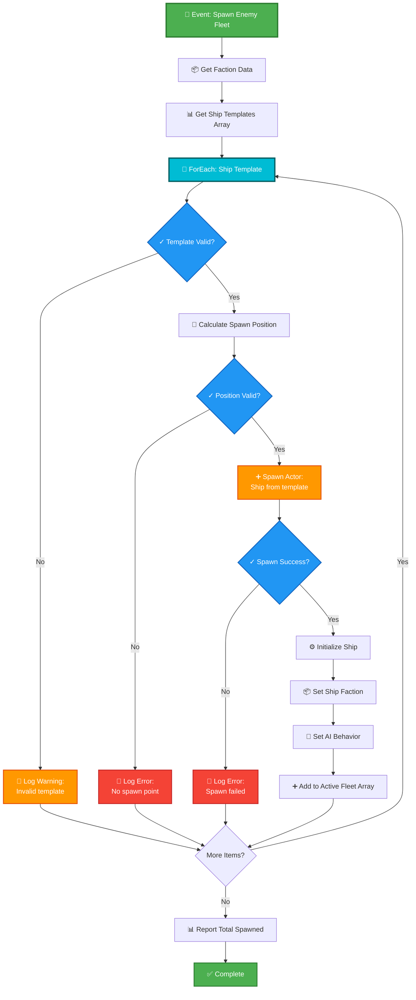
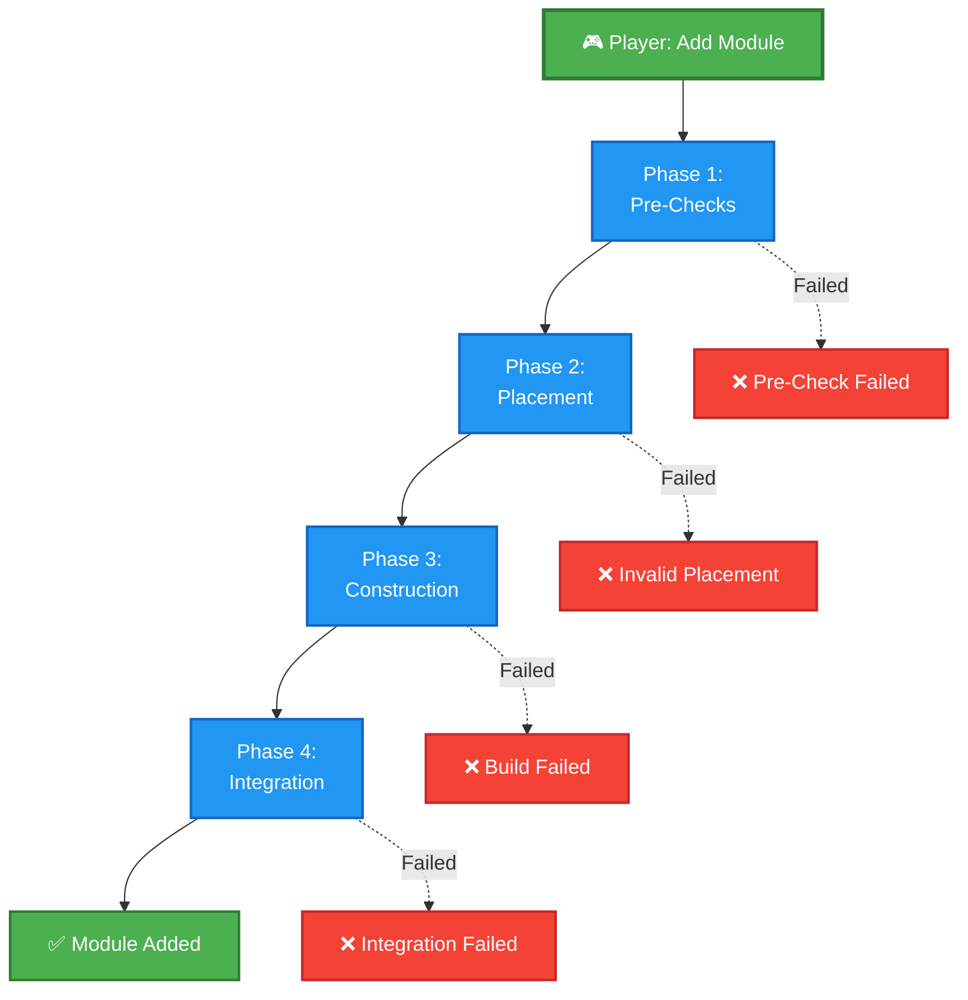
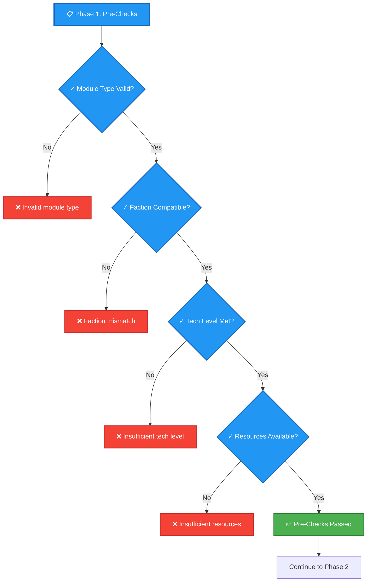
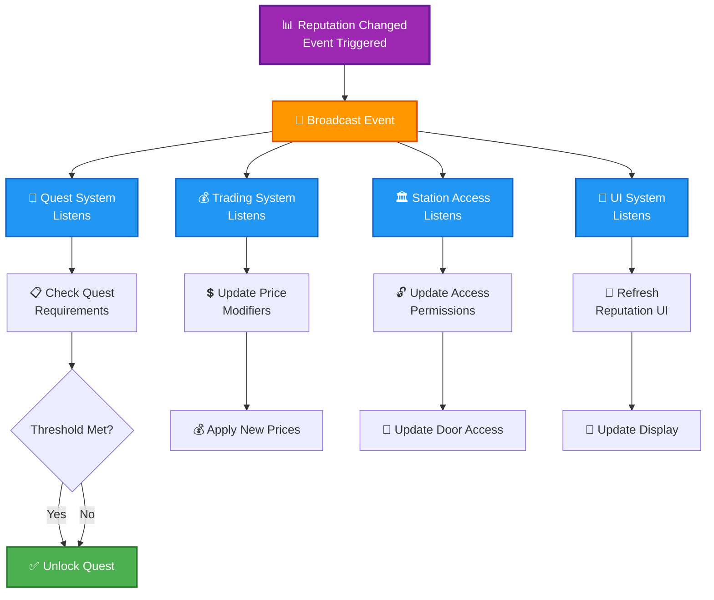
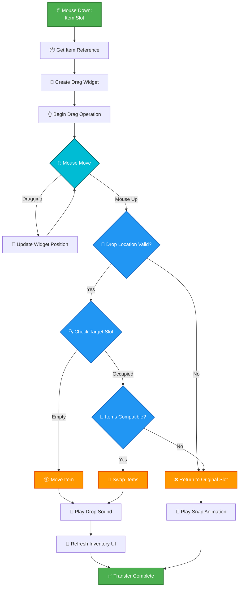
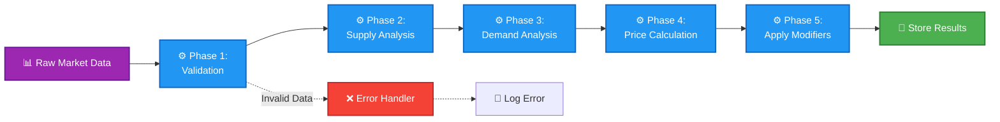
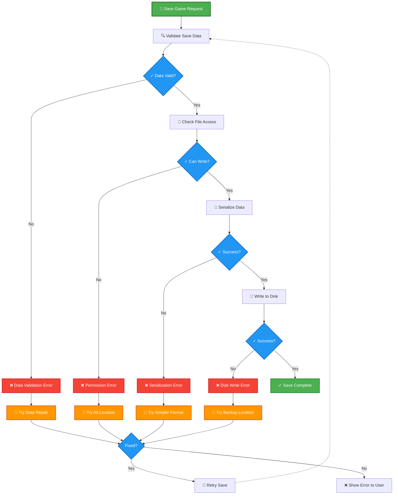

# Blueprint Display Examples - Real-World Use Cases

## Overview

This document provides practical, real-world examples of Blueprint documentation using the new standards from [BLUEPRINT_DISPLAY_GUIDE.md](BLUEPRINT_DISPLAY_GUIDE.md). Each example shows the same logic documented in multiple formats to demonstrate when each style works best.

**Last Updated**: November 19, 2025

---

## Table of Contents

1. [Simple Linear Flow](#example-1-simple-linear-flow)
2. [Branching Decision Logic](#example-2-branching-decision-logic)
3. [Loop with Validation](#example-3-loop-with-validation)
4. [Complex Multi-Phase System](#example-4-complex-multi-phase-system)
5. [Event-Driven System](#example-5-event-driven-system)
6. [UI Interaction Flow](#example-6-ui-interaction-flow)
7. [Data Processing Pipeline](#example-7-data-processing-pipeline)
8. [Error Handling Pattern](#example-8-error-handling-pattern)

---

## Example 1: Simple Linear Flow

### Scenario
Initializing a player's inventory when they start the game.

### Format A: Unreal Node Style (Recommended for Documentation)

```mermaid
graph LR
    A[["⚡ Event Begin Play"]] --> B[["📦 Get Player Controller"]]
    B --> C[["🎭 Cast to AdastreaPlayerController"]]
    C --> D[["📦 Get Inventory Component"]]
    D --> E[["⚙️ Initialize Inventory"]]
    E --> F[["➕ Add Starting Items"]]
    F --> G[["📊 Set Max Capacity: 100"]]
    G --> H[["✅ Complete"]]
    
    style A fill:#1a1a1a,stroke:#DC3545,stroke-width:4px,color:#fff,rx:10,ry:10
    style B fill:#1a1a1a,stroke:#0d6efd,stroke-width:3px,color:#fff,rx:10,ry:10
    style C fill:#1a1a1a,stroke:#0d6efd,stroke-width:3px,color:#fff,rx:10,ry:10
    style D fill:#1a1a1a,stroke:#0d6efd,stroke-width:3px,color:#fff,rx:10,ry:10
    style E fill:#1a1a1a,stroke:#0d6efd,stroke-width:3px,color:#fff,rx:10,ry:10
    style F fill:#1a1a1a,stroke:#0d6efd,stroke-width:3px,color:#fff,rx:10,ry:10
    style G fill:#1a1a1a,stroke:#0d6efd,stroke-width:3px,color:#fff,rx:10,ry:10
    style H fill:#1a1a1a,stroke:#28a745,stroke-width:3px,color:#fff,rx:10,ry:10
```



### Format B: Enhanced Text (Good for Code Comments)

```
🎯 Event: Initialize Player Inventory
📍 Location: BP_PlayerCharacter → Event Graph

──────────────────────────────────
EXECUTION FLOW
──────────────────────────────────

🟢 START → Event Begin Play
    │
    ├─→ 📦 Get Player Controller
    │     └─→ Returns: PlayerController reference
    │
    ├─→ 🎭 Cast to AdastreaPlayerController
    │     └─→ Validates controller type
    │
    ├─→ 📦 Get Inventory Component
    │     └─→ Returns: InventoryComponent reference
    │
    ├─→ ⚙️ Initialize Inventory
    │     └─→ Sets up inventory data structures
    │
    ├─→ ➕ Add Starting Items
    │     ├─→ Add: Health Pack (x5)
    │     ├─→ Add: Energy Cell (x10)
    │     └─→ Add: Basic Tool (x1)
    │
    ├─→ 📊 Set Max Capacity
    │     └─→ Value: 100 units
    │
    └─→ 🏁 COMPLETE
```

### When to Use Each

- **Mermaid**: Perfect for documentation, wikis, GitHub README
- **Enhanced Text**: Great for inline code comments, text-only environments

---

## Example 2: Branching Decision Logic

### Scenario
Checking if a player can purchase an item from a vendor.

### Format A: Unreal Node Style with Multiple Branches

```mermaid
graph LR
    A[["🎮 OnBuyButtonClicked"]] --> B[["📦 Get Selected Item"]]
    B --> C{{"✓ Item Valid?"}}
    C -->|"✗ No"| D[["❌ Error: No item"]]
    C -->|"✓ Yes"| E[["💰 Get Item Price"]]
    E --> F[["🧮 Calculate Total"]]
    F --> G{{"💳 Has Credits?"}}
    G -->|"✗ No"| H[["❌ Error: Insufficient<br/>funds"]]
    G -->|"✓ Yes"| I{{"📦 Has Space?"}}
    I -->|"✗ No"| J[["❌ Error: Inventory<br/>full"]]
    I -->|"✓ Yes"| K[["💸 Deduct Credits"]]
    K --> L[["📦 Add to Inventory"]]
    L --> M[["🔊 Play Sound"]]
    M --> N[["🎨 Show Animation"]]
    N --> O[["🔄 Refresh UI"]]
    O --> P[["✅ Complete"]]
    D --> Q(( ))
    H --> Q
    J --> Q
    P --> Q
    
    style A fill:#1a1a1a,stroke:#DC3545,stroke-width:4px,color:#fff,rx:10,ry:10
    style B fill:#1a1a1a,stroke:#0d6efd,stroke-width:3px,color:#fff,rx:10,ry:10
    style C fill:#1a1a1a,stroke:#17a2b8,stroke-width:3px,color:#17a2b8
    style D fill:#1a1a1a,stroke:#DC3545,stroke-width:3px,color:#fff,rx:10,ry:10
    style E fill:#1a1a1a,stroke:#0d6efd,stroke-width:3px,color:#fff,rx:10,ry:10
    style F fill:#1a1a1a,stroke:#0d6efd,stroke-width:3px,color:#fff,rx:10,ry:10
    style G fill:#1a1a1a,stroke:#17a2b8,stroke-width:3px,color:#17a2b8
    style H fill:#1a1a1a,stroke:#DC3545,stroke-width:3px,color:#fff,rx:10,ry:10
    style I fill:#1a1a1a,stroke:#17a2b8,stroke-width:3px,color:#17a2b8
    style J fill:#1a1a1a,stroke:#DC3545,stroke-width:3px,color:#fff,rx:10,ry:10
    style K fill:#1a1a1a,stroke:#0d6efd,stroke-width:3px,color:#fff,rx:10,ry:10
    style L fill:#1a1a1a,stroke:#0d6efd,stroke-width:3px,color:#fff,rx:10,ry:10
    style M fill:#1a1a1a,stroke:#6f42c1,stroke-width:3px,color:#fff,rx:10,ry:10
    style N fill:#1a1a1a,stroke:#6f42c1,stroke-width:3px,color:#fff,rx:10,ry:10
    style O fill:#1a1a1a,stroke:#0d6efd,stroke-width:3px,color:#fff,rx:10,ry:10
    style P fill:#1a1a1a,stroke:#28a745,stroke-width:3px,color:#fff,rx:10,ry:10
    style Q fill:#1a1a1a,stroke:#6c757d,stroke-width:2px,color:#fff
```



### Format B: Node Card (For Function Reference)

<details>
<summary>💰 <b>Attempt Purchase</b> - Transaction Function</summary>

```
┌─────────────────────────────────────────────────────────────┐
│ 💰 ATTEMPT PURCHASE                                         │
│ Type: Custom Function                                       │
│ Category: Trading System                                    │
├─────────────────────────────────────────────────────────────┤
│ 📥 INPUTS                                                    │
│   • Item (TradeItemDataAsset) - Item to purchase            │
│   • Quantity (Integer) - Number of units (default: 1)       │
│                                                              │
│ 📤 OUTPUTS                                                   │
│   • Success (Boolean) - True if transaction completed       │
│   • ErrorMessage (Text) - Error description if failed       │
├─────────────────────────────────────────────────────────────┤
│ 🔍 VALIDATION CHECKS (in order)                             │
│   1. ✓ Item is valid and not null                          │
│   2. ✓ Player has sufficient credits                       │
│   3. ✓ Inventory has space for item                        │
│   4. ✓ Item is available at vendor                         │
│                                                              │
│ ⚙️ OPERATIONS (if all checks pass)                          │
│   1. Calculate final cost with taxes/discounts             │
│   2. Deduct credits from player account                    │
│   3. Add item to player inventory                          │
│   4. Update vendor stock levels                            │
│   5. Trigger UI refresh                                    │
│   6. Play success feedback (sound/animation)               │
│                                                              │
│ ❌ FAILURE CONDITIONS                                        │
│   • "No item selected" - Item parameter is null             │
│   • "Insufficient funds" - Credits < Total Cost             │
│   • "Inventory full" - No space for new items               │
│   • "Item unavailable" - Vendor out of stock                │
│                                                              │
│ 💡 USAGE NOTES                                               │
│   • Called from trading UI buy button                       │
│   • Automatically handles all validation                    │
│   • Returns specific error messages for UI display          │
│   • Transaction is atomic (all-or-nothing)                  │
├─────────────────────────────────────────────────────────────┤
│ 📝 EXAMPLE USAGE                                             │
│                                                              │
│   [Buy Button Clicked]                                      │
│        ↓                                                     │
│   Attempt Purchase                                          │
│     Item: DA_TradeItem_HealthPack                           │
│     Quantity: 3                                             │
│        ↓                                                     │
│   Branch (Success?)                                         │
│     ├─→ True: Show "Purchase Complete" message              │
│     └─→ False: Display ErrorMessage to player               │
└─────────────────────────────────────────────────────────────┘
```

</details>

### Format C: Quick Reference Table

| Decision Point | Condition | True Path | False Path |
|----------------|-----------|-----------|------------|
| 1️⃣ **Item Valid** | Item != null | Continue | Error: "No item selected" |
| 2️⃣ **Has Credits** | Credits >= Cost | Continue | Error: "Insufficient funds" |
| 3️⃣ **Has Space** | Inventory not full | Process purchase | Error: "Inventory full" |

---

## Example 3: Loop with Validation

### Scenario
Spawning multiple enemy ships from a faction's fleet data.

### Mermaid Representation



### Enhanced Text with Loop Detail

```
🎯 Function: Spawn Enemy Fleet
📥 Inputs: FactionData, SpawnLocation, FleetSize
📤 Outputs: SpawnedShips (Array)

──────────────────────────────────
EXECUTION FLOW
──────────────────────────────────

🟢 START
    │
    ├─→ 📦 Get Faction Data
    │     └─→ Retrieve faction's ship templates
    │
    ├─→ 📊 Get Ship Templates Array
    │     └─→ Extract available ship designs
    │
    └─→ 🔄 BEGIN FOREACH LOOP
          │
          ┌─────────────────────────────────┐
          │ LOOP ITERATION (per template)   │
          └─────────────────────────────────┘
          │
          ├─→ 🔍 Validate Template
          │     ├─→ ✅ Valid → Continue
          │     └─→ ❌ Invalid → Skip, log warning
          │
          ├─→ 📍 Calculate Spawn Position
          │     └─→ Offset from base location
          │
          ├─→ 🔍 Check Position Valid
          │     ├─→ ✅ Clear space → Continue
          │     └─→ ❌ Blocked → Skip, log error
          │
          ├─→ ➕ Spawn Ship Actor
          │     ├─→ ✅ Success → Initialize
          │     │     ├─→ Set Faction
          │     │     ├─→ Set AI Behavior
          │     │     └─→ Add to Fleet Array
          │     └─→ ❌ Failed → Skip, log error
          │
          └─→ 🔄 Next Iteration

    ↓
    
    📊 After Loop Complete:
    │
    ├─→ Count Spawned Ships
    │     └─→ Total: X out of Y attempts
    │
    ├─→ 📝 Log Summary
    │     └─→ "Spawned X ships for [Faction]"
    │
    └─→ 🏁 RETURN: SpawnedShips Array
```

---

## Example 4: Complex Multi-Phase System

### Scenario
Complete station module construction process with multiple validation phases.

### High-Level Overview (Mermaid)



### Detailed Phase Breakdown

#### Phase 1: Pre-Checks (Mermaid Detail)



### Phase Summary Table

| Phase | Purpose | Key Checks | On Failure |
|-------|---------|------------|------------|
| 1️⃣ Pre-Checks | Validate requirements | Type, Faction, Tech, Resources | Show specific error |
| 2️⃣ Placement | Find valid location | Position, Clearance, Connections | Show placement guide |
| 3️⃣ Construction | Build the module | Power, Materials, Time | Rollback transaction |
| 4️⃣ Integration | Connect to station | Systems, Network, Data | Remove module, refund |

---

## Example 5: Event-Driven System

### Scenario
Faction reputation change propagation through multiple systems.

### Event Flow Diagram



### Event System Reference Card

<details>
<summary>📊 <b>OnReputationChanged</b> - Event Dispatcher</summary>

```
┌─────────────────────────────────────────────────────────────┐
│ 📊 ON REPUTATION CHANGED                                    │
│ Type: Event Dispatcher (Multicast)                         │
│ Category: Faction System                                   │
├─────────────────────────────────────────────────────────────┤
│ 📡 BROADCAST PARAMETERS                                      │
│   • Faction (FactionDataAsset) - Affected faction           │
│   • OldValue (Integer) - Previous reputation value          │
│   • NewValue (Integer) - Updated reputation value           │
│   • ChangeReason (Text) - Why it changed (optional)         │
│                                                              │
│ 🎧 LISTENERS (Automatically Notified)                       │
│   1. Quest System - Check unlocked quests                   │
│   2. Trading System - Update price modifiers                │
│   3. Station Access - Update permissions                    │
│   4. UI System - Refresh reputation displays                │
│   5. AI System - Update NPC behavior                        │
│   6. Save System - Mark for persistence                     │
│                                                              │
│ 🔄 TRIGGER CONDITIONS                                        │
│   • Player completes mission for faction                    │
│   • Player attacks faction ships/stations                   │
│   • Player completes trade contracts                        │
│   • Story events modify standing                            │
│   • Diplomatic actions (alliances, wars)                    │
│                                                              │
│ ⚙️ EXECUTION ORDER                                           │
│   1. Reputation value is changed in data                    │
│   2. Event is broadcast to all listeners                    │
│   3. Each listener processes independently                  │
│   4. UI updates last (for visual feedback)                  │
│                                                              │
│ 💡 BINDING EXAMPLE                                           │
│   In Quest System Blueprint:                                │
│     Event BeginPlay →                                       │
│       Get Game Instance →                                   │
│         Get Player Controller →                             │
│           Bind Event to OnReputationChanged →              │
│             Custom Event: Handle Reputation Change          │
│                                                              │
│ ⚠️ IMPORTANT                                                 │
│   • All listeners execute in parallel (not sequential)      │
│   • Don't modify reputation within listener                 │
│   • Use ChangeReason for logging/debugging                  │
│   • Event persists for entire game session                  │
└─────────────────────────────────────────────────────────────┘
```

</details>

---

## Example 6: UI Interaction Flow

### Scenario
Complete inventory drag-and-drop item transfer.

### Interactive UI Flow



---

## Example 7: Data Processing Pipeline

### Scenario
Processing market price data with supply/demand simulation.

### Pipeline Visualization



### Pipeline Stage Details

| Stage | Input | Processing | Output | Error Handling |
|-------|-------|------------|--------|----------------|
| 1️⃣ Validation | Raw data | Check nulls, ranges | Clean data | Log and skip |
| 2️⃣ Supply | Item data | Calculate stock levels | Supply ratio | Use defaults |
| 3️⃣ Demand | Transaction history | Analyze trends | Demand ratio | Use baseline |
| 4️⃣ Calculate | Base price, ratios | Apply formulas | Calculated price | Use base price |
| 5️⃣ Modify | Price, modifiers | Apply bonuses/penalties | Final price | Clamp to limits |

---

## Example 8: Error Handling Pattern

### Scenario
Comprehensive error handling in a save game system.

### Error Flow with Recovery



### Error Recovery Strategy Table

| Error Type | Recovery Attempt | Fallback | User Action |
|------------|-----------------|----------|-------------|
| **Data Validation** | Repair corrupted fields | Use defaults | Continue with warning |
| **Permission Error** | Try alternate location | Use temp directory | Manual file selection |
| **Serialization** | Simpler format | JSON instead of binary | Reduced features |
| **Disk Write** | Backup location | Cloud save | Manual retry |
| **All Failed** | - | Emergency autosave | Show error message |

---

## Best Practices Demonstrated

### ✅ What These Examples Show

1. **Appropriate Format Selection**
   - Mermaid for complex flows and documentation
   - Enhanced text for code comments and linear logic
   - Node cards for API reference
   - Tables for quick summaries

2. **Consistent Visual Language**
   - Color coding follows the guide standards
   - Emoji icons aid quick scanning
   - Clear labels and descriptions

3. **Error Handling**
   - Always show failure paths
   - Document recovery strategies
   - Provide user feedback options

4. **Real-World Complexity**
   - Multi-phase operations
   - Validation at each step
   - Event-driven architectures
   - Data processing pipelines

5. **Readability**
   - Logical flow top-to-bottom or left-to-right
   - Clear decision points
   - Descriptive labels
   - Grouped related operations

---

## Converting Your Own Blueprints

### Step-by-Step Process

1. **Identify the Logic Type**
   - Linear? → Enhanced Text or simple Mermaid
   - Branching? → Mermaid with decisions
   - Complex? → Hybrid approach

2. **Choose Your Format**
   - Reference the guide's "When to Use" section
   - Consider your audience (developers vs designers)
   - Think about maintenance needs

3. **Create the Diagram**
   - Start with main flow
   - Add branches and loops
   - Include error paths
   - Apply color coding

4. **Add Documentation**
   - Inputs and outputs
   - Key decision points
   - Error conditions
   - Usage examples

5. **Test and Refine**
   - View on GitHub
   - Check mobile rendering
   - Get feedback
   - Iterate

---

## Template Checklist

When documenting a new Blueprint:

- [ ] Identify the complexity level
- [ ] Choose appropriate format(s)
- [ ] Create main flow diagram
- [ ] Document inputs/outputs
- [ ] Include error handling
- [ ] Add usage examples
- [ ] Apply consistent styling
- [ ] Test rendering on GitHub
- [ ] Link to related documentation
- [ ] Update index/table of contents

---

## Questions and Feedback

Have examples you'd like to see? Found a better way to visualize something? Contribute to this document by submitting examples via GitHub!

---

**Document Version**: 1.0.0  
**Last Updated**: November 19, 2025  
**Examples Count**: 8 complete scenarios  
**See Also**: [BLUEPRINT_DISPLAY_GUIDE.md](BLUEPRINT_DISPLAY_GUIDE.md)
