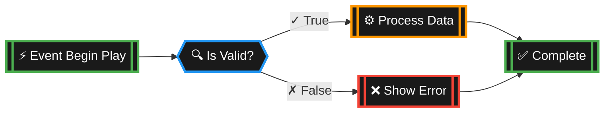
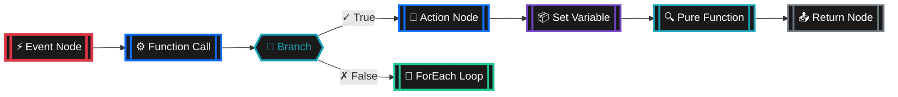
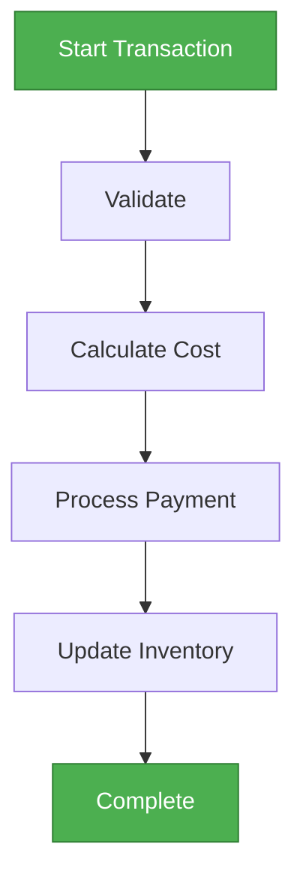
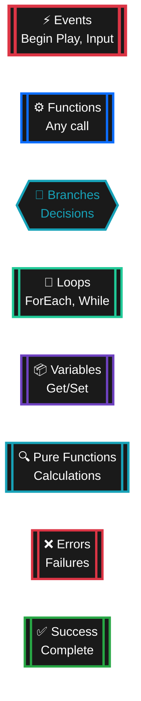
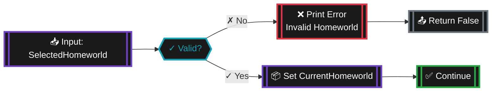
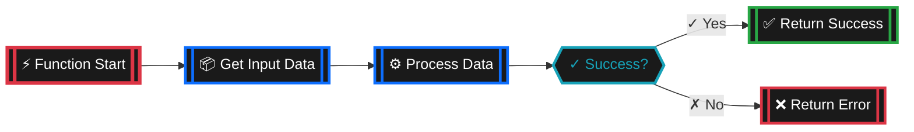
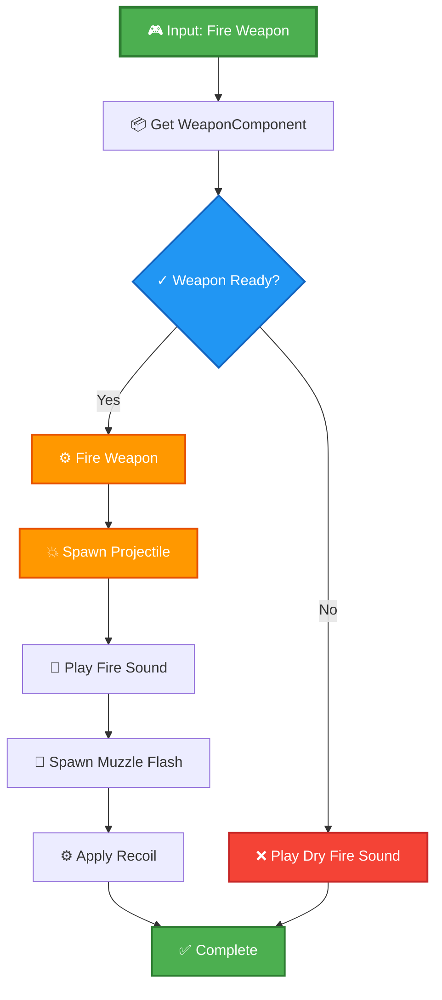

# Blueprint Display Guide - Best Practices for Visual Documentation

## Overview

This guide establishes consistent, clear, and maintainable standards for documenting Unreal Engine Blueprint logic in markdown files. It provides multiple visualization formats optimized for different use cases and viewing platforms.

**Last Updated**: November 19, 2025  
**Version**: 1.0.0

---

## Table of Contents

1. [Why Better Blueprint Documentation?](#why-better-blueprint-documentation)
2. [Visual Format Standards](#visual-format-standards)
3. [Format 1: Mermaid Flowcharts](#format-1-mermaid-flowcharts-recommended)
4. [Format 2: Enhanced Text Flow](#format-2-enhanced-text-flow)
5. [Format 3: Node Cards](#format-3-node-cards)
6. [Format 4: Quick Reference Tables](#format-4-quick-reference-tables)
7. [Format 5: Hybrid Approach](#format-5-hybrid-approach-best-for-complex-logic)
8. [Color Coding Standards](#color-coding-standards)
9. [Node Type Reference](#node-type-reference)
10. [Best Practices](#best-practices)
11. [Migration Guide](#migration-guide)
12. [Templates](#templates)

---

## Why Better Blueprint Documentation?

### Problems with Current Approach
- ❌ ASCII art is hard to read and maintain
- ❌ Inconsistent formatting across documents
- ❌ No visual hierarchy or color coding
- ❌ Difficult to distinguish node types
- ❌ Poor rendering on mobile/GitHub

### Benefits of New Standards
- ✅ Clear visual hierarchy
- ✅ Color-coded node types
- ✅ Platform-agnostic rendering
- ✅ Easy to update and maintain
- ✅ Professional appearance
- ✅ Better for learning and reference

---

## Visual Format Standards

### When to Use Each Format

| Format | Best For | Complexity | GitHub Support |
|--------|----------|------------|----------------|
| **Mermaid Flowcharts** | Complex logic flows, branching | High | ✅ Native |
| **Enhanced Text Flow** | Linear sequences, simple flows | Low-Medium | ✅ Always |
| **Node Cards** | Detailed node documentation | Medium | ✅ Always |
| **Quick Reference Tables** | Function summaries, overviews | Low | ✅ Always |
| **Hybrid Approach** | Complete systems, tutorials | High | ✅ Always |

---

## Format 1: Mermaid Flowcharts (Recommended)

### Overview
Mermaid diagrams render natively on GitHub and provide professional flowchart visualization.

### Advantages
- 🎨 **Visual**: Automatic layout and styling
- 🔄 **Interactive**: Clickable nodes on GitHub
- 🎯 **Clear**: Easy to follow execution flow
- 📱 **Responsive**: Works on all devices

### Basic Structure (Unreal Engine Node Style)



### Example: Trading System Buy Flow (Unreal Node Style)

```mermaid
graph LR
    A[["🎮 OnBuyButtonClicked"]] --> B[["📦 Get Selected Item"]]
    B --> C{{"✓ Item Valid?"}}
    C -->|"✗ False"| D[["❌ Show Error<br/>Select an item"]]
    C -->|"✓ True"| E[["💰 Get Item Price"]]
    E --> F[["🧮 Calculate Total Cost"]]
    F --> G{{"💳 Has Credits?"}}
    G -->|"✗ False"| H[["❌ Show Error<br/>Insufficient funds"]]
    G -->|"✓ True"| I[["💸 Deduct Credits"]]
    I --> J[["📦 Add to Inventory"]]
    J --> K[["🔊 Play Buy Sound"]]
    K --> L[["🔄 Refresh UI"]]
    L --> M[["✅ Success"]]
    D --> N(( ))
    H --> N
    M --> N
    
    style A fill:#1a1a1a,stroke:#DC3545,stroke-width:4px,color:#fff,rx:10,ry:10
    style B fill:#1a1a1a,stroke:#0d6efd,stroke-width:3px,color:#fff,rx:10,ry:10
    style C fill:#1a1a1a,stroke:#17a2b8,stroke-width:3px,color:#17a2b8
    style D fill:#1a1a1a,stroke:#DC3545,stroke-width:3px,color:#fff,rx:10,ry:10
    style E fill:#1a1a1a,stroke:#0d6efd,stroke-width:3px,color:#fff,rx:10,ry:10
    style F fill:#1a1a1a,stroke:#0d6efd,stroke-width:3px,color:#fff,rx:10,ry:10
    style G fill:#1a1a1a,stroke:#17a2b8,stroke-width:3px,color:#17a2b8
    style H fill:#1a1a1a,stroke:#DC3545,stroke-width:3px,color:#fff,rx:10,ry:10
    style I fill:#1a1a1a,stroke:#0d6efd,stroke-width:3px,color:#fff,rx:10,ry:10
    style J fill:#1a1a1a,stroke:#0d6efd,stroke-width:3px,color:#fff,rx:10,ry:10
    style K fill:#1a1a1a,stroke:#6f42c1,stroke-width:3px,color:#fff,rx:10,ry:10
    style L fill:#1a1a1a,stroke:#0d6efd,stroke-width:3px,color:#fff,rx:10,ry:10
    style M fill:#1a1a1a,stroke:#28a745,stroke-width:3px,color:#fff,rx:10,ry:10
    style N fill:#1a1a1a,stroke:#6c757d,stroke-width:2px,color:#fff
```



### Mermaid Node Types (Unreal Engine Style)



### Complex Example: Station Module Addition

```mermaid
graph LR
    A[["🎮 Button: Add Module"]] --> B[["📦 Get Module Class"]]
    B --> C{{"✓ Valid?"}}
    C -->|"✗ No"| D[["❌ Error: Select module"]]
    C -->|"✓ Yes"| E[["📍 Get Location"]]
    E --> F{{"✓ Valid Placement?"}}
    F -->|"✗ No"| G[["❌ Error: Invalid location"]]
    F -->|"✓ Yes"| H{{"✓ Faction Compatible?"}}
    H -->|"✗ No"| I[["📊 Get Faction"]]
    I --> J[["🔢 Get Tech Level"]]
    J --> K[["📝 Format Error"]]
    K --> L[["❌ Tech Requirement"]]
    H -->|"✓ Yes"| M[["⚙️ Add Module<br/>(C++ Call)"]]
    M --> N{{"✓ Created?"}}
    N -->|"✗ No"| O[["❌ Creation Failed"]]
    N -->|"✓ Yes"| P[["🔄 Update UI"]]
    P --> Q[["🔊 Play Sound"]]
    Q --> R[["🧹 Clear Selection"]]
    R --> S[["✅ Complete"]]
    D --> T(( ))
    G --> T
    L --> T
    O --> T
    S --> T
    
    style A fill:#1a1a1a,stroke:#DC3545,stroke-width:4px,color:#fff,rx:10,ry:10
    style B fill:#1a1a1a,stroke:#0d6efd,stroke-width:3px,color:#fff,rx:10,ry:10
    style C fill:#1a1a1a,stroke:#17a2b8,stroke-width:3px,color:#17a2b8
    style D fill:#1a1a1a,stroke:#DC3545,stroke-width:3px,color:#fff,rx:10,ry:10
    style E fill:#1a1a1a,stroke:#0d6efd,stroke-width:3px,color:#fff,rx:10,ry:10
    style F fill:#1a1a1a,stroke:#17a2b8,stroke-width:3px,color:#17a2b8
    style G fill:#1a1a1a,stroke:#DC3545,stroke-width:3px,color:#fff,rx:10,ry:10
    style H fill:#1a1a1a,stroke:#17a2b8,stroke-width:3px,color:#17a2b8
    style I fill:#1a1a1a,stroke:#0d6efd,stroke-width:3px,color:#fff,rx:10,ry:10
    style J fill:#1a1a1a,stroke:#0d6efd,stroke-width:3px,color:#fff,rx:10,ry:10
    style K fill:#1a1a1a,stroke:#0d6efd,stroke-width:3px,color:#fff,rx:10,ry:10
    style L fill:#1a1a1a,stroke:#DC3545,stroke-width:3px,color:#fff,rx:10,ry:10
    style M fill:#1a1a1a,stroke:#0d6efd,stroke-width:3px,color:#fff,rx:10,ry:10
    style N fill:#1a1a1a,stroke:#17a2b8,stroke-width:3px,color:#17a2b8
    style O fill:#1a1a1a,stroke:#DC3545,stroke-width:3px,color:#fff,rx:10,ry:10
    style P fill:#1a1a1a,stroke:#0d6efd,stroke-width:3px,color:#fff,rx:10,ry:10
    style Q fill:#1a1a1a,stroke:#6f42c1,stroke-width:3px,color:#fff,rx:10,ry:10
    style R fill:#1a1a1a,stroke:#0d6efd,stroke-width:3px,color:#fff,rx:10,ry:10
    style S fill:#1a1a1a,stroke:#28a745,stroke-width:3px,color:#fff,rx:10,ry:10
    style T fill:#1a1a1a,stroke:#6c757d,stroke-width:2px,color:#fff
```



### Mermaid Best Practices

**DO:**
- ✅ Use emojis for quick visual identification
- ✅ Keep node text concise (under 30 characters)
- ✅ Use color coding consistently
- ✅ Add descriptive labels to decision branches
- ✅ Group related nodes visually

**DON'T:**
- ❌ Create overly complex diagrams (split into multiple)
- ❌ Use inconsistent styling
- ❌ Forget to label branches
- ❌ Mix different visual styles

---

## Format 2: Enhanced Text Flow

### Overview
Structured text format with clear visual hierarchy, perfect for linear sequences and simple documentation.

### Structure

```
🎯 Function: [Function Name]
📥 Inputs: [Input parameters]
📤 Outputs: [Return values]

──────────────────────────────────
EXECUTION FLOW
──────────────────────────────────

🟢 START → Event Begin Play
    │
    ├─→ 📦 Get Player Controller
    │      └─→ Cast to AdastreaPlayerController
    │            ├─→ ✅ Success Path
    │            │     ├─→ 🔧 Get Current Station
    │            │     │     └─→ 📦 Store in Variable: CurrentStation
    │            │     │
    │            │     ├─→ ⚙️ Initialize Faction Data
    │            │     │     └─→ Call: Set Station Faction()
    │            │     │
    │            │     └─→ 🔄 Refresh All UI Elements
    │            │           ├─→ Update Module List
    │            │           ├─→ Update Faction Display
    │            │           └─→ Update Tech Level Indicator
    │            │
    │            └─→ ❌ Failure Path
    │                  └─→ 📝 Log Warning: "Invalid Player Controller"
    │
    └─→ 🏁 END
```

### Example: Price Calculation Function

```
🎯 Function: Calculate Item Price
📥 Inputs:
   • BasePrice (Float) - Base item cost
   • Quantity (Integer) - Number of units
   • IsBuying (Boolean) - True for buy, false for sell
📤 Outputs:
   • TotalPrice (Float) - Final calculated price
   • PricePerUnit (Float) - Price per single unit

──────────────────────────────────
EXECUTION FLOW
──────────────────────────────────

🟢 START
    │
    ├─→ 🔍 Validate Inputs
    │     ├─→ ❓ Is BasePrice > 0?
    │     │     ├─→ ✅ Yes → Continue
    │     │     └─→ ❌ No → Return 0.0
    │     │
    │     └─→ ❓ Is Quantity > 0?
    │           ├─→ ✅ Yes → Continue
    │           └─→ ❌ No → Return 0.0
    │
    ├─→ 💰 Calculate Base Total
    │     └─→ BaseTotalPrice = BasePrice × Quantity
    │
    ├─→ 🔧 Apply Price Modifiers
    │     ├─→ ❓ Is Buying?
    │     │     ├─→ ✅ Yes → Apply Buy Markup (×1.15)
    │     │     └─→ ❌ No → Apply Sell Markdown (×0.85)
    │     │
    │     └─→ 📈 Apply Supply/Demand Modifier
    │           └─→ Get Market Supply/Demand Ratio
    │                 └─→ ModifiedPrice = Price × Ratio
    │
    ├─→ 🏛️ Apply Transaction Tax
    │     └─→ TaxAmount = ModifiedPrice × TaxRate
    │           └─→ FinalPrice = ModifiedPrice + TaxAmount
    │
    ├─→ 📤 Calculate Per-Unit Price
    │     └─→ PricePerUnit = FinalPrice / Quantity
    │
    └─→ 🏁 RETURN
          ├─→ TotalPrice = FinalPrice
          └─→ PricePerUnit = PricePerUnit

──────────────────────────────────
💡 NOTES
──────────────────────────────────
• All calculations use floating-point precision
• Tax rate is retrieved from market configuration
• Supply/demand ratio ranges from 0.5 to 2.0
• Price is clamped to minimum of 1 credit
```

### Visual Elements Key

| Symbol | Meaning | Usage |
|--------|---------|-------|
| 🟢 | Start | Function/event entry point |
| 🏁 | End | Function/event completion |
| 📥 | Input | Function parameters |
| 📤 | Output | Return values |
| 🔧 | Action | Execute function or operation |
| ⚙️ | Process | Complex operation or calculation |
| 📦 | Variable | Get or set variable |
| ❓ | Branch | Decision point |
| ✅ | True Path | Condition satisfied |
| ❌ | False Path | Condition failed or error |
| 🔄 | Loop | Iteration or repeat |
| 🔍 | Check | Validation or query |
| 💡 | Note | Additional information |
| 📝 | Log | Debug or log output |
| 🎵 | Audio | Sound/music playback |
| 🎨 | Visual | UI or visual effect |
| 📊 | Data | Data retrieval or processing |
| 🌐 | Network | Online/multiplayer operation |

---

## Format 3: Node Cards

### Overview
Detailed visual cards for documenting individual Blueprint nodes with all properties and connections.

### Structure

<details>
<summary>📦 <b>Get Faction Reputation</b> - Pure Function</summary>

```
┌─────────────────────────────────────────────────────────────┐
│ 🔍 GET FACTION REPUTATION                                   │
│ Type: Pure Function (no execution pins)                     │
│ Category: Faction System                                    │
├─────────────────────────────────────────────────────────────┤
│ 📥 INPUTS                                                    │
│   • Faction (FactionDataAsset) - Target faction to query    │
│                                                              │
│ 📤 OUTPUTS                                                   │
│   • Reputation (Integer) - Current reputation value         │
│   • Found (Boolean) - True if faction relationship exists   │
├─────────────────────────────────────────────────────────────┤
│ 📋 DESCRIPTION                                               │
│   Retrieves the player's current reputation with the        │
│   specified faction. Returns 0 if no relationship exists.   │
│                                                              │
│ 💡 USAGE                                                     │
│   Used to check if player meets reputation requirements     │
│   for missions, trading discounts, or access permissions.   │
│                                                              │
│ ⚠️ IMPORTANT                                                 │
│   • Always check 'Found' output before using reputation     │
│   • Returns 0 for unknown factions (not an error)           │
│   • Reputation range: -100 (Hostile) to +100 (Allied)       │
├─────────────────────────────────────────────────────────────┤
│ 📝 EXAMPLE USAGE                                             │
│                                                              │
│   Get Faction Reputation                                    │
│     Input: DA_Faction_SolarisUnion                          │
│     Output: Reputation = 50, Found = true                   │
│         ↓                                                    │
│   Branch (Found = true)                                     │
│     ├─→ True: Display reputation in UI                      │
│     └─→ False: Show "No relationship established"           │
└─────────────────────────────────────────────────────────────┘
```

</details>

### Example: Combat Function Node Card

<details>
<summary>🎯 <b>Fire Weapon</b> - C++ Function Call</summary>

```
┌─────────────────────────────────────────────────────────────┐
│ 🔫 FIRE WEAPON                                              │
│ Type: BlueprintCallable Function                            │
│ Category: Combat System                                     │
│ Source: WeaponComponent.h                                   │
├─────────────────────────────────────────────────────────────┤
│ 📥 INPUTS                                                    │
│   • Target (Actor) - Actor to fire at (optional)            │
│   • FireLocation (Vector) - Override spawn point (optional) │
│   • bAutoLead (Boolean) - Auto-calculate lead (default: true)│
│                                                              │
│ 📤 OUTPUTS                                                   │
│   • Success (Boolean) - True if weapon fired                │
│   • ProjectileSpawned (Actor) - Reference to spawned        │
│     projectile (null for hitscan)                           │
├─────────────────────────────────────────────────────────────┤
│ 📋 DESCRIPTION                                               │
│   Fires the currently equipped weapon at the target or      │
│   in the specified direction. Handles ammunition, heat,     │
│   cooldown, and projectile spawning automatically.          │
│                                                              │
│ 🔧 BEHAVIOR                                                  │
│   1. Checks if weapon is ready to fire                      │
│   2. Consumes ammunition (if required)                      │
│   3. Generates heat and starts cooldown                     │
│   4. Spawns projectile or traces line for hitscan           │
│   5. Applies recoil and visual effects                      │
│   6. Returns success status                                 │
│                                                              │
│ 💡 USAGE TIPS                                                │
│   • Call on input action for manual firing                  │
│   • Use in timer for automatic firing                       │
│   • Check Success output before playing effects             │
│   • Auto-lead requires valid target with velocity           │
│                                                              │
│ ⚠️ REQUIREMENTS                                              │
│   • Weapon must be equipped and loaded                      │
│   • Component must be initialized                           │
│   • Sufficient power available (for energy weapons)         │
│   • Not overheated or on cooldown                           │
├─────────────────────────────────────────────────────────────┤
│ 📝 BLUEPRINT EXAMPLE                                         │
│                                                              │
│   [Input Action: Fire Weapon]                               │
│          ↓                                                   │
│   Get WeaponComponent                                       │
│          ↓                                                   │
│   Fire Weapon                                               │
│     • Target: CurrentTarget                                 │
│     • bAutoLead: true                                       │
│          ↓                                                   │
│   Branch (Success?)                                         │
│     ├─→ True:  Play Firing Sound                            │
│     │          Play Muzzle Flash VFX                        │
│     │          Apply Screen Shake                           │
│     └─→ False: Play Dry Fire Sound                          │
│                Show "Weapon Not Ready" UI                   │
└─────────────────────────────────────────────────────────────┘
```

</details>

---

## Format 4: Quick Reference Tables

### Overview
Compact tabular format for summarizing multiple functions or nodes at a glance.

### Function Reference Table

| Function | Category | Inputs | Outputs | Purpose |
|----------|----------|--------|---------|---------|
| 🎯 **Fire Weapon** | Combat | Target, Location | Success, Projectile | Fires equipped weapon |
| 🔍 **Get Current Target** | Targeting | - | Target Actor | Returns active target |
| 💰 **Calculate Price** | Trading | Item, Qty, IsBuy | Price | Computes transaction price |
| 📦 **Get Reputation** | Faction | Faction | Value, Found | Queries faction standing |
| ⚡ **Apply Damage** | Combat | Amount, Type, Actor | Actual Damage | Deals damage to target |
| 🔄 **Refresh UI** | UI | - | - | Updates all UI elements |
| 🏛️ **Add Module** | Station | Type, Location | Module | Adds station module |
| 🔧 **Can Add Module** | Station | Type, Faction | Boolean | Checks tech requirements |

### Event Reference Table

| Event | Trigger | Parameters | Description |
|-------|---------|------------|-------------|
| 🎮 **Begin Play** | Actor spawned | - | Initialization logic |
| 🖱️ **Button Clicked** | UI interaction | - | Handle button press |
| 💥 **Take Damage** | Combat | Damage, Type, Instigator | Process incoming damage |
| 🎯 **Target Acquired** | Targeting | New Target | New target locked |
| 💰 **Transaction Complete** | Trading | Item, Amount, Cost | Trade finished |
| 📊 **Reputation Changed** | Faction | Faction, Old, New | Standing updated |
| ⚙️ **Module Added** | Station | Module, Success | Module placement done |

### Variable Reference Table

| Variable | Type | Category | Default | Description |
|----------|------|----------|---------|-------------|
| 📦 **CurrentStation** | SpaceStation | Station System | null | Active station reference |
| 🎯 **SelectedTarget** | Actor | Combat | null | Currently targeted actor |
| 💰 **PlayerCredits** | Integer | Economy | 10000 | Available currency |
| 📊 **FactionReputation** | Map<Faction,Int> | Faction System | Empty | All faction standings |
| 🔫 **EquippedWeapon** | WeaponData | Combat | null | Active weapon asset |
| 🏠 **CurrentHomeworld** | HomeworldData | Player | null | Starting homeworld |

---

## Format 5: Hybrid Approach (Best for Complex Logic)

### Overview
Combines multiple formats for comprehensive documentation of complex systems.

### Example: Complete Trading Transaction Flow

#### 1. High-Level Overview (Mermaid)



#### 2. Detailed Flow (Enhanced Text)

```
🎯 Function: Execute Trading Transaction
📥 Inputs: Item, Quantity, IsBuying, Market
📤 Outputs: Success, ErrorMessage

──────────────────────────────────
PHASE 1: VALIDATION
──────────────────────────────────

🔍 Validate Inputs
    ├─→ ❓ Item != null?
    │     └─→ ❌ No → Return Error: "Invalid item"
    │
    ├─→ ❓ Quantity > 0?
    │     └─→ ❌ No → Return Error: "Invalid quantity"
    │
    └─→ ❓ Market != null?
          └─→ ❌ No → Return Error: "Invalid market"

──────────────────────────────────
PHASE 2: PRICE CALCULATION
──────────────────────────────────

💰 Calculate Transaction Cost
    ├─→ Get Base Price from Market
    ├─→ Apply Buy/Sell Modifier
    ├─→ Apply Supply/Demand
    ├─→ Apply Faction Relationship Discount
    └─→ Calculate Tax

──────────────────────────────────
PHASE 3: EXECUTE TRANSACTION
──────────────────────────────────

[Continue with payment processing...]
```

#### 3. Key Functions (Node Cards)

<details>
<summary>📦 <b>Get Item Price</b></summary>

[Full node card documentation here...]

</details>

#### 4. Function Summary (Table)

| Step | Function | Purpose |
|------|----------|---------|
| 1 | Validate Transaction | Check all inputs |
| 2 | Calculate Cost | Compute final price |
| 3 | Process Payment | Deduct/add credits |
| 4 | Update Inventory | Add/remove items |
| 5 | Refresh UI | Update displays |

---

## Color Coding Standards (Unreal Engine Style)

### Standard Color Palette



### Unreal Engine Color Meanings

| Color | Node Type | Stroke Color | Background | When to Use |
|-------|-----------|--------------|------------|-------------|
| 🔴 Red | Events | `#DC3545` (Red) | `#1a1a1a` (Dark) | Entry points like Begin Play, Input Actions |
| 🔵 Blue | Functions | `#0d6efd` (Blue) | `#1a1a1a` (Dark) | Function calls, actions, operations |
| 🔷 Cyan | Branches | `#17a2b8` (Cyan) | `#1a1a1a` (Dark) | Decisions, conditionals, switches |
| 🟢 Green | Loops | `#20c997` (Teal) | `#1a1a1a` (Dark) | Iterations, ForEach, While loops |
| 🟣 Purple | Variables | `#6f42c1` (Purple) | `#1a1a1a` (Dark) | Get/Set variable operations |
| 🔷 Cyan | Pure Functions | `#17a2b8` (Cyan) | `#1a1a1a` (Dark) | Getters, calculations (no side effects) |
| 🔴 Red | Errors | `#DC3545` (Red) | `#1a1a1a` (Dark) | Error states, failures |
| 🟢 Green | Success | `#28a745` (Green) | `#1a1a1a` (Dark) | Completion, success outcomes |
| ⚪ Gray | Flow Control | `#6c757d` (Gray) | `#1a1a1a` (Dark) | Flow control, end points |

### Unreal Node Styling Rules

1. **Dark Background**: All nodes use `#1a1a1a` for authentic Unreal appearance
2. **Thick Event Borders**: Event nodes use 4px stroke width (thicker than others)
3. **Rounded Rectangles**: Most nodes use `[[double brackets]]` for rounded corners
4. **Diamond Shapes**: Branch/decision nodes use `{{double braces}}`
5. **White Text**: All text is white (`color:#fff`) for contrast against dark background
6. **Consistent Spacing**: Use `rx:10,ry:10` for border radius on rectangular nodes

---

## Node Type Reference

### Complete Node Type Guide (Unreal Style)

| Node Type | Symbol | Mermaid Shape | Stroke Color | Example |
|-----------|--------|---------------|--------------|---------|
| Event | ⚡ | `[["Event"]]` | Red (#DC3545) | `[["⚡ Begin Play"]]` |
| Function Call | ⚙️ | `[["Function"]]` | Blue (#0d6efd) | `[["⚙️ Fire Weapon"]]` |
| Branch | 🔀 | `{{"Decision?"}}` | Cyan (#17a2b8) | `{{"✓ Is Valid?"}}` |
| Switch | 🔀 | `{{"Switch"}}` | Cyan (#17a2b8) | `{{"🔀 Enum Value"}}` |
| Loop | 🔄 | `[["Loop"]]` | Teal (#20c997) | `[["🔄 ForEach"]]` |
| Variable Get | 📦 | `[["Get Var"]]` | Purple (#6f42c1) | `[["📦 PlayerHealth"]]` |
| Variable Set | 📝 | `[["Set Var"]]` | Purple (#6f42c1) | `[["📝 Set Score"]]` |
| Pure Function | 🔍 | `[["Pure"]]` | Cyan (#17a2b8) | `[["🔍 Calculate"]]` |
| Cast | 🎭 | `[["Cast"]]` | Blue (#0d6efd) | `[["🎭 Cast to Player"]]` |
| Spawn Actor | ➕ | `[["Spawn"]]` | Blue (#0d6efd) | `[["➕ Spawn Projectile"]]` |
| Delay | ⏱️ | `[["Delay"]]` | Gray (#6c757d) | `[["⏱️ Wait 2s"]]` |
| Print/Log | 📝 | `[["Print"]]` | Gray (#6c757d) | `[["📝 Log Message"]]` |
| Return | 📤 | `[["Return"]]` | Gray (#6c757d) | `[["📤 Return Value"]]` |
| Error | ❌ | `[["Error"]]` | Red (#DC3545) | `[["❌ Show Error"]]` |
| Success | ✅ | `[["Success"]]` | Green (#28a745) | `[["✅ Complete"]]` |

### Unreal Node Syntax Reference

**Standard Node (Rounded Rectangle)**:
```
NodeName[["⚙️ Node Label"]]
style NodeName fill:#1a1a1a,stroke:#0d6efd,stroke-width:3px,color:#fff,rx:10,ry:10
```

**Event Node (Thicker Border)**:
```
EventName[["⚡ Event Begin Play"]]
style EventName fill:#1a1a1a,stroke:#DC3545,stroke-width:4px,color:#fff,rx:10,ry:10
```

**Branch/Decision Node (Diamond)**:
```
BranchName{{"✓ Is Valid?"}}
style BranchName fill:#1a1a1a,stroke:#17a2b8,stroke-width:3px,color:#17a2b8
```

**Connection Labels**:
```
NodeA -->|"✓ True"| NodeB
NodeA -->|"✗ False"| NodeC
```

**End Point (Circle)**:
```
End(( ))
style End fill:#1a1a1a,stroke:#6c757d,stroke-width:2px,color:#fff
```

### Special Nodes

| Node Type | Symbol | Description |
|-----------|--------|-------------|
| 🎮 Input Event | Player input action |
| 🖱️ UI Event | Button click, widget interaction |
| 💥 Combat Event | Damage taken, weapon fired |
| 💰 Economy Event | Purchase, sale, payment |
| 🏛️ System Event | Module added, faction changed |
| 🎵 Audio | Play sound/music |
| 🎨 VFX | Visual effects, particles |
| 📊 Data | Data processing, calculations |
| 🌐 Network | Multiplayer/online operations |

---

## Best Practices

### General Guidelines

#### DO ✅
1. **Be Consistent**: Use the same format throughout a document
2. **Use Color Coding**: Help readers quickly identify node types
3. **Add Context**: Include descriptions and usage notes
4. **Show Data Flow**: Clearly indicate how data moves between nodes
5. **Document Assumptions**: Note requirements and prerequisites
6. **Include Examples**: Show real usage scenarios
7. **Keep It Simple**: Split complex flows into multiple diagrams
8. **Use Emojis Wisely**: For quick visual scanning (but don't overdo it)

#### DON'T ❌
1. **Mix Formats**: Don't combine different styles inconsistently
2. **Overcomplicate**: Break complex logic into smaller chunks
3. **Skip Error Paths**: Always document failure cases
4. **Forget Parameters**: Document all inputs and outputs
5. **Use Tiny Text**: Ensure readability at normal zoom
6. **Ignore Updates**: Keep docs in sync with code changes
7. **Copy-Paste Blindly**: Adapt templates to your specific needs

### Accessibility

- Use high contrast colors for visibility
- Include text descriptions with visual diagrams
- Avoid relying solely on color to convey meaning
- Ensure emoji fallbacks for plain text viewers
- Test rendering on GitHub, VS Code, and browser

### Performance

- Keep Mermaid diagrams under 30 nodes
- Use collapsed sections for large card collections
- Consider linking to separate files for huge flows
- Optimize image sizes if using screenshots

---

## Migration Guide

### Converting Old ASCII Diagrams

#### Before (Old ASCII Style)

```
┌─────────────────────────────────────┐
│ Function: Initialize Faction        │
│ Reputation From Homeworld           │
└─────────────────────────────────────┘

Input: SelectedHomeworld
   ↓
┌──────────────────────────────┐
│ Is Valid (SelectedHomeworld) │
└──────────────────────────────┘
   ↓
Branch
 ├─ False ──→ Print String
 │            "Invalid Homeworld"
 │               ↓
 │            Return False
 │
 └─ True ──→ Set CurrentHomeworld
              (Store on Player Character)
```

#### After (New Unreal Node Style)



### Conversion Checklist

- [ ] Identify the flow type (linear, branching, complex)
- [ ] Choose appropriate new format
- [ ] Convert nodes to standardized symbols
- [ ] Apply color coding
- [ ] Add emoji icons for visual scanning
- [ ] Include input/output documentation
- [ ] Add usage examples
- [ ] Test rendering on GitHub
- [ ] Update any references to the diagram

### Quick Migration Tool

Use this pattern matcher to identify sections needing updates:

```bash
# Find old ASCII diagrams
grep -r "└─" --include="*.md" .

# Find old arrow flows
grep -r "├─→" --include="*.md" .

# Find blueprint graphs without mermaid
grep -B5 "Blueprint Graph:" --include="*.md" . | grep -v "mermaid"
```

---

## Templates

### Template 1: Simple Function (Unreal Node Style)



### Template 2: Enhanced Text Flow

```
🎯 Function: [Function Name]
📥 Inputs: [Parameters]
📤 Outputs: [Returns]

──────────────────────────────────
EXECUTION FLOW
──────────────────────────────────

🟢 START
    ├─→ [Step 1]
    ├─→ [Step 2]
    │     └─→ [Sub-step]
    └─→ 🏁 END
```

### Template 3: Node Card

<details>
<summary>⚙️ <b>[Function Name]</b> - [Node Type]</summary>

```
┌─────────────────────────────────────────────────────────────┐
│ [ICON] [FUNCTION NAME]                                      │
│ Type: [Node Type]                                           │
│ Category: [Category]                                        │
├─────────────────────────────────────────────────────────────┤
│ 📥 INPUTS                                                    │
│   • [Input 1] ([Type]) - [Description]                     │
│                                                              │
│ 📤 OUTPUTS                                                   │
│   • [Output 1] ([Type]) - [Description]                    │
├─────────────────────────────────────────────────────────────┤
│ 📋 DESCRIPTION                                               │
│   [What this node does]                                     │
│                                                              │
│ 💡 USAGE                                                     │
│   [When to use this node]                                   │
│                                                              │
│ ⚠️ IMPORTANT                                                 │
│   [Critical notes and warnings]                             │
└─────────────────────────────────────────────────────────────┘
```

</details>

### Template 4: Function Summary Table

| Function | Inputs | Outputs | Purpose |
|----------|--------|---------|---------|
| [Name] | [Params] | [Returns] | [Description] |

---

## Examples by System

### Combat System Example

See how combat system functions are documented:



### Trading System Example

[See full trading examples in TradingSystemBlueprintGuide.md]

### UI System Example

[See full UI examples in BlueprintWorkflowTemplates.md]

---

## Tools and Resources

### Recommended Tools

- **Mermaid Live Editor**: https://mermaid.live/
- **VS Code Extension**: Markdown Preview Mermaid Support
- **GitHub**: Native Mermaid rendering
- **Draw.io**: For complex diagrams

### Testing Your Diagrams

1. Copy your Mermaid code
2. Paste into https://mermaid.live/
3. Verify it renders correctly
4. Copy back to your markdown file
5. Test on GitHub preview

### Online Resources

- **Mermaid Documentation**: https://mermaid.js.org/
- **GitHub Flavored Markdown**: https://guides.github.com/features/mastering-markdown/
- **Emoji Cheat Sheet**: https://github.com/ikatyang/emoji-cheat-sheet

---

## Conclusion

By following these standards, Blueprint documentation in Adastrea will be:

- ✅ **Clearer** - Easy to understand at a glance
- ✅ **Consistent** - Same style across all docs
- ✅ **Professional** - Publication-quality visuals
- ✅ **Maintainable** - Simple to update and modify
- ✅ **Accessible** - Works for all skill levels

**Remember**: The goal is to help developers and designers understand Blueprint logic quickly and accurately. Choose the format that best serves your readers!

---

**Questions or Suggestions?**

Open an issue on GitHub or contribute improvements to this guide!

---

**Document Version**: 1.0.0  
**Last Updated**: November 19, 2025  
**Maintained by**: Adastrea Documentation Team
