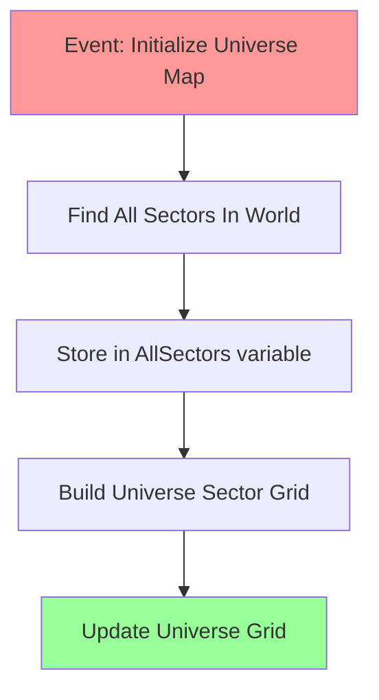
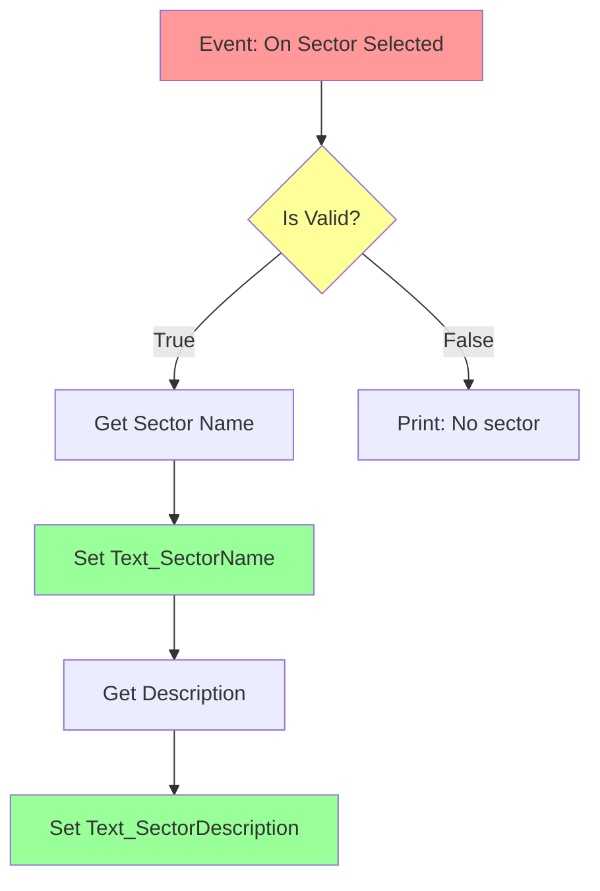
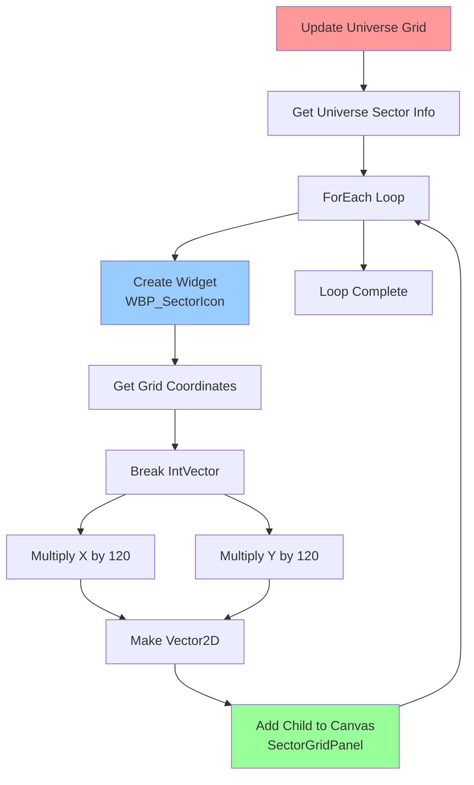
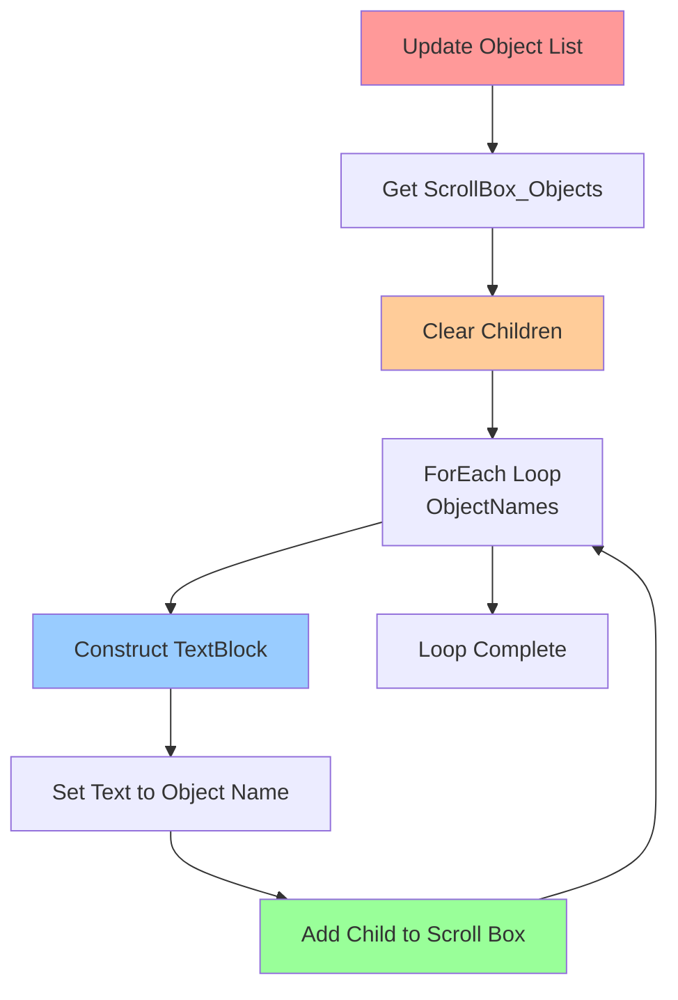
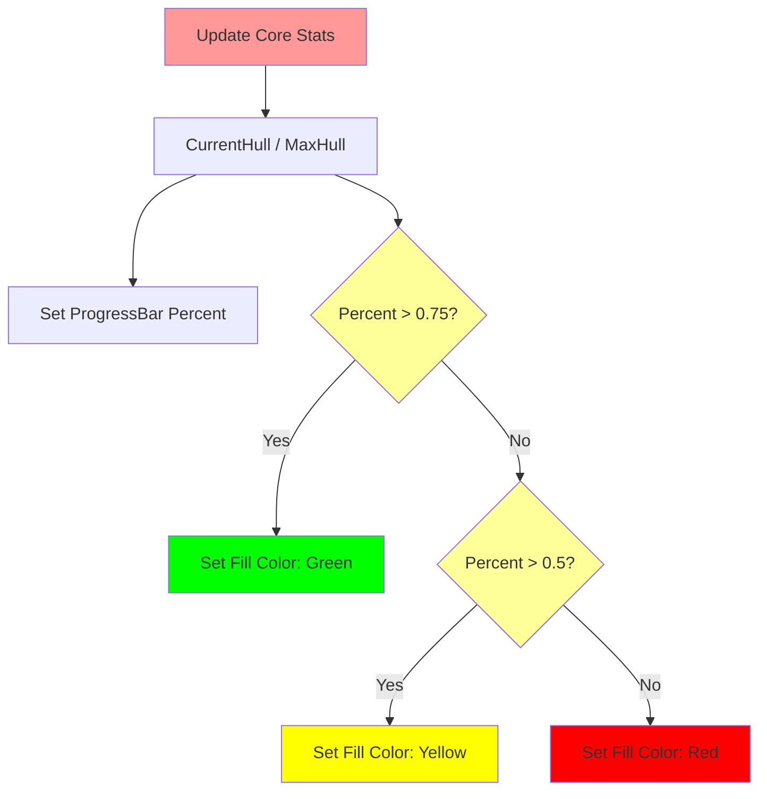

# Blueprint Graph Visual Guide - Copyable Diagrams

**Last Updated**: December 16, 2025  
**Purpose**: Visual representations of Blueprint graphs you can copy and reference

> **Note**: These are text-based visual representations of Blueprint node graphs. Copy the ASCII art or Mermaid diagrams and use them as reference when creating your Blueprints in Unreal Engine.

---

## Table of Contents

1. [How to Use These Diagrams](#how-to-use-these-diagrams)
2. [Universe Map Blueprints](#universe-map-blueprints)
3. [Sector Map Blueprints](#sector-map-blueprints)
4. [Ship Status Blueprints](#ship-status-blueprints)
5. [Common Blueprint Patterns](#common-blueprint-patterns)
6. [Legend and Symbols](#legend-and-symbols)

---

## How to Use These Diagrams

### Reading the Diagrams

- **Boxes** represent Blueprint nodes
- **Arrows (→)** represent execution flow (white pins)
- **Lines (─)** represent data connections (colored pins)
- **[Type]** indicates the data type being passed

### Copying Instructions

1. Select the diagram you need
2. Copy the entire ASCII art or Mermaid code block
3. Paste into a text editor for reference
4. Recreate the connections in Unreal Engine Blueprint editor

### Mermaid Diagrams

Some diagrams use Mermaid syntax. You can:
- View them rendered on GitHub
- Paste into Mermaid Live Editor: https://mermaid.live/
- Use as text reference

---

## Universe Map Blueprints

### 1. Initialize Universe Map

```
┌─────────────────────────────────┐
│  Event: Initialize Universe Map │
│  (Called when map opens)        │
└────────────┬────────────────────┘
             │ [Execution]
             ↓
┌─────────────────────────────────┐
│  Find All Sectors In World      │
│  → Returns: Array<Sector>       │
└────────────┬────────────────────┘
             │ [Array of ASpaceSectorMap*]
             ↓
┌─────────────────────────────────┐
│  Store in: AllSectors variable  │
└────────────┬────────────────────┘
             │ [Execution]
             ↓
┌─────────────────────────────────┐
│  Build Universe Sector Grid     │
│  (Organizes sectors by position)│
└────────────┬────────────────────┘
             │ [Execution]
             ↓
┌─────────────────────────────────┐
│  Update Universe Grid           │
│  (Refreshes display)            │
└─────────────────────────────────┘
```

**Mermaid Version:**



**To Create in Unreal:**

1. In Graph tab, find "Initialize Universe Map" event
2. Right-click → Search "Find All Sectors In World"
3. Connect execution pin (white arrow)
4. Drag from return value → Right-click → "Set" → Select "AllSectors" variable
5. From Set node → Right-click → "Build Universe Sector Grid"
6. From that → Right-click → "Update Universe Grid"

---

### 2. On Sector Selected

```
┌─────────────────────────────────┐
│  Event: On Sector Selected      │
│  Input: Selected Sector         │
└────────────┬────────────────────┘
             │ [Execution]
             ├────────────────────────┐ [Selected Sector]
             ↓                        ↓
┌─────────────────────────────────┐  │
│  Is Valid?                      │←─┘
│  (Check if sector is not null)  │
└────────┬────────────┬────────────┘
         │ True       │ False
         ↓            ↓
    ┌────────────┐  ┌────────────────┐
    │ Continue   │  │ Print String   │
    │            │  │ "No sector"    │
    └─────┬──────┘  └────────────────┘
          │ [Execution]
          ↓
    ┌──────────────────────────────────┐
    │ Get Sector Name                  │
    │ Target: Selected Sector          │
    └────────┬─────────────────────────┘
             │ [FText]
             ↓
    ┌──────────────────────────────────┐
    │ Set Text (Text Block)            │
    │ Target: Text_SectorName          │
    │ Text: [from Get Sector Name]     │
    └────────┬─────────────────────────┘
             │ [Execution]
             ↓
    ┌──────────────────────────────────┐
    │ Get Description                  │
    │ Target: Selected Sector          │
    └────────┬─────────────────────────┘
             │ [FText]
             ↓
    ┌──────────────────────────────────┐
    │ Set Text (Text Block)            │
    │ Target: Text_SectorDescription   │
    └──────────────────────────────────┘
```

**Mermaid Version:**



---

### 3. Update Universe Grid with Sector Icons

```
┌──────────────────────────────────────┐
│  Event: Update Universe Grid         │
└────────────┬─────────────────────────┘
             │ [Execution]
             ↓
┌──────────────────────────────────────┐
│  Get Universe Sector Info            │
│  → Returns: Array<FSectorInfo>       │
└────────────┬─────────────────────────┘
             │ [Array]
             ↓
┌──────────────────────────────────────┐
│  ForEach Loop                        │
│  ┌─────────────────────────────────┐ │
│  │ Array Element: Current Sector   │ │
│  │ Array Index: Loop Index         │ │
│  └─────────────────────────────────┘ │
└─┬──────────┬─────────────────────────┘
  │ Loop     │ Completed
  │ Body     │
  ↓          ↓
┌────────────────────────┐    ┌─────────────────┐
│ Create Widget          │    │ Update Progress │
│ Class: WBP_SectorIcon  │    │ Bar             │
└──────┬─────────────────┘    └─────────────────┘
       │ [Widget Reference]
       ↓
┌────────────────────────────────────┐
│ Get Grid Coordinates               │
│ From: Current Sector               │
└──────┬─────────────────────────────┘
       │ [FIntVector]
       ↓
┌────────────────────────────────────┐
│ Break IntVector                    │
│ → X, Y, Z                          │
└──┬──────┬──────┬───────────────────┘
   │ X    │ Y    │ Z
   ↓      ↓      ↓
┌──────┐ ┌──────┐ (Not used)
│ * 120│ │ * 120│
└──┬───┘ └──┬───┘
   │        │
   └────┬───┘
        │ [Float, Float]
        ↓
┌────────────────────────────────────┐
│ Make Vector2D                      │
│ X: [from calc], Y: [from calc]     │
└──────┬─────────────────────────────┘
       │ [Vector2D]
       ↓
┌────────────────────────────────────┐
│ Add Child to Canvas                │
│ Parent: SectorGridPanel            │
│ Widget: [Created Widget]           │
│ Position: [Vector2D]               │
└────────────────────────────────────┘
```

**Simplified Mermaid:**



---

### 4. Update Exploration Progress

```
┌──────────────────────────────────────┐
│  Event: Update Universe Grid         │
└────────────┬─────────────────────────┘
             │
             ↓
┌──────────────────────────────────────┐
│  Get Exploration Progress            │
│  (Returns 0.0 to 1.0)                │
└────────────┬─────────────────────────┘
             │ [Float]
             ├──────────────┐
             ↓              ↓
┌─────────────────────┐  ┌──────────────────────┐
│ Set Percent         │  │ Float * Float        │
│ Target: ProgressBar │  │ A: [Progress]        │
│ Percent: [Progress] │  │ B: 100.0             │
└─────────────────────┘  └───────┬──────────────┘
                                 │ [Float]
                                 ↓
                         ┌──────────────────────┐
                         │ Format Text          │
                         │ Format: "{0}%"       │
                         │ Param: [Result]      │
                         └───────┬──────────────┘
                                 │ [FText]
                                 ↓
                         ┌──────────────────────┐
                         │ Set Text             │
                         │ Target: Text_Percent │
                         └──────────────────────┘
```

**Mermaid Version:**

```mermaid
graph TD
    A[Update Universe Grid] --> B[Get Exploration Progress]
    B --> C[Set ProgressBar Percent]
    B --> D[Multiply by 100.0]
    D --> E[Format Text: {0}%]
    E --> F[Set Text_Percent]
    
    style A fill:#ff9999
    style B fill:#ffff99
    style C fill:#99ff99
    style F fill:#99ff99
```

---

### 5. Close Button Handler

```
┌────────────────────────────────┐
│  Button_Close: On Clicked      │
└────────────┬───────────────────┘
             │ [Execution]
             ↓
┌────────────────────────────────┐
│  Get Player Controller         │
└────────────┬───────────────────┘
             │ [APlayerController*]
             ↓
┌────────────────────────────────┐
│  Toggle Universe Map Visibility│
│  Target: [Player Controller]   │
│  b Visible: false              │
└────────────────────────────────┘
```

**Simple One-Line:**
```
On Clicked → Get Player Controller → Toggle Universe Map Visibility (false)
```

---

## Sector Map Blueprints

### 1. Initialize Sector Map

```
┌─────────────────────────────────┐
│  Event: Initialize Sector Map   │
└────────────┬────────────────────┘
             │ [Execution]
             ↓
┌─────────────────────────────────┐
│  Print String                   │
│  String: "Sector Map Init"      │
└────────────┬────────────────────┘
             │ [Execution]
             ↓
┌─────────────────────────────────┐
│  Get Target Sector              │
└────────────┬────────────────────┘
             │ [ASpaceSectorMap*]
             ↓
┌─────────────────────────────────┐
│  Is Valid?                      │
└────────┬────────────┬───────────┘
         │ True       │ False
         ↓            ↓
    ┌─────────┐  ┌──────────┐
    │ Refresh │  │ (Do      │
    │ Data    │  │ Nothing) │
    └─────────┘  └──────────┘
```

---

### 2. Update Sector Info

```
┌────────────────────────────────────────┐
│  Event: Update Sector Info             │
│  Input: FSectorDisplayInfo SectorInfo  │
└────────────┬───────────────────────────┘
             │ [Execution]
             │ [SectorInfo]
             ↓
┌────────────────────────────────────────┐
│  Break FSectorDisplayInfo              │
│  ┌──────────────────────────────────┐  │
│  │ → Sector Name (FText)            │  │
│  │ → Description (FText)            │  │
│  │ → Sector Center (FVector)        │  │
│  │ → Sector Size (Float)            │  │
│  │ → Object Count (Int32)           │  │
│  └──────────────────────────────────┘  │
└─┬──────┬──────┬──────┬──────┬──────────┘
  │ Name │ Desc │Center│ Size │ Count
  ↓      ↓      ↓      ↓      ↓
┌─────┐ ┌────┐ (Not  (Not  ┌────────────┐
│Set  │ │Set │ used) used) │Format Text │
│Text │ │Text│             │"Objects:{0}"│
│Name │ │Desc│             └─────┬──────┘
└─────┘ └────┘                    │
                                  ↓
                              ┌────────────┐
                              │Set Text    │
                              │ObjectCount │
                              └────────────┘
```

**Mermaid Version:**

```mermaid
graph TD
    A[Update Sector Info<br/>Input: SectorInfo] --> B[Break FSectorDisplayInfo]
    B --> C[Get Sector Name]
    B --> D[Get Description]
    B --> E[Get Object Count]
    C --> F[Set Text_SectorName]
    D --> G[Set Text_SectorDescription]
    E --> H[Format: Objects: {0}]
    H --> I[Set Text_ObjectCount]
    
    style A fill:#ff9999
    style B fill:#ffff99
    style F fill:#99ff99
    style G fill:#99ff99
    style I fill:#99ff99
```

---

### 3. Update Object List

```
┌──────────────────────────────────────────┐
│  Event: Update Object List               │
│  Input: Array<FText> ObjectNames         │
│  Input: Int32 ObjectCount                │
└────────────┬─────────────────────────────┘
             │ [Execution]
             ↓
┌──────────────────────────────────────────┐
│  Get ScrollBox_Objects                   │
└────────────┬─────────────────────────────┘
             │ [UScrollBox*]
             ↓
┌──────────────────────────────────────────┐
│  Clear Children                          │
│  Target: [ScrollBox_Objects]             │
└────────────┬─────────────────────────────┘
             │ [Execution]
             │ [ObjectNames Array]
             ↓
┌──────────────────────────────────────────┐
│  ForEach Loop                            │
│  Array: ObjectNames                      │
└─┬────────────────────────────────────────┘
  │ Loop Body
  ↓
┌──────────────────────────────────────────┐
│  Construct Object from Class             │
│  Class: TextBlock                        │
└────────────┬─────────────────────────────┘
             │ [UTextBlock*]
             ├──────────────────┐
             ↓                  │ [Current Element]
┌─────────────────────────┐    │
│  Set Text               │←───┘
│  Text: [Object Name]    │
└────────────┬────────────┘
             │ [Execution]
             ↓
┌─────────────────────────────────────────┐
│  Add Child to Scroll Box                │
│  Parent: ScrollBox_Objects              │
│  Child: [Created TextBlock]             │
└─────────────────────────────────────────┘
```

**Mermaid Version:**



---

## Ship Status Blueprints

### 1. Initialize Ship Status

```
┌──────────────────────────────────────┐
│  Event: Initialize Ship Status       │
└────────────┬─────────────────────────┘
             │ [Execution]
             ↓
┌──────────────────────────────────────┐
│  Get Player Spaceship                │
│  (Gets controlled ship)              │
└────────────┬─────────────────────────┘
             │ [ASpaceship*]
             ↓
┌──────────────────────────────────────┐
│  Is Valid?                           │
└────────┬────────────┬────────────────┘
         │ True       │ False
         ↓            ↓
    ┌────────────┐  ┌─────────────────┐
    │ Store in   │  │ Print: No Ship  │
    │ Variable   │  └─────────────────┘
    └─────┬──────┘
          │ [Execution]
          ↓
    ┌────────────────────────────────┐
    │ Get Ship Data Asset            │
    │ Target: [Spaceship]            │
    └─────────┬──────────────────────┘
              │ [USpaceshipDataAsset*]
              ↓
    ┌────────────────────────────────┐
    │ Refresh Ship Status            │
    │ (Updates all displays)         │
    └────────────────────────────────┘
```

---

### 2. Update Basic Info

```
┌──────────────────────────────────────────┐
│  Event: Update Basic Info                │
│  Input: FText ShipName                   │
│  Input: FText ShipClass                  │
│  Input: FText Description                │
└────────┬─────────┬─────────┬─────────────┘
         │ Name    │ Class   │ Description
         ↓         ↓         ↓
    ┌────────┐ ┌────────┐ ┌────────────┐
    │Set Text│ │Set Text│ │Set Text    │
    │Name    │ │Class   │ │Description │
    └────────┘ └────────┘ └────────────┘
```

**Simple Parallel Flow:**
```
Update Basic Info
    ├─> ShipName → Set Text_ShipName
    ├─> ShipClass → Set Text_ShipClass
    └─> Description → Set Text_Description
```

---

### 3. Update Core Stats with Hull Bar

```
┌──────────────────────────────────────────────┐
│  Event: Update Core Stats                   │
│  Input: Float CurrentHull                   │
│  Input: Float MaxHull                       │
│  Input: Float CargoCapacity                 │
│  Input: Int32 CrewRequired, MaxCrew         │
│  Input: Int32 ModularPoints                 │
└───┬────────┬────────┬────────┬──────────────┘
    │        │        │        │
    │ Hull   │ Cargo  │ Crew   │ ModPoints
    ↓        ↓        ↓        ↓
┌─────────────────────┐ (Format and set
│ CurrentHull / Max   │  text for each)
└──────┬──────────────┘
       │ [Float 0.0-1.0]
       ├──────────────────────────┐
       ↓                          ↓
┌──────────────────┐     ┌────────────────────┐
│ Set Percent      │     │ Branch: > 0.75?    │
│ ProgressBar_Hull │     └────┬──────┬────────┘
└──────────────────┘          │True  │False
                              ↓      ↓
                         ┌────────┐  ┌──────────────┐
                         │Set Fill│  │Branch: > 0.5?│
                         │Green   │  └──┬──────┬────┘
                         └────────┘     │True  │False
                                        ↓      ↓
                                   ┌────────┐ ┌─────┐
                                   │Yellow  │ │Red  │
                                   └────────┘ └─────┘
```

**Mermaid Version:**



---

### 4. Update Ratings with Progress Bars

```
┌──────────────────────────────────────────┐
│  Event: Update Ratings                   │
│  Input: Float CombatRating (0-100)      │
│  Input: Float MobilityRating (0-100)    │
│  Input: Float UtilityRating (0-100)     │
└──────┬────────┬────────┬─────────────────┘
       │Combat  │Mobility│Utility
       ↓        ↓        ↓
   ┌────────┐ ┌────────┐ ┌────────┐
   │/ 100.0 │ │/ 100.0 │ │/ 100.0 │
   └───┬────┘ └───┬────┘ └───┬────┘
       │ 0.0-1.0  │ 0.0-1.0  │ 0.0-1.0
       ↓          ↓          ↓
   ┌──────────┐ ┌──────────┐ ┌──────────┐
   │Set %     │ │Set %     │ │Set %     │
   │Combat    │ │Mobility  │ │Utility   │
   │ProgressBar│ │ProgressBar│ │ProgressBar│
   └──────────┘ └──────────┘ └──────────┘
   
   (Also format text: "Combat: 75%" etc.)
```

---

### 5. Polished - Color Coding Example

```
After setting Progress Bar percent value:

┌────────────────────────┐
│ Get Percent Value      │
│ (CurrentHull / MaxHull)│
└───────┬────────────────┘
        │ [Float]
        ↓
┌────────────────────────┐
│ Float > Float          │
│ A: [Percent]           │
│ B: 0.75                │
└────┬──────────┬────────┘
     │ True     │ False
     ↓          ↓
┌──────────┐  ┌────────────────────┐
│Branch    │  │ Float > Float      │
└────┬─────┘  │ A: [Percent]       │
     │        │ B: 0.5             │
     ↓        └────┬──────────┬────┘
┌──────────────┐   │ True     │ False
│Get ProgressBar│  ↓          ↓
│Hull          │  │          │
└─────┬────────┘  │          │
      │           │          │
      ↓           ↓          ↓
┌────────────┐ ┌────────┐ ┌────────┐
│Set Fill    │ │Set Fill│ │Set Fill│
│Color:      │ │Color:  │ │Color:  │
│RGB(0,1,0)  │ │RGB(1,1,0)│ │RGB(1,0,0)│
│(Green)     │ │(Yellow)│ │(Red)   │
└────────────┘ └────────┘ └────────┘
```

---

## Common Blueprint Patterns

### Pattern 1: Simple Button Click

```
┌──────────────────────┐
│  Button: On Clicked  │
└──────────┬───────────┘
           │
           ↓
┌──────────────────────┐
│  Do Action           │
└──────────────────────┘
```

### Pattern 2: Input Validation Check

```
┌──────────────────────┐
│  Get Variable        │
└──────────┬───────────┘
           │ [Reference]
           ↓
┌──────────────────────┐
│  Is Valid?           │
└────┬──────────┬──────┘
     │ Valid    │ Invalid
     ↓          ↓
┌─────────┐  ┌──────────┐
│Continue │  │Show Error│
└─────────┘  └──────────┘
```

### Pattern 3: Format and Display Text

```
┌──────────────┐
│  Get Value   │
│  (e.g. 75)   │
└──────┬───────┘
       │ [Float]
       ↓
┌──────────────────────┐
│  Format Text         │
│  Format: "HP: {0}"   │
│  Param: [Value]      │
└──────┬───────────────┘
       │ [FText]
       ↓
┌──────────────────────┐
│  Set Text (TextBlock)│
└──────────────────────┘
```

### Pattern 4: Array Loop with Widget Creation

```
┌──────────────────────┐
│  Get Array           │
└──────────┬───────────┘
           │ [Array]
           ↓
┌──────────────────────┐
│  ForEach Loop        │
└─┬────────────────────┘
  │ Loop Body
  ↓
┌──────────────────────┐
│  Create Widget       │
│  Class: [WidgetType] │
└──────────┬───────────┘
           │
           ↓
┌──────────────────────┐
│  Add to Parent       │
└──────────────────────┘
```

### Pattern 5: Timer/Delayed Action

```
┌──────────────────────┐
│  Event BeginPlay     │
└──────────┬───────────┘
           │
           ↓
┌──────────────────────┐
│  Set Timer by Event  │
│  Time: 1.0 seconds   │
│  Looping: true       │
└──────────┬───────────┘
           │ [Event]
           ↓
┌──────────────────────┐
│  Custom Event:       │
│  UpdateDisplay       │
└──────────────────────┘
```

### Pattern 6: Toggle Visibility

```
┌──────────────────────┐
│  Get Widget          │
└──────────┬───────────┘
           │
           ↓
┌──────────────────────┐
│  Get Visibility      │
└──────────┬───────────┘
           │ [ESlateVisibility]
           ↓
┌──────────────────────┐
│  Equal (Visibility)  │
│  Compare to: Visible │
└────┬──────────┬──────┘
     │ True     │ False
     ↓          ↓
┌─────────┐  ┌─────────┐
│Set to   │  │Set to   │
│Hidden   │  │Visible  │
└─────────┘  └─────────┘
```

---

## Legend and Symbols

### Box Types

```
┌─────────────────────┐
│  Event Node         │  ← Red in Unreal (Entry point)
└─────────────────────┘

┌─────────────────────┐
│  Function Call      │  ← Blue in Unreal (Action)
└─────────────────────┘

┌─────────────────────┐
│  Pure Function      │  ← Green in Unreal (No execution pin)
└─────────────────────┘

┌─────────────────────┐
│  Variable Get/Set   │  ← Various colors (Data access)
└─────────────────────┘
```

### Connection Types

```
─────────> Execution Pin (White)
─ ─ ─ ─ > Data Pin (Colored by type)

[Type] indicates data type:
  [Float] - Decimal number
  [Int32] - Whole number
  [FText] - Text/string
  [FVector] - 3D position
  [Boolean] - True/False
  [Array] - List of items
```

### Branch/Conditional

```
┌──────────┐
│  Branch  │
└─┬──────┬─┘
  │True  │False
  ↓      ↓
```

### Loop

```
┌────────────────┐
│  ForEach Loop  │
└─┬──────────────┘
  │ Body → [runs for each item]
  ↓
  [Back to loop until complete]
```

---

## Tips for Using These Diagrams

### 1. Start Simple

Begin with the simpler patterns (button clicks, text updates) before attempting complex flows like loops with widget creation.

### 2. Follow the Arrows

- **Solid arrows** (→) = Execution flow (must follow these)
- **Dashed lines** (- - -) = Data connections (can skip ahead)

### 3. Read Top to Bottom

Most diagrams flow from top (start) to bottom (end).

### 4. Parallel Branches

When arrows split, you need to create multiple connections from the same starting point.

### 5. Variable Storage

When you see "Store in variable" or "Set Variable", you need to:
1. Create the variable in My Blueprint panel
2. Drag it into the graph
3. Select "Set" option
4. Connect the value you want to store

---

## Converting Diagrams to Blueprints

### Step-by-Step Process

1. **Identify the starting event**
   - Look for "Event:" boxes
   - Find these in the Graph tab under Functions or Events

2. **Follow execution path**
   - Create each node in order
   - Right-click in empty space
   - Search for the node name shown in the box

3. **Connect execution pins**
   - White arrow pins
   - Must connect for code to run

4. **Connect data pins**
   - Colored pins based on data type
   - Drag from output to input
   - Must match compatible types

5. **Set values**
   - Literal values (numbers, text) shown in the boxes
   - Type them directly in the node

6. **Create branches**
   - Use Branch node for True/False splits
   - Connect condition to the Branch input

7. **Test frequently**
   - Compile after each section
   - Use Print String to debug
   - Check Output Log for errors

---

## Example: Creating Universe Map Initialize from Diagram

### Diagram Reference:
```
Event: Initialize Universe Map
    ↓
Find All Sectors In World
    ↓
Store in AllSectors
    ↓
Build Universe Sector Grid
    ↓
Update Universe Grid
```

### Steps in Unreal:

1. **Open WBP_UniverseMap Blueprint**
2. **Go to Graph tab**
3. **Find "Initialize Universe Map" function**
4. **Right-click in empty space → Type "Find All Sectors"**
5. **Select "Find All Sectors In World"**
6. **Connect white execution pin from event to this node**
7. **Drag from the return value (array output)**
8. **Right-click → "Set" → Select "AllSectors" variable**
9. **From the Set node, drag execution pin**
10. **Right-click → Type "Build Universe Sector Grid"**
11. **Connect execution pin**
12. **From that node, drag execution pin**
13. **Right-click → Type "Update Universe Grid"**
14. **Connect execution pin**
15. **Compile and test!**

---

## Screenshots vs Diagrams

### Why Text Diagrams?

**Advantages:**
- ✅ Can copy and paste
- ✅ Work in any text editor
- ✅ Easy to share in documentation
- ✅ Version control friendly
- ✅ Search engine friendly
- ✅ No image hosting needed

**When to Use Screenshots:**
- ✔️ Final documentation
- ✔️ Bug reports showing specific issues
- ✔️ Tutorials with multiple complex connections
- ✔️ Showing UI layout visually

### Creating Your Own Diagrams

Use this template:
```
┌──────────────────────┐
│  Node Name           │
│  Details/Inputs      │
└──────────┬───────────┘
           │ [Data Type]
           ↓
┌──────────────────────┐
│  Next Node           │
└──────────────────────┘
```

---

## Quick Reference Cheat Sheet

### Basic Nodes

```
Event → Start point
Get → Retrieve value
Set → Store value
Branch → If/else split
ForEach → Loop through array
Format Text → Build text string
Print String → Debug output
Is Valid? → Check if not null
Create Widget → Make UI element
Add to Viewport → Show widget
```

### Common Connections

```
Event → Function Call → Function Call → End
Get Value → Set Text Block
Get Array → ForEach Loop → Create Widget
Condition → Branch → True/False paths
```

---

## Conclusion

These diagrams provide a copyable reference for all the Blueprint graphs in the tutorial guide. Use them alongside the detailed instructions in `BLUEPRINT_CREATION_DETAILED_GUIDE.md` to recreate the functionality in your own Blueprints.

**Remember:**
- Start simple and build up
- Test frequently with Print String
- Check the Output Log for errors
- Don't worry about making mistakes - Blueprints are forgiving!

For questions about specific nodes or connections, refer back to the main guide or search Unreal Engine documentation.

---

**Related Documents:**
- `BLUEPRINT_CREATION_DETAILED_GUIDE.md` - Step-by-step tutorials
- `UPDATED_BLUEPRINT_LIST_2025.md` - Complete blueprint catalog
- `Assets/MapSystemGuide.md` - Map system C++ reference
- `Source/Adastrea/UI/ShipStatusWidget_Usage.md` - Ship status C++ reference

**Good luck creating your Blueprints! 🎮**
