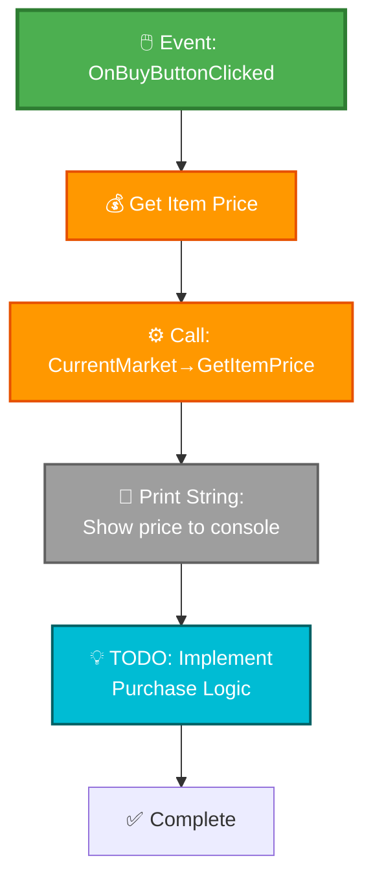
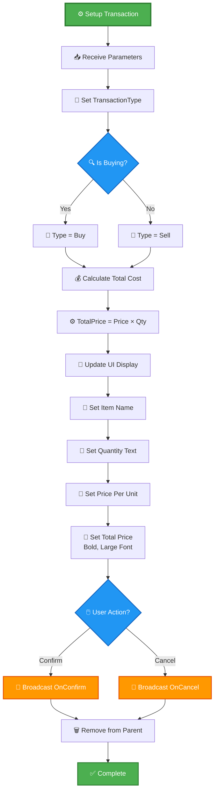
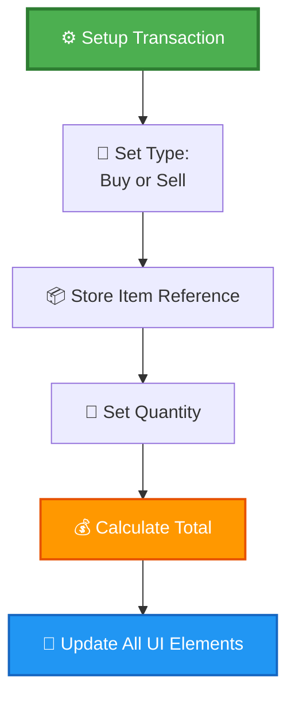

# Trading System - Blueprint Integration Guide (UPDATED SAMPLE)

> **📝 Note**: This is a demonstration of the new Blueprint display standards from [BLUEPRINT_DISPLAY_GUIDE.md](../BLUEPRINT_DISPLAY_GUIDE.md). This shows how to update existing documentation.

---

## Quick Start: 5-Minute Trading Setup

### Step 3: Create Trading UI Widget (Updated Format)

1. **In Content Browser**:
   - Navigate to `Content/UI/Trading/`
   - Right-click → User Interface → Widget Blueprint
   - Name: `WBP_SimpleTradingUI`

2. **Add basic widgets**:
   - Canvas Panel (root)
   - Text Block: Market name
   - Button: "Buy Iron Ore"
   - Button: "Sell Iron Ore"
   - Text Block: Price display

3. **Add variables**:
   - `CurrentMarket` (MarketDataAsset, Instance Editable)
   - `IronOreItem` (TradeItemDataAsset, Instance Editable)

4. **Implement Buy button** (NEW FORMAT):

#### Mermaid Visualization



#### Enhanced Text Format

```
🎯 Event: OnBuyButtonClicked
📍 Widget: WBP_SimpleTradingUI

──────────────────────────────────
EXECUTION FLOW
──────────────────────────────────

🟢 START → Button Clicked
    │
    ├─→ 💰 Get Item Price
    │     ├─→ Target: CurrentMarket
    │     ├─→ Function: GetItemPrice
    │     ├─→ Parameters:
    │     │     • Item: IronOreItem
    │     │     • IsBuying: true
    │     └─→ Returns: Float (price)
    │
    ├─→ 📝 Print String
    │     └─→ Message: "Price: $[price]"
    │
    └─→ 💡 TODO Implementation
          └─→ Add: Purchase validation
                  Credit deduction
                  Inventory update
                  UI refresh
```

**You now have a working trading system foundation!**

---

## Blueprint Widget Examples (Updated)

### Example 1: Price Display Widget

**Widget**: `WBP_ItemPriceDisplay`

**Variables**:
```
TradeItem (TradeItemDataAsset, Instance Editable)
CurrentMarket (MarketDataAsset, Instance Editable)
```

**Widget Hierarchy**:
```
Horizontal Box
├── Image: Item Icon
├── Text Block: Item Name
├── Text Block: Price (Colored)
└── Text Block: Supply/Demand Indicator
```

#### Event Graph (Mermaid Format)

```mermaid
graph TD
    A[📅 Event Construct] --> B[⚙️ Update Price Display]
    
    B --> C[💰 Get Current Price]
    C --> D[⚙️ CurrentMarket→GetItemPrice]
    D --> E[📝 Set Price Text]
    E --> F[🎨 Set Price Color]
    F --> G{💲 Price vs Base?}
    
    G -->|High| H[🔴 Color: Red]
    G -->|Low| I[🟢 Color: Green]
    G -->|Normal| J[⚪ Color: White]
    
    H --> K[📊 Get Inventory Entry]
    I --> K
    J --> K
    
    K --> L[⚙️ GetInventoryEntry]
    L --> M[📝 Set Supply/Demand Text]
    M --> N{📦 Supply Level?}
    
    N -->|Low| O[⚠️ "Low Stock"]
    N -->|High Demand| P[📈 "High Demand"]
    N -->|Normal| Q[✅ "Normal"]
    
    O --> R[✅ Complete]
    P --> R
    Q --> R
    
    style A fill:#4CAF50,stroke:#2E7D32,stroke-width:3px,color:#fff
    style G fill:#2196F3,stroke:#1565C0,stroke-width:2px,color:#fff
    style N fill:#2196F3,stroke:#1565C0,stroke-width:2px,color:#fff
    style H fill:#F44336,stroke:#C62828,stroke-width:2px,color:#fff
    style I fill:#4CAF50,stroke:#2E7D32,stroke-width:2px,color:#fff
    style R fill:#4CAF50,stroke:#2E7D32,stroke-width:2px,color:#fff
```

#### Detailed Function Card

<details>
<summary>🔄 <b>Update Price Display</b> - Custom Event</summary>

```
┌─────────────────────────────────────────────────────────────┐
│ 🔄 UPDATE PRICE DISPLAY                                     │
│ Type: Custom Event                                          │
│ Category: UI Update                                         │
├─────────────────────────────────────────────────────────────┤
│ 📥 INPUTS                                                    │
│   None (uses widget variables)                              │
│                                                              │
│ 📤 OUTPUTS                                                   │
│   None (updates UI elements directly)                       │
├─────────────────────────────────────────────────────────────┤
│ 🔧 OPERATIONS                                                │
│                                                              │
│ 1. 💰 Get Current Price                                     │
│    └─→ Call: CurrentMarket→GetItemPrice(TradeItem, true)   │
│        Returns: Float (current buy price)                   │
│                                                              │
│ 2. 📝 Format and Display Price                              │
│    └─→ Convert to currency format: "$X.XX"                  │
│        Set Text_Price widget text                           │
│                                                              │
│ 3. 🎨 Apply Color Coding                                    │
│    ├─→ If Price > BasePrice × 1.2 → Red (inflated)         │
│    ├─→ If Price < BasePrice × 0.8 → Green (bargain)        │
│    └─→ Otherwise → White (normal)                           │
│                                                              │
│ 4. 📊 Get Market Status                                     │
│    └─→ Call: CurrentMarket→GetInventoryEntry()             │
│        Returns: Supply, Demand, Stock levels                │
│                                                              │
│ 5. 📝 Display Market Status                                 │
│    ├─→ If Supply < 0.8 → "Low Stock" ⚠️                    │
│    ├─→ If Demand > 1.2 → "High Demand" 📈                  │
│    └─→ Otherwise → "Normal" ✅                              │
│                                                              │
├─────────────────────────────────────────────────────────────┤
│ 💡 USAGE                                                     │
│   • Called on Event Construct (widget initialization)       │
│   • Called when market data changes                         │
│   • Called on timer for real-time updates                   │
│                                                              │
│ ⚠️ IMPORTANT                                                 │
│   • Requires valid CurrentMarket reference                  │
│   • Requires valid TradeItem reference                      │
│   • Price calculation includes taxes and modifiers          │
│   • Supply/Demand affects displayed price                   │
├─────────────────────────────────────────────────────────────┤
│ 📝 EXAMPLE BINDING                                           │
│                                                              │
│   Event Construct                                           │
│        ↓                                                     │
│   Update Price Display (first time)                         │
│        ↓                                                     │
│   Set Timer (Repeating, 5 seconds)                          │
│        ↓                                                     │
│   Update Price Display (periodic refresh)                   │
└─────────────────────────────────────────────────────────────┘
```

</details>

---

### Example 2: Transaction Widget (Updated)

**Widget**: `WBP_TransactionDialog`

**Purpose**: Confirm buy/sell transactions with detailed information

**Variables**:
```
TransactionType (Text) // "Buy" or "Sell"
TradeItem (TradeItemDataAsset)
Quantity (Integer)
PricePerUnit (Float)
TotalPrice (Float)
OnConfirm (Event Dispatcher)
OnCancel (Event Dispatcher)
```

#### Complete Transaction Flow



#### Quick Reference Table

| User Action | Event Fired | Parameters | Result |
|-------------|-------------|------------|--------|
| **Click Confirm** | OnConfirm | Item, Quantity, Price | Transaction processed |
| **Click Cancel** | OnCancel | None | Dialog closes, no action |
| **Press ESC** | OnCancel | None | Same as cancel button |
| **Click Outside** | OnCancel | None | Dismiss dialog |

---

## Comparison: Old vs New Format

### OLD Format (ASCII Art)

```
Function: Setup Transaction
  Inputs: Item, Qty, Price, IsBuying
  
  ├── Set TransactionType
  │   └── If IsBuying: "Buy" Else: "Sell"
  ├── Set TradeItem = Item
  ├── Set Quantity = Qty
  ├── Set PricePerUnit = Price
  ├── Calculate Total
  │   └── TotalPrice = Price * Qty
  └── Update Display
      ├── Set Item Name Text
      ├── Set Quantity Text: "Quantity: X units"
      ├── Set Price Text: "$X.XX per unit"
      └── Set Total Text: "Total: $X,XXX.XX" (Bold)
```

### NEW Format (Mermaid)



### Benefits of New Format

✅ **Visual Clarity**
- Color-coded nodes show purpose at a glance
- Emojis provide quick visual scanning
- Better rendering on GitHub and mobile

✅ **Professional Appearance**
- Modern flowchart style
- Consistent with industry standards
- Publication-quality visuals

✅ **Easier Maintenance**
- Mermaid syntax is simpler than ASCII art
- Changes are quick to make
- Version control friendly

✅ **Better Information Density**
- Compact yet readable
- Shows relationships clearly
- Easy to follow execution flow

---

## Migration Notes

### Converting Existing Documentation

1. **Identify diagram type** in old docs
2. **Choose appropriate new format** from guide
3. **Recreate using Mermaid** or enhanced text
4. **Test rendering** on GitHub
5. **Update any references** to the documentation

### Files to Update (Priority Order)

1. ✅ TradingSystemBlueprintGuide.md (this file) - IN PROGRESS
2. ⏳ BlueprintWorkflowTemplates.md - Complex flows
3. ⏳ HomeworldBlueprintTemplates.md - Initialization logic
4. ⏳ WayNetworkBlueprintExamples.md - Network interactions
5. ⏳ CombatSystemGuide.md - Combat flows

### Quick Tips

- Use [Mermaid Live Editor](https://mermaid.live/) to preview
- Keep diagrams under 30 nodes for readability
- Split complex flows into multiple diagrams
- Link diagrams to detailed node cards
- Always include text alternatives

---

## See Also

- [BLUEPRINT_DISPLAY_GUIDE.md](../BLUEPRINT_DISPLAY_GUIDE.md) - Complete standards reference
- [BLUEPRINT_DISPLAY_EXAMPLES.md](../BLUEPRINT_DISPLAY_EXAMPLES.md) - More examples
- [Assets/TradingSystemGuide.md](../Assets/TradingSystemGuide.md) - Full C++ reference

---

**Last Updated**: November 19, 2025  
**Format Version**: 1.0.0 (New Standards)  
**Status**: Sample demonstration file
