# Adastrea - Game Visual Mockups

[](https://opensource.org/licenses/MIT)
[](https://www.unrealengine.com/)

> Visual concept mockups showing the current baseline vs. desired future look for Adastrea's open-world space flight game.

**Last Updated**: November 15, 2025  
**Version**: 1.0  
**Purpose**: Visual design reference for UI/UX, environment art, and gameplay presentation

---

## Table of Contents

- [Overview](#overview)
- [Design Vision](#design-vision)
- [Core Screens Mockups](#core-screens-mockups)
  - [1. Main Menu](#1-main-menu)
  - [2. Space Flight View](#2-space-flight-view)
  - [3. Station Construction Editor](#3-station-construction-editor)
  - [4. Trading Interface](#4-trading-interface)
  - [5. Crew Management](#5-crew-management)
  - [6. Faction Diplomacy](#6-faction-diplomacy)
  - [7. Ship Interior](#7-ship-interior)
  - [8. Sector Map](#8-sector-map)
- [Art Style Guidelines](#art-style-guidelines)
- [Color Palette](#color-palette)
- [UI/UX Principles](#uiux-principles)
- [Implementation Priority](#implementation-priority)

---


---

## Visual Architecture Diagrams

### UI Screen Flow


### HUD Layout Structure


### Station Module Connection System


### Faction Relationship Network

```mermaid
graph TD
    Player[🚀 Player]
    
    SU[☀️ Solaris Union<br/>Rep: +82]
    IC[⚙️ Ironclad Consortium<br/>Rep: +95]
    NC[💠 Neon Collective<br/>Rep: +30]
    VW[💀 Void Walkers<br/>Rep: -80]
    FT[🌿 Frontier Tribes<br/>Rep: +65]
    
    Player -->|Allied| IC
    Player -->|Allied| SU
    Player -->|Tense| NC
    Player -->|Hostile| VW
    Player -->|Friendly| FT
    
    SU <-->|Allied +85| IC
    SU <-->|Tense +30| NC
    SU <-->|War -80| VW
    SU <-->|Friendly +65| FT
    
    IC <-->|Neutral +50| FT
    IC <-->|Tense +25| NC
    IC <-->|Hostile -60| VW
    
    NC <-->|Hostile -70| VW
    NC <-->|Neutral +40| FT
    
    FT <-->|Friendly +55| VW
    
    style Player fill:#FFD700,stroke:#000,stroke-width:3px
    style SU fill:#87CEEB
    style IC fill:#708090
    style NC fill:#00FFFF
    style VW fill:#8B0000
    style FT fill:#228B22
```



### Trading System Flow


### Crew Management Hierarchy

```mermaid
graph TD
    A[👨‍✈️ Captain Sarah Chen<br/>Leadership: 10, Tactics: 8]
    
    B[👨‍💼 XO Marcus Webb<br/>Command: 8, Diplomacy: 7]
    C[👨‍🔧 Chief Engineer Lisa Wong<br/>Engineering: 9, Repair: 8]
    D[⚕️ Dr. Elena Park<br/>Medical: 9, Science: 7]
    E[🎖️ Security Chief James Torres<br/>Combat: 8, Security: 9]
    
    A --> B
    A --> C
    A --> D
    A --> E
    
    B --> F[Navigator]
    B --> G[Communications Officer]
    
    C --> H[Engineer x3]
    C --> I[Technician x2]
    
    D --> J[Nurse x2]
    D --> K[Scientist x2]
    
    E --> L[Security Officer x4]
    E --> M[Gunner Chief]
    
    M --> N[Gunner x4]
    
    style A fill:#FFD700
    style B fill:#4A9EFF
    style C fill:#F39C12
    style D fill:#2ECC71
    style E fill:#E74C3C
```



---
## Overview

This document presents visual mockups for Adastrea, illustrating the evolution from basic functional prototype to a polished, immersive space flight experience. Each mockup section includes:

- **Current/Baseline**: What a minimal implementation looks like (greybox/prototype)
- **Desired/Target**: The visual fidelity and polish we aim to achieve

These mockups serve as:
- Visual reference for artists and designers
- UI/UX guidance for interface development
- Quality benchmarks for asset creation
- Communication tool for project vision

---

## Design Vision

### Visual Pillars

1. **Immersive Space Environment**: Realistic lighting, nebulae, and celestial bodies
2. **Functional Sci-Fi Aesthetic**: Clean interfaces with purposeful design
3. **Information Clarity**: Data-rich displays without overwhelming the player
4. **Atmospheric Depth**: Sense of scale and wonder in vast space
5. **Modular Flexibility**: Systems that look good at various scales

### Target Aesthetic

- **Genre**: Hard sci-fi with accessibility
- **Tone**: Professional, tactical, but not sterile
- **Inspiration**: Elite Dangerous meets Stellaris meets Mass Effect
- **Palette**: Deep space blacks, electric blues, warm oranges, faction colors

---

## Core Screens Mockups

### 1. Main Menu

#### Current/Baseline Concept
```
╔════════════════════════════════════════════════════════════════╗
║                                                                ║
║                                                                ║
║                        ADASTREA                                ║
║                  Open World Space Flight                       ║
║                                                                ║
║                                                                ║
║                    [  NEW GAME  ]                              ║
║                    [  CONTINUE  ]                              ║
║                    [  OPTIONS   ]                              ║
║                    [   QUIT     ]                              ║
║                                                                ║
║                                                                ║
║                                                                ║
║                                                                ║
║               Version 0.9.0 - Pre-Alpha                        ║
╚════════════════════════════════════════════════════════════════╝
```

**Current Features**:
- Simple text-based menu
- Standard button layout
- Basic background (solid color or simple starfield)
- Functional but minimal

#### Desired/Target Concept
```
╔════════════════════════════════════════════════════════════════╗
║                                                                ║
║   ╭──────────────────────────────────────────────────────╮   ║
║   │                    ✦ ADASTREA ✦                      │   ║
║   │                                                       │   ║
║   │  ┌───────────────────────────────────────────────┐  │   ║
║   │  │  Background: Animated 3D space scene with     │  │   ║
║   │  │  - Slowly rotating planet/moon                │  │   ║
║   │  │  - Distant nebula with particle effects       │  │   ║
║   │  │  - Ships flying past in distance              │  │   ║
║   │  │  - Subtle lighting bloom and lens flares      │  │   ║
║   │  └───────────────────────────────────────────────┘  │   ║
║   │                                                       │   ║
║   │        ╔════════════════════════════╗                │   ║
║   │        ║    ▶ NEW GAME              ║                │   ║
║   │        ╠════════════════════════════╣                │   ║
║   │        ║    ⟳ CONTINUE [SLOT 1]    ║                │   ║
║   │        ╠════════════════════════════╣                │   ║
║   │        ║    ⚙ OPTIONS               ║                │   ║
║   │        ╠════════════════════════════╣                │   ║
║   │        ║    ℹ CREDITS               ║                │   ║
║   │        ╠════════════════════════════╣                │   ║
║   │        ║    ⊗ QUIT                  ║                │   ║
║   │        ╚════════════════════════════╝                │   ║
║   │                                                       │   ║
║   │  Lower Right: News ticker with faction updates      │   ║
║   │  Lower Left: Version info with sleek styling        │   ║
║   ╰──────────────────────────────────────────────────────╯   ║
║                                                                ║
╚════════════════════════════════════════════════════════════════╝
```

**Target Features**:
- Animated 3D background with real game assets
- Cinematic camera movements
- Faction news ticker showing dynamic events
- Polished button design with hover effects
- Ambient sound and music
- Save game previews with ship/station thumbnails
- Clean, sci-fi typography with glowing accents

**Technical Implementation**:
- Use UE5's Niagara for particle effects
- Level sequence for camera animations
- Widget animations for UI transitions
- Material instances for button hover states

---

### 2. Space Flight View

#### Current/Baseline Concept
```
╔════════════════════════════════════════════════════════════════╗
║  Hull: 100%  Shields: 100%        Speed: 50 m/s               ║
╠════════════════════════════════════════════════════════════════╣
║                                                                ║
║                           [Ship]                               ║
║                             ↑                                  ║
║                                                                ║
║              ○                                                 ║
║          Station                    *  *                       ║
║                                   *      *  Stars              ║
║                                     *  *                       ║
║                                                                ║
║            [Crosshair +]                                       ║
║                                                                ║
║                                                                ║
║                                                                ║
║                                                                ║
║  Target: Station-01    Distance: 1.5km                        ║
╚════════════════════════════════════════════════════════════════╝
```

**Current Features**:
- Basic 3D flight view
- Simple HUD elements (health, speed)
- Wireframe or low-poly ship model
- Basic targeting system
- Functional but unpolished

#### Desired/Target Concept
```
╔════════════════════════════════════════════════════════════════╗
║ ╭──HUD TOP LEFT───╮              ╭───HUD TOP RIGHT──────────╮ ║
║ │ HULL: ████████░░ 85%           │ POWER: ██████████ 100%  │ ║
║ │ SHLD: █████░░░░░ 52%           │ FUEL:  ████████░░  82%  │ ║
║ │ TEMP: ███░░░░░░░ 32°C          │ CARGO: ███░░░░░░░  3/10 │ ║
║ ╰──────────────────╯              ╰──────────────────────────╯ ║
╠════════════════════════════════════════════════════════════════╣
║                                                                ║
║         Nebula         ╔═══════════════════════════╗          ║
║       (Glowing)        ║    [3D Ship Model]         ║         ║
║      Purple/Blue       ║   Detailed textures        ║         ║
║         Clouds         ║   Engine glow effects      ║         ║
║                        ║   Dynamic lighting         ║         ║
║    ◉ Station          ╚═══════════════════════════╝          ║
║  (Detailed Model)                                              ║
║   with Lights          ┌─TACTICAL HUD──┐                      ║
║   & Windows            │  ⊕ Target:    │                      ║
║                        │  Trade Hub-7  │                      ║
║  Asteroid Field →      │  Dist: 1.2km  │                      ║
║   with Particles       │  Faction: ☆   │                      ║
║   & Collision          │  Status: ✓    │                      ║
║                        └───────────────┘                      ║
║           ⊕                                                    ║
║      (Crosshair)                        Velocity Vector →     ║
║    with Lock-on                         Speed Indicator       ║
║     Indicator                                                  ║
║                                                                ║
║ ╭──RADAR/MINIMAP────╮              ╭───COMMS/ALERTS────────╮ ║
║ │     N              │              │ ⚠ Pirate Scan Detect  │ ║
║ │   ∙ · ∙            │              │ 📡 Station Hail       │ ║
║ │  W ⊕ E   [Ship]    │              │ 💰 Trade Opportunity  │ ║
║ │   ∙ · ∙            │              │                       │ ║
║ │     S              │              │ [F] Open Comms        │ ║
║ ╰────────────────────╯              ╰───────────────────────╯ ║
╚════════════════════════════════════════════════════════════════╝
```

**Target Features**:
- Volumetric fog and nebulae with god rays
- Physically-based rendering (PBR) for all assets
- Dynamic cockpit reflections
- Particle systems for engine trails and weapon fire
- HDR bloom for stars and engine glows
- Screen-space reflections
- Detailed asteroid fields with procedural generation
- Real-time shadows and ambient occlusion
- Tactical overlay showing navigation paths
- Advanced targeting with lead indicators
- Radar showing 360° situational awareness
- Contextual alerts and mission objectives
- Damage effects (sparks, smoke, hull breaches)

**Technical Implementation**:
- Lumen for global illumination
- Nanite for detailed station/asteroid geometry
- Virtual Shadow Maps for crisp shadows
- Post-process volume for depth of field
- Niagara for all particle effects
- Material layering for ship damage states

---

### 3. Station Construction Editor

#### Current/Baseline Concept
```
╔════════════════════════════════════════════════════════════════╗
║  Station Editor - Station Alpha                                ║
╠════════════════════════════════════════════════════════════════╣
║                                                                ║
║  Module List:             Station View (Grid):                 ║
║  ┌──────────────┐        ┌────────────────────────┐           ║
║  │ Docking Bay  │        │   ╔═══╗                │           ║
║  │ Power Core   │        │   ║ C ║    [Core]      │           ║
║  │ Habitat      │        │   ╚═══╝                │           ║
║  │ Storage      │        │   ┌─┐  ┌─┐             │           ║
║  │ Weapons      │        │   │H│  │D│             │           ║
║  │ Trade Hub    │        │   └─┘  └─┘             │           ║
║  └──────────────┘        │  [Hab] [Dock]          │           ║
║                          └────────────────────────┘           ║
║  [Add Module] [Remove] [Rotate]                                ║
║                                                                ║
║  Resources: Steel: 500  Electronics: 200                       ║
╚════════════════════════════════════════════════════════════════╝
```

**Current Features**:
- Top-down or isometric grid view
- Simple module representations
- Basic drag-and-drop
- Resource counter
- Functional but minimal visual feedback

#### Desired/Target Concept
```
╔════════════════════════════════════════════════════════════════╗
║ ╔════ STATION CONSTRUCTION INTERFACE ════════════════════════╗ ║
║ ║ Station: "Frontier Outpost" | Faction: Solaris Union      ║ ║
║ ║ Owner: Player | Modules: 12/25 | Population: 450/1000     ║ ║
║ ╚════════════════════════════════════════════════════════════╝ ║
╠════════════════════════════════════════════════════════════════╣
║                                                                ║
║ ╭──MODULE PALETTE──╮    ╔═══════════════════════════════╗    ║
║ │                  │    ║  3D Station Preview           ║    ║
║ │ 🔧 CORE          │    ║                               ║    ║
║ │ ▣ Command Center │    ║      ┌─────────┐             ║    ║
║ │ ⚡ Power Gen.    │    ║      │⚡ POWER  │             ║    ║
║ │ 🛡️ Life Support  │    ║      └────┬────┘             ║    ║
║ │                  │    ║           │                   ║    ║
║ │ 🚀 OPERATIONS    │    ║    ┌──────┴──────┐           ║    ║
║ │ 🔌 Docking Bay   │    ║    │  ╔═══════╗  │           ║    ║
║ │ 📦 Cargo Hold    │    ║    │  ║ CORE  ║  │  Rotating ║    ║
║ │ 🏭 Manufacturing │    ║    │  ║CENTER ║  │   3D View ║    ║
║ │ 🏪 Trade Hub     │    ║    │  ╚═══════╝  │  with     ║    ║
║ │                  │    ║    └─────────────┘  Lighting ║    ║
║ │ 🛡️ DEFENSE       │    ║         │   │                ║    ║
║ │ 💥 Turret        │    ║    ┌────┘   └────┐           ║    ║
║ │ 🛰️ Shield Gen.   │    ║    │🔌DOCK   HAB│           ║    ║
║ │                  │    ║    └────    ────┘           ║    ║
║ │ [Filter: All ▼]  │    ║                               ║    ║
║ │ [Search______]   │    ║  Camera Controls: Orbit/Pan  ║    ║
║ ╰──────────────────╯    ╚═══════════════════════════════╝    ║
║                                                                ║
║ ╭──SELECTED MODULE INFO──────────────────────────────────────╮ ║
║ │ Module: Trade Hub Module MK-II                             │ ║
║ │ ├─ Power Required: 25 MW  ├─ Crew: 15-25                  │ ║
║ │ ├─ Build Cost: Steel×150, Electronics×75                   │ ║
║ │ ├─ Build Time: 4 hours    ├─ Maintenance: 500 credits/day │ ║
║ │ └─ Special: +15% Trade Volume, Faction Discount Bonus     │ ║
║ │                                                             │ ║
║ │ [PLACE] [ROTATE 90°] [UPGRADE] [INFO]                      │ ║
║ ╰─────────────────────────────────────────────────────────────╯ ║
║                                                                ║
║ ╭──RESOURCES──────────╮  ╭──CONSTRUCTION QUEUE──────────────╮ ║
║ │ Steel: 1,250/2,000  │  │ 1. Habitat Wing - 2h remaining  │ ║
║ │ Electronics: 450    │  │ 2. Shield Generator - Queued    │ ║
║ │ Polymers: 800       │  │ 3. Turret Array - Queued        │ ║
║ │ Rare Metals: 125    │  │                                 │ ║
║ │                     │  │ [PAUSE] [CANCEL] [RUSH]         │ ║
║ ╰─────────────────────╯  ╰─────────────────────────────────╯ ║
╚════════════════════════════════════════════════════════════════╝
```

**Target Features**:
- Full 3D preview with real-time rendering
- Drag-and-drop from palette to 3D view
- Snap-to-grid with visual feedback
- Animated construction progress
- Module interconnection visualization (power, data, life support)
- Faction-specific visual styles
- Upgrade paths shown visually
- Resource flow visualization
- Construction queue with time estimates
- Preview of population capacity
- Module efficiency indicators
- Placement validation (red/green highlighting)
- Undo/redo system
- Save/load station templates

**Technical Implementation**:
- Widget interaction with 3D viewport
- Line renderers for connection visualization
- Material color changes for validation feedback
- Instanced static meshes for performance
- Construction animation using material parameters
- Save system for station configurations

---

### 4. Trading Interface

#### Current/Baseline Concept
```
╔════════════════════════════════════════════════════════════════╗
║  Trading Post - Station Beta                                   ║
╠════════════════════════════════════════════════════════════════╣
║                                                                ║
║  Station Inventory:          Your Cargo:                       ║
║  ┌─────────────────────┐    ┌─────────────────────┐           ║
║  │ Food       x 1000   │    │ Food       x 50     │           ║
║  │ Fuel       x 500    │    │ Electronics x 20    │           ║
║  │ Electronics x 200   │    │ (8/10 slots used)   │           ║
║  │ Weapons    x 50     │    │                     │           ║
║  │ Medicine   x 300    │    │                     │           ║
║  └─────────────────────┘    └─────────────────────┘           ║
║                                                                ║
║  [BUY] [SELL] [CONTRACTS]                                      ║
║                                                                ║
║  Credits: 15,000                                               ║
╚════════════════════════════════════════════════════════════════╝
```

**Current Features**:
- Simple list-based UI
- Basic buy/sell functionality
- Inventory display
- Credit counter
- Minimal market information

#### Desired/Target Concept

**Target Features**:
- Comprehensive market data with supply/demand visualization
- Price history charts (interactive)
- Reputation-based pricing with discounts
- Trend indicators (rising/falling prices with arrows)
- Cargo management with drag-and-drop
- Transaction calculator with profit margins
- Contract board integration
- Tax and fee transparency
- Faction-specific markets
- Bulk buy/sell options
- Route planning tools
- Black market access (hidden goods)
- News feed affecting prices
- Auction house for rare items

---

### 5. Crew Management

#### Current/Baseline Concept
```
╔════════════════════════════════════════════════════════════════╗
║  Crew Roster                                                   ║
╠════════════════════════════════════════════════════════════════╣
║                                                                ║
║  Captain: John Smith        Status: Active                     ║
║  Skills: Leadership 8, Tactics 7                               ║
║                                                                ║
║  Engineer: Mary Johnson     Status: Active                     ║
║  Skills: Engineering 9, Repair 6                               ║
║                                                                ║
║  Pilot: Alex Chen           Status: Active                     ║
║  Skills: Piloting 8, Navigation 7                              ║
║                                                                ║
║  Gunner: Mike Rodriguez     Status: Injured                    ║
║  Skills: Gunnery 7, Tactics 5                                  ║
║                                                                ║
║  [ASSIGN] [DISMISS] [TRAIN]                                    ║
╚════════════════════════════════════════════════════════════════╝
```

**Current Features**:
- Simple list of crew members
- Basic stats display
- Assignment buttons
- Minimal visual representation

#### Desired/Target Concept

**Target Features**:
- Character portraits (2D or 3D rendered)
- Detailed skill trees with progression
- Visual status bars (health, morale, fatigue, loyalty)
- Relationship network visualization
- Trait system with gameplay effects
- Station assignment with ship schematic
- Performance tracking over time
- Training and progression systems
- Recruitment marketplace
- Personality profiles (8 dispositions)
- Daily schedule visualization
- Conflict/synergy indicators
- Award and achievement tracking
- Personal story events

---

### 6. Faction Diplomacy

#### Current/Baseline Concept
```
╔════════════════════════════════════════════════════════════════╗
║  Faction Relations                                             ║
╠════════════════════════════════════════════════════════════════╣
║                                                                ║
║  Solaris Union          Reputation: 50/100 (Neutral)           ║
║  Ironclad Consortium    Reputation: 75/100 (Friendly)          ║
║  Neon Collective        Reputation: 25/100 (Unfriendly)        ║
║  The Void Walkers       Reputation: -50/100 (Hostile)          ║
║                                                                ║
║  [VIEW DETAILS] [DIPLOMACY OPTIONS]                            ║
╚════════════════════════════════════════════════════════════════╝
```

**Current Features**:
- Simple list of factions
- Numeric reputation values
- Basic status labels
- Minimal interaction

#### Desired/Target Concept

**Target Features**:
- Faction emblems and color schemes
- Detailed reputation tracking with history
- Inter-faction relationship visualization (network graph)
- Recent events timeline
- Territory and fleet information
- Trait system affecting diplomacy
- Active treaties and agreements
- Diplomatic action menu with requirements
- Reputation gain/loss predictions
- War/peace status tracking
- Trade agreement details
- Intelligence gathering
- Historical conflict tracking
- Faction news feed

---

### 7. Ship Interior

#### Current/Baseline Concept
```
╔════════════════════════════════════════════════════════════════╗
║  Ship Interior - Bridge                                        ║
╠════════════════════════════════════════════════════════════════╣
║                                                                ║
║                 [Console]                                      ║
║                                                                ║
║          [Chair]    [Chair]                                    ║
║                                                                ║
║                                                                ║
║     [Door]                          [Door]                     ║
║                                                                ║
║                                                                ║
║  [E] Interact with Console                                     ║
╚════════════════════════════════════════════════════════════════╝
```

**Current Features**:
- Basic geometry (boxes for furniture)
- Simple collision
- Interact prompts
- Minimal detail

#### Desired/Target Concept

**Target Features**:
- Fully modeled 3D interiors with PBR materials
- Functional consoles with UI integration
- Crew NPCs performing tasks
- Dynamic lighting (alert status, time of day simulation)
- Animated holographic displays
- Environmental storytelling (personal items, maintenance notes)
- Different interior styles per ship class
- Atmospheric effects (steam, sparks during damage)
- Ambient sounds and music
- Walkable between rooms
- Physics objects (mugs, tablets, tools)
- Damage states visible in interiors
- Quick travel between key locations
- First-person and third-person views
- VR support potential

---

### 8. Sector Map

#### Current/Baseline Concept
```
╔════════════════════════════════════════════════════════════════╗
║  Sector Map                                                    ║
╠════════════════════════════════════════════════════════════════╣
║                                                                ║
║          *       ☀                *                            ║
║                                                                ║
║     *        ☀         *                                       ║
║                              *                                 ║
║       ☀            *                  *                        ║
║                                                                ║
║              *         ☀                                       ║
║                                                                ║
║  Legend: ☀ = Star System  * = Station  YOU = ▶                ║
║                                                                ║
║  [ZOOM] [FILTER] [SET WAYPOINT]                                ║
╚════════════════════════════════════════════════════════════════╝
```

**Current Features**:
- 2D top-down view
- Simple icons for systems/stations
- Basic navigation
- Zoom and pan

#### Desired/Target Concept

**Target Features**:
- Full 3D holographic-style map
- Orbital mechanics visualization
- Faction territory boundaries (colored regions)
- Trade route visualization
- Jump range indicators
- Threat level heatmaps
- Filterable layers (stations, resources, threats, etc.)
- Zoom from galaxy to system to planet level
- Animated ship traffic
- Real-time updates from game events
- Bookmarks and waypoints
- Route planning with fuel calculations
- Historical data (visited systems)
- Scanning and fog-of-war
- News/intel overlay
- Mission objectives highlighted

---

## Art Style Guidelines

### General Art Direction

**Space Environments**:
- Realistic physics and lighting
- Volumetric effects for nebulae and clouds
- Detailed celestial bodies with procedural variation
- Sense of scale (massive stations, tiny ships in distance)
- Darkness of space with points of light

**Ship Design**:
- Functional, industrial aesthetic
- Visible components (engines, thrusters, weapons)
- Faction-specific design languages
- Weathering and wear appropriate to ship age
- Realistic materials (metal, composites, glass)
- Asymmetrical designs acceptable for character

**Station Design**:
- Modular construction visible
- Different architectural styles per faction
- Functional purpose reflected in form
- Lights indicating activity and life
- Rotating sections for gravity (where applicable)
- Docking bays and external details

**UI Design**:
- Clean, readable typography
- Sci-fi elements without being too futuristic
- Information hierarchy (important data stands out)
- Consistent iconography
- Faction color theming
- Holographic/transparent overlays
- Tactical data displays
- Minimalist where appropriate

---

## Color Palette

### Primary Palette

**Space Environment**:
- Deep Space Black: `#0A0E1A`
- Star White: `#FFFFFF`
- Nebula Purple: `#6B4C9A`
- Nebula Blue: `#2E5EAA`
- Nebula Orange: `#FF8C42`

**UI Base Colors**:
- Primary UI Background: `#1A2332` (dark blue-grey)
- Secondary UI Background: `#0F1419` (darker)
- UI Accent: `#4A9EFF` (bright blue)
- Text Primary: `#E8F0FF` (off-white)
- Text Secondary: `#8C9AAF` (grey)

**Status Colors**:
- Success/Good: `#2ECC71` (green)
- Warning/Caution: `#F39C12` (orange)
- Danger/Critical: `#E74C3C` (red)
- Info/Neutral: `#3498DB` (blue)
- Energy/Power: `#9B59B6` (purple)

### Faction Color Schemes

**Solaris Union** (Democratic Federation):
- Primary: Bright Gold `#FFD700`
- Secondary: Sky Blue `#87CEEB`
- Accent: White `#FFFFFF`

**Ironclad Consortium** (Corporate Oligarchy):
- Primary: Steel Grey `#708090`
- Secondary: Industrial Orange `#FF6B35`
- Accent: Dark Blue `#1F3A93`

**Neon Collective** (Technocracy):
- Primary: Neon Cyan `#00FFFF`
- Secondary: Neon Pink `#FF10F0`
- Accent: Electric Purple `#A020F0`

**Void Walkers** (Nomadic Raiders):
- Primary: Deep Red `#8B0000`
- Secondary: Shadow Black `#1C1C1C`
- Accent: Rust Orange `#B7410E`

**Frontier Tribes** (Independent Colonies):
- Primary: Earthy Brown `#8B4513`
- Secondary: Forest Green `#228B22`
- Accent: Tan `#D2B48C`

---

## UI/UX Principles

### Core Principles

1. **Clarity Over Style**: Information must be readable first, beautiful second
2. **Consistent Patterns**: Same actions look the same across all interfaces
3. **Progressive Disclosure**: Show basic info first, details on demand
4. **Responsive Feedback**: Every action has immediate visual/audio feedback
5. **Accessibility**: Colorblind modes, font scaling, key remapping

### Interaction Design

**Button States**:
- Default: Subtle background, clear text
- Hover: Highlight with accent color, slight scale/glow
- Pressed: Darker background, inset effect
- Disabled: Greyed out, lower opacity
- Selected: Persistent highlight, border accent

**Data Visualization**:
- Bar charts for resources/status
- Line graphs for trends over time
- Network graphs for relationships
- Heat maps for threat/opportunity
- Icons for quick recognition

**Navigation**:
- Breadcrumbs for nested menus
- Tab systems for parallel information
- Drawer panels for secondary content
- Modal dialogs for focused interactions
- Tooltips for contextual help

### HUD Design

**Principles**:
- Keep center screen clear for gameplay
- Critical info in peripheral vision
- Contextual elements appear when relevant
- Transparency for non-critical overlays
- Customizable layout for player preference

**Information Hierarchy**:
1. **Critical**: Hull, shields, immediate threats
2. **Important**: Speed, target, objectives
3. **Contextual**: Mission info, faction alerts
4. **Background**: Map, resource levels, time

---

## Implementation Priority

### Phase 1: Core Functionality (Current)
**Focus**: Get systems working with minimal visuals

- ✓ Basic 3D flight
- ✓ Simple station construction
- ✓ List-based trading
- ✓ Text-based crew roster
- ✓ Simple faction relationships
- ✓ Basic ship interiors
- ✓ 2D sector map

**Visual Quality**: Greybox/prototype level

---

### Phase 2: Visual Foundation (Next 3-6 months)
**Focus**: Establish art style and improve core visuals

**Priority Items**:
1. Main Menu polish (3D background, animated elements)
2. Space Flight HUD redesign (corner displays, tactical overlay)
3. PBR materials for ships and stations
4. Basic particle effects (engines, weapons)
5. Improved lighting (HDR, bloom)
6. UI framework standardization
7. Faction color theming

**Visual Quality**: Early access level

---

### Phase 3: Advanced Visuals (6-12 months)
**Focus**: Polish and detail

**Priority Items**:
1. Volumetric effects (nebulae, fog)
2. Advanced HUD (animated transitions, holographics)
3. Detailed station interiors
4. Crew portraits and character art
5. Cinematic camera work
6. Environmental storytelling elements
7. Advanced lighting (Lumen, ray tracing)

**Visual Quality**: Indie release level

---

### Phase 4: AAA Polish (12-18 months)
**Focus**: Excellence in every detail

**Priority Items**:
1. Full 3D character models for crew
2. Animated UI elements throughout
3. Procedural variation in all assets
4. Advanced post-processing
5. Cinematic sequences
6. Environmental audio design
7. VR optimization
8. Photo mode

**Visual Quality**: AAA release level

---

## Technical Considerations

### Performance Targets

**Minimum Spec**:
- 1080p @ 30 FPS
- Medium settings
- GTX 1060 / RX 580 equivalent

**Recommended Spec**:
- 1440p @ 60 FPS
- High settings
- RTX 3060 / RX 6700 equivalent

**Optimal Spec**:
- 4K @ 60 FPS (or 1440p @ 120 FPS)
- Ultra settings with ray tracing
- RTX 4070 / RX 7800 equivalent

### Optimization Strategies

**LOD Systems**:
- Ships: 4 LOD levels
- Stations: 5 LOD levels (with module culling)
- Asteroids: 3 LOD levels with imposters

**Rendering**:
- Occlusion culling for interiors
- Distance-based detail reduction
- Instanced rendering for asteroid fields
- Texture streaming for large environments

**UI**:
- Widget pooling for lists
- Cached widget hierarchies
- Texture atlases for icons
- Invalidation-based updates

---

## Asset Production Guidelines

### Ship Models

**Polygon Budget**:
- Small ships (fighters): 5k-10k tris
- Medium ships (corvettes): 15k-30k tris
- Large ships (capital): 50k-100k tris
- LOD0: 100%, LOD1: 60%, LOD2: 30%, LOD3: 10%

**Texture Resolution**:
- Small: 2K (2048x2048)
- Medium: 4K (4096x4096)
- Large: 4K with detail maps
- Normal, roughness, metallic, emissive maps

### Station Modules

**Polygon Budget**:
- Small modules: 10k-20k tris
- Medium modules: 30k-50k tris
- Large modules: 80k-150k tris

**Modular Design**:
- Snap points for connections
- Power/data connection ports
- Faction variant materials
- Damage state variations

### UI Elements

**Resolution**:
- Icons: 128x128, 256x256 for important
- Backgrounds: Tileable 512x512 or 1K
- Portraits: 512x512
- Full-screen backgrounds: 2K-4K

**Format**:
- UI textures: PNG with alpha
- Compressed in-engine
- Vector-based where possible
- Scalable for different resolutions

---

## Conclusion

This mockup document serves as a visual guide for the Adastrea project's evolution from functional prototype to polished game. The progression from "Current" to "Desired" showcases our commitment to both solid gameplay mechanics and exceptional visual presentation.

**Key Takeaways**:
- Start with function, add form iteratively
- Maintain consistency across all systems
- Prioritize player experience and clarity
- Build scalable, modular assets
- Plan for performance from the start

**Next Steps**:
1. Review and approve mockup concepts
2. Create detailed asset lists per section
3. Establish production pipeline
4. Begin Phase 2 visual upgrades
5. Iterate based on playtesting feedback

For questions or feedback on these mockups, please open an issue or discussion in the repository.

---

**Document Version**: 1.0  
**Last Updated**: November 15, 2025  
**Authors**: Adastrea Development Team  
**License**: MIT (matching project license)
