# Blueprint Documentation System - README

## Overview

This documentation system provides comprehensive standards and tools for documenting Unreal Engine Blueprint logic in markdown files. It offers multiple visualization formats optimized for clarity, maintainability, and professional presentation.

**Version**: 1.0.0  
**Last Updated**: November 19, 2025  
**Status**: Production Ready

---

## 📚 Documentation Files

### Core Documentation

| File | Purpose | Audience |
|------|---------|----------|
| [**BLUEPRINT_DISPLAY_GUIDE.md**](BLUEPRINT_DISPLAY_GUIDE.md) | Complete reference guide with all standards | All developers |
| [**BLUEPRINT_DISPLAY_EXAMPLES.md**](BLUEPRINT_DISPLAY_EXAMPLES.md) | Real-world examples and use cases | Learning/reference |
| [**BLUEPRINT_DISPLAY_CHEATSHEET.md**](BLUEPRINT_DISPLAY_CHEATSHEET.md) | Quick reference for daily use | Daily workflow |
| **BLUEPRINT_DOCS_README.md** | This file - overview and getting started | New users |

### Sample Files

| File | Purpose |
|------|---------|
| [**TradingSystemBlueprintGuide_UPDATED_SAMPLE.md**](Blueprints/TradingSystemBlueprintGuide_UPDATED_SAMPLE.md) | Before/after demonstration |

---

## 🚀 Quick Start (5 Minutes)

### 1. Choose Your Format

For your Blueprint documentation, pick the best format:

```
Complex branching logic? → Mermaid diagrams
Simple linear flow? → Enhanced text format
Detailed API reference? → Node cards
Quick function list? → Tables
Complete system docs? → Hybrid approach
```

### 2. Copy a Template

**Mermaid Template**:
````markdown

```mermaid
graph TD
    A[📅 Start] --> B[⚙️ Action]
    B --> C{✓ Decision?}
    C -->|Yes| D[✅ Success]
    C -->|No| E[❌ Error]
    
    style A fill:#4CAF50,stroke:#2E7D32,color:#fff
    style C fill:#2196F3,stroke:#1565C0,color:#fff
    style D fill:#4CAF50,stroke:#2E7D32,color:#fff
    style E fill:#F44336,stroke:#C62828,color:#fff
```

````

**Enhanced Text Template**:
```markdown
🎯 Function: [Name]
📥 Inputs: [Params]
📤 Outputs: [Returns]

──────────────────────────────────
EXECUTION FLOW
──────────────────────────────────

🟢 START
    ├─→ [Step 1]
    ├─→ [Step 2]
    └─→ 🏁 END
```

### 3. Customize and Test

1. Replace placeholder text with your Blueprint logic
2. Test rendering: Copy to https://mermaid.live/ (for Mermaid)
3. Paste into your markdown file
4. Preview on GitHub

---

## 📖 Learning Path

### For New Users

1. **Read the Guide** (30 min)
   - [BLUEPRINT_DISPLAY_GUIDE.md](BLUEPRINT_DISPLAY_GUIDE.md)
   - Focus on "Why Better Documentation?" and "Visual Format Standards"

2. **Study Examples** (20 min)
   - [BLUEPRINT_DISPLAY_EXAMPLES.md](BLUEPRINT_DISPLAY_EXAMPLES.md)
   - Find examples similar to your use case

3. **Use the Cheatsheet** (Daily)
   - [BLUEPRINT_DISPLAY_CHEATSHEET.md](BLUEPRINT_DISPLAY_CHEATSHEET.md)
   - Bookmark for quick reference

4. **See Before/After** (10 min)
   - [TradingSystemBlueprintGuide_UPDATED_SAMPLE.md](Blueprints/TradingSystemBlueprintGuide_UPDATED_SAMPLE.md)
   - Compare old vs new formats

### For Experienced Users

Jump straight to:
- [Cheatsheet](BLUEPRINT_DISPLAY_CHEATSHEET.md) for quick templates
- [Examples](BLUEPRINT_DISPLAY_EXAMPLES.md) for advanced patterns
- [Migration Guide](BLUEPRINT_DISPLAY_GUIDE.md#migration-guide) for updating docs

---

## 🎨 Visual Format Standards

### Format Overview

| Format | Complexity | Best For | GitHub Support |
|--------|------------|----------|----------------|
| **Mermaid** | High | Complex flows, branches | ✅ Native rendering |
| **Enhanced Text** | Low-Medium | Linear sequences | ✅ Always works |
| **Node Cards** | Medium | API documentation | ✅ Collapsible sections |
| **Tables** | Low | Quick reference | ✅ Standard markdown |
| **Hybrid** | High | Complete tutorials | ✅ Combination |

### Color Standards

All formats use consistent color coding:

- 🟢 **Green** (#4CAF50) - Events, Start, Success
- 🟠 **Orange** (#FF9800) - Functions, Actions
- 🔵 **Blue** (#2196F3) - Branches, Decisions
- 🟦 **Cyan** (#00BCD4) - Loops, Iterations
- 🟣 **Purple** (#9C27B0) - Variables
- 🟩 **Teal** (#009688) - Pure Functions
- 🔴 **Red** (#F44336) - Errors, Failures
- ⚪ **Gray** (#9E9E9E) - End Points

---

## 💡 Key Benefits

### Why Use These Standards?

#### Before (Old ASCII Art)
```
┌─────────────────────┐
│ Some Function       │
└─────────────────────┘
   ↓
┌──────────────────┐
│ Is Valid?        │
└──────────────────┘
   ├─ True → Continue
   └─ False → Error
```

**Problems**:
- ❌ Hard to read
- ❌ Inconsistent rendering
- ❌ No color coding
- ❌ Time-consuming to create
- ❌ Difficult to maintain

#### After (New Standards)

```mermaid
graph TD
    A[⚙️ Some Function] --> B{✓ Is Valid?}
    B -->|Yes| C[✅ Continue]
    B -->|No| D[❌ Error]
    
    style A fill:#FF9800,stroke:#E65100,color:#fff
    style B fill:#2196F3,stroke:#1565C0,color:#fff
    style C fill:#4CAF50,stroke:#2E7D32,color:#fff
    style D fill:#F44336,stroke:#C62828,color:#fff
```



**Benefits**:
- ✅ Clear visual hierarchy
- ✅ Professional appearance
- ✅ Native GitHub rendering
- ✅ Easy to create and modify
- ✅ Color-coded for quick scanning

---

## 🛠️ Tools and Resources

### Required Tools

- **Text Editor**: Any markdown editor (VS Code recommended)
- **Browser**: For testing and previewing

### Recommended Tools

- **Mermaid Live Editor**: https://mermaid.live/
  - Test diagrams before committing
  - Quick iteration and preview
  
- **VS Code Extensions**:
  - Markdown Preview Enhanced
  - Markdown Preview Mermaid Support
  
- **GitHub**: Native Mermaid rendering in README files

### Online Resources

- **Mermaid Documentation**: https://mermaid.js.org/
- **GitHub Markdown Guide**: https://guides.github.com/features/mastering-markdown/
- **Emoji Cheat Sheet**: https://github.com/ikatyang/emoji-cheat-sheet

---

## 📋 Migration Guide

### Updating Existing Documentation

#### Step-by-Step Process

1. **Identify Documentation to Update**
   ```bash
   # Find files with old ASCII diagrams
   grep -r "└─" --include="*.md" .
   grep -r "├─→" --include="*.md" .
   ```

2. **Choose New Format**
   - Consult [format decision guide](BLUEPRINT_DISPLAY_GUIDE.md#visual-format-standards)
   - Select based on complexity and use case

3. **Create New Visualization**
   - Use templates from [cheatsheet](BLUEPRINT_DISPLAY_CHEATSHEET.md)
   - Test on https://mermaid.live/
   - Apply color coding

4. **Replace Old Content**
   - Keep filename and structure
   - Update visualization only
   - Maintain all text descriptions

5. **Test and Verify**
   - Preview on GitHub
   - Check mobile rendering
   - Verify all links work

#### Priority Files for Migration

**High Priority** (User-facing docs):
1. TradingSystemBlueprintGuide.md
2. BlueprintWorkflowTemplates.md
3. CombatSystemGuide.md

**Medium Priority** (Developer docs):
4. HomeworldBlueprintTemplates.md
5. WayNetworkBlueprintExamples.md
6. Assets/BlueprintWorkflowTemplates.md

**Low Priority** (Internal docs):
7. Various system guides as needed

### Backward Compatibility

- ✅ Old ASCII diagrams still work (just less visually appealing)
- ✅ No breaking changes to existing documentation
- ✅ Can migrate gradually over time
- ✅ Both formats can coexist during transition

---

## 🎯 Best Practices

### Do's ✅

1. **Use Consistent Colors** across all diagrams
2. **Add Emoji Icons** for quick visual scanning (but don't overdo it)
3. **Label All Branches** with clear conditions
4. **Show Error Paths** - don't hide failure cases
5. **Keep Diagrams Focused** - under 30 nodes per diagram
6. **Include Text Alternatives** for accessibility
7. **Test on GitHub** before committing
8. **Document Inputs/Outputs** clearly

### Don'ts ❌

1. **Don't Mix Styles** - pick one format per section
2. **Don't Overcomplicate** - split complex flows into multiple diagrams
3. **Don't Skip Error Handling** - always show failure paths
4. **Don't Forget Parameters** - document all inputs and outputs
5. **Don't Use Tiny Text** - ensure readability
6. **Don't Ignore Updates** - keep docs in sync with code
7. **Don't Copy Blindly** - adapt templates to your needs

### Accessibility Guidelines

- Use high contrast colors
- Include text descriptions alongside diagrams
- Don't rely solely on color to convey meaning
- Provide emoji fallbacks for text-only viewers
- Test rendering on multiple platforms

---

## 📊 Examples by Use Case

### Simple Function
**Use**: Mermaid (5-10 nodes)
**Example**: [Price calculation function](BLUEPRINT_DISPLAY_EXAMPLES.md#example-1-simple-linear-flow)

### Branching Logic
**Use**: Mermaid with decisions
**Example**: [Purchase validation](BLUEPRINT_DISPLAY_EXAMPLES.md#example-2-branching-decision-logic)

### Loop Operations
**Use**: Mermaid or enhanced text
**Example**: [Spawning enemy fleet](BLUEPRINT_DISPLAY_EXAMPLES.md#example-3-loop-with-validation)

### Complex System
**Use**: Hybrid (overview + details)
**Example**: [Module construction](BLUEPRINT_DISPLAY_EXAMPLES.md#example-4-complex-multi-phase-system)

### Event System
**Use**: Mermaid for flow + node card for details
**Example**: [Reputation change](BLUEPRINT_DISPLAY_EXAMPLES.md#example-5-event-driven-system)

### UI Interaction
**Use**: Mermaid with user actions
**Example**: [Drag and drop](BLUEPRINT_DISPLAY_EXAMPLES.md#example-6-ui-interaction-flow)

### Data Pipeline
**Use**: Mermaid left-to-right + table
**Example**: [Market data processing](BLUEPRINT_DISPLAY_EXAMPLES.md#example-7-data-processing-pipeline)

### Error Handling
**Use**: Mermaid with recovery paths
**Example**: [Save system errors](BLUEPRINT_DISPLAY_EXAMPLES.md#example-8-error-handling-pattern)

---

## 🤝 Contributing

### Adding New Examples

1. Follow existing format standards
2. Include both visualization and explanation
3. Add to [BLUEPRINT_DISPLAY_EXAMPLES.md](BLUEPRINT_DISPLAY_EXAMPLES.md)
4. Update table of contents

### Improving Standards

1. Open an issue for discussion
2. Provide example use case
3. Show before/after comparison
4. Get team consensus

### Reporting Issues

- Unclear documentation?
- Format not rendering correctly?
- Better approach for a use case?

Open an issue with:
- File name and section
- Current problem
- Suggested improvement
- Example (if applicable)

---

## 📈 Metrics and Success

### Documentation Quality Indicators

- ✅ Consistent styling across all files
- ✅ All diagrams render correctly on GitHub
- ✅ Mobile-friendly viewing
- ✅ Quick visual scanning (under 5 seconds to understand flow)
- ✅ Easy to update and maintain
- ✅ Positive user feedback

### Migration Progress

Track progress on migrating old documentation:

```markdown
**Total Files**: ~119 markdown files with Blueprint content
**High Priority**: 3 files → [Status: Planned]
**Medium Priority**: 3 files → [Status: Pending]
**Low Priority**: ~113 files → [Status: As-needed basis]
```

---

## 🔗 Related Documentation

### Blueprint Documentation
- [BLUEPRINT_CHECKLIST.md](BLUEPRINT_CHECKLIST.md)
- [BLUEPRINT_CREATION_GUIDE.md](BLUEPRINT_CREATION_GUIDE.md)
- [BLUEPRINT_QUICK_REFERENCE.md](BLUEPRINT_QUICK_REFERENCE.md)
- [BLUEPRINT_REQUIREMENTS_LIST.md](BLUEPRINT_REQUIREMENTS_LIST.md)

### System Guides
- [Assets/TradingSystemGuide.md](Assets/TradingSystemGuide.md)
- [Assets/CombatSystemGuide.md](Assets/CombatSystemGuide.md)
- [Assets/QuestSystemGuide.md](Assets/QuestSystemGuide.md)

### Project Documentation
- [README.md](README.md) - Project overview
- [ARCHITECTURE.md](ARCHITECTURE.md) - System architecture
- [CODE_STYLE.md](CODE_STYLE.md) - Coding standards

---

## 🆘 Getting Help

### Quick Questions?

Refer to:
1. [Cheatsheet](BLUEPRINT_DISPLAY_CHEATSHEET.md) - Fast answers
2. [Examples](BLUEPRINT_DISPLAY_EXAMPLES.md) - Similar use cases
3. [Guide](BLUEPRINT_DISPLAY_GUIDE.md) - Detailed explanations

### Need Assistance?

- **General Questions**: Check the [Guide FAQ](BLUEPRINT_DISPLAY_GUIDE.md)
- **Technical Issues**: Open a GitHub issue
- **Format Questions**: See [Examples](BLUEPRINT_DISPLAY_EXAMPLES.md)
- **Tool Help**: Visit [Mermaid Docs](https://mermaid.js.org/)

---

## 📅 Version History

### Version 1.0.0 (November 19, 2025)

**Initial Release**
- Complete documentation system
- Five visualization formats
- Comprehensive examples
- Migration guide
- Cheatsheet for daily use

**Files Created**:
- BLUEPRINT_DISPLAY_GUIDE.md (32KB)
- BLUEPRINT_DISPLAY_EXAMPLES.md (26KB)
- BLUEPRINT_DISPLAY_CHEATSHEET.md (7KB)
- BLUEPRINT_DOCS_README.md (this file)
- TradingSystemBlueprintGuide_UPDATED_SAMPLE.md (12KB)

**Total Documentation**: ~90KB of comprehensive Blueprint visualization standards

---

## 📝 Summary

This Blueprint documentation system provides everything you need to create clear, professional, and maintainable Blueprint documentation in markdown:

✅ **Multiple Formats** - Choose the right tool for each job  
✅ **Visual Standards** - Consistent, professional appearance  
✅ **Complete Examples** - Real-world use cases  
✅ **Quick Reference** - Cheatsheet for daily use  
✅ **Migration Path** - Easy transition from old docs  
✅ **GitHub Native** - Perfect rendering on GitHub  
✅ **Future Proof** - Built on stable, widely-supported technologies  

**Start using it today** - Pick a template and improve your Blueprint docs!

---

**Questions? Feedback? Contributions?**

Open an issue or submit a PR. We welcome improvements to this documentation system!

---

**Last Updated**: November 19, 2025  
**Version**: 1.0.0  
**Maintained by**: Adastrea Documentation Team
