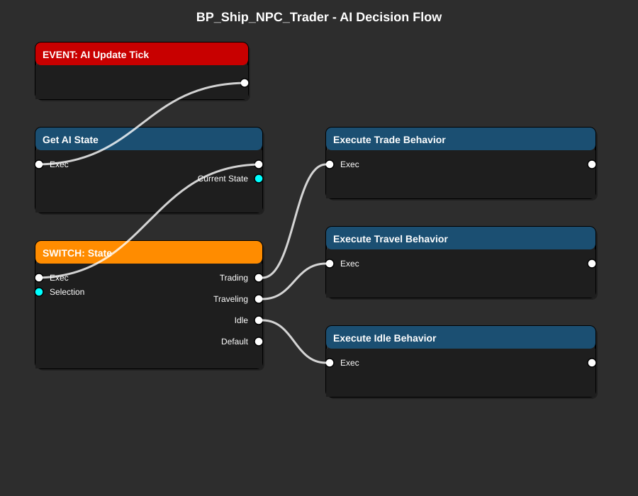

# BP_Ship_NPC_Trader - AI Trader Ship Guide

> **AI-controlled trading ship that autonomously travels between stations and trades goods**

**Blueprint Type**: Pawn Actor
**Parent Class**: `ASpaceship` (C++)
**Location**: `Content/Blueprints/Ships/NPCs/BP_Ship_NPC_Trader.uasset`
**Priority**: 🔷 **MEDIUM** - Adds life to trading economy (MVP Phase 2)

---

## 📋 Overview

`BP_Ship_NPC_Trader` is an AI-controlled ship that autonomously travels between stations, buys low, sells high, and creates a living economy. It uses a state machine to manage behavior.

### Responsibilities

- ✅ Autonomously navigate between trading stations
- ✅ Make trading decisions based on profit margins
- ✅ Execute buy/sell transactions at stations
- ✅ Avoid obstacles and other ships
- ✅ React to player presence (flee if attacked)
- ✅ Contribute to dynamic economy simulation

---

## 🎨 Visual Flow Diagram



**Flow Explanation:**

1. **AI Update Tick** - Called periodically (every 0.5-1 second)
2. **Get AI State** - Determines current behavior state
3. **Switch: State** - Branches based on current state
4. **Execute [State] Behavior** - Performs appropriate actions
   - **Trading**: Buy/sell at current station
   - **Traveling**: Navigate to next station
   - **Idle**: Wait for conditions to change

---

## 🔧 Prerequisites

### Required C++ Classes
- ✅ `ASpaceship` - Parent ship class
- ✅ `UNavigationComponent` - Pathfinding and autopilot
- ✅ `UAITraderComponent` - Trading logic
- ✅ `UCargoComponent` - Cargo management

### Required Data Assets
- ✅ `USpaceshipDataAsset` - Ship stats (trader variant)
- ✅ `UFactionDataAsset` - Trader's faction affiliation

### Required Systems
- ✅ Economy Manager - For price queries
- ✅ Faction Manager - For relationship checks
- ✅ Station network - Stations to trade with

---

## 📦 Components Setup

### Core Components

```yaml
# Ship Components (inherited from ASpaceship)
StaticMeshComponent:
  Name: ShipMesh
  Static Mesh: SM_Ship_Trader
  Collision: BlockAll

# AI Components (Add these)
NavigationComponent:
  Name: NavigationComp
  Auto Pilot Enabled: true
  Max Speed: 800 (slower than player for balance)
  Turning Rate: 60

AITraderComponent:
  Name: TraderComp
  Auto Activate: true
  Update Interval: 1.0 (seconds between decisions)
  Trade Aggressiveness: 0.5 (0-1 scale)

CargoComponent:
  Name: CargoComp
  Max Cargo Space: 50 (larger than player start)
  Starting Cargo:
    - Random basic goods

# No combat components for traders
# They flee instead of fight
```

---

## 🏗️ Implementation Steps

### Step 1: Create the Blueprint

1. Content Browser → `Content/Blueprints/Ships/NPCs/`
2. Right-click → Blueprint Class
3. Parent: `Spaceship`
4. Name: `BP_Ship_NPC_Trader`
5. Open Blueprint

### Step 2: Configure AI Properties

In Class Defaults:

```yaml
# Ship Configuration
ShipDataAsset: DA_Ship_NPC_Trader
FactionDataAsset: DA_Faction_TradingGuild

# AI Behavior
AI Behavior Mode: Trader
AI Update Frequency: 1.0 (seconds)
Aggression Level: 0.0 (peaceful)

# Trading Settings
Min Profit Margin: 20 (minimum % profit to trade)
Max Travel Distance: 10000 (units)
Preferred Cargo Types:
  - Basic Goods
  - Common Materials
  - Food

# Navigation
Cruise Speed: 800
Max Speed: 1200
Turning Speed: 60
```

### Step 3: Implement State Machine

#### Variables Needed

```yaml
# State Management
CurrentState: ETraderState (Enum)
  - Idle
  - SelectingDestination
  - Traveling
  - Docking
  - Trading
  - Undocking

TargetStation: ASpaceStation*
CurrentStation: ASpaceStation*
TradingOpportunity: FTradingOpportunity (Struct)
```

#### State Enum Definition

```cpp
UENUM(BlueprintType)
enum class ETraderState : uint8
{
    Idle,
    SelectingDestination,
    Traveling,
    Docking,
    Trading,
    Undocking
};
```

### Step 4: Implement AI Tick

#### Event: AI Update Tick

```
EVENT: Custom Event - AI Update Tick
└─► Exec
    └─► Switch on Current State
```

**Setup:**
1. Add Custom Event: `AI_UpdateTick`
2. Call this event on a timer (1.0 second intervals)
3. In BeginPlay:
   - Set Timer by Event: `AI_UpdateTick`
   - Time: 1.0
   - Looping: true

#### Switch on State

```
SWITCH: Current State
├─► Case: Idle
│   └─► Execute Idle Behavior
├─► Case: SelectingDestination
│   └─► Execute Select Destination Behavior
├─► Case: Traveling
│   └─► Execute Travel Behavior
├─► Case: Docking
│   └─► Execute Docking Behavior
├─► Case: Trading
│   └─► Execute Trading Behavior
└─► Case: Undocking
    └─► Execute Undocking Behavior
```

### Step 5: Implement State Behaviors

#### Idle State

```
FUNCTION: Execute Idle Behavior
└─► Exec
    ├─► Check if cargo is full or empty
    ├─► If full: Find station to sell
    ├─► If empty: Find station to buy
    └─► Transition to: SelectingDestination
```

**Implementation:**
```
1. Get Cargo Component
2. Check cargo fill percentage
3. If > 80%: Set mode to "Selling"
4. If < 20%: Set mode to "Buying"
5. Set state: SelectingDestination
```

#### Selecting Destination

```
FUNCTION: Execute Select Destination
└─► Exec
    ├─► Query stations with best opportunities
    ├─► Calculate profit potential
    ├─► Select most profitable station
    └─► Transition to: Traveling
```

**Implementation:**
```
1. Get all stations in range
2. For each station:
   - Get market prices
   - Calculate potential profit
   - Consider distance cost
3. Sort by profit margin
4. Select best option
5. Set TargetStation
6. Start navigation
7. Set state: Traveling
```

#### Traveling State

```
FUNCTION: Execute Travel Behavior
└─► Exec
    ├─► Check if reached destination
    ├─► If reached: Transition to Docking
    └─► If not: Continue navigation
```

**Implementation:**
```
1. Get distance to target station
2. If distance < 500:
   - Slow down
   - Set state: Docking
3. Else:
   - Continue autopilot
   - Check for obstacles
   - Avoid collisions
```

#### Docking State

```
FUNCTION: Execute Docking Behavior
└─► Exec
    ├─► Request docking from station
    ├─► Wait for clearance
    ├─► Move to docking point
    └─► Transition to: Trading
```

**Implementation:**
```
1. Call RequestDocking on TargetStation
2. If granted:
   - Get docking point location
   - Navigate to docking point
   - Disable manual control
   - Set state: Trading
3. If denied:
   - Wait and retry
   - Or select different station
```

#### Trading State

```
FUNCTION: Execute Trading Behavior
└─► Exec
    ├─► If selling mode: Sell cargo
    ├─► If buying mode: Buy goods
    ├─► Wait for transaction to complete
    └─► Transition to: Undocking
```

**Implementation:**
```
1. Get AITraderComponent
2. Call MakeTradingDecision:
   - Returns: Items to buy/sell
3. For each item:
   - Call ExecuteTrade
   - Update cargo
   - Update credits
4. Log trade completion
5. Set state: Undocking
```

#### Undocking State

```
FUNCTION: Execute Undocking Behavior
└─► Exec
    ├─► Request undocking
    ├─► Move away from station
    ├─► Re-enable controls
    └─► Transition to: Idle
```

**Implementation:**
```
1. Call Undock on CurrentStation
2. Navigate away from station (offset 1000 units)
3. Re-enable autopilot
4. Set state: Idle (to find next opportunity)
```

---

## 🔌 Integration Points

### With Economy System

```cpp
// Query best trading opportunities
UEconomyManager* Economy = GetWorld()->GetSubsystem<UEconomyManager>();
TArray<FTradingOpportunity> Opportunities =
    Economy->GetTradingOpportunities(CurrentLocation, MaxDistance);
```

### With Station Network

```cpp
// Find stations in range
TArray<ASpaceStation*> NearbyStations =
    StationManager->GetStationsInRange(GetActorLocation(), MaxDistance);
```

### With Navigation

```cpp
// Autopilot to destination
UNavigationComponent* Nav = GetNavigationComponent();
Nav->SetDestination(TargetStation->GetActorLocation());
Nav->EnableAutopilot();
```

---

## 🎮 Testing

### In-Editor Testing

1. **Spawn Trader**:
   - Place BP_Ship_NPC_Trader in level
   - Or spawn from game mode

2. **Observe Behavior**:
   - Enable debug logging
   - Watch state transitions
   - Verify travels to stations
   - Check trades execute

3. **Test Economy Impact**:
   - Spawn multiple traders
   - Verify prices fluctuate
   - Check supply/demand changes

### Debug Visualization

Add debug drawing in AI Tick:

```
Debug:
├─ Draw Line to Target Station
├─ Display Current State as text
├─ Show Cargo Fill %
└─ Log trade transactions
```

### Verification Checklist

- [ ] Trader spawns without errors
- [ ] Selects destination automatically
- [ ] Navigates to stations correctly
- [ ] Docks successfully
- [ ] Executes trades
- [ ] Undocks and continues
- [ ] Avoids collisions
- [ ] Reacts to obstacles
- [ ] Contributes to economy
- [ ] No infinite loops or stuck states

---

## ⚠️ Common Issues

### Issue 1: Trader Gets Stuck

**Symptoms**: Ship stops moving, state doesn't change

**Causes**:
- Navigation pathfinding fails
- No valid trading opportunities
- Station docking full

**Solutions**:
1. Add timeout to each state
2. Fallback to Idle if stuck > 30 seconds
3. Check pathfinding validity
4. Ensure stations have docking points available

### Issue 2: Doesn't Trade

**Symptoms**: Docks but doesn't buy/sell

**Causes**:
- Trading component not initialized
- No profitable opportunities
- Insufficient credits/cargo

**Solutions**:
1. Verify AITraderComponent is active
2. Lower Min Profit Margin for testing
3. Give trader starting credits
4. Check market prices are loaded

### Issue 3: Crashes Into Things

**Symptoms**: Collides with stations or other ships

**Causes**:
- Navigation doesn't avoid obstacles
- Speed too high for turning
- Collision not configured

**Solutions**:
1. Enable obstacle avoidance in Navigation Component
2. Reduce cruise speed
3. Add slow-down logic near stations
4. Check collision channels

---

## 🎯 MVP Checklist

For Trade Simulator MVP:

- [ ] Basic trader AI functional (Phase 2)
- [ ] Travels between 2-3 stations
- [ ] Executes simple buy/sell
- [ ] Doesn't crash or get stuck
- [ ] Contributes to price fluctuations
- [ ] Spawns at game start
- [ ] Multiple traders can coexist
- [ ] Performance acceptable (10+ traders)

**Not Required for MVP Phase 1:**
- This is a Phase 2 feature for economy polish
- Focus on player trading first
- Add NPC traders to create dynamic market

---

## 🔗 Related Blueprints

**Required Before**:
- [BP_SpaceStation_Main](BP_SpaceStation_Main.md) - Destinations
- Economy Manager (C++) - Price queries

**Similar Blueprints**:
- `BP_Ship_NPC_Miner` - Mining ship variant
- `BP_Ship_NPC_Hauler` - Large cargo hauler
- `BP_Ship_NPC_Patrol` - Security ship

**Data Assets**:
- `DA_Ship_NPC_Trader` - Trader ship stats
- `DA_Faction_TradingGuild` - Trader faction

---

**Last Updated**: December 30, 2025
**Status**: Phase 2 Feature (not critical for MVP launch)
**Difficulty**: ⭐⭐⭐⭐ Advanced
