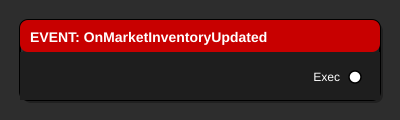
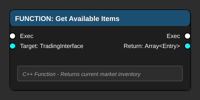
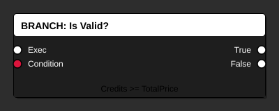
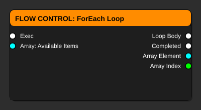

# Blueprint Node Types - Complete Visual Reference

> **Comprehensive guide to every Blueprint node type you'll encounter in Adastrea**

**Last Updated**: January 17, 2026
**For**: Unreal Engine 5.6
**Audience**: Beginners to intermediate Blueprint developers

---

## 🎯 Purpose

This guide provides detailed explanations of every major Blueprint node type, with visual examples and practical use cases from the Adastrea project.

---

## 📚 Table of Contents

1. [Event Nodes](#event-nodes)
2. [Function Nodes](#function-nodes)
3. [Pure Function Nodes](#pure-function-nodes)
4. [Branch and Logic Nodes](#branch-and-logic-nodes)
5. [Flow Control Nodes](#flow-control-nodes)
6. [Variable Nodes](#variable-nodes)
7. [Math Nodes](#math-nodes)
8. [String and Text Nodes](#string-and-text-nodes)
9. [Array Nodes](#array-nodes)
10. [Cast and Conversion Nodes](#cast-and-conversion-nodes)
11. [Widget and UI Nodes](#widget-and-ui-nodes)
12. [Actor and Component Nodes](#actor-and-component-nodes)

---

## Event Nodes

### What Are Events?

**Events** are the starting points of Blueprint execution. They trigger when specific things happen in your game.

**Visual Appearance:**
- 🔴 **Red header**
- White execution output pin (no input)
- Optional data output pins



---

### Common Event Types

#### Event BeginPlay

**When it triggers**: Once, when the actor spawns in the world

**Use cases:**
- Initialize variables
- Setup initial state
- Spawn child actors
- Register for events

**Example - Trading Ship:**
```
Event BeginPlay
  → Set CurrentCredits = 1000
  → Set CargoCapacity = 10
  → Print "Ship Initialized"
```

**Adastrea Usage:**
- `BP_TradingShip` - Initialize cargo hold
- `BP_TradingStation` - Setup market inventory
- `BP_GameMode` - Initialize economy system

---

#### Event Tick

**When it triggers**: Every frame (typically 60 times per second)

**Use cases:**
- Continuous updates
- Smooth interpolation
- Real-time calculations

**⚠️ Warning**: Use sparingly! Tick is expensive.

**Example - Ship Movement:**
```
Event Tick
  → Get Current Velocity
    → Update Speed Display on HUD
```

**Better Alternative:**
```
Event OnVelocityChanged (custom event)
  → Update Speed Display
```

**Adastrea Usage:**
- Avoid using Tick when possible
- Use timers or event-driven updates instead

---

#### Event OnClicked

**When it triggers**: When UI button is clicked

**Use cases:**
- Button press responses
- Menu navigation
- Confirmation dialogs

**Example - Buy Button:**
```
Event OnClicked (Buy Button)
  → Get Selected Item
    → Get Item Price
      → Check if Player Can Afford
        → Branch
          ├─ True → Buy Item
          └─ False → Show Error
```

**Adastrea Usage:**
- `WBP_TradingUI` - Buy/sell buttons
- `WBP_MainMenu` - Menu buttons
- `WBP_DockingUI` - Interaction prompts

---

#### Custom Events

**When it triggers**: When you manually call it from another part of your Blueprint

**Use cases:**
- Reusable logic
- Communication between Blueprints
- Event-driven architecture

**Example - Cargo Update:**
```
Custom Event: OnCargoChanged
  → Update Cargo Display
  → Check if Overweight
  → Notify Player
```

**How to Call:**
```
Event OnBuyItem
  → Add to Cargo
  → Call Event: OnCargoChanged
```

**Adastrea Usage:**
- `BP_TradingShip` - OnCargoChanged, OnCreditsChanged
- `BP_TradingStation` - OnMarketInventoryUpdated
- `WBP_MarketDisplay` - OnPricesRefreshed

---

## Function Nodes

### What Are Functions?

**Functions** perform actions or calculations and can return values. They have both execution pins and data pins.

**Visual Appearance:**
- 🔵 **Blue header**
- White execution input and output pins
- Colored data input pins (parameters)
- Colored data output pins (return values)



---

### Common Function Categories

#### Debug Functions

**Print String**

**Purpose**: Display text on screen for debugging

**Parameters:**
- In String (String) - Text to display
- Duration (Float) - How long to show (default: 2 sec)
- Text Color (Color) - Display color

**Example:**
```
Event BeginPlay
  → Print String: "Game Started!"
    (Duration: 5.0, Color: Green)
```

**Best Practices:**
- Use different colors for different message types
- Add context to messages: "Credits: 1000" not just "1000"
- Remove or disable before shipping

---

#### Actor Functions

**Get Actor Location**

**Purpose**: Get the current position of an actor

**Parameters:**
- Target (Actor) - Which actor?

**Returns:**
- Return Value (Vector) - XYZ position

**Example:**
```
Event BeginPlay
  → Get Actor Location (Self)
    → Print String (shows position)
```

**Adastrea Usage:**
- Distance calculations
- Docking range checks
- Spawn point positioning

---

**Set Actor Location**

**Purpose**: Move an actor to a specific position

**Parameters:**
- Target (Actor) - Which actor to move?
- New Location (Vector) - Where to move it?
- Sweep (Boolean) - Check for collisions?

**Example - Respawn Ship:**
```
Event OnPlayerDeath
  → Set Actor Location
    (New Location: SpawnPoint.Location)
```

**Adastrea Usage:**
- Ship spawning
- Teleportation
- Docking alignment

---

**Spawn Actor**

**Purpose**: Create a new actor in the world

**Parameters:**
- Class (Actor Class) - What to spawn?
- Spawn Transform (Transform) - Where/rotation?
- Collision Handling (Enum) - What if blocked?

**Returns:**
- Return Value (Actor) - The spawned actor

**Example - Spawn Trading Station:**
```
Event BeginPlay
  → Spawn Actor
    (Class: BP_TradingStation)
    (Location: (1000, 0, 0))
  → Store Reference → StationVariable
```

**Adastrea Usage:**
- Spawning stations during game init
- Creating projectiles (post-MVP)
- Instantiating pickups

---

## Pure Function Nodes

### What Are Pure Functions?

**Pure functions** calculate values without side effects. They have NO execution pins - they only process data.

**Visual Appearance:**
- 🟢 **Green header** (usually)
- NO white execution pins
- Only colored data pins

**Key Difference**: They don't "do" anything, they just calculate!

---

### Math Operations

#### Add / Subtract / Multiply / Divide

**Purpose**: Basic arithmetic

**Parameters:**
- Two numbers (Float or Integer)

**Returns:**
- Result of operation

**Example - Calculate Total Price:**
```
Get Item Price → Multiply (Quantity) → Total Price
```

**Tip**: Chain multiple operations
```
Get Base Price
  → Multiply (Quantity)
  → Multiply (Tax Rate: 1.1)
  → Total with Tax
```

---

### Comparison Operations

#### Greater Than / Less Than / Equal

**Purpose**: Compare two values

**Parameters:**
- A (Number)
- B (Number)

**Returns:**
- Boolean (true/false)

**Example - Afford Check:**
```
Get Player Credits → Greater Than (Item Price) → Can Afford?
  → Branch
    ├─ True → Buy
    └─ False → Error
```

**Common Uses:**
- Validation checks
- Conditional logic
- Threshold detection

---

### Variable Get Nodes

**Purpose**: Read a variable's current value

**Visual Appearance:**
- Light blue oval
- Variable name displayed
- Single output pin

**Example:**
```
Variable: PlayerHealth (Get)
  → Greater Than (0)
  → IsAlive Boolean
```

**Best Practice**: Use Get nodes liberally - they're free (performance-wise)!

---

## Branch and Logic Nodes

### Branch

**Purpose**: Make decisions (if/else logic)

**Visual Appearance:**
- ⚪ White header
- Execution input
- Condition input (Boolean)
- Two execution outputs (True/False)



**Example - Purchase Validation:**
```
Event OnBuyClicked
  → Get Player Credits
    → Greater Than (Item Price)
      → Branch
        ├─ True
        │   → Subtract Credits
        │   → Add to Cargo
        │   → Show Success Message
        └─ False
            → Show "Not Enough Credits" Error
```

**Common Pattern - Multiple Checks:**
```
Branch (Has Cargo Space?)
  ├─ True
  │   → Branch (Can Afford?)
  │     ├─ True → Buy
  │     └─ False → "Not enough credits"
  └─ False → "Cargo full"
```

---

### AND / OR / NOT

**Purpose**: Combine multiple conditions

**AND**: Both must be true
```
Has Credits AND Has Cargo Space → Can Buy
```

**OR**: At least one must be true
```
Is Docked OR Is In Range → Show Trading UI
```

**NOT**: Invert condition
```
NOT Is Dead → Is Alive
```

**Example - Complex Check:**
```
Get Player Credits → Greater Than (Item Price) → A
Get Cargo Space → Greater Than (0) → B

A AND B → Branch
  ├─ True → Allow Purchase
  └─ False → Show Error
```

---

## Flow Control Nodes

### ForLoop

**Purpose**: Repeat an action a specific number of times

**Visual Appearance:**
- 🟠 **Orange header**
- Execution input
- First Index / Last Index inputs
- Loop Body output (executes each iteration)
- Completed output (executes when done)
- Index output (current iteration number)

**Example - Spawn Multiple Stations:**
```
Event BeginPlay
  → ForLoop (0 to 4)
    └─ Loop Body
      → Spawn Actor (BP_TradingStation)
        (Location: Index * 1000, 0, 0)
    → Completed
      → Print "All stations spawned"
```

**Adastrea Usage:**
- Initializing multiple objects
- Processing fixed-size arrays
- Batch operations

---

### ForEachLoop

**Purpose**: Process each item in an array

**Visual Appearance:**
- 🟠 **Orange header**
- Array input
- Loop Body output
- Completed output
- Array Element output (current item)
- Array Index output (current position)



**Example - Update All Market Items:**
```
Event OnMarketRefresh
  → Get All Market Items (Array)
    → ForEachLoop
      └─ Loop Body
        → Get Array Element
        → Calculate New Price
        → Update UI Element
```

**Adastrea Usage:**
- Processing market inventory
- Updating UI for all items
- Checking all docked ships
- Iterating cargo contents

---

### Sequence

**Purpose**: Execute multiple actions in order

**Visual Appearance:**
- 🟠 **Orange header**
- One execution input
- Multiple numbered execution outputs (Then 0, Then 1, Then 2...)

**Example - Initialize Game:**
```
Event BeginPlay
  → Sequence
    ├─ Then 0 → Setup Economy
    ├─ Then 1 → Spawn Stations
    ├─ Then 2 → Initialize Player
    └─ Then 3 → Show UI
```

**Use Case**: When you need to do multiple things in a specific order

---

### Delay

**Purpose**: Wait a specified time before continuing

**Parameters:**
- Duration (Float) - How many seconds to wait

**Example - Timed Message:**
```
Event OnDocking
  → Print "Docking..."
  → Delay (3.0 seconds)
  → Print "Docking Complete!"
  → Enable Trading UI
```

**⚠️ Warning**: Delays block ONLY that execution path. Other Blueprints continue running.

---

### Gate

**Purpose**: Control whether execution can pass through

**States:**
- Open - Execution can pass
- Closed - Execution is blocked

**Actions:**
- Enter - Try to pass through
- Open - Allow passage
- Close - Block passage
- Toggle - Switch state

**Example - One-Time Tutorial:**
```
Variable: TutorialShown = false

Event OnFirstDocking
  → Branch (NOT TutorialShown)
    ├─ True
    │   → Show Tutorial
    │   → Set TutorialShown = true
    └─ False
        → (Do nothing)
```

---

## Variable Nodes

### Get Variable

**Purpose**: Read a variable's value

**Visual**: Light blue oval, variable name, one output pin

**Example:**
```
Get PlayerCredits → Print String
```

---

### Set Variable

**Purpose**: Change a variable's value

**Visual**: Purple oval, variable name, one input pin, execution pins

**Example:**
```
Event OnPurchase
  → Set PlayerCredits
    (Value: Get PlayerCredits - ItemPrice)
```

---

## Widget and UI Nodes

### Add to Viewport

**Purpose**: Show a widget on screen

**Parameters:**
- Target (Widget) - Which widget to show?
- Z Order (Integer) - Display priority

**Example - Show Trading UI:**
```
Event OnDockingComplete
  → Create Widget (WBP_TradingUI)
  → Add to Viewport
```

---

### Remove from Parent

**Purpose**: Hide/remove a widget from screen

**Example - Close Menu:**
```
Event OnCloseButtonClicked
  → Remove from Parent (Self)
```

---

### Bind Event

**Purpose**: Connect a widget event to a function

**Example - Button Click:**
```
Event Construct (Widget)
  → BuyButton
    → Bind Event to OnClicked
      → Custom Function: OnBuyClicked
```

---

## Practical Examples from Adastrea

### Example 1: Complete Buy Flow

```
Event OnBuyButtonClicked
  ↓
Get Selected Item → ItemData
  ↓
Get Item Price → Price
  ↓
Get Player Credits → Credits
  ↓
Greater Than (Credits, Price) → CanAfford
  ↓
Get Cargo Space → Space
  ↓
Greater Than (Space, 0) → HasSpace
  ↓
CanAfford AND HasSpace → AllowPurchase
  ↓
Branch
  ├─ True
  │   ├─→ Subtract (Credits - Price) → Set PlayerCredits
  │   ├─→ Add Item to Cargo
  │   ├─→ Update UI
  │   └─→ Print "Purchase Successful!"
  └─ False
      ├─→ Branch (CanAfford)
      │   ├─ True → Print "Cargo Full!"
      │   └─ False → Print "Not Enough Credits!"
      └─→ (End)
```

---

### Example 2: Market Display Update

```
Custom Event: RefreshMarketDisplay
  ↓
Get Market Inventory → ItemArray
  ↓
Clear Display
  ↓
ForEachLoop (ItemArray)
  └─ Loop Body
    ├─→ Get Array Element → CurrentItem
    ├─→ Create Widget (WBP_MarketItemEntry)
    ├─→ Set Item Data
    ├─→ Set Price Display
    └─→ Add to ScrollBox
  → Completed
    → Print "Market Updated"
```

---

## Quick Reference

### Node Colors

| Color | Node Type | Example |
|-------|-----------|---------|
| 🔴 Red | Event | BeginPlay |
| 🔵 Blue | Function | Print String |
| 🟢 Green | Pure Function | Add, Get Variable |
| ⚪ White | Branch | If/Else |
| 🟠 Orange | Flow Control | Loop, Delay |
| 🟣 Purple | Set Variable | Set Health |
| 🔵 Light Blue | Get Variable | Get Health |

### Pin Colors

| Color | Data Type | Example |
|-------|-----------|---------|
| ⚪ White | Execution | Flow control |
| 🔴 Red | Boolean | true/false |
| 🟢 Green | Integer | 1, 2, 100 |
| 🟢 Light Green | Float | 1.5, 3.14 |
| 🟣 Magenta | String | "Hello" |
| 🩷 Pink | Text | Localized text |
| 🟡 Yellow | Vector | (X, Y, Z) |
| 🔵 Cyan | Object | Actor reference |
| 🔵 Steel Blue | Struct | Complex data |

---

## Best Practices

### Node Organization

1. **Left to Right Flow** - Execution flows left to right
2. **Group Related Nodes** - Use comment boxes
3. **Reroute Wires** - Keep connections clean
4. **Name Variables Clearly** - Self-documenting

### Performance Tips

1. **Avoid Event Tick** - Use timers or events
2. **Cache References** - Don't Get Component every frame
3. **Use Pure Functions** - They're optimized
4. **Break Complex Graphs** - Into functions

---

## Next Steps

- **Practice**: Create Blueprints using each node type
- **Experiment**: Try combining different nodes
- **Study**: Look at existing Adastrea Blueprints
- **Build**: Create complete features

**Ready for real projects?** Try:
- [Trading UI Guide](../../Blueprints/TradingSystemBlueprintGuide_SIMPLIFIED.md)
- [Trading Ship Guide](../../Blueprints/BP_TradingShip_GUIDE.md)

---

**Remember**: This is a reference guide. Come back whenever you need to look up a specific node type!
