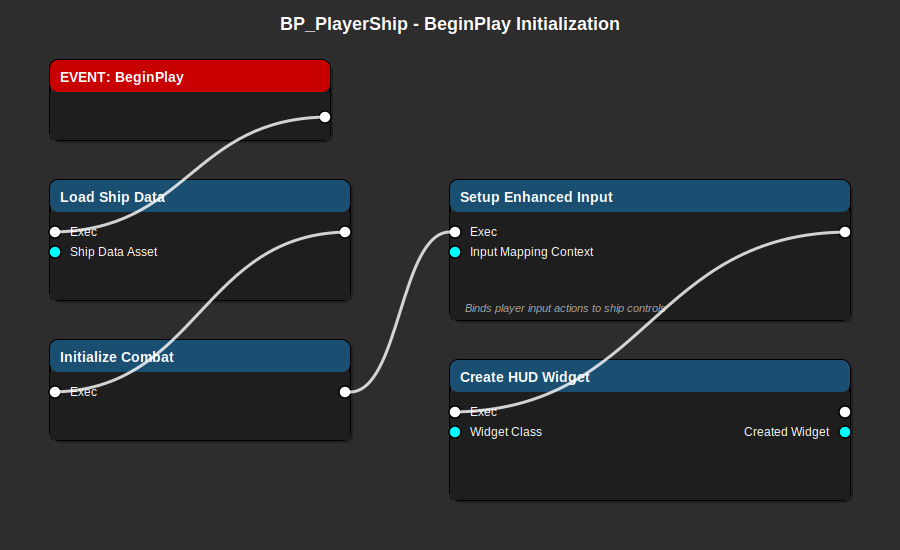

# BP_PlayerShip - Player Spaceship Guide

> **The player's controllable spaceship with combat, navigation, and cargo systems**

**Blueprint Type**: Pawn Actor  
**Parent Class**: `ASpaceship` (C++)  
**Location**: `Content/Blueprints/Ships/BP_PlayerShip.uasset`  
**Priority**: ⚠️ **CRITICAL** - This is the player's main avatar

---

## 📋 Overview

`BP_PlayerShip` is the player's controllable spaceship. It handles ship data loading, component initialization, combat systems, navigation, and HUD management.

### Responsibilities

- ✅ Load ship statistics from Data Asset
- ✅ Initialize combat components (weapons, shields, health)
- ✅ Setup Enhanced Input for player controls
- ✅ Create and display HUD widget
- ✅ Manage cargo inventory
- ✅ Handle docking with stations

---

## 🎨 Visual Flow Diagram



**Flow Explanation:**

1. **BeginPlay Event** triggers when ship is spawned
2. **Load Ship Data** applies stats from Ship Data Asset
3. **Initialize Combat** sets up weapons, shields, and health
4. **Setup Enhanced Input** binds player controls
5. **Create HUD Widget** displays ship status to player

---

## 🔧 Prerequisites

### Required C++ Classes
- ✅ `ASpaceship` - Parent class with ship logic
- ✅ `UWeaponComponent` - Weapon management
- ✅ `UTargetingComponent` - Combat targeting
- ✅ `UCombatHealthComponent` - Health and damage
- ✅ `UNavigationComponent` - Autopilot and waypoints
- ✅ `UCargoComponent` - Inventory management

### Required Data Assets
- ✅ `USpaceshipDataAsset` - Ship configuration (stats, model, etc.)
- ✅ `UInputMappingContext` - Enhanced Input configuration

### Required Widgets
- ✅ `WBP_SpaceshipHUD` - Main HUD widget

---

## 📦 Components Setup

### Core Components (Add in Components panel)

```yaml
# Mesh and Visuals
StaticMeshComponent (Root):
  Name: ShipMesh
  Static Mesh: SM_Ship_Scout (or chosen model)
  Collision: BlockAll
  Simulate Physics: false

# Camera System
SpringArmComponent:
  Name: CameraBoom
  Target Arm Length: 1500
  Use Pawn Control Rotation: true
  Inherit Pitch/Yaw/Roll: false, true, false
  
CameraComponent:
  Name: FollowCamera
  Parent: CameraBoom
  Field of View: 90

# Projectile Spawn Point
ArrowComponent:
  Name: ProjectileSpawnPoint
  Location: (500, 0, 0) relative to mesh front
  Rotation: (0, 0, 0)

# Combat Components (C++ created, exposed in BP)
WeaponComponent:
  Name: WeaponComp
  Auto-Activate: true
  
TargetingComponent:
  Name: TargetingComp
  Max Target Distance: 5000
  
CombatHealthComponent:
  Name: HealthComp
  Max Health: 100 (overridden by Data Asset)
  Max Shields: 100 (overridden by Data Asset)

# Navigation
NavigationComponent:
  Name: NavigationComp
  Autopilot Enabled: false
  Max Speed: 1000 (overridden by Data Asset)

# Cargo System
CargoComponent:
  Name: CargoComp
  Max Cargo Space: 10 (overridden by Data Asset)
```

---

## 🏗️ Implementation Steps

### Step 1: Create the Blueprint

1. Content Browser → `Content/Blueprints/Ships/`
2. Right-click → Blueprint Class
3. Search for `Spaceship` (your C++ class)
4. Name it `BP_PlayerShip`
5. Open the Blueprint

### Step 2: Add Components

1. Click "Components" panel (left side)
2. Add components listed above in order
3. Configure each component's properties
4. Set up component hierarchy (camera boom → camera)

### Step 3: Configure Ship Properties

In Class Defaults (right panel):

```yaml
# Ship Data Reference
ShipDataAsset: DA_Ship_PlayerScout

# Movement Settings
ForwardSpeed: 1000.0
StrafeSpeed: 800.0
BoostMultiplier: 2.0

# Rotation Settings
YawRate: 100.0
PitchRate: 80.0
RollRate: 120.0

# Combat Settings
MaxHealth: 100.0 (will be overridden)
MaxShields: 100.0 (will be overridden)

# Input
InputMappingContext: IMC_Spaceship
InputMappingPriority: 0
```

### Step 4: Implement BeginPlay

Open Event Graph:

#### Node 1: Event BeginPlay

```
EVENT: BeginPlay
└─► (execution flows to next node)
```

#### Node 2: Load Ship Data

```
FUNCTION: Load Ship Data
├─► Exec (from BeginPlay)
├─  Ship Data Asset (USpaceshipDataAsset) - from variable
└─► Exec (to next node)
```

**Implementation:**
1. Get ShipDataAsset variable
2. Branch: Is Valid?
   - True path: Continue
   - False path: Log error and use defaults

3. If valid, call these functions:
   - `Apply Core Stats` - Sets health, shields, speed
   - `Apply Combat Stats` - Sets weapon damage, fire rate
   - `Apply Mobility Stats` - Sets turn rates, acceleration
   - `Apply Visual` - Sets ship mesh if specified

**Pins to connect:**
- Input: ShipDataAsset (from variable)
- Calls: `ApplyCoreStats`, `ApplyCombatStats`, etc. on self

#### Node 3: Initialize Combat

```
FUNCTION: Initialize Combat
├─► Exec (from Load Ship Data)
└─► Exec (to next node)
```

**Implementation:**
1. Get WeaponComponent reference
2. Call `Initialize` on WeaponComp
3. Get TargetingComponent reference
4. Call `Initialize` on TargetingComp
5. Get HealthComponent reference
6. Call `Initialize` on HealthComp (applies max health/shields)

**Node sequence:**
```
Get WeaponComponent → Initialize Weapon
Get TargetingComponent → Initialize Targeting
Get CombatHealthComponent → Initialize Health
```

#### Node 4: Setup Enhanced Input

```
FUNCTION: Setup Enhanced Input
├─► Exec (from Initialize Combat)
├─  Input Mapping Context (UInputMappingContext)
└─► Exec (to next node)
```

**Implementation:**
1. Get Player Controller:
   - Node: `Get Player Controller`
   - Node: `Cast to APlayerController`

2. Get Enhanced Input Component:
   - Node: `Get Enhanced Input Subsystem`
   
3. Add Input Mapping Context:
   - Node: `Add Mapping Context`
   - Context: IMC_Spaceship (from variable)
   - Priority: 0

This enables all player input actions defined in Input Mapping Context.

#### Node 5: Create HUD Widget

```
FUNCTION: Create HUD Widget
├─► Exec (from Setup Enhanced Input)
├─  Widget Class (WBP_SpaceshipHUD)
└─► Exec (to next node)
    └─  Created Widget (UUserWidget)
```

**Implementation:**
1. Create Widget:
   - Node: `Create Widget`
   - Class: `WBP_SpaceshipHUD`
   - Owning Player: `Get Player Controller`

2. Add to Viewport:
   - Node: `Add to Viewport`
   - Target: Created widget
   - Z-Order: 0

3. Store reference:
   - Variable: `HUDWidget` (add new variable)
   - Type: `UUserWidget*`
   - Store widget for future updates

**Verification:**
- HUD appears on screen
- Shows ship health, shields, speed
- Updates in real-time

---

## 🎮 Input Actions

### Required Input Actions (defined in IMC_Spaceship)

```yaml
# Movement
IA_MoveForward:
  Key: W, S, Gamepad Left Thumbstick Y
  Action: Accelerate/Decelerate

IA_MoveRight:
  Key: A, D, Gamepad Left Thumbstick X
  Action: Strafe left/right

IA_MoveUp:
  Key: Space, LeftShift
  Action: Move up/down

# Rotation
IA_Look:
  Key: Mouse, Gamepad Right Thumbstick
  Action: Rotate ship (yaw/pitch)

IA_Roll:
  Key: Q, E
  Action: Roll ship

# Combat
IA_Fire:
  Key: Left Mouse Button, Gamepad Right Trigger
  Action: Fire weapons

IA_TargetNext:
  Key: T, Gamepad Right Bumper
  Action: Cycle to next target

# Systems
IA_Boost:
  Key: LeftShift
  Action: Activate boost

IA_Brake:
  Key: X, Gamepad Left Trigger
  Action: Brake/stop

IA_ToggleAutopilot:
  Key: V
  Action: Enable/disable autopilot
```

### Bind Input Actions (in Event Graph)

For each action, create:

```
EVENT: Enhanced Input Action [ActionName]
├─  Action Value (float/vector/bool)
└─► Call movement/combat function
```

**Example: Move Forward**
```
Event IA_MoveForward
├─  Action Value (float: -1.0 to 1.0)
└─► Add Movement Input
    ├─  World Direction: Forward Vector
    └─  Scale Value: Action Value × ForwardSpeed
```

---

## 🔌 Integration Points

### With Ship Data Asset

```cpp
// Ship stats come from Data Asset
USpaceshipDataAsset* ShipData = GetShipDataAsset();
float MaxSpeed = ShipData->MaxSpeed;
float HullStrength = ShipData->HullStrength;
```

### With Combat System

```cpp
// Combat components handle all combat logic
UWeaponComponent* Weapon = GetWeaponComponent();
Weapon->Fire();  // Called when player presses fire button

UCombatHealthComponent* Health = GetHealthComponent();
float CurrentHealth = Health->GetCurrentHealth();
```

### With HUD Widget

```cpp
// Update HUD with current ship status
if (HUDWidget)
{
    HUDWidget->UpdateHealth(CurrentHealth, MaxHealth);
    HUDWidget->UpdateSpeed(CurrentSpeed);
    HUDWidget->UpdateTarget(CurrentTarget);
}
```

### With Trading System

```cpp
// When docked at station, open trading UI
if (bIsDocked)
{
    UCargoComponent* Cargo = GetCargoComponent();
    int32 AvailableSpace = Cargo->GetAvailableSpace();
    // Pass to trading UI
}
```

---

## 🎮 Testing

### In-Editor Testing

1. **Add to Level**:
   - Drag BP_PlayerShip into level OR
   - Let BP_SpaceGameMode spawn it

2. **Test Movement**:
   - W/S: Forward/backward
   - A/D: Strafe
   - Mouse: Look around
   - Q/E: Roll

3. **Test Combat**:
   - Left Click: Fire weapons
   - T: Target enemies
   - Verify damage dealt

4. **Test HUD**:
   - Health bar shows
   - Shield bar shows
   - Speed indicator updates
   - Target info displays

### Verification Checklist

- [ ] Ship spawns without errors
- [ ] Can control ship with keyboard/mouse
- [ ] Gamepad input works (if connected)
- [ ] HUD displays all info correctly
- [ ] Combat systems work (firing, targeting)
- [ ] No null reference warnings
- [ ] Ship mesh visible and correct
- [ ] Camera follows ship smoothly

---

## ⚠️ Common Issues

### Issue 1: Ship Doesn't Move

**Symptoms**: Input doesn't move the ship

**Causes**:
- Enhanced Input not setup
- Input Mapping Context not added
- Input actions not bound

**Solutions**:
1. Verify Setup Enhanced Input is called in BeginPlay
2. Check Input Mapping Context is valid
3. Ensure input actions are bound in Event Graph
4. Test with different input (keyboard vs gamepad)

### Issue 2: No HUD Visible

**Symptoms**: Ship works but UI missing

**Causes**:
- HUD widget not created
- Widget not added to viewport
- Widget class reference missing

**Solutions**:
1. Verify Create HUD Widget node exists in BeginPlay
2. Check Add to Viewport is called
3. Set WBP_SpaceshipHUD class in widget creation
4. Check widget exists in Content Browser

### Issue 3: Ship Stats Wrong

**Symptoms**: Ship too slow/fast or wrong health

**Causes**:
- Ship Data Asset not loaded
- Data Asset has wrong values
- Stats not applied from Data Asset

**Solutions**:
1. Verify ShipDataAsset variable is set in Class Defaults
2. Check Data Asset has correct values
3. Ensure Load Ship Data calls Apply functions
4. Test with different Data Assets

---

## 🎯 MVP Checklist

For Trade Simulator MVP, this ship must:

- [x] Move in all 6 degrees of freedom
- [x] Display HUD with health, shields, speed
- [x] Load stats from Ship Data Asset
- [x] Support cargo inventory
- [x] Enable docking at stations
- [ ] Support ship upgrades (cargo expansion)
- [ ] Handle combat (not MVP critical)
- [ ] Autopilot to waypoints (nice to have)

---

## 🔗 Related Blueprints

**Required Before**:
- [BP_SpaceGameMode](BP_SpaceGameMode.md) - Spawns this ship
- [BP_SpaceshipController](BP_SpaceshipController.md) - Controls this ship

**Required After**:
- [WBP_SpaceshipHUD](WBP_SpaceshipHUD.md) - HUD created by this
- Data Asset: `DA_Ship_PlayerScout` - Ship configuration

**Integrates With**:
- [WBP_TradingUI](WBP_TradingUI.md) - Trading while docked
- [BP_SpaceStation_Main](BP_SpaceStation_Main.md) - Docking target

---

**Last Updated**: December 30, 2025  
**Status**: Essential for MVP  
**Difficulty**: ⭐⭐⭐ Intermediate-Advanced
