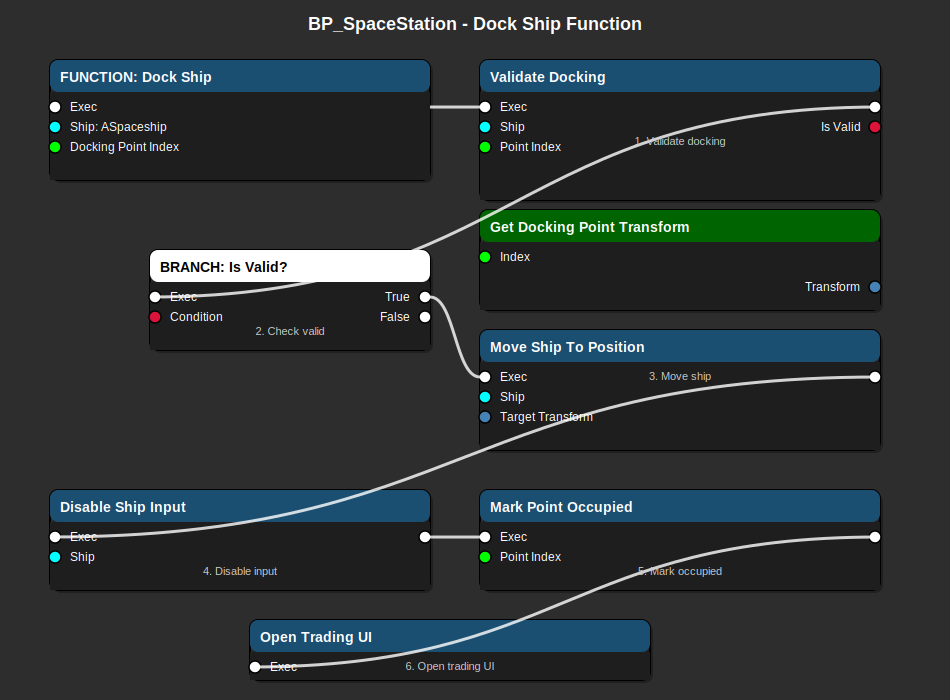
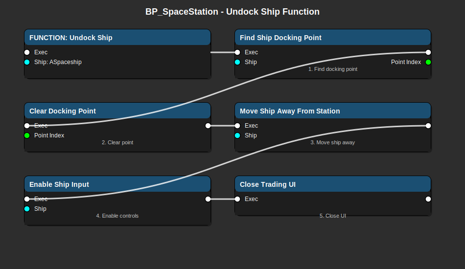

# BP_SpaceStation_Main - Space Station Blueprint Guide

> **Main space station actor with modular attachment system for trading and docking**

**Blueprint Type**: Actor  
**Parent Class**: `ASpaceStation` (C++)  
**Location**: `Content/Blueprints/Stations/BP_SpaceStation_Main.uasset`  
**Priority**: 🔶 **HIGH** - Required for trading and docking in MVP

---

## 📋 Overview

`BP_SpaceStation_Main` represents a space station in the game world. It handles module attachments, faction ownership, docking, and market functionality for the trading system.

### Responsibilities

- ✅ Manage station modules (docking, storage, defense, etc.)
- ✅ Handle ship docking and undocking
- ✅ Provide market access for trading
- ✅ Track station ownership and faction
- ✅ Calculate station stats from attached modules
- ✅ Display station visual representation

---

## 🎨 Visual Flow Diagram


**Flow Explanation:**

1. **On Module Attached Event** - Triggered when new module added
2. **Validate Module Attachment** - Checks if attachment is valid
3. **Branch: Is Valid?** - Determines if attachment can proceed
4. **Attach Module to Station** - Physically attaches the module
5. **Update Station Stats** - Recalculates station capabilities

---

## 🔧 Prerequisites

### Required C++ Classes
- ✅ `ASpaceStation` - Parent class with station logic
- ✅ `ASpaceStationModule` - Module actor class
- ✅ `UFactionDataAsset` - Faction ownership
- ✅ `UMarketDataAsset` - Trading market configuration

### Required Blueprints
- ✅ Various `BP_SpaceStationModule_*` blueprints (Docking, Power, Storage, etc.)

### Required Data Assets
- ✅ `UFactionDataAsset` - Faction that owns this station
- ✅ `UMarketDataAsset` - Market inventory and prices

---

## 📦 Components Setup

### Core Components

```yaml
# Root and Mesh
SceneComponent (Root):
  Name: StationRoot
  Location: (0, 0, 0)

StaticMeshComponent:
  Name: StationCoreMesh
  Parent: StationRoot
  Static Mesh: SM_Station_Core
  Collision: BlockAll
  Simulate Physics: false

# Docking Points (Multiple)
SceneComponent (Array):
  Name: DockingPoints
  Count: 4-8 (depending on station size)
  Location: Positioned around station
  Purpose: Ship docking locations

# Module Attachment Points (Multiple)
SceneComponent (Array):
  Name: ModuleAttachmentPoints
  Count: 10-20 (depending on station design)
  Location: Positioned around core for modules
  Purpose: Module connection sockets
  
# Station Systems
SphereComponent:
  Name: DockingRange
  Sphere Radius: 2000 (collision sphere for docking range)
  Collision: Overlap All Dynamic
  Purpose: Detect ships in docking range
```

---

## 🏗️ Implementation Steps

### Step 1: Create the Blueprint

1. Content Browser → `Content/Blueprints/Stations/`
2. Right-click → Blueprint Class
3. Search for `SpaceStation` (your C++ class)
4. Name it `BP_SpaceStation_Main`
5. Open the Blueprint

### Step 2: Configure Station Properties

In Class Defaults:

```yaml
# Station Identity
StationName: "Trading Hub Alpha"
StationDescription: "Major trading station in the sector"

# Faction
FactionDataAsset: DA_Faction_TradingGuild

# Market
MarketDataAsset: DA_Market_TradingHub
EnableTrading: true

# Docking
MaxDockedShips: 4
DockingFee: 100 (credits to dock, 0 for free)
AutoDockingEnabled: true

# Modules
InitialModules:
  - DA_Module_DockingBay (x2)
  - DA_Module_Storage (x1)
  - DA_Module_Power (x1)
  - DA_Module_Habitation (x1)
```

### Step 3: Add Docking Points

1. Add Scene Components for docking points
2. Position them around the station
3. Name them: `DockingPoint_01`, `DockingPoint_02`, etc.
4. Add to array variable: `DockingPoints`

### Step 4: Implement Docking Logic

Docking involves three main flows: detecting ships in range, docking ships, and undocking them.

#### Flow 1: Docking Range Overlap Detection

**Purpose**: Detects when a player ship enters docking range and displays the docking prompt.


**Node-by-Node Breakdown:**

1. **EVENT: OnComponentBeginOverlap (DockingRange)**
   - **Trigger**: When any actor overlaps the station's docking range sphere
   - **Output Pins**:
     - `Exec` (white): Execution flow
     - `Overlapped Component` (cyan): The component that was overlapped
     - `Other Actor` (cyan): The actor that entered the docking range

2. **Cast to ASpaceship**
   - **Purpose**: Verify the overlapping actor is a spaceship
   - **Input Pins**:
     - `Exec` (white): From previous node
     - `Object` (cyan): Other Actor from event
   - **Output Pins**:
     - `Exec` (white): Continues if cast succeeds
     - `As Spaceship` (cyan): The cast spaceship reference

3. **BRANCH: Is Valid Ship?**
   - **Purpose**: Check if cast succeeded (valid spaceship)
   - **Input Pins**:
     - `Exec` (white): From cast node
     - `Is Valid` (red boolean): Result of cast operation
   - **Output Pins**:
     - `True` (white): Valid spaceship - continue
     - `False` (white): Not a ship - ignore

4. **Is Player Controlled?**
   - **Purpose**: Check if the ship is controlled by a player (not NPC)
   - **Input Pins**:
     - `Exec` (white): From True branch
     - `Target: Spaceship` (cyan): The spaceship to check
   - **Output Pins**:
     - `Exec` (white): Continues execution
     - `Is Player` (red boolean): True if player-controlled

5. **BRANCH: Is Player?**
   - **Purpose**: Only show docking UI for player ships
   - **Input Pins**:
     - `Exec` (white): From previous function
     - `Condition` (red boolean): Is Player result
   - **Output Pins**:
     - `True` (white): Player ship - show UI
     - `False` (white): NPC ship - ignore

6. **Show Docking UI Prompt**
   - **Purpose**: Display "Press F to Dock" message to player
   - **Input Pins**:
     - `Exec` (white): From True branch
     - `Message` (pink text): The prompt text to display
   - **Implementation**: Creates and displays UI widget with docking instructions

**Key Details:**
- Only player-controlled ships get docking prompts
- NPC ships are ignored at the branch nodes
- The docking UI appears when player enters the sphere collision
- Actual docking happens when player presses the docking key (handled elsewhere)

---

#### Flow 2: Dock Ship Function

**Purpose**: Moves ship to docking point, disables controls, and opens trading UI.



**Node-by-Node Breakdown:**

1. **FUNCTION: Dock Ship**
   - **Purpose**: Entry point for docking a ship
   - **Input Pins**:
     - `Exec` (white): Function entry
     - `Ship: ASpaceship` (cyan): Ship to dock
     - `Docking Point Index` (green int): Which docking point to use
   - **Called By**: Player input handler or automated docking system

2. **Validate Docking**
   - **Purpose**: Verify the ship can dock at this point
   - **Input Pins**:
     - `Exec` (white): From function entry
     - `Ship` (cyan): Ship to validate
     - `Point Index` (green int): Docking point to check
   - **Output Pins**:
     - `Exec` (white): Continues execution
     - `Is Valid` (red boolean): True if docking allowed
   - **Checks**:
     - Docking point exists and is not occupied
     - Ship has docking clearance
     - Faction relationship allows docking (not hostile)

3. **BRANCH: Is Valid?**
   - **Purpose**: Proceed only if validation passed
   - **Input Pins**:
     - `Exec` (white): From validation
     - `Condition` (red boolean): Validation result
   - **Output Pins**:
     - `True` (white): Validation passed - proceed
     - `False` (white): Validation failed - abort docking

4. **Get Docking Point Transform**
   - **Purpose**: Retrieve the position and rotation for the docking point
   - **Type**: Pure function (green) - no execution pins
   - **Input Pins**:
     - `Index` (green int): Docking point index
   - **Output Pins**:
     - `Transform` (blue struct): Location, rotation, scale for docking

5. **Move Ship To Position**
   - **Purpose**: Smoothly move ship from current position to docking point
   - **Input Pins**:
     - `Exec` (white): From True branch
     - `Ship` (cyan): Ship to move
     - `Target Transform` (blue struct): Docking point location
   - **Output Pins**:
     - `Exec` (white): After movement completes
   - **Implementation**: Uses timeline or lerp for smooth movement (not instant teleport)

6. **Disable Ship Input**
   - **Purpose**: Prevent player from controlling ship while docked
   - **Input Pins**:
     - `Exec` (white): After ship positioned
     - `Ship` (cyan): Ship to disable
   - **Output Pins**:
     - `Exec` (white): After disabling input
   - **Actions**:
     - Disable physics simulation
     - Disable player input
     - Lock ship in place

7. **Mark Point Occupied**
   - **Purpose**: Record that this docking point is now in use
   - **Input Pins**:
     - `Exec` (white): After input disabled
     - `Point Index` (green int): Docking point to mark
   - **Output Pins**:
     - `Exec` (white): After marking
   - **Actions**:
     - Set docking point status to occupied
     - Store ship reference for later undocking

8. **Open Trading UI**
   - **Purpose**: Show trading interface to player
   - **Input Pins**:
     - `Exec` (white): Final step of docking
   - **Implementation**:
     - Creates `WBP_TradingUI` widget
     - Passes station's `MarketDataAsset` to widget
     - Adds widget to player viewport

**Key Details:**
- Validation happens first to prevent invalid docking attempts
- Ship movement is smooth, not instant
- Input is disabled so player can't fly while docked
- Trading UI opens automatically after successful docking

---

#### Flow 3: Undock Ship Function

**Purpose**: Returns ship to flight mode and closes trading UI.



**Node-by-Node Breakdown:**

1. **FUNCTION: Undock Ship**
   - **Purpose**: Entry point for undocking
   - **Input Pins**:
     - `Exec` (white): Function entry
     - `Ship: ASpaceship` (cyan): Ship to undock
   - **Called By**: Player closing trading UI or undock button press

2. **Find Ship Docking Point**
   - **Purpose**: Locate which docking point this ship is using
   - **Input Pins**:
     - `Exec` (white): From function entry
     - `Ship` (cyan): Ship to search for
   - **Output Pins**:
     - `Exec` (white): After finding point
     - `Point Index` (green int): Index of docking point ship is using
   - **Implementation**: Searches docking points array for ship reference

3. **Clear Docking Point**
   - **Purpose**: Mark docking point as available again
   - **Input Pins**:
     - `Exec` (white): After finding point
     - `Point Index` (green int): Point to clear
   - **Output Pins**:
     - `Exec` (white): After clearing
   - **Actions**:
     - Set docking point status to unoccupied
     - Remove ship reference

4. **Move Ship Away From Station**
   - **Purpose**: Move ship to safe distance from station
   - **Input Pins**:
     - `Exec` (white): After clearing point
     - `Ship` (cyan): Ship to move
   - **Output Pins**:
     - `Exec` (white): After movement completes
   - **Implementation**: Moves ship ~500 units away from station using offset vector

5. **Enable Ship Input**
   - **Purpose**: Return control to player
   - **Input Pins**:
     - `Exec` (white): After ship moved away
     - `Ship` (cyan): Ship to enable
   - **Output Pins**:
     - `Exec` (white): After enabling
   - **Actions**:
     - Re-enable physics simulation
     - Re-enable player input
     - Unlock ship movement

6. **Close Trading UI**
   - **Purpose**: Remove trading interface from screen
   - **Input Pins**:
     - `Exec` (white): Final step
   - **Implementation**:
     - Removes `WBP_TradingUI` from viewport
     - Cleans up widget references

**Key Details:**
- Ship is moved to safe distance before re-enabling controls
- Docking point is freed immediately for other ships
- Trading UI is closed automatically
- Ship regains full control after undocking
- Optional: Charge docking fee during this process (check station settings)

### Step 5: Implement Module Attachment

#### Event: On Module Attached

```
EVENT: On Module Attached (Custom Event)
├─  Module Actor (ASpaceStationModule)
├─  Attachment Point Index (int32)
└─► Exec
    └─► Call ValidateModuleAttachment
```

**Implementation:**
```
1. Validate Module Attachment
   - Check attachment point exists
   - Check attachment point is empty
   - Check module type is compatible
   - Check faction permissions

2. Attach Module to Station
   - Get attachment point transform
   - Attach actor to component
   - Call SetAttachedToStation on module
   - Add module to AttachedModules array

3. Update Station Stats
   - Recalculate total power
   - Recalculate total storage
   - Recalculate total defenses
   - Update UI if visible
```

### Step 6: Implement Market Access

#### Function: Open Station Market

```
FUNCTION: Open Station Market
├─► Exec (input)
├─  Player Controller (APlayerController)
└─► Exec (output)
```

**Called when player docks and requests trading.**

**Implementation:**
```
1. Check if player is docked
2. Check if trading is enabled
3. Check faction relationship (discount/markup)
4. Create Trading UI widget
5. Pass MarketDataAsset to widget
6. Show widget to player
```

---

## 🔌 Integration Points

### With Faction System

```cpp
// Station belongs to a faction
UFactionDataAsset* OwningFaction = GetFactionDataAsset();

// Faction affects trading prices
float PriceMultiplier = FactionManager->GetPriceMultiplier(
    PlayerFaction, OwningFaction);
```

### With Trading System

```cpp
// Station provides market access
UMarketDataAsset* Market = GetMarketDataAsset();
TradingUI->OpenMarket(Market);
```

### With Player Ship

```cpp
// Docking disables ship controls
ASpaceship* Ship = DockedShips[DockingPointIndex];
Ship->DisableInput(PlayerController);
Ship->SetActorEnableCollision(false);
```

---

## 🎮 Testing

### In-Editor Testing

1. **Place Station in Level**:
   - Drag BP_SpaceStation_Main into level
   - Position at (0, 0, 0) or desired location

2. **Test Docking Range**:
   - Fly player ship near station
   - Verify docking prompt appears
   - Press F (or docking key)
   - Ship should move to docking point

3. **Test Trading**:
   - After docked, trading UI should appear
   - Verify market items load
   - Test buying items
   - Undock and verify items in cargo

4. **Test Modules** (Optional):
   - Spawn module actors
   - Call attach module function
   - Verify module attaches visually
   - Check station stats update

### Verification Checklist

- [ ] Station spawns without errors
- [ ] Docking range collision works
- [ ] Can dock player ship
- [ ] Trading UI opens when docked
- [ ] Market items display correctly
- [ ] Can complete purchases
- [ ] Can undock ship
- [ ] Ship regains control after undocking
- [ ] Faction ownership displays
- [ ] No performance issues

---

## ⚠️ Common Issues

### Issue 1: Can't Dock

**Symptoms**: Docking prompt doesn't appear

**Causes**:
- Docking range collision not configured
- Overlap events not firing
- Ship not detected as player

**Solutions**:
1. Verify SphereComponent collision set to Overlap
2. Check overlap events bound in Event Graph
3. Test Cast to Spaceship succeeds
4. Verify player controller is valid

### Issue 2: Trading UI Doesn't Open

**Symptoms**: Dock works but no UI

**Causes**:
- Widget class not set
- Market Data Asset missing
- Widget creation fails

**Solutions**:
1. Verify WBP_TradingUI class exists
2. Set MarketDataAsset in station properties
3. Add debug logs before CreateWidget
4. Check viewport add succeeds

### Issue 3: Ship Stuck After Undocking

**Symptoms**: Can't control ship after undocking

**Causes**:
- Input not re-enabled
- Physics not restored
- Ship still marked as docked

**Solutions**:
1. Call EnableInput in undock function
2. Re-enable collision and physics
3. Clear docked flag on ship
4. Verify player controller is valid

---

## 🎯 MVP Checklist

For Trade Simulator MVP, this station must:

- [x] Support ship docking (automatic or manual)
- [x] Open trading UI when docked
- [x] Provide market inventory (10-20 items)
- [x] Allow undocking to return to flight
- [x] Display faction ownership
- [ ] Support multiple docked ships (nice to have)
- [ ] Module attachment system (Phase 2)
- [ ] Station missions/quests (not MVP)

---

## 🔗 Related Blueprints

**Required Before**:
- [BP_SpaceGameMode](BP_SpaceGameMode.md) - Places stations in world
- [BP_PlayerShip](BP_PlayerShip.md) - Ships that dock here

**Required With**:
- [WBP_TradingUI](WBP_TradingUI.md) - Trading interface opened here
- [BP_SpaceStationModule](BP_SpaceStationModule.md) - Attached modules

**Data Assets**:
- `UFactionDataAsset` - Station ownership
- `UMarketDataAsset` - Trading inventory

---

**Last Updated**: December 30, 2025  
**Status**: Essential for MVP  
**Difficulty**: ⭐⭐⭐ Intermediate-Advanced
