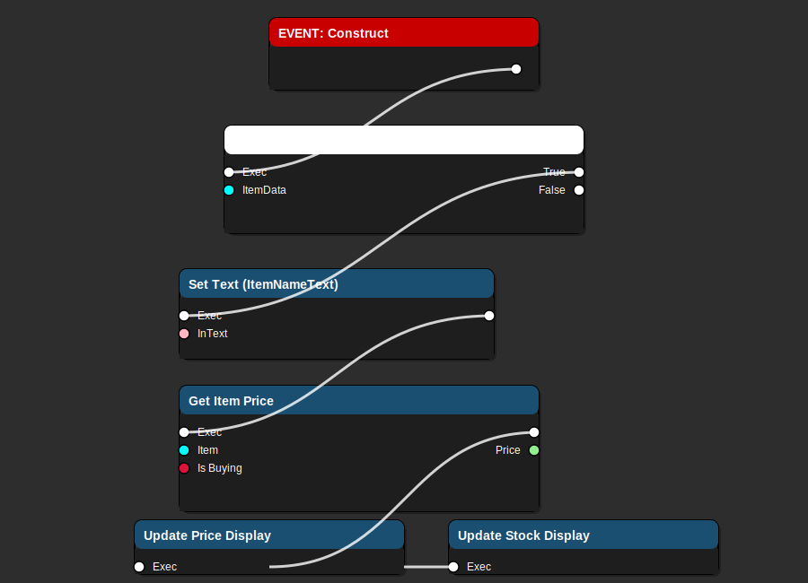
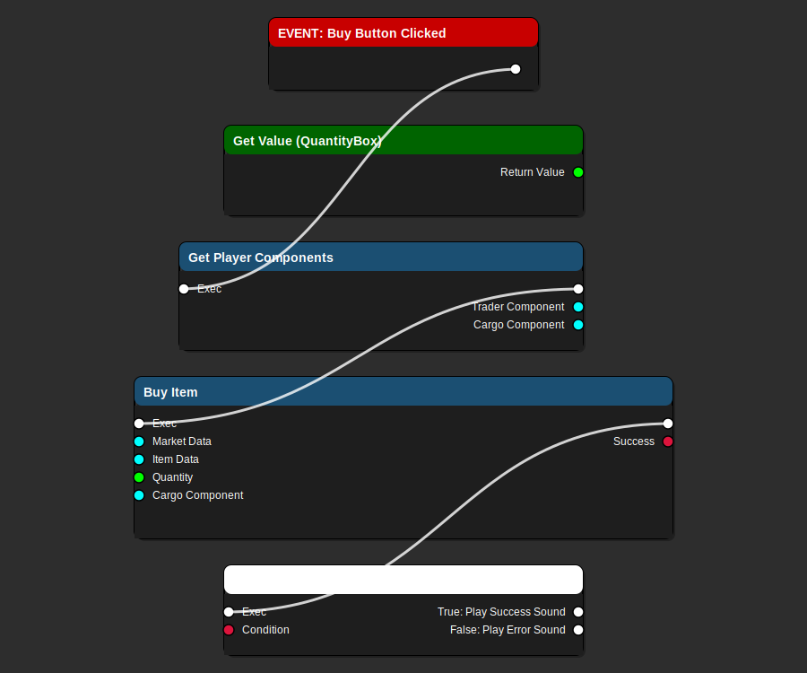
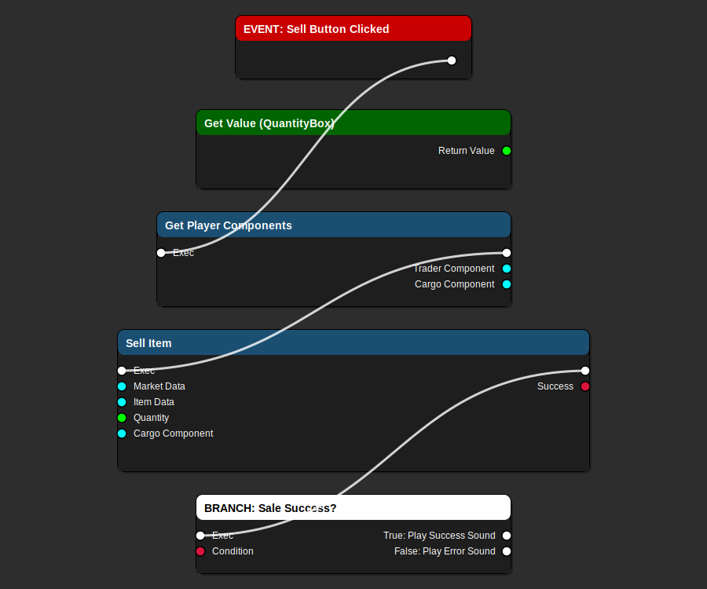
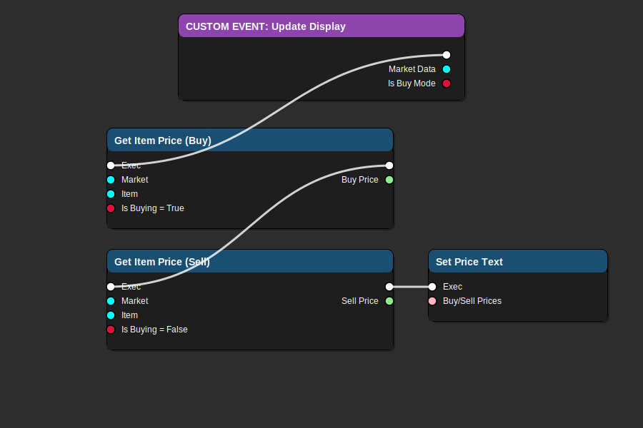

# WBP_TradeItemRow - Trade Item Row Widget Guide

> **Individual trade item display widget for market inventory lists - MVP CORE COMPONENT**

**Blueprint Type**: UMG Widget  
**Parent Class**: `UserWidget` (Standard UMG)  
**Location**: `Content/UI/Trading/WBP_TradeItemRow.uasset`  
**Used By**: WBP_TradingUI (parent widget)  
**Priority**: ⚠️ **CRITICAL** - Core component of Trade Simulator MVP

---

## 📋 Overview

`WBP_TradeItemRow` is a reusable widget component that displays individual trade items in the market inventory list. Each row shows item information, current prices, stock levels, and provides buy/sell interaction buttons.

### Responsibilities

- ✅ Display item name, description, and icon
- ✅ Show current buy and sell prices
- ✅ Display stock levels and availability
- ✅ Provide quantity selector (spin box)
- ✅ Handle buy button click with validation
- ✅ Handle sell button click with validation
- ✅ Update display based on market changes
- ✅ Provide visual feedback for transactions

---

## 🎨 Visual Flow Diagrams

### Event Construct Flow



**Flow Explanation:**

1. **EVENT: Construct** - Widget is created and added to viewport
2. **BRANCH: Is Valid (ItemData)?** - Validates ItemData reference exists
3. **Set Text (ItemNameText)** - Displays item name from ItemData.ItemName
4. **Get Item Price** - Retrieves current market price for this item
5. **Update Price Display** - Formats and displays buy/sell prices
6. **Update Stock Display** - Shows current stock level at market

**Key Variables Set:**
- `ItemNameText` - Displays item display name
- `PriceText` - Shows "Buy: X CR / Sell: Y CR"
- `StockText` - Shows "Stock: Z units"

---

### Buy Button Click Flow



**Flow Explanation:**

1. **EVENT: Buy Button Clicked** - Player clicks the "BUY" button
2. **Get Value (QuantityBox)** - Retrieves selected quantity from spin box
3. **Get Player Components** - Gets PlayerTraderComponent and CargoComponent references
4. **Buy Item** - Calls trading system function with:
   - Market Data (which market)
   - Item Data (which item)
   - Quantity (how many)
   - Cargo Component (for space validation)
5. **BRANCH: Purchase Success?** - Checks if transaction completed
6. **True**: Play success sound, update parent UI
7. **False**: Play error sound, show error message

**Transaction Validation (handled by C++):**
- Player has sufficient credits
- Market has sufficient stock
- Ship has sufficient cargo space
- Item is legal at this market

---

### Sell Button Click Flow



**Flow Explanation:**

1. **EVENT: Sell Button Clicked** - Player clicks the "SELL" button
2. **Get Value (QuantityBox)** - Retrieves selected quantity from spin box
3. **Get Player Components** - Gets PlayerTraderComponent and CargoComponent references
4. **Sell Item** - Calls trading system function with:
   - Market Data (which market)
   - Item Data (which item)
   - Quantity (how many)
   - Cargo Component (to remove items from cargo)
5. **BRANCH: Sale Success?** - Checks if transaction completed
6. **True**: Play success sound, update parent UI
7. **False**: Play error sound, show error message

**Transaction Validation (handled by C++):**
- Player has item in cargo
- Player has sufficient quantity
- Market accepts this item type
- Market has room for more stock

---

### Update Display Flow



**Flow Explanation:**

1. **CUSTOM EVENT: Update Display** - Called when market prices change
2. **Get Item Price (Buy)** - Gets current buy price (Is Buying = True)
3. **Get Item Price (Sell)** - Gets current sell price (Is Buying = False)
4. **Set Price Text** - Updates displayed prices with new values

**When Called:**
- After market initialization
- After any transaction (supply/demand changes)
- When switching between markets
- On periodic market updates (if economy simulation enabled)

---

## 📖 UMG Widget Terminology

> **Important Clarification**: This document uses official Unreal Engine UMG widget class names.

### TextBlock vs RichTextBlock

**"TextBlock" refers to Unreal Engine's `UTextBlock` widget class** (found in `Components/TextBlock.h`), not `RichTextBlock`.

Both are real UMG widget types in Unreal Engine:

| Widget Class | UE Class Name | When to Use | Features |
|--------------|---------------|-------------|----------|
| **TextBlock** | `UTextBlock` | Simple text display (✅ Used in this widget) | Single style, fast rendering, no markup |
| **RichTextBlock** | `URichTextBlock` | Formatted text with markup | Inline styles, images, custom decorators, slower |

**In Unreal Editor:**
- TextBlock: Palette → Common → **Text** (displays as "Text" in the widget picker)
- RichTextBlock: Palette → Common → **Rich Text Block**

**Why TextBlock for Trading UI:**
- ✅ **Performance**: Faster rendering for lists with many items
- ✅ **Simplicity**: No need for inline formatting in prices/names
- ✅ **Consistency**: Single font/color per element
- ✅ **MVP Focus**: Keep it simple and fast

**When to Consider RichTextBlock:**
- Detailed item descriptions with formatting (bold, italic, colors)
- Tutorial/help text with embedded images
- Chat systems with player name colors
- Lore/story text with styled paragraphs

**For this MVP**: All text displays use standard `UTextBlock` widgets for optimal performance.

---

## 🔧 Using TextBlock in Blueprint Graphs

### How to Set Text on a TextBlock Widget

To modify TextBlock content in Blueprint graphs, follow these steps:

#### Step 1: Create/Reference the TextBlock

1. **In Designer Tab**: Add a TextBlock widget (Palette → Common → **Text**)
2. **Name it**: Give it a descriptive name (e.g., `ItemNameText`, `PriceText`)
3. **Make it a Variable**: Check "Is Variable" in Details panel

#### Step 2: Access TextBlock in Graph

In the **Graph** tab of your widget Blueprint:

> **Note**: SVG diagram to be added - see `Tools/generate_blueprint_images.py` for generation.

**Blueprint Flow:**
- **Event** (e.g., Event Construct)
- **Get** ItemNameText variable → Returns TextBlock reference
- **Set Text (Text)** function → Modifies the TextBlock's displayed text

**Blueprint Nodes Needed:**
1. **Get [TextBlockName]** - Drag your TextBlock variable into the graph (or right-click → Get)
2. **Set Text (Text)** - Right-click TextBlock reference → Text → Set Text (Text)
3. **Connect** your text value to the "In Text" pin

#### Step 3: Set the Text Value

**Example: Setting Static Text**


_Flow description:_
- On **Event Construct**, get a reference to `PriceText` (TextBlock variable).
- Call **Set Text (Text)** on `PriceText`.
- Pass in `"100 CR"` as a literal text value (or use **Make Literal Text** node).

**Example: Setting Dynamic Text from Variable**


_Flow description:_
- On **Event Construct**, get the `ItemData` variable.
- **Break** `ItemData` struct to access the `ItemName` field (or use a direct property access).
- Get a reference to `ItemNameText` (TextBlock variable).
- Call **Set Text (Text)** on `ItemNameText`, passing in `ItemData.ItemName`.

**Example: Setting Formatted Text**


_Flow description:_
- On **Event Construct**, use a **Format Text** node with format string `"Buy: {Price} CR"`.
- Bind the `Price` pin to the `ItemPrice` variable.
- Get a reference to `PriceText` (TextBlock variable).
- Call **Set Text (Text)** on `PriceText`, using the output from **Format Text** as the new text value.

#### Common TextBlock Functions

| Function | Purpose | Usage in Graph |
|----------|---------|----------------|
| **Set Text (Text)** | Set the displayed text | Right-click TextBlock → Text → Set Text (Text) |
| **Get Text** | Read current text | Right-click TextBlock → Text → Get Text |
| **Set Color and Opacity** | Change text color | Right-click TextBlock → Appearance → Set Color and Opacity |
| **Set Font** | Change font style/size | Right-click TextBlock → Appearance → Set Font |
| **Set Justification** | Align text (Left/Center/Right) | Right-click TextBlock → Appearance → Set Justification |

#### Quick Tips

✅ **Do:**
- Always check "Is Variable" for TextBlocks you want to modify in graphs
- Use descriptive names: `Text_PlayerName`, `Text_ItemPrice`, `Text_StatusMessage`
- Use Format Text node for combining multiple values
- Cache TextBlock references if updating frequently

❌ **Don't:**
- Forget to make TextBlock a variable (can't access in graph otherwise)
- Update text every frame (use events/timers instead)
- Use SetText in Tick events (performance issue)

#### Common Mistakes

**Issue**: "I can't find my TextBlock in the graph"
- **Solution**: Make sure "Is Variable" is checked in Designer

**Issue**: "SetText node doesn't appear"
- **Solution**: Drag TextBlock variable to graph, then right-click it → Text → Set Text (Text)

**Issue**: "Text doesn't update"
- **Solution**: Ensure execution wire connects from your event to SetText node

---

## 🏗️ Widget Structure

> **Note**: "TextBlock" refers to UMG's `UTextBlock` class. In Unreal Editor's widget picker, this appears as "Text" under Common widgets.

### UI Hierarchy

```
WBP_TradeItemRow (UserWidget)
├─ Border (Root)
│  └─ HorizontalBox (MainContainer)
│     ├─ Image: ItemIcon (64x64)
│     │  └─ Size: 64x64 pixels
│     │  └─ Binding: ItemData->Icon (if available)
│     ├─ VerticalBox: ItemInfo
│     │  ├─ TextBlock: ItemNameText
│     │  │  └─ Font: Bold, 16pt
│     │  │  └─ Binding: ItemData->ItemName
│     │  ├─ TextBlock: ItemDescriptionText
│     │  │  └─ Font: Regular, 12pt
│     │  │  └─ Truncated: Yes (1 line max)
│     │  │  └─ Binding: ItemData->Description
│     │  └─ TextBlock: StockText
│     │     └─ Font: Regular, 11pt, Italic
│     │     └─ Format: "Stock: {Quantity} units"
│     ├─ Spacer (Fill remaining space)
│     ├─ VerticalBox: PriceInfo
│     │  ├─ TextBlock: PriceLabel
│     │  │  └─ Text: "Price"
│     │  └─ TextBlock: PriceText
│     │     └─ Font: Bold, 18pt
│     │     └─ Format: "Buy: X CR / Sell: Y CR"
│     └─ HorizontalBox: Actions
│        ├─ Button: DecreaseButton ("-")
│        │  └─ OnClicked: Decrease quantity by 1
│        ├─ SpinBox: QuantityBox
│        │  └─ Min: 1, Max: 9999
│        │  └─ Default: 1
│        ├─ Button: IncreaseButton ("+")
│        │  └─ OnClicked: Increase quantity by 1
│        ├─ Button: BuyButton
│        │  └─ Style: Green background
│        │  └─ Text: "BUY"
│        │  └─ OnClicked: → Buy Button Flow
│        └─ Button: SellButton
│           └─ Style: Red background
│           └─ Text: "SELL"
│           └─ OnClicked: → Sell Button Flow
```

---

## 📊 Variables

### Exposed Variables (Instance Editable)

```cpp
// UPROPERTY(BlueprintReadWrite, meta=(ExposeOnSpawn))
UTradeItemDataAsset* ItemData;
```
- **Type**: Object Reference (TradeItemDataAsset)
- **Purpose**: Reference to the trade item this row displays
- **Set By**: Parent WBP_TradingUI when creating widget
- **Required**: Yes (widget won't display without this)

```cpp
// UPROPERTY(BlueprintReadWrite, meta=(ExposeOnSpawn))
UMarketDataAsset* MarketData;
```
- **Type**: Object Reference (MarketDataAsset)
- **Purpose**: Reference to current market for price lookups
- **Set By**: Parent WBP_TradingUI when creating widget
- **Required**: Yes (needed for pricing)

```cpp
// UPROPERTY(BlueprintReadWrite, meta=(ExposeOnSpawn))
bool bIsBuyMode;
```
- **Type**: Boolean
- **Purpose**: Determines if widget shows buy or sell mode
- **Default**: true (buy mode)
- **Set By**: Parent widget based on UI toggle state

### Internal Variables

```cpp
// UPROPERTY(BlueprintReadWrite)
int32 Quantity;
```
- **Type**: Integer
- **Purpose**: Current selected quantity from spin box
- **Default**: 1
- **Range**: 1-9999

```cpp
// UPROPERTY(BlueprintReadWrite)
UPlayerTraderComponent* CachedTraderComponent;
```
- **Type**: Object Reference (PlayerTraderComponent)
- **Purpose**: Cached reference to player's trader component
- **Set**: On Construct (cached for performance)

```cpp
// UPROPERTY(BlueprintReadWrite)
UCargoComponent* CachedCargoComponent;
```
- **Type**: Object Reference (CargoComponent)
- **Purpose**: Cached reference to player's cargo component
- **Set**: On Construct (cached for performance)

---

## 🎮 Blueprint Events

### Event Construct

**When**: Widget is created and added to parent

**Implementation**:
1. Validate `ItemData` is not null
2. If invalid, hide widget and return early
3. Set item name text: `ItemNameText->SetText(ItemData->ItemName)`
4. Set item description text: `ItemDescriptionText->SetText(ItemData->Description)`
5. Get player pawn reference
6. Get and cache `PlayerTraderComponent`
7. Get and cache `CargoComponent`
8. Call `UpdatePriceDisplay()`
9. Call `UpdateStockDisplay()`

### OnBuyButtonClicked

**When**: Player clicks "BUY" button

**Implementation**:
1. Get quantity from `QuantityBox->GetValue()`
2. Validate `CachedTraderComponent` is valid
3. Validate `CachedCargoComponent` is valid
4. Call `BuyItem(MarketData, ItemData, Quantity, CachedCargoComponent)`
5. Store result in `bSuccess` boolean
6. Branch on `bSuccess`:
   - **True**: 
     - Play success sound effect
     - Reset quantity to 1
     - Call parent widget's `RefreshDisplay()`
   - **False**:
     - Play error sound effect
     - Display error message (get from error output)

### OnSellButtonClicked

**When**: Player clicks "SELL" button

**Implementation**:
1. Get quantity from `QuantityBox->GetValue()`
2. Validate `CachedTraderComponent` is valid
3. Validate `CachedCargoComponent` is valid
4. Call `SellItem(MarketData, ItemData, Quantity, CachedCargoComponent)`
5. Store result in `bSuccess` boolean
6. Branch on `bSuccess`:
   - **True**: 
     - Play success sound effect
     - Reset quantity to 1
     - Call parent widget's `RefreshDisplay()`
   - **False**:
     - Play error sound effect
     - Display error message

### OnDecreaseButtonClicked

**When**: Player clicks "-" button

**Implementation**:
```blueprint
Current = QuantityBox->GetValue()
New = Max(1, Current - 1)  // Don't go below 1
QuantityBox->SetValue(New)
```

### OnIncreaseButtonClicked

**When**: Player clicks "+" button

**Implementation**:
```blueprint
Current = QuantityBox->GetValue()
New = Min(9999, Current + 1)  // Don't exceed max
QuantityBox->SetValue(New)
```

---

## 🔧 Custom Functions

### Function: UpdatePriceDisplay

**Purpose**: Updates price text based on current market conditions

**Implementation**:
```blueprint
// Get current prices from economy manager
BuyPrice = EconomyManager->GetItemPrice(MarketData, ItemData, true)
SellPrice = EconomyManager->GetItemPrice(MarketData, ItemData, false)

// Format text
FormattedText = "Buy: " + BuyPrice + " CR / Sell: " + SellPrice + " CR"

// Update display
PriceText->SetText(FormattedText)

// Color code based on profitability
if (SellPrice > BuyPrice * 1.2):
    PriceText->SetColorAndOpacity(Green)  // Good profit margin
else if (SellPrice > BuyPrice):
    PriceText->SetColorAndOpacity(Yellow)  // Small profit
else:
    PriceText->SetColorAndOpacity(White)  // Normal
```

### Function: UpdateStockDisplay

**Purpose**: Shows current stock level at market

**Implementation**:
```blueprint
// Get stock from market inventory
InventoryEntry = MarketData->GetInventoryEntry(ItemData)

if (InventoryEntry is valid):
    StockQuantity = InventoryEntry.CurrentStock
    MaxStock = InventoryEntry.MaxStock
    
    // Format with stock level indicator
    FormattedText = "Stock: " + StockQuantity + " / " + MaxStock
    
    // Color code based on availability
    if (StockQuantity < MaxStock * 0.2):
        StockText->SetColorAndOpacity(Red)  // Low stock
    else if (StockQuantity < MaxStock * 0.5):
        StockText->SetColorAndOpacity(Yellow)  // Medium stock
    else:
        StockText->SetColorAndOpacity(Green)  // High stock
else:
    StockText->SetText("Out of Stock")
    StockText->SetColorAndOpacity(Red)
```

### Function: GetMaxAffordableQuantity

**Purpose**: Calculate maximum quantity player can buy

**Returns**: int32

**Implementation**:
```blueprint
// Get player credits
PlayerCredits = CachedTraderComponent->GetCredits()

// Get item price
ItemPrice = EconomyManager->GetItemPrice(MarketData, ItemData, true)

// Calculate max by credits
MaxByCredits = Floor(PlayerCredits / ItemPrice)

// Get cargo space
AvailableSpace = CachedCargoComponent->GetAvailableSpace()
ItemVolume = ItemData->VolumePerUnit

// Calculate max by space
MaxBySpace = Floor(AvailableSpace / ItemVolume)

// Return minimum
return Min(MaxByCredits, MaxBySpace)
```

---

## 🎨 Styling Guidelines (MVP)

### Colors

```
Buy Button: #00CC00 (Bright Green)
Sell Button: #CC0000 (Bright Red)
Disabled Button: #666666 (Gray)
Price Text (Normal): #FFFFFF (White)
Price Text (Profit): #00FF00 (Green)
Stock Low: #FF0000 (Red)
Stock Medium: #FFAA00 (Yellow)
Stock High: #00FF00 (Green)
```

### Fonts

```
Item Name: Bold, 16pt
Item Description: Regular, 12pt, Truncated
Price: Bold, 18pt
Stock: Italic, 11pt
Button Text: Bold, 14pt
```

### Spacing

```
Row Height: 80-100px
Item Icon: 64x64px
Padding: 8px all sides
Button Size: 80x40px
Quantity Box: 80px wide
```

### Visual Feedback

**Button Hover**:
- Scale: 1.05x
- Brightness: +20%

**Button Pressed**:
- Scale: 0.95x
- Play click sound

**Transaction Success**:
- Flash green border (0.5s)
- Play "cha-ching" sound
- Particle effect (optional)

**Transaction Failure**:
- Shake animation (0.3s)
- Flash red border (0.5s)
- Play error buzz sound

---

## 🔗 Integration Points

### With WBP_TradingUI (Parent Widget)

**Created By**: WBP_TradingUI in `PopulateItemList()` function

**Data Passed**:
```blueprint
// When creating WBP_TradeItemRow
RowWidget = CreateWidget(WBP_TradeItemRow)
RowWidget->ItemData = CurrentItem
RowWidget->MarketData = CurrentMarket
RowWidget->bIsBuyMode = bShowBuyView
```

**Events Dispatched** (back to parent):
```blueprint
// After successful transaction
OnTransactionCompleted(ItemData, Quantity, bWasPurchase)
```

### With PlayerTraderComponent

**Functions Called**:
- `GetCredits()` - Check available money
- `GetProfit()` - Display profit for UI
- `BuyItem()` - Execute purchase
- `SellItem()` - Execute sale

### With CargoComponent

**Functions Called**:
- `GetAvailableSpace()` - Check cargo capacity
- `GetUsedSpace()` - Display current usage
- `HasSpaceFor()` - Validate purchase fits

### With EconomyManager

**Functions Called**:
- `GetItemPrice(Market, Item, IsBuying)` - Get current price
- `GetInventoryEntry(Market, Item)` - Get stock level

---

## ✅ Testing Checklist

### Basic Display
- [ ] Widget displays item name correctly
- [ ] Widget shows item description (truncated)
- [ ] Prices display in correct format
- [ ] Stock level shows current amount
- [ ] All buttons are visible and styled

### Buy Functionality
- [ ] Buy button works with quantity 1
- [ ] Buy button works with quantity 10
- [ ] Buy fails when insufficient credits
- [ ] Buy fails when insufficient cargo space
- [ ] Buy fails when market out of stock
- [ ] Success sound plays on successful purchase
- [ ] Error sound plays on failed purchase
- [ ] Credits decrease after purchase
- [ ] Cargo space decreases after purchase
- [ ] Stock level updates after purchase

### Sell Functionality
- [ ] Sell button works with quantity 1
- [ ] Sell button works with quantity 10
- [ ] Sell fails when player doesn't have item
- [ ] Sell fails when quantity exceeds owned amount
- [ ] Success sound plays on successful sale
- [ ] Error sound plays on failed sale
- [ ] Credits increase after sale
- [ ] Cargo space increases after sale
- [ ] Stock level updates after sale

### Quantity Controls
- [ ] Decrease button reduces quantity
- [ ] Decrease button stops at 1 (minimum)
- [ ] Increase button raises quantity
- [ ] Increase button stops at 9999 (maximum)
- [ ] Spin box accepts manual input
- [ ] Invalid quantities are rejected

### Price Updates
- [ ] Prices update after transactions
- [ ] Prices reflect supply/demand changes
- [ ] Buy/sell price difference is correct
- [ ] Price colors indicate profitability

---

## 🐛 Common Issues & Solutions

### Issue: Widget Displays Blank

**Symptom**: Row appears but no text shows

**Solution**:
1. Check `ItemData` is not null in Event Construct
2. Verify `ItemData->ItemName` has valid text
3. Check text block bindings are set correctly
4. Ensure font is not corrupted

### Issue: Buttons Don't Work

**Symptom**: Clicking buy/sell does nothing

**Solution**:
1. Verify `OnClicked` events are wired
2. Check component references are cached
3. Ensure player pawn has required components
4. Check Blueprint compile errors

### Issue: Prices Show as 0

**Symptom**: All prices display "0 CR"

**Solution**:
1. Verify `MarketData` is valid
2. Check EconomyManager is initialized
3. Ensure market is registered with economy
4. Verify `ItemData->BasePrice` is not 0

### Issue: Can't Buy Even With Sufficient Credits

**Symptom**: Buy fails with no error message

**Solution**:
1. Check cargo space is available
2. Verify market has stock
3. Check item legality at market
4. Ensure no faction restrictions

### Issue: Visual Feedback Not Working

**Symptom**: No sounds or animations play

**Solution**:
1. Import sound assets to project
2. Set sound cue references in widget
3. Check animation blueprints are compiled
4. Verify animation timelines are set

---

## 📚 Related Documentation

### Trading System
- [WBP_TradingUI](WBP_TradingUI.md) - Parent trading interface
- [Trading UI Blueprint Guide](../mvp/TRADING_UI_BLUEPRINT_GUIDE.md) - Complete setup guide
- [Trading MVP Guide](../mvp/TRADING_MVP_GUIDE.md) - Overall MVP documentation

### C++ Integration
- `UTradeItemDataAsset` - Item data structure
- `UPlayerTraderComponent` - Player trading logic
- `UCargoComponent` - Cargo management
- `UEconomyManager` - Price calculation and supply/demand

### Asset Creation
- [Trade Item Templates](../Assets/TradeItemTemplates/) - YAML templates
- [Market Templates](../Assets/MarketTemplates/) - YAML templates

---

## 🎯 MVP Priorities

### Must Have (Week 4)
- ✅ Basic display (name, price, stock)
- ✅ Buy button functionality
- ✅ Sell button functionality
- ✅ Quantity selector
- ✅ Basic validation (credits, space)

### Should Have (Week 8)
- ✅ Visual feedback (sounds, colors)
- ✅ Price color coding
- ✅ Stock level indicators
- ✅ Error messages

### Nice to Have (Week 12)
- ⚠️ Animations (flash, shake)
- ⚠️ Particle effects
- ⚠️ Item icons/thumbnails
- ⚠️ Detailed tooltips
- ⚠️ Transaction history

---

## 📝 Implementation Notes

### Performance Considerations

**Caching**:
- Cache component references on Construct (not on every button click)
- Cache price lookups when possible
- Don't update display on Tick (use events instead)

**Pooling**:
- Consider object pooling for 50+ items
- Reuse widgets when scrolling large lists
- Clear references when removing from viewport

**Optimization**:
- Use sparse updates for stock display (not every frame)
- Batch price updates across all rows
- Delay non-critical UI updates until user stops scrolling

### Blueprint Best Practices

**Null Checks**:
Always validate object references before use:
```blueprint
if (IsValid(ItemData)):
    // Safe to use ItemData
else:
    // Hide widget or show error
```

**Event Dispatchers**:
Use event dispatchers to notify parent:
```blueprint
DECLARE_DYNAMIC_MULTICAST_DELEGATE(OnTransactionComplete)
```

**Error Handling**:
Provide clear feedback for all failure cases:
- Insufficient credits: "Not enough credits"
- No cargo space: "Cargo hold full"
- Out of stock: "Market out of stock"
- Illegal item: "Item banned at this station"

---

**Last Updated**: 2026-01-01  
**For**: Trade Simulator MVP  
**Status**: Production Ready  
**Version**: 1.0
