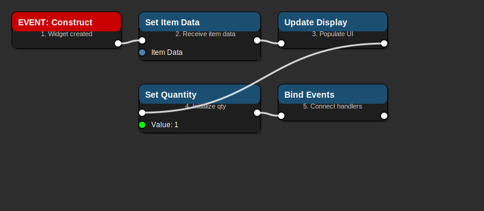
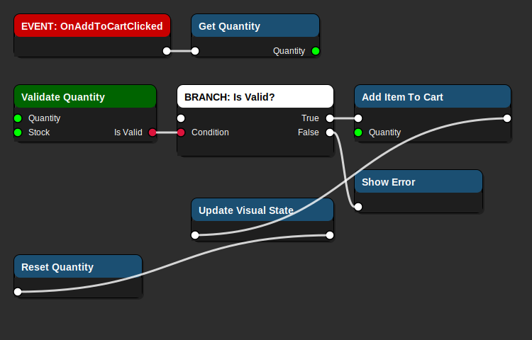
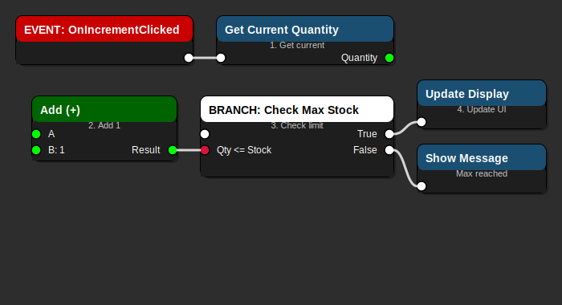
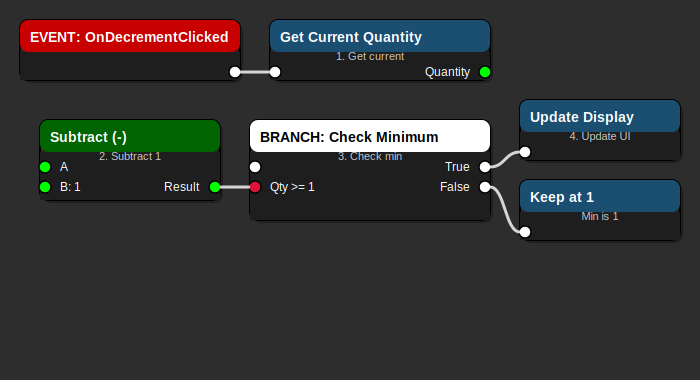

# WBP_TradeItemRow - Trade Item List Row Widget Guide

> **Individual item row in the trading interface list - MVP CORE FEATURE**

**Blueprint Type**: UMG Widget  
**Parent Class**: `UUserWidget`  
**Location**: `Content/UI/Trading/WBP_TradeItemRow.uasset`  
**Priority**: ⚠️ **CRITICAL** - Core component of Trade Simulator MVP

---

## 📋 Overview

`WBP_TradeItemRow` represents a single trade item in the market inventory list. It displays item information (name, price, stock) and provides controls for adding items to the shopping cart.

### Responsibilities

- ✅ Display item name, description, and icon
- ✅ Show current market price
- ✅ Display available stock quantity
- ✅ Provide quantity selector (increment/decrement)
- ✅ Show "Add to Cart" button
- ✅ Visual feedback for selection state
- ✅ Price comparison indicators (buy vs sell)

---

## 🎨 Visual Layout

### Component Hierarchy

```
WBP_TradeItemRow (User Widget)
│
└── Container (Horizontal Box)
    │
    ├── Item Icon (Image) - 64x64
    │
    ├── Item Info Panel (Vertical Box)
    │   ├── Item Name (TextBlock) - Bold, 16pt
    │   ├── Item Description (TextBlock) - 12pt, gray
    │   └── Stock Info (TextBlock) - 10pt, "Stock: X"
    │
    ├── Price Panel (Vertical Box)
    │   ├── Price Label (TextBlock) - "Price:"
    │   ├── Price Value (TextBlock) - Bold, 14pt
    │   └── Unit Label (TextBlock) - "credits"
    │
    ├── Quantity Selector (Horizontal Box)
    │   ├── Decrease Button (Button) - "-"
    │   ├── Quantity Display (TextBlock) - Current qty
    │   └── Increase Button (Button) - "+"
    │
    └── Add to Cart Button (Button)
```

---

## 🎨 Visual Flow Diagrams

### Initialize Row Data Flow



**Flow Explanation:**

1. **EVENT: Construct** - Widget created and added to list
2. **Set Item Data** - Receives trade item data from parent
3. **Update Display** - Populates all UI elements with item info
4. **Set Quantity** - Initializes quantity selector to 1
5. **Bind Events** - Connects button click handlers

### Add to Cart Flow



**Flow Explanation:**

1. **EVENT: OnAddToCartClicked** - User clicks "Add to Cart" button
2. **Get Quantity** - Reads current quantity from selector
3. **Validate Quantity** - Ensures quantity > 0 and <= stock
4. **BRANCH: Is Valid?** - Check if quantity is valid
   - **True**: Proceed to add to cart
   - **False**: Show error message
5. **Call Parent Function** - `AddItemToCart(ItemData, Quantity)`
6. **Update Visual State** - Highlight row as added
7. **Reset Quantity** - Reset selector to 1

### Quantity Increment Flow



**Flow Explanation:**

1. **EVENT: OnIncrementClicked** - User clicks "+" button
2. **Get Current Quantity** - Read quantity from display
3. **Increment Value** - Add 1 to quantity
4. **BRANCH: Check Max Stock** - Ensure quantity <= available stock
   - **True**: Update display with new quantity
   - **False**: Keep current quantity (show message)
5. **Update Display** - Refresh quantity text

### Quantity Decrement Flow



**Flow Explanation:**

1. **EVENT: OnDecrementClicked** - User clicks "-" button
2. **Get Current Quantity** - Read quantity from display
3. **Decrement Value** - Subtract 1 from quantity
4. **BRANCH: Check Minimum** - Ensure quantity >= 1
   - **True**: Update display with new quantity
   - **False**: Keep at 1 (minimum quantity)
5. **Update Display** - Refresh quantity text

---

## 📦 Properties

### Item Data

```cpp
UPROPERTY(BlueprintReadWrite, Category="Trade Item")
FTradeItemData ItemData;
```

Struct containing:
- `ItemName` (FText) - Display name
- `ItemDescription` (FText) - Description text
- `ItemIcon` (UTexture2D*) - Icon image
- `Price` (int32) - Current market price
- `StockQuantity` (int32) - Available stock
- `ItemID` (FName) - Unique identifier

### UI State

```cpp
UPROPERTY(BlueprintReadWrite, Category="UI State")
int32 CurrentQuantity;

UPROPERTY(BlueprintReadWrite, Category="UI State")
bool bIsSelected;

UPROPERTY(BlueprintReadWrite, Category="UI State")
bool bIsInCart;
```

### Style Settings

```cpp
UPROPERTY(EditAnywhere, BlueprintReadOnly, Category="Style")
FLinearColor NormalRowColor;

UPROPERTY(EditAnywhere, BlueprintReadOnly, Category="Style")
FLinearColor SelectedRowColor;

UPROPERTY(EditAnywhere, BlueprintReadOnly, Category="Style")
FLinearColor HoverRowColor;
```

---

## 🔧 Functions

### Initialization

#### SetItemData
```cpp
UFUNCTION(BlueprintCallable, Category="Trade Item")
void SetItemData(const FTradeItemData& InItemData);
```

**Purpose**: Initialize the row with trade item data

**Parameters**:
- `InItemData` - Trade item information

**Implementation**:
1. Store item data
2. Update all display elements
3. Reset quantity to 1
4. Update visual state

### Quantity Management

#### IncrementQuantity
```cpp
UFUNCTION(BlueprintCallable, Category="Trade Item")
void IncrementQuantity();
```

**Purpose**: Increase quantity by 1

**Logic**:
- Check if `CurrentQuantity < StockQuantity`
- If true, increment and update display
- If false, show "Maximum stock reached" message

#### DecrementQuantity
```cpp
UFUNCTION(BlueprintCallable, Category="Trade Item")
void DecrementQuantity();
```

**Purpose**: Decrease quantity by 1

**Logic**:
- Check if `CurrentQuantity > 1`
- If true, decrement and update display
- If false, keep at 1 (minimum)

#### SetQuantity
```cpp
UFUNCTION(BlueprintCallable, Category="Trade Item")
void SetQuantity(int32 NewQuantity);
```

**Purpose**: Set quantity directly

**Parameters**:
- `NewQuantity` - New quantity value

**Validation**:
- Clamp to range [1, StockQuantity]

### Cart Operations

#### AddToCart
```cpp
UFUNCTION(BlueprintCallable, Category="Trade Item")
void AddToCart();
```

**Purpose**: Add current item with quantity to shopping cart

**Implementation**:
1. Validate quantity > 0
2. Call parent widget's `AddItemToCart(ItemData, CurrentQuantity)`
3. Update visual state (highlight row)
4. Reset quantity to 1
5. Dispatch `OnItemAddedToCart` event

### Visual Updates

#### UpdateDisplay
```cpp
UFUNCTION(BlueprintCallable, Category="Trade Item")
void UpdateDisplay();
```

**Purpose**: Refresh all UI elements with current data

**Updates**:
- Item name text
- Description text
- Price text
- Stock text
- Quantity display
- Button states

#### SetSelectedState
```cpp
UFUNCTION(BlueprintCallable, Category="Trade Item")
void SetSelectedState(bool bSelected);
```

**Purpose**: Update visual state for selection

**Parameters**:
- `bSelected` - Whether row is selected

**Visual Changes**:
- Background color (normal vs selected)
- Border highlight
- Font weight

---

## 🎯 Events

### OnItemAddedToCart
```cpp
DECLARE_DYNAMIC_MULTICAST_DELEGATE_TwoParams(FOnItemAddedToCart, FTradeItemData, ItemData, int32, Quantity);

UPROPERTY(BlueprintAssignable, Category="Trade Item")
FOnItemAddedToCart OnItemAddedToCart;
```

**Purpose**: Notify parent widget that item was added to cart

**Parameters**:
- `ItemData` - The trade item
- `Quantity` - Quantity added

### OnQuantityChanged
```cpp
DECLARE_DYNAMIC_MULTICAST_DELEGATE_OneParam(FOnQuantityChanged, int32, NewQuantity);

UPROPERTY(BlueprintAssignable, Category="Trade Item")
FOnQuantityChanged OnQuantityChanged;
```

**Purpose**: Notify when quantity selector changes

**Parameters**:
- `NewQuantity` - New quantity value

---

## 🎨 Styling Guide

### Colors

**Normal State**:
- Background: `#2D2D2D` (dark gray)
- Text: `#FFFFFF` (white)
- Border: None

**Hover State**:
- Background: `#3D3D3D` (lighter gray)
- Text: `#FFFFFF` (white)
- Border: `#5DADE2` (light blue, 1px)

**Selected State**:
- Background: `#1B4F72` (blue)
- Text: `#FFFFFF` (white)
- Border: `#5DADE2` (light blue, 2px)

**In Cart State**:
- Background: `#2D4D2D` (dark green tint)
- Text: `#90EE90` (light green)
- Border: `#00FF00` (green, 1px)

### Typography

**Item Name**:
- Font: Arial/Sans-serif
- Size: 16pt
- Weight: Bold
- Color: White

**Item Description**:
- Font: Arial/Sans-serif
- Size: 12pt
- Weight: Normal
- Color: Light Gray (#CCCCCC)

**Price**:
- Font: Arial/Sans-serif
- Size: 14pt
- Weight: Bold
- Color: Yellow (#FFD700)

**Stock Info**:
- Font: Arial/Sans-serif
- Size: 10pt
- Weight: Normal
- Color: Gray (#999999)

### Spacing

- Row padding: 10px all sides
- Icon margin: 10px right
- Panel spacing: 15px between panels
- Button margin: 5px between buttons

---

## 💡 Usage Examples

### Creating in Blueprint

**Parent Widget (WBP_TradingUI)**:

```
1. In Designer:
   - Add Scroll Box named "ItemListScrollBox"
   - Set to vertical scrolling

2. In Event Graph:
   OnMarketInventoryUpdated:
   ├─ ForEach Loop: Available Items
   │  ├─ Create Widget: WBP_TradeItemRow
   │  ├─ Call SetItemData(Item)
   │  ├─ Bind OnItemAddedToCart → HandleItemAdded
   │  └─ Add to Scroll Box
   └─ Done
```

### Handling Add to Cart

**In Parent Widget**:

```
EVENT: HandleItemAdded(ItemData, Quantity)
├─ Get Shopping Cart Component
├─ Add Item to Cart(ItemData, Quantity)
├─ Update Cart Display
├─ Calculate New Total
└─ Update UI
```

---

## ⚠️ Common Issues and Solutions

### Issue: Quantity Not Updating

**Problem**: Clicking +/- buttons doesn't update quantity

**Solution**:
1. Verify button events are bound in Event Graph
2. Check `CurrentQuantity` variable is initialized
3. Ensure `UpdateDisplay()` is called after quantity change

### Issue: Item Added Multiple Times

**Problem**: Clicking "Add to Cart" adds item multiple times

**Solution**:
1. Disable button after click
2. Re-enable after parent confirms addition
3. Add visual feedback (button state change)

### Issue: Price Not Displaying

**Problem**: Price shows as 0 or blank

**Solution**:
1. Verify `ItemData.Price` is set correctly
2. Check text binding in Designer
3. Ensure `UpdateDisplay()` populates price text

---

## 🧪 Testing Checklist

Before using this widget:

- [ ] Widget displays item name correctly
- [ ] Item icon loads and displays
- [ ] Price shows correct value and currency
- [ ] Stock quantity is accurate
- [ ] Increment button increases quantity
- [ ] Decrement button decreases quantity
- [ ] Quantity can't go below 1
- [ ] Quantity can't exceed stock
- [ ] "Add to Cart" adds correct item and quantity
- [ ] Visual state updates when selected
- [ ] Hover state works correctly
- [ ] Events fire to parent widget

---

## 🔗 Integration

### With WBP_TradingUI

`WBP_TradingUI` creates instances of this widget:

```
WBP_TradingUI
└─ ItemListScrollBox
    ├─ WBP_TradeItemRow (Water)
    ├─ WBP_TradeItemRow (Food)
    ├─ WBP_TradeItemRow (Medicine)
    └─ [More items...]
```

### With C++ Backend

This widget interacts with:
- `UTradingInterfaceWidget` (parent C++ class)
- `UMarketDataAsset` (market data)
- `UTradeItemDataAsset` (item definitions)
- `UCargoComponent` (inventory management)

---

## 📚 Related Documentation

- `WBP_TradingUI.md` - Parent trading interface
- `docs/mvp/TRADING_UI_BLUEPRINT_GUIDE.md` - Complete trading UI guide
- `docs/reference/TRADING_MVP_QUICK_REFERENCE.md` - MVP quick reference
- `docs/reference/UI_WIDGET_REFERENCE.md` - General UI widget guide

---

**Last Updated**: 2026-01-02  
**Version**: 1.0  
**Status**: MVP Critical Component
