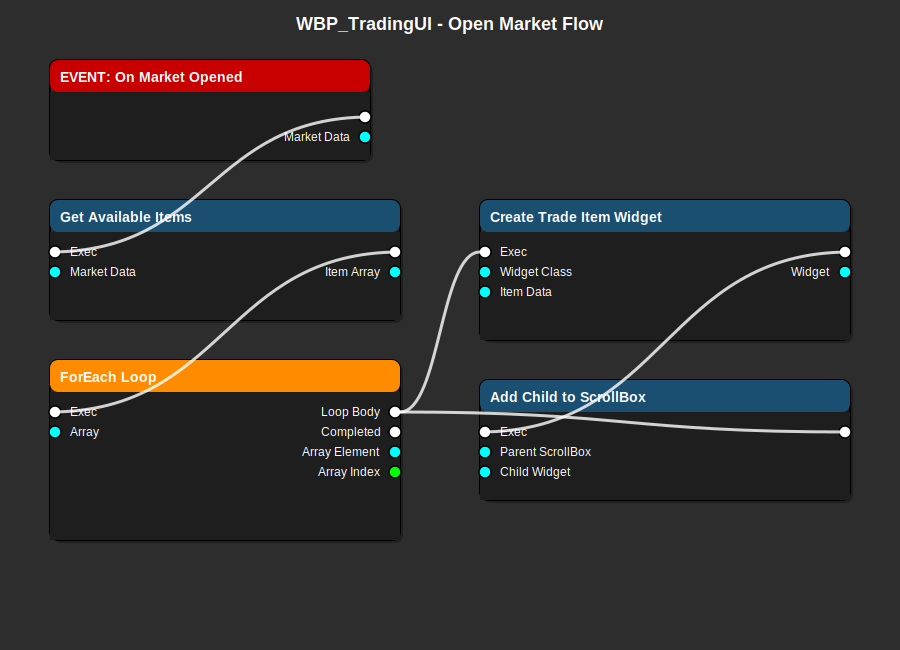
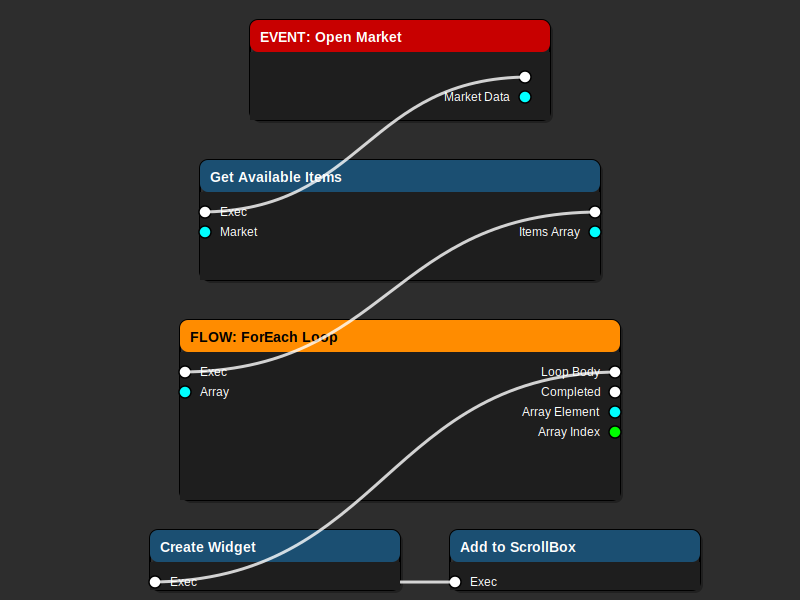
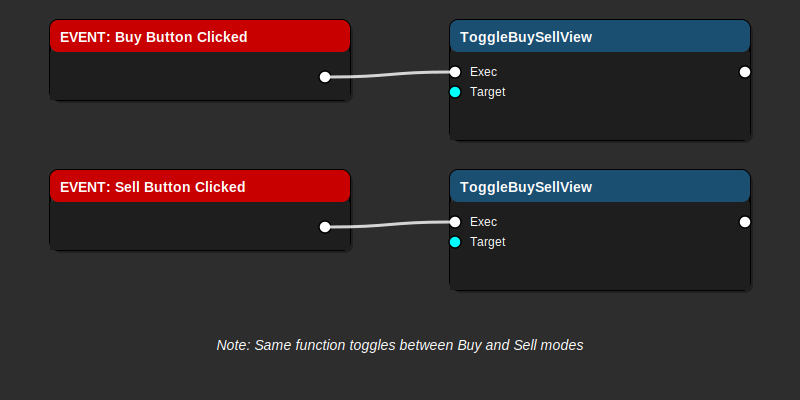
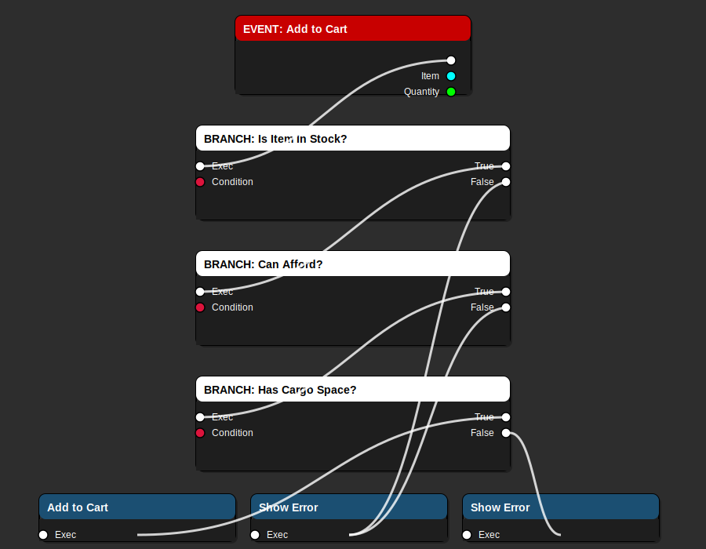
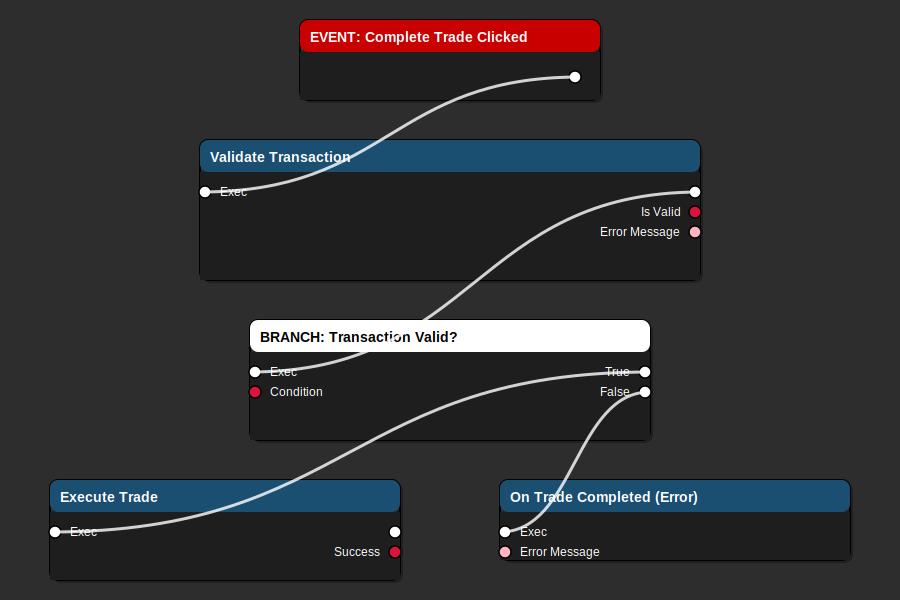

# WBP_TradingUI - Trading Interface Widget Guide

> **Main trading interface for buying and selling items at stations - MVP CORE FEATURE**

**Blueprint Type**: UMG Widget  
**Parent Class**: `UTradingInterfaceWidget` (C++)  
**Location**: `Content/UI/Trading/WBP_TradingUI.uasset`  
**Priority**: ⚠️ **CRITICAL** - Core feature of Trade Simulator MVP

---

## 📋 Overview

`WBP_TradingUI` is the primary user interface for the Trade Simulator MVP. It displays market inventory, handles buy/sell transactions, manages shopping cart, and validates purchases.

### Responsibilities

- ✅ Display available market items with prices
- ✅ Show player credits and cargo space
- ✅ Handle buy/sell mode toggle
- ✅ Manage shopping cart (add/remove items)
- ✅ Validate transactions (credits, cargo space)
- ✅ Execute purchase and update inventory
- ✅ Display error messages for failed transactions

---

## 🎨 Visual Flow Diagrams

### Open Market Flow



**Flow Explanation:**

1. **On Market Opened Event** - Triggered when player docks at station
2. **Get Available Items** - Fetches current market inventory
3. **ForEach Loop** - Iterates through each market item
4. **Create Trade Item Widget** - Creates WBP_TradeItemRow for each item
5. **Add Child to ScrollBox** - Displays item in the list

### Market Item Display Flow



**Flow Explanation:**

1. **EVENT: Open Market** - Market interface opened with market data
2. **Get Available Items** - Retrieves market inventory array
3. **ForEach Loop** - Iterates through each inventory entry
4. **Create Widget** - Creates WBP_TradeItemRow for each item
5. **Add to ScrollBox** - Populates the item list UI

### Buy/Sell Toggle Flow



**Flow Explanation:**

1. **EVENT: Buy Button Clicked** - Player clicks "Buy" button
2. **ToggleBuySellView** - Switches to buy mode (sets `bShowBuyView = true`)
3. **EVENT: Sell Button Clicked** - Player clicks "Sell" button
4. **ToggleBuySellView** - Switches to sell mode (sets `bShowBuyView = false`)

**Note**: Both buttons call the same function which toggles the mode.

### Add to Cart Validation Flow



**Flow Explanation:**

1. **EVENT: Add to Cart** - Player adds item with quantity
2. **BRANCH: Is Item In Stock?** - Validates market has sufficient stock
3. **BRANCH: Can Afford?** - Checks player has enough credits
4. **BRANCH: Has Cargo Space?** - Verifies ship has room for item
5. **Add to Cart** (Success) - Item added to shopping cart
6. **Show Error** (Failure) - Display appropriate error message

### Buy Item Validation Flow


**Flow Explanation:**

1. **On Buy Button Clicked** - Player clicks buy button
2. **Calculate Total Cost** - Gets item price × quantity
3. **Branch: Can Afford?** - Checks if player has enough credits
4. **Branch: Has Cargo Space?** - Checks if ship has room
5. **Execute Purchase** (Success) - Complete transaction
6. **Show Error Message** (Failure) - Display reason for failure

### Execute Trade Flow



**Flow Explanation:**

1. **EVENT: Complete Trade Clicked** - Player confirms transaction
2. **Validate Transaction** - Checks cart validity, credits, cargo space
3. **BRANCH: Transaction Valid?** - Determines if trade can proceed
4. **Execute Trade** (Success) - Process all items in cart
5. **On Trade Completed (Error)** (Failure) - Show error message with reason

---

## 🔧 Prerequisites

### Required C++ Classes
- ✅ `UTradingInterfaceWidget` - Parent class with trading logic
- ✅ `UMarketDataAsset` - Market configuration
- ✅ `UTradeItemDataAsset` - Item definitions
- ✅ `UEconomyManager` - Price calculation and supply/demand

### Required Widgets
- ✅ `WBP_TradeItemRow` - Individual item display widget

### Required Data Assets
- ✅ At least 1 `UMarketDataAsset` for testing
- ✅ At least 10-20 `UTradeItemDataAsset` for inventory

---

## 🎨 Widget Layout Structure

```
Canvas Panel (Root)
├── Background Overlay
│   └── Background Image (semi-transparent)
│
├── Header Panel (Horizontal Box)
│   ├── Market Name (Text Block)
│   ├── Spacer
│   └── Close Button
│
├── Main Container (Horizontal Box)
│   │
│   ├── Left Panel: Market Info (Vertical Box)
│   │   ├── Buy/Sell Toggle (Horizontal Box)
│   │   │   ├── Buy Button (Button)
│   │   │   └── Sell Button (Button)
│   │   │
│   │   ├── Category Filter (Combo Box) [Optional]
│   │   ├── Sort Dropdown (Combo Box) [Optional]
│   │   │
│   │   └── Item List (Scroll Box)
│   │       └── [WBP_TradeItemRow instances]
│   │
│   └── Right Panel: Player Info (Vertical Box)
│       │
│       ├── Player Stats Panel
│       │   ├── Credits Display (Text Block)
│       │   ├── Cargo Space Bar (Progress Bar)
│       │   └── Profit Display (Text Block)
│       │
│       ├── Shopping Cart Panel
│       │   ├── Cart Title (Text Block)
│       │   ├── Cart Items List (Scroll Box)
│       │   └── Cart Total (Text Block)
│       │
│       └── Transaction Panel
│           ├── Trade Button (Button)
│           └── Clear Cart Button (Button)
│
└── Status Message (Text Block)
    └── Shows errors/success messages
```

---

## 🏗️ Implementation Steps

### Step 1: Create the Widget Blueprint

1. Content Browser → `Content/UI/Trading/`
2. Right-click → User Interface → Widget Blueprint
3. Name it `WBP_TradingUI`
4. Open the widget

### Step 2: Set Parent Class

1. Click "File" → "Reparent Blueprint"
2. Search for `TradingInterfaceWidget`
3. Select it as parent
4. This gives access to all C++ trading functions

### Step 3: Design the Layout

#### Root Canvas Panel

1. Add Canvas Panel (if not already root)
2. Set size: 1920 × 1080 (or use anchors for responsive)
3. Add Background:
   - Add Image widget
   - Set brush color: Black with 0.8 opacity
   - Anchor: Fill screen

#### Header Section

1. Add Horizontal Box at top
2. Padding: 20px all sides
3. Add children:
   - **Text Block**: "Market Name"
     - Bind text to `GetMarketName()` function
     - Font Size: 32
     - Color: White
   
   - **Spacer**: Fill remaining space
   
   - **Button**: "Close"
     - Content: Text "X"
     - OnClicked: Close widget and undock

#### Left Panel: Market Items

1. Add Vertical Box (50% width)
2. Add Buy/Sell Toggle:
   ```
   Horizontal Box
   ├── Button: "Buy"
   │   OnClicked: ToggleBuySellView()
   │   Style: Highlighted when bShowBuyView == true
   └── Button: "Sell"
       OnClicked: ToggleBuySellView()
       Style: Highlighted when bShowBuyView == false
   ```
   
   **Note**: `ToggleBuySellView()` switches between buy and sell modes. You can bind button states to the `bShowBuyView` property to highlight the active mode.

3. Add Filters (Optional for MVP):
   - Combo Box for category filtering
   - Combo Box for sorting (price, name)

4. Add Scroll Box:
   - Name: `ItemListScrollBox`
   - Fill remaining space
   - This will contain WBP_TradeItemRow widgets

#### Right Panel: Player Info

1. Add Vertical Box (50% width)
2. Add Player Stats Panel:
   ```
   Vertical Box
   ├── Text: "Credits:"
   ├── Text: Bind to GetPlayerCredits()
   │   Font Size: 24, Color: Gold
   ├── Text: "Cargo Space:"
   └── Progress Bar: Bind to GetCargoSpacePercent()
       Fill Color: Green → Yellow → Red
   ```

3. Add Shopping Cart Panel:
   ```
   Vertical Box
   ├── Text: "Shopping Cart"
   ├── Scroll Box: CartItemsScrollBox
   │   └── [Cart item entries]
   └── Text: "Total: " + GetCartTotal() + " CR"
       Font Size: 20, Color: White
   ```

4. Add Transaction Buttons:
   ```
   Horizontal Box
   ├── Button: "Complete Trade"
   │   OnClicked: ExecuteTrade()
   │   Enabled: Bind to CanExecuteTrade()
   └── Button: "Clear Cart"
       OnClicked: ClearCart()
   ```

#### Status Message

1. Add Text Block at bottom
2. Name: `StatusMessageText`
3. Initially hidden (visibility: Collapsed)
4. Used for error/success messages

---

## 🔌 Blueprint Function Implementation

### Event: On Market Opened

```
EVENT: On Market Opened (Blueprint Implementable Event from C++)
├─  Market Data (UMarketDataAsset)
└─► Exec
    └─► Call PopulateMarketItems(Market Data)
```

**Implementation:**
1. Clear existing item list
2. Call C++ function `GetAvailableItems(MarketData)`
3. Returns: `TArray<FMarketInventoryEntry>`
4. ForEach loop through entries
5. For each entry:
   - Create Widget: `WBP_TradeItemRow`
   - Set item data on widget
   - Add to `ItemListScrollBox`

### Function: Populate Market Items

```
FUNCTION: Populate Market Items
├─► Exec (input)
├─  Market Data (UMarketDataAsset)
└─► Exec (output)
```

**Node Sequence:**

```
1. Clear Children (ItemListScrollBox)

2. Get Available Items (C++ function)
   ├─  Market Data
   └─► Returns: Array<InventoryEntry>

3. ForEach Loop (Array of InventoryEntry)
   ├─► Loop Body:
   │   │
   │   ├─► Create Widget (WBP_TradeItemRow)
   │   │   ├─  Class: WBP_TradeItemRow
   │   │   └─  Owning Player: Get Owning Player
   │   │
   │   ├─► Set Item Data (on created widget)
   │   │   ├─  Item: Array Element.Item
   │   │   ├─  Price: Array Element.Price
   │   │   └─  Stock: Array Element.Stock
   │   │
   │   └─► Add Child (ItemListScrollBox, Widget)
   │
   └─► Completed: (end of loop)
```

### Function: On Buy Button Clicked

```
EVENT: On Buy Button Clicked
├─  Item (UTradeItemDataAsset)
├─  Quantity (int32)
└─► Exec
    └─► Call ValidateAndExecute Purchase
```

**Validation Chain:**

```
1. Calculate Total Cost
   ├─  Item Price × Quantity
   └─► Total Cost (int32)

2. Branch: Can Afford?
   ├─  Condition: Player Credits >= Total Cost
   ├─► True Path:
   │   │
   │   └─► Branch: Has Cargo Space?
   │       ├─  Condition: Available Cargo >= Item Volume × Quantity
   │       ├─► True Path:
   │       │   └─► Execute Purchase (Success)
   │       │       ├─  Deduct credits
   │       │       ├─  Add to cargo
   │       │       ├─  Update UI
   │       │       └─  Show success message
   │       │
   │       └─► False Path:
   │           └─► Show Error: "Not enough cargo space"
   │
   └─► False Path:
       └─► Show Error: "Not enough credits"
```

### Function: Execute Purchase

```
FUNCTION: Execute Purchase (C++ Integration)
├─► Exec (input)
├─  Item (UTradeItemDataAsset)
├─  Quantity (int32)
├─  Total Price (int32)
└─► Exec (output)
    ├─  Success (bool)
    └─  Error Message (FText)
```

**Calls C++ function:**
```cpp
// C++ handles the actual transaction
bool Success = TradingInterface->ExecutePurchase(Item, Quantity, TotalPrice);
if (Success)
{
    UpdatePlayerStats();
    RefreshMarketInventory();
    ShowSuccessMessage();
}
```

---

## 🎮 Widget Binding Functions

### Get Player Credits

```
FUNCTION: Get Player Credits (BlueprintPure)
└─► Returns: int32 (current credits)
```

Bind to Credits text display.

### Get Cargo Space Percent

```
FUNCTION: Get Cargo Space Percent (BlueprintPure)
└─► Returns: float (0.0 to 1.0)
```

Calculate: `Used Cargo / Max Cargo`  
Bind to Progress Bar percent.

### Get Cart Total

```
FUNCTION: Get Cart Total (BlueprintPure)
└─► Returns: int32 (total cart value)
```

Sum all items in cart.  
Bind to Cart Total text.

### Can Execute Trade

```
FUNCTION: Can Execute Trade (BlueprintPure)
└─► Returns: bool (can complete transaction)
```

Checks:
- Cart not empty
- Player has enough credits
- Player has enough cargo space

Bind to Trade Button IsEnabled.

---

## 🎨 Visual States

### Trading Modes

**Buy Mode:**
- Buy button: Highlighted (blue/green)
- Sell button: Greyed out
- Item list: Shows market's sell prices
- Cart: Accumulates purchases

**Sell Mode:**
- Sell button: Highlighted
- Buy button: Greyed out
- Item list: Shows items player can sell
- Cart: Accumulates sales (adds credits)

### Success State

```
Show green message: "Purchase successful! Spent X CR"
Play success sound
Flash cart total
Update player stats
Clear cart (optional)
```

### Error States

```
Error: "Not enough credits"
├─  Show red message at bottom
├─  Flash credits display
└─  Keep items in cart

Error: "Not enough cargo space"
├─  Show red message
├─  Flash cargo bar
└─  Suggest ship upgrade

Error: "Item out of stock"
├─  Show red message
├─  Grey out item in list
└─  Update quantity available
```

---

## 🧪 Testing

### In-Editor Testing

1. **Open Widget Editor**:
   - Open WBP_TradingUI
   - Click "Designer" tab
   - Verify layout looks correct

2. **Test in Game**:
   - Add test code to open widget on key press
   - Dock at station to trigger naturally
   - Test all interactions

### Test Scenarios

**Scenario 1: Successful Purchase**
```
1. Open trading UI
2. Select item with sufficient credits/space
3. Add to cart
4. Click "Complete Trade"
5. Verify: Credits deducted, item in cargo, success message
```

**Scenario 2: Insufficient Credits**
```
1. Set player credits to low value (100 CR)
2. Try to buy expensive item (1000 CR)
3. Verify: Error message shown, transaction blocked
```

**Scenario 3: Insufficient Cargo**
```
1. Fill player cargo to 95%
2. Try to buy large item
3. Verify: Cargo space error shown
```

**Scenario 4: Multiple Items**
```
1. Add 3 different items to cart
2. Verify total calculates correctly
3. Complete trade
4. Verify all items added to cargo
```

### Verification Checklist

- [ ] Widget opens without errors
- [ ] Market items display correctly
- [ ] Prices show for all items
- [ ] Player credits display
- [ ] Cargo space bar accurate
- [ ] Can add items to cart
- [ ] Cart total calculates correctly
- [ ] Validation prevents invalid purchases
- [ ] Success message appears
- [ ] Error messages clear and helpful
- [ ] Can close widget and return to game

---

## ⚠️ Common Issues

### Issue 1: Items Don't Display

**Symptoms**: Empty item list

**Causes**:
- Market Data not loaded
- GetAvailableItems returns empty
- Widget creation fails

**Solutions**:
1. Verify Market Data Asset is valid
2. Check C++ GetAvailableItems implementation
3. Add debug logs in ForEach loop
4. Verify WBP_TradeItemRow class exists

### Issue 2: Purchase Doesn't Work

**Symptoms**: Button does nothing

**Causes**:
- Button not bound to function
- Validation always fails
- C++ function not called

**Solutions**:
1. Check OnClicked event is bound
2. Debug validation branches
3. Verify C++ ExecutePurchase is called
4. Check player credits/cargo values

### Issue 3: UI Doesn't Update

**Symptoms**: Stale data after transaction

**Causes**:
- Bindings not refreshing
- C++ data not updated
- Widget not invalidated

**Solutions**:
1. Call ForceLayoutPrepass after changes
2. Manually update text bindings
3. Verify C++ updates internal state
4. Rebuild widget if necessary

---

## 🎯 MVP Checklist

For Trade Simulator MVP, this widget must:

- [x] Display market inventory (10-20 items)
- [x] Show current prices
- [x] Display player credits
- [x] Show cargo space available
- [x] Support buying items
- [x] Validate transactions (credits + cargo)
- [x] Execute purchase and update state
- [x] Show clear error messages
- [ ] Support selling items (Phase 2)
- [ ] Category filtering (nice to have)
- [ ] Price history graphs (not MVP)

---

## 🔗 Related Blueprints

**Required Before**:
- [BP_PlayerShip](BP_PlayerShip.md) - Has cargo component
- [BP_SpaceStation_Main](BP_SpaceStation_Main.md) - Triggers docking

**Required With**:
- [WBP_TradeItemRow](WBP_TradeItemRow.md) - Individual item widget

**Integrates With**:
- Economy Manager (C++) - Price calculation
- Cargo Component (C++) - Inventory management
- Player State - Credits tracking

---

**Last Updated**: December 30, 2025  
**Status**: CRITICAL for MVP  
**Difficulty**: ⭐⭐⭐⭐ Advanced
