# Player Controls Visual Diagrams

This document provides visual flowcharts using Mermaid syntax for the Adastrea player control systems.

## Table of Contents
1. [Spaceship System Diagrams](#spaceship-system-diagrams)
2. [Character System Diagrams](#character-system-diagrams)
3. [Transition Diagrams](#transition-diagrams)

---

## Spaceship System Diagrams

### Game Start to Spaceship Control - Complete Flow

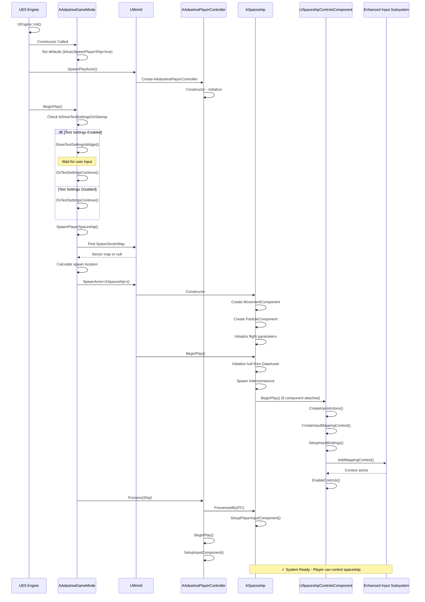

### Spaceship Runtime Input Processing

```mermaid
flowchart TD
    Start([Player Presses W Key]) --> Input[Enhanced Input System<br/>Captures Input]
    Input --> Match[Match to SpaceshipMappingContext]
    Match --> Action[Find MoveAction<br/>W → Y:1.0]
    Action --> Modifier[Apply Modifiers<br/>SwizzleAxis, Negate, etc.]
    Modifier --> Trigger[Trigger ETriggerEvent::Triggered]
    
    Trigger --> Handler[USpaceshipControlsComponent<br/>::HandleMove]
    Handler --> Extract[Extract FVector2D value]
    Extract --> Multiply[Multiply by MovementSpeed<br/>and CurrentSpeed]
    Multiply --> Event[Call OnMoveInput BlueprintNativeEvent]
    
    Event --> Impl[OnMoveInput_Implementation]
    Impl --> GetVectors[Get RightVector and UpVector<br/>from Pawn]
    GetVectors --> CalcDir[Calculate Movement Direction<br/>MoveDir = Right*X + Up*Y]
    CalcDir --> AddInput[APawn::AddMovementInput]
    
    AddInput --> Accumulate[Accumulate in ControlInputVector]
    
    Accumulate --> Tick[ASpaceship::Tick]
    Tick --> CheckPossessed{Possessed?}
    CheckPossessed -->|No| EndTick[Skip Physics]
    CheckPossessed -->|Yes| FlightAssist{Flight Assist<br/>Enabled?}
    
    FlightAssist -->|Yes| ApplyAssist[ApplyFlightAssist]
    ApplyAssist --> UpdateThrottle[UpdateThrottleVelocity]
    FlightAssist -->|No| UpdateThrottle
    
    UpdateThrottle --> AutoLevel{Auto-Level<br/>Enabled?}
    AutoLevel -->|Yes| ApplyLevel[ApplyAutoLeveling]
    AutoLevel -->|No| MovementComp[UFloatingPawnMovement<br/>::TickComponent]
    ApplyLevel --> MovementComp
    
    MovementComp --> ApplyVel[Apply Velocity to Position]
    ApplyVel --> Collision[Collision Detection]
    Collision --> UpdatePos[Update Actor Location]
    UpdatePos --> Render[Renderer Updates Visual]
    
    Render --> End([Frame Complete])
    EndTick --> End
```

### Spaceship Input Binding Architecture

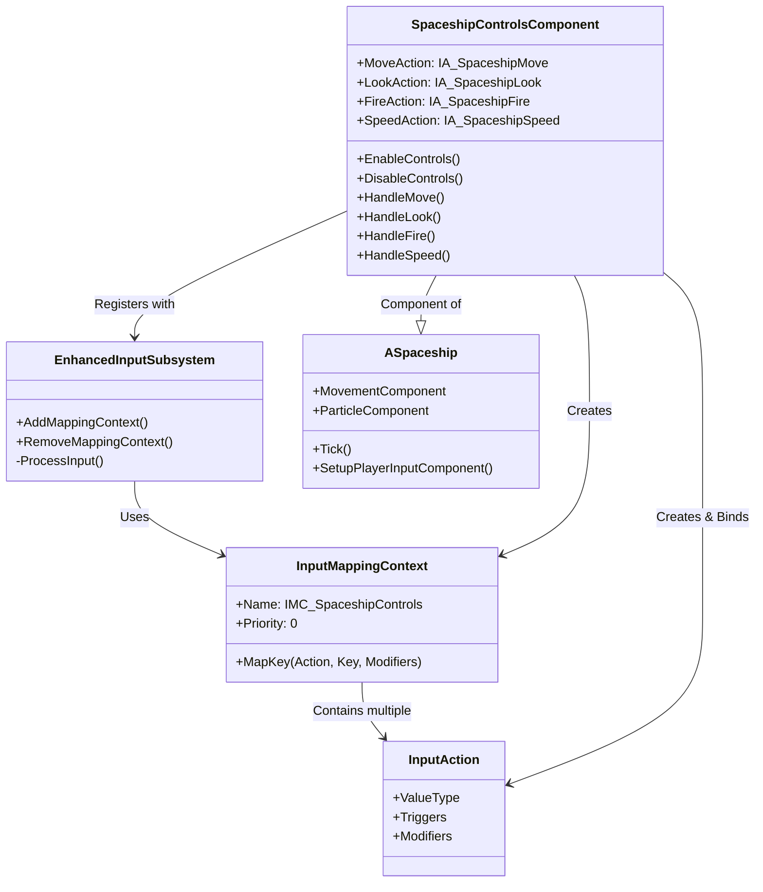

### Spaceship Component Hierarchy

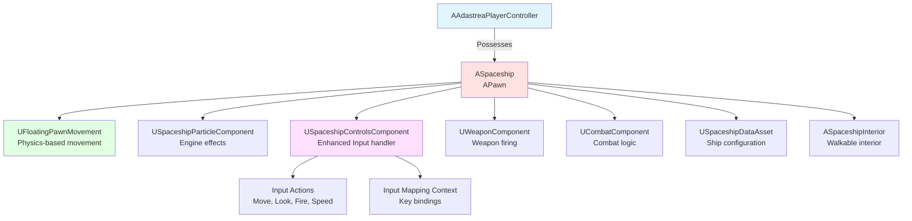

---

## Character System Diagrams

### Character Spawn and Initialization (Planned)

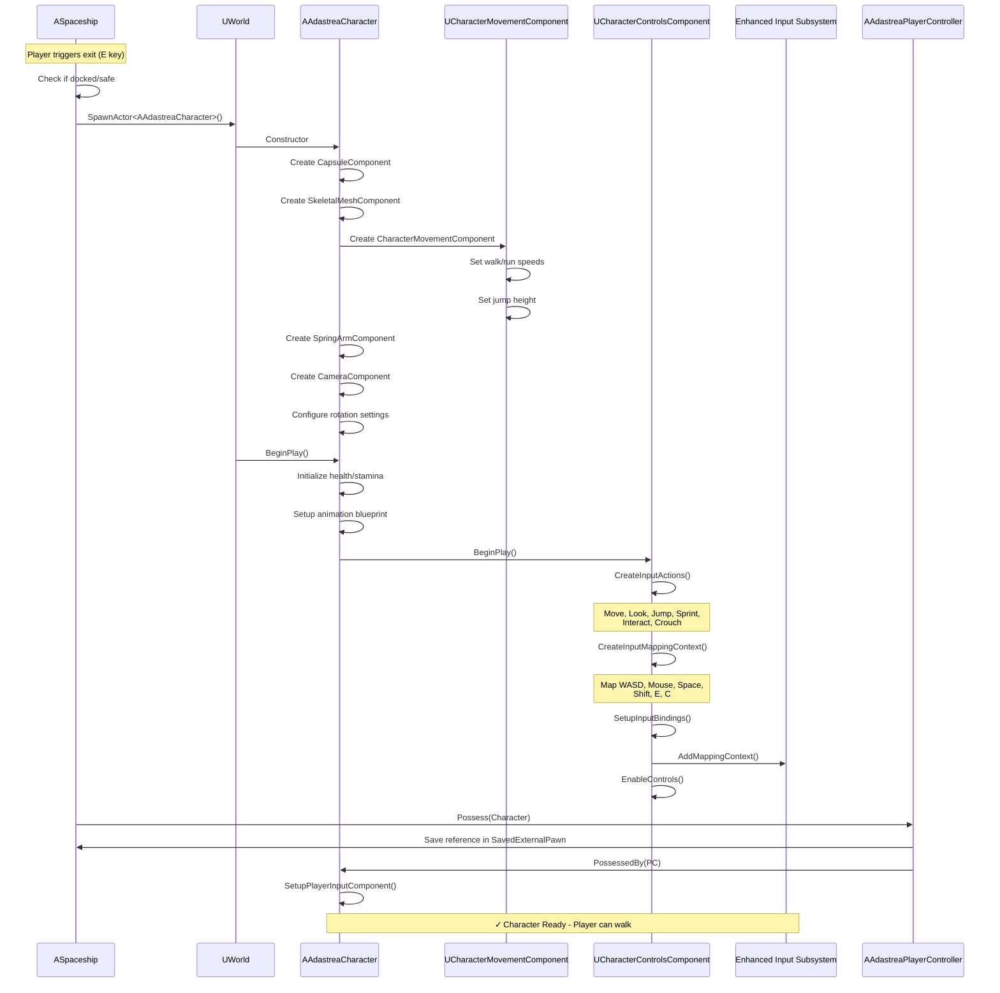

### Character Movement Input Flow (Planned)

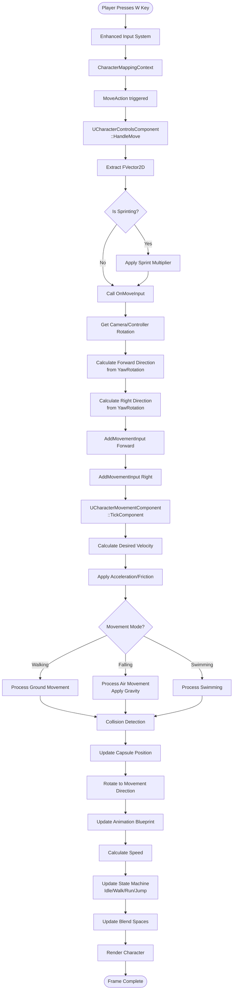

### Character Look and Camera Control (Planned)

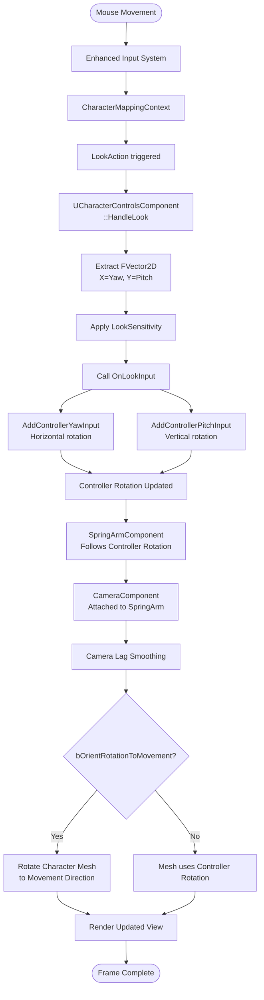

### Character Jump Mechanics (Planned)

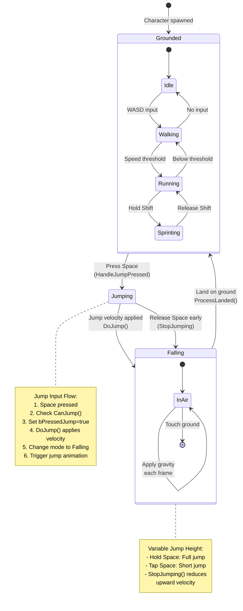

### Character Component Architecture (Planned)

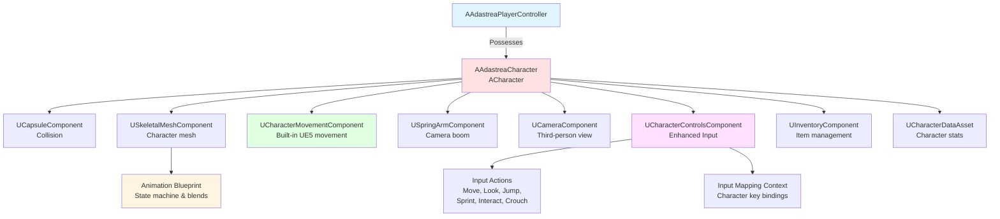

---

## Transition Diagrams

### Spaceship to Character Transition

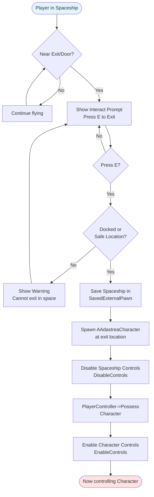

### Character to Spaceship Transition

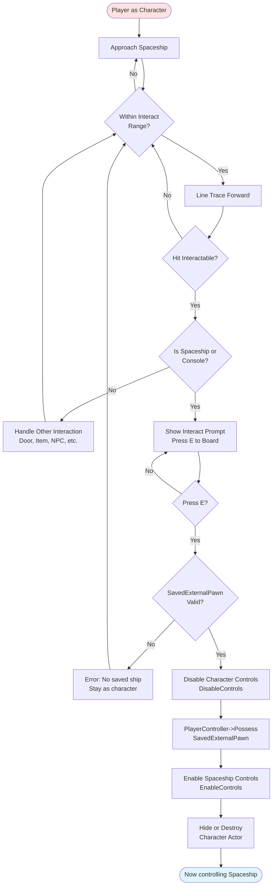

### Interior Console Control Transition

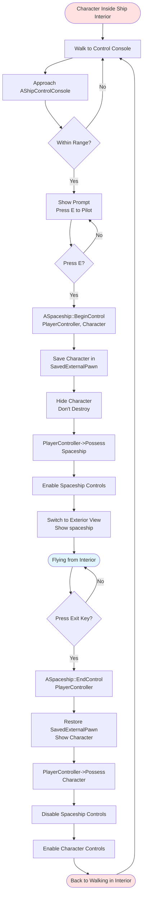

### Enhanced Input Context Priority Management

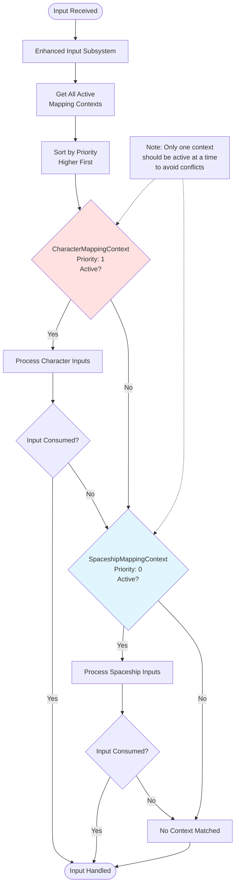

### State Machine: Player Control Modes

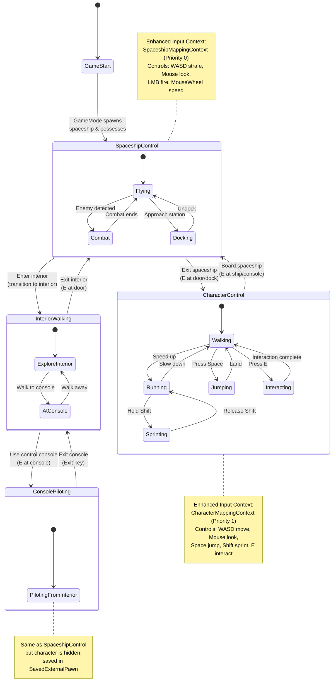

---

## Implementation Checklist

### Spaceship System (✓ Implemented)
- [x] AAdastreaPlayerController
- [x] ASpaceship with FloatingPawnMovement
- [x] USpaceshipControlsComponent
- [x] Enhanced Input Actions (Move, Look, Fire, Speed)
- [x] Input Mapping Context
- [x] Flight physics (flight assist, throttle, auto-level)
- [x] Weapon integration

### Character System (⚠️ Planned)
- [ ] AAdastreaCharacter (derived from ACharacter)
- [ ] UCharacterControlsComponent
- [ ] Enhanced Input Actions (Move, Look, Jump, Sprint, Interact, Crouch)
- [ ] Character Input Mapping Context
- [ ] Animation Blueprint setup
- [ ] Inventory system integration
- [ ] Interaction system (IInteractable interface)

### Transition System (⚠️ Partially Implemented)
- [x] SavedExternalPawn tracking in controller
- [x] ASpaceship::BeginControl / EndControl for interior console
- [ ] Character spawn on ship exit
- [ ] Character-to-ship boarding interaction
- [ ] Interior-to-exterior transition
- [ ] Seamless possession switching

---

## Testing Procedures

### Spaceship Controls Testing
1. Start game → Verify spaceship spawns
2. Press WASD → Verify strafe movement
3. Move mouse → Verify rotation
4. Press LMB → Verify weapon fires (if weapon component exists)
5. Scroll mouse wheel → Verify speed changes
6. Check flight assist → Enable/disable and test feel
7. Throttle controls → Test speed multipliers

### Character Controls Testing (When Implemented)
1. Exit spaceship → Verify character spawns at correct location
2. Press WASD → Verify forward/back/strafe movement
3. Move mouse → Verify camera rotation
4. Press Space → Verify jump
5. Hold Shift while moving → Verify sprint
6. Press E near object → Verify interaction
7. Press C → Verify crouch
8. Board spaceship → Verify return to spaceship control

### Transition Testing
1. Spaceship → Character → Verify smooth possession switch
2. Character → Spaceship → Verify saved ship restored
3. Interior console → Verify character hidden, ship control active
4. Exit console → Verify character restored, walking active
5. Multiple transitions → Verify no memory leaks or lost references

---

## Performance Profiling

### Key Metrics to Monitor

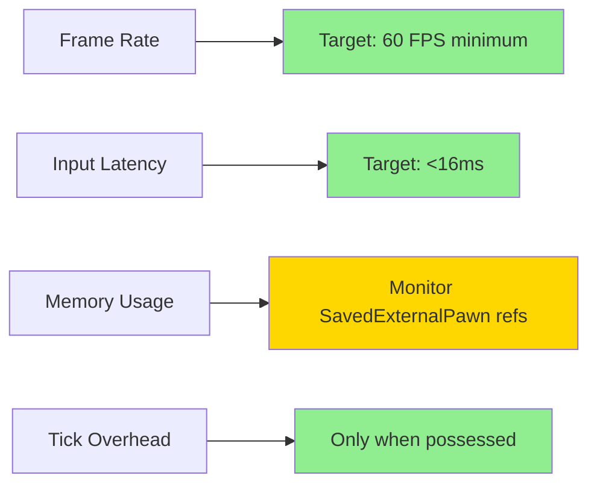

**Optimization Tips**:
- Spaceship Tick only runs when possessed (check GetController())
- Component caching reduces repeated FindComponent calls
- Input mapping contexts cleanly enable/disable
- Character movement uses built-in UE5 optimizations

---

**Document Version**: 1.0  
**Last Updated**: 2025-12-05  
**Status**: Spaceship diagrams complete, Character diagrams planned
