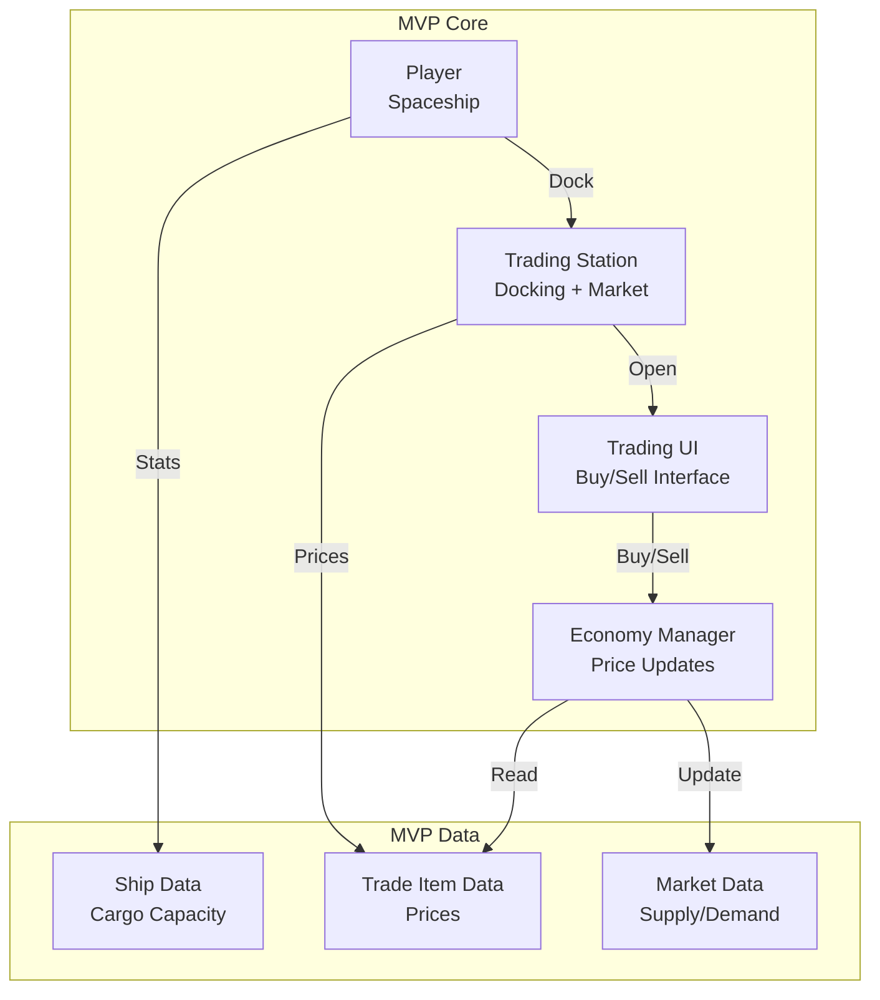
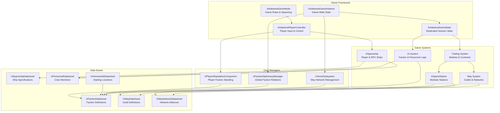

# Adastrea Architecture Overview

**Current Phase**: Trade Simulator MVP (Dec 2025 - Mar 2026)  
**Last Updated**: 2025-12-24

> **Important**: This document describes the full architecture vision. For current MVP development, see the [MVP Focus](#mvp-focus-trade-simulator) section below.

---

## 🎯 MVP Focus (Trade Simulator)

### Current Development Priority

Adastrea is currently focused on a **12-week Trade Simulator MVP** to validate core gameplay before expanding to the full vision described in this document.

**MVP Scope** (Dec 2025 - Mar 2026):
- ✅ **Active Systems**: Trading, Basic Flight, Stations (docking), Simple Economy, Save/Load
- ⚠️ **Simplified**: Faction (pricing only), Navigation (waypoints), Inventory (cargo only)
- 🚫 **Deferred**: Combat, Exploration, Quests, Personnel, AI (except economy), Full diplomacy

**See**: [MVP Documentation](docs/mvp/README.md) for detailed scope and [System Classification](docs/mvp/SYSTEM_CLASSIFICATION.md) for per-system status.

### MVP Architecture (Simplified)



**MVP Data Flow**:
1. Player flies to station (basic movement)
2. Player docks (trigger overlap)
3. Trading UI opens (market prices displayed)
4. Player buys/sells cargo (inventory management)
5. Economy updates prices (simple supply/demand)
6. Player upgrades ship (unlock larger cargo)
7. Repeat with better margins

**Validation Gates**:
- Week 4: 60% "had fun" rating OR PIVOT
- Week 12: 75% "had fun", 50% "would buy" → FUNDING READY

---

## Full Architecture Vision

The sections below describe the **complete vision** for Adastrea. These systems exist in code but are **deferred until post-MVP validation**.

This document provides a high-level overview of the Adastrea project architecture, code organization, and design patterns.

## Table of Contents

- [Player Character Architecture](#player-character-architecture)
- [Architecture Overview](#architecture-overview)
- [Project Structure](#project-structure)
- [Module Organization](#module-organization)
- [Design Patterns](#design-patterns)
- [Data Flow](#data-flow)
- [Blueprint Integration](#blueprint-integration)
- [Extension Points](#extension-points)

## Player Character Architecture

**Question: "Where is the player?"**

**MVP Answer**: Player IS the spaceship. No walking character needed.

**Post-MVP Answer**: Player can be EITHER spaceship OR walking character.

For comprehensive details on player architecture, see:
- **[Player Character Architecture](docs/development/PLAYER_CHARACTER_ARCHITECTURE.md)** - Complete design document

### MVP Player Flow (Current)

```
Player Controller → Possess Spaceship → Fly → Dock → Trading UI → Undock → Fly
```

**Key Points:**
- Player never leaves ship pawn
- All interactions via UI overlay
- No walking character exists
- Simplifies MVP scope

### Post-MVP Player Flow (Future)

```
Player Controller → [Spaceship OR Character] → Seamless Transitions
```

**Planned Features:**
- `AAdastreaCharacter` - Walking character class
- Ship ↔ Character possession switching
- Interior exploration
- Station walking gameplay
- NPC interactions

## Architecture Overview

The following diagram illustrates the high-level architecture and relationships between core game systems:



**Key Relationships:**
- **UAdastreaGameInstance** manages persistent state across level transitions and owns global managers (FactionDiplomacy, VerseSubsystem)
- **AAdastreaGameState** stores replicated session state, including active events, time progression, and market conditions
- **AAdastreaPlayerController** handles player input and manages the possessed Spaceship actor
- **AAdastreaGameMode** controls game rules, player spawning, and session lifecycle
- **Managers** coordinate cross-system functionality (diplomacy, reputation, Way networks)
- **Game Systems** implement core gameplay features (ships, stations, trading, AI, Ways)
- **Data Assets** provide designer-friendly configuration without C++ code

## Project Structure

```
Adastrea/
├── Assets/                      # Documentation and templates
│   ├── *Guide.md               # Comprehensive system guides
│   ├── *Templates.md           # Reference documentation
│   ├── *Workflow.md            # Designer workflows
│   ├── *SUMMARY.md             # Technical summaries
│   ├── FactionAITemplates/     # YAML templates for faction AI
│   ├── PersonnelAITemplates/   # YAML templates for personnel AI
│   ├── PersonnelTemplates/     # YAML templates for crew roles
│   ├── SpaceshipTemplates/     # YAML templates for ships
│   ├── TradingTemplates/       # YAML templates for trading
│   └── WayNetworkTemplates/    # YAML templates for Way networks
│
├── Blueprints/                  # Blueprint documentation
│   ├── HomeworldBlueprintTemplates.md
│   └── TradingSystemBlueprintGuide.md
│
├── Config/                      # Unreal Engine configuration files
│
├── Content/                     # Game content (UE assets)
│   ├── Blueprints/             # Blueprint classes
│   ├── Homeworlds/             # Homeworld assets
│   ├── Maps/                   # Level maps
│   ├── Planets/                # Planet assets
│   ├── SpaceStations/          # Station assets and modules
│   └── UI/                     # UI widgets and assets
│
└── Source/                      # C++ source code
    ├── Adastrea/               # Core game systems
        ├── AI/                 # AI logic classes
        ├── Characters/         # Character and personnel classes
        ├── Factions/           # Faction system
        ├── Materials/          # Material system
        ├── Planets/            # Planet classes
        ├── Player/             # Player-specific systems (includes Verse component)
        ├── Ships/              # Spaceship classes
        ├── Stations/           # Space station classes
        ├── Trading/            # Trading economy system
        ├── UI/                 # UI widgets and HUD
        └── Way/                # Way system (guilds and networks)
```

## Module Organization

### Core Module: `Adastrea`

The main game logic module, organized by feature:

#### AI System (`Source/Adastrea/AI/`)
- **NPCLogicBase**: Base class for all NPC AI behaviors
- **FactionLogic**: Strategic AI for faction-level decisions
- **PersonnelLogic**: Individual crew member AI with personality

**Key Features**:
- BlueprintNativeEvent pattern for easy extension
- 8 personality dispositions
- Peaceful early-game priorities
- Social relationship simulation

#### Characters System (`Source/Adastrea/Characters/`)
- **PersonnelDataAsset**: Complete crew member specification
  - 31 distinct roles
  - Skills, traits, relationships
  - Performance and status tracking
  - Command hierarchy

#### Faction System (`Source/Adastrea/Factions/`)
- **FactionDataAsset**: Large political/military organization definition and attributes
- **FFactionTrait**: Political and military gameplay modifiers
- **FFactionRelationship**: Inter-faction political diplomacy

**Focus**: Political diplomacy, warfare, military alliances

**Integration Points**:
- Space stations (political ownership and military protection)
- Trading (political access and embargoes; day-to-day trade via Way System)
- AI (faction-level political and military strategic decisions)
- Homeworlds (starting political relationships)

#### Way System (`Source/Adastrea/Way/`)
- **WayDataAsset**: Specialized guild definitions
  - Industry specialization (15 types)
  - Quality reputation tiers
  - Core Precepts (value system)
  - Supply chain relationships
  - Sector council participation
- **WayNetworkDataAsset**: Micro-alliance of 2-5 Ways
  - Member Ways with influence/commitment levels
  - Shared Precepts
  - Reputation spillover mechanics (20-70%)
  - Network alignment bonuses (1.5-3.0x)
  - Qualification thresholds
- **VerseSubsystem**: Global network management
  - Network registration and tracking
  - Reputation calculations
  - Network score aggregation
  - Feat recording with spillover
- **Verse Component**: Player reputation tracking
  - Way reputation storage
  - Completed Feats tracking
  - Verse score calculation

**Key Features**:
- Small focused guilds (50-1000 members)
- Value-driven alliances (Precepts)
- Reputation spillover between network members
- Economic supply chains
- Sector governance (non-political)

**Integration Points**:
- Trading (supply chains, network discounts)
- Factions (Ways belong to larger factions)
- Stations (Way ownership and operations)
- Quests (network-wide missions and rewards)
- Personnel (guild membership and careers)

#### Material System (`Source/Adastrea/Materials/`)
- **MaterialDataAsset**: Raw materials and refined goods
- Quality tiers and rarity
- Station construction integration

#### Player System (`Source/Adastrea/Player/`)
- **AdastreaPlayerController**: Player input handling and interaction
- **AdastreaGameInstance**: Game-wide persistent state management
- **AdastreaGameState**: Replicated session state for multiplayer
- **HomeworldDataAsset**: Starting location with faction relationships
- **PlayerReputationComponent**: Tracks player standing with factions
- Initial reputation system
- Starting experience customization

#### Ships System (`Source/Adastrea/Ships/`)
- **Spaceship**: Base ship actor with FloatingPawnMovement component
  - Supports 3D space flight movement
  - Configurable movement properties (speed, acceleration, turning)
  - Blueprint-accessible movement component
- **SpaceshipDataAsset**: Complete ship specifications
  - Core, Combat, Mobility stats
  - Utility, Operational, Advanced stats
  - Lore and flavor data
- **SpaceshipInterior**: Interior spaces (walkable, entry/exit points)
- **ShipControlConsole**: Interactive control console for piloting from interior
- **Component Placeholders**: Engines, weapons, organisms

**Design Philosophy**:
- Data-driven ship creation
- 6 pre-built templates
- Blueprint-callable rating functions
- Designer-friendly without C++ knowledge
- Full 3D movement capabilities for space flight
- Interior implementation: Separate level or embedded approach
- Control console system for boarding and piloting

#### Stations System (`Source/Adastrea/Stations/`)
- **SpaceStation**: Core station actor with module management
- **SpaceStationModule**: Base module class with type system
- Module groups for organization (Docking, Power, Storage, etc.)

**Key Functions**:
- Add/remove/move modules
- Faction integration
- Trait-based gameplay modifiers

#### Trading System (`Source/Adastrea/Trading/`)
- **TradeItemDataAsset**: Tradeable commodities
- **MarketDataAsset**: Trading hubs with dynamic pricing
- **TradeContractDataAsset**: Delivery missions
- **AITraderComponent**: Autonomous trading behavior
- **TradeTransaction**: Transaction workflow

**Features**:
- Supply/demand simulation
- Faction relationship pricing
- Contract quest system
- AI-driven markets

#### Combat System (`Source/Adastrea/Public/Combat/`)
- **WeaponComponent**: Weapon firing, ammunition, heat management
- **TargetingComponent**: Target acquisition, lock-on, lead calculation
- **CombatHealthComponent**: Hull integrity, shields, damage application
- **PointDefenseComponent**: Automated missile interception
- **BoardingComponent**: 5-phase boarding mechanics with crew combat
- **WeaponDataAsset**: 6 weapon types, 5 damage types

**Features**:
- Directional shields (4 facings)
- Armor penetration mechanics
- Multi-weapon coordination
- Threat assessment and prioritization

#### Navigation System (`Source/Adastrea/Public/Navigation/`)
- **NavigationComponent**: Autopilot, pathfinding, following behavior
- Multi-waypoint navigation with individual settings
- 3D pathfinding with obstacle avoidance
- Configurable speed, distance, and turn smoothing

#### Quest System (`Source/Adastrea/Public/Quest/`)
- **QuestDataAsset**: 10 quest types, 9 objective types
- **QuestManagerSubsystem**: Quest tracking, progress, events
- Quest chains with prerequisites
- Difficulty-scaled rewards (credits, reputation, items, XP)
- Procedural generation support

#### Enhanced Input System (`Source/Adastrea/Public/Input/`)
- **InputConfigDataAsset**: Centralized input action storage
- 30+ predefined input actions organized in categories
- Multiple mapping contexts (Spaceship, Menu)
- Validation functions for configuration

#### Audio System (`Source/Adastrea/Public/Audio/`)
- **AdastreaAudioComponent**: Sound effect playback with priorities
- **MusicManagerSubsystem**: Dynamic music with 8 moods
- **SoundEffectDataAsset**: 8 audio categories
- **MusicTrackDataAsset**: Mood-based music selection
- Spatial audio with attenuation
- Smooth crossfading between tracks

#### Performance System (`Source/Adastrea/Public/Performance/`)
- **PerformanceProfiler**: Runtime performance monitoring
- **LODManagerComponent**: Level-of-detail management
- Profiling tools for optimization
- Scalable architecture support

#### Tutorial System (`Source/Adastrea/Public/Tutorial/`)
- **TutorialStepDataAsset**: 6 tutorial step types
- **TutorialManagerSubsystem**: Progress tracking and saving
- Interactive tutorials with UI highlighting
- Wait for action/condition support
- Voiceover and animation support

#### Save System (`Source/Adastrea/Public/Player/`)
- **SaveGameSubsystem**: Complete save/load with multiple slots
- Auto-save functionality
- Save file metadata for UI display
- Version control and compatibility checking
- Player and world state serialization

#### UI System (`Source/Adastrea/UI/`)
- **AdastreaHUDWidget**: Complete heads-up display
- **InventoryWidget**: Item management interface
- **InventoryComponent**: Item storage with weight/volume limits
- **ShipCustomizationWidget**: Visual customization and loadouts
- **TradingInterfaceWidget**: Trading UI
- **StationManagementWidget**: Station management interface
- **SectorMapWidget**: Galactic navigation
- **Sector**: Spatial regions

#### Player Progression (`Source/Adastrea/Public/Player/`)
- **PlayerProgressionComponent**: Leveling and experience
- **ShipUpgradeComponent**: Ship upgrade trees
- **PlayerReputationComponent**: Faction reputation tracking
- **ShipUpgradeDataAsset**: Upgrade definitions
- Unlock systems for ships, modules, equipment
- Achievement framework (needs content)

#### Rivals/Antagonists (`Source/Adastrea/Rivals/`)
- **AntagonistManager**: Nemesis spawning and tracking
- **Antagonist**: Rival character actors
- Relationship tracking with player
- Dynamic rival generation

### StationEditor Module (`Source/StationEditor/`)

**Runtime module** providing in-game, player-facing space station editor features. This module contains all UI and gameplay systems for the station construction editor that players interact with during gameplay.

**Key Components:**
- **UStationEditorWidget** (`UI/StationEditorWidget.h/cpp`): Player-facing station construction UI
  - Blueprint-callable functions for adding/removing/moving station modules
  - Faction integration for technology-level restrictions
  - Validation hooks for module placement

**Module Type:** Runtime (available in both editor and packaged builds)

**Documentation:**
- Blueprint workflows: [Content/Blueprints/STATION_EDITOR_README.md](Content/Blueprints/STATION_EDITOR_README.md)
- Implementation templates: [Assets/BlueprintWorkflowTemplates.md](Assets/BlueprintWorkflowTemplates.md)

**Note:** The AdastreaEditor C++ module has been removed from the project. All player-facing station editing features are now in the StationEditor runtime module. However, the `AdastreaEditor.Target.cs` file remains necessary for building the project in Unreal Editor - this target file is separate from the module and tells Unreal Build Tool how to compile for editor mode. Future editor customizations can be added as a new module if needed.

## Design Patterns

### 1. Data Asset Pattern

**All game content uses Data Assets for configuration:**

```cpp
UCLASS(BlueprintType)
class ADASTREA_API UYourDataAsset : public UPrimaryDataAsset
{
    GENERATED_BODY()
    
    UPROPERTY(EditAnywhere, BlueprintReadOnly, Category="Config")
    float SomeValue;
};
```

**Benefits**:
- Designer-friendly (no C++ required)
- Easy to create variants
- Reusable across Blueprints
- Version control friendly (text-based)

### 2. BlueprintNativeEvent Pattern

**All AI and extensible systems use BlueprintNativeEvent:**

```cpp
UFUNCTION(BlueprintNativeEvent, Category="AI")
void MakeDecision();

// C++ implementation
void UYourClass::MakeDecision_Implementation()
{
    // Default C++ logic
}
```

**Benefits**:
- C++ performance by default
- Blueprint override when needed
- Call parent implementation option
- Best of both worlds

### 3. Trait System Pattern

**Reusable across Factions, Personnel, and other systems:**

```cpp
USTRUCT(BlueprintType)
struct FYourTrait
{
    UPROPERTY(EditAnywhere, BlueprintReadWrite)
    FName TraitID;
    
    UPROPERTY(EditAnywhere, BlueprintReadWrite)
    float ModifierValue;
};
```

**Benefits**:
- Flexible gameplay customization
- Stackable modifiers
- Easy to query and apply

### 4. Relationship System Pattern

**Used in Factions and Personnel:**

```cpp
USTRUCT(BlueprintType)
struct FRelationship
{
    UPROPERTY(EditAnywhere, BlueprintReadWrite)
    FName TargetID;
    
    UPROPERTY(EditAnywhere, BlueprintReadWrite, meta=(ClampMin="-100", ClampMax="100"))
    int32 RelationshipValue;
};
```

**Benefits**:
- Consistent diplomacy/social mechanics
- Simple -100 to +100 scale
- Easy to visualize and understand

## Data Flow

### Typical Game System Flow

```
1. Designer creates Data Asset
   ↓
2. Configure properties in Unreal Editor
   ↓
3. Reference Data Asset in Blueprint
   ↓
4. Blueprint calls C++ functions
   ↓
5. C++ processes and returns results
   ↓
6. Blueprint uses results for gameplay
```

### Example: Faction System Flow

```
FactionDataAsset (Created by Designer)
   ↓
SpaceStation references Faction
   ↓
Blueprint checks HasFactionTrait()
   ↓
C++ returns trait info
   ↓
Blueprint applies gameplay modifiers
```

## Blueprint Integration

### Best Practices

1. **All game content configuration is Blueprint-accessible**
   - Use `BlueprintReadOnly` for designer-set values
   - Use `BlueprintReadWrite` for runtime-modified values

2. **All gameplay functions are Blueprint-callable**
   - Mark with `UFUNCTION(BlueprintCallable)`
   - Add clear descriptions and parameter docs
   - Use appropriate categories

3. **Use proper metadata for better UX**
   ```cpp
   UPROPERTY(EditAnywhere, BlueprintReadWrite, Category="Stats",
             meta=(ClampMin="0", ClampMax="100", UIMin="0", UIMax="100"))
   float Health;
   ```

4. **Struct usage for complex data**
   - Group related properties in structs
   - Mark structs `BlueprintType`
   - Use in arrays for lists of items

### Blueprint-Friendly APIs

Every system provides:
- **Getters**: Pure functions for querying state
- **Setters**: Functions for modifying state
- **Queries**: Boolean checks (Has*, Is*, Can*)
- **Calculations**: Functions returning computed values

Example from SpaceshipDataAsset:
```cpp
UFUNCTION(BlueprintCallable, Category="Spaceship Stats")
float GetCombatRating() const;

UFUNCTION(BlueprintCallable, Category="Spaceship Stats")
bool IsSuitableForRole(const FString& Role) const;
```

## Extension Points

### For Designers (No C++)

1. **Create New Data Assets**
   - Use existing templates as reference
   - Configure all properties in editor
   - Test with Blueprint functions

2. **Override AI Behavior in Blueprints**
   - Create Blueprint based on UFactionLogic or UPersonnelLogic
   - Override BlueprintNativeEvents
   - Call parent implementation when needed

3. **Create Custom Modules**
   - Blueprint extends ASpaceStationModule
   - Set module type and properties
   - Integrate with station system

### For Programmers (C++)

1. **Add New Systems**
   - Follow Data Asset pattern
   - Expose all functionality to Blueprints
   - Create comprehensive documentation
   - Provide YAML templates

2. **Extend Existing Systems**
   - Use inheritance or composition
   - Add new traits or modifiers
   - Maintain backward compatibility

3. **Optimize Performance**
   - Profile before optimizing
   - Use parallel processing where applicable
   - Cache expensive calculations

## System Dependencies

```
Core Dependencies:
- Unreal Engine 5.6
- C++ Standard Library
- Unreal Core, Engine, EnhancedInput modules

System Interdependencies:
- Faction System ← Personnel, Stations, Trading, AI, Ways
- Ship System ← Personnel (crew), Trading (cargo), Combat, Navigation
- Station System ← Factions, Materials (construction), Trading
- Trading System ← Factions (relationships), Ships (cargo), Ways (supply chains)
- AI System ← Factions, Personnel (behavior)
- Personnel System ← Ships/Stations (assignments), AI
- Homeworld System ← Factions (relationships)
- Combat System ← Targeting, Weapons, Health components
- Navigation System ← Pathfinding, Waypoint management
- Quest System ← Objectives, Rewards, Faction reputation
- Way System ← Networks, Precepts, Verse reputation
- Audio System ← Music tracks, Sound effects
- Tutorial System ← Step definitions, Progress tracking
- Save System ← Player state, World state serialization
- Player Progression ← Reputation, Unlocks, Experience
```

## Performance Considerations

### Current Implementation
- Most systems are lightweight (Data Assets)
- No significant runtime overhead
- Blueprint-callable functions are fast

### Scalability Concerns
- **Many Entities**: Use object pooling for ships/stations
- **Frequent AI Updates**: Stagger updates across frames
- **Large Markets**: Cache price calculations
- **Complex Relationships**: Use spatial partitioning for queries

### Optimization Strategies
1. **LOD for distant stations/ships**
2. **Tick rate reduction for non-critical systems**
3. **Async loading for Data Assets**
4. **Instanced static meshes for station modules**

## Testing Strategy

### Manual Testing
- Editor play testing for immediate feedback
- Use example Data Assets to verify systems
- Blueprint integration testing

### Automated Testing (Future)
- Unit tests for C++ classes
- Blueprint test maps
- Performance benchmarks

## Documentation Maintenance

All systems follow this documentation structure:
1. **System Guide** (Assets/[System]Guide.md) - Complete overview
2. **Templates** (Assets/[System]Templates.md) - Reference examples
3. **Workflow** (Assets/[System]Workflow.md) - Step-by-step process
4. **Summary** (Assets/[System]_SUMMARY.md) - Technical overview
5. **YAML Templates** (Assets/[System]Templates/*.yaml) - Copy-paste configs

## Getting Help

- **For Designers**: See DesignerOnboarding.md in Assets/
- **For Programmers**: Review CONTRIBUTING.md and this document
- **For Quick Start**: Check individual system guides
- **For Examples**: See YAML templates and Blueprint guides

## Future Architecture Plans

### Completed in Phase 4 (November 2025) ✅
- ✅ **Save System**: Complete persistence with SaveGameSubsystem
- ✅ **Combat System**: Full weapons, targeting, damage mechanics
- ✅ **Navigation System**: Autopilot and 3D pathfinding
- ✅ **Quest System**: Mission tracking with 10 types
- ✅ **Audio System**: Dynamic music and sound effects
- ✅ **Tutorial System**: Interactive onboarding
- ✅ **Performance Tools**: Profiling and LOD management

### Planned Modules (Phase 5+)
- **Networking Module**: Multiplayer support (Q3-Q4 2026)
- **Exploration Module**: Galaxy and planet generation (Q2-Q3 2026)

### Planned Improvements
- Custom Unreal Editor tools (can be added as separate editor module if needed)
- Visual programming for AI behaviors
- Dynamic event system
- Modding API enhancements

---

Last Updated: 2025-11-15
Version: 1.0.0-alpha
