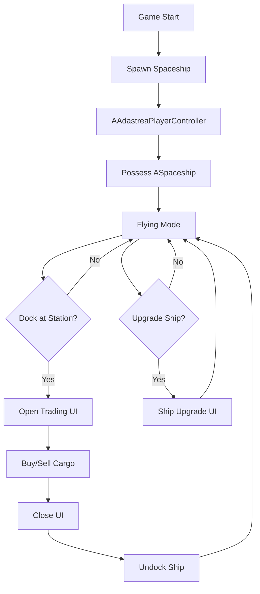
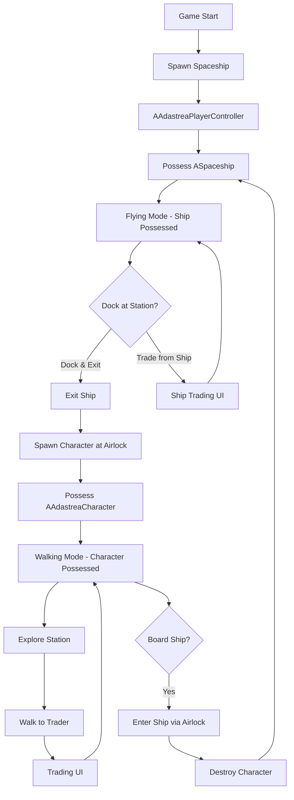

# Player Character Architecture

**Document Type**: Architectural Design  
**Status**: MVP Phase (Ship-Only) + Future Design  
**Last Updated**: 2026-01-08  
**Applies To**: Adastrea v1.0+ (Trade Simulator MVP and beyond)

---

## Executive Summary

This document answers the critical architectural question: **"Where is the player?"**

The answer depends on the development phase:

- **MVP (Current)**: Player IS the spaceship. No walking character needed.
- **Post-MVP (Future)**: Player can be EITHER spaceship OR walking character, with seamless transitions.

---

## 🎯 MVP Phase: Ship-Only Architecture (Current)

### Overview

For the **Trade Simulator MVP** (Dec 2025 - Mar 2026), the player architecture is **intentionally simplified**:

**Player = Spaceship Pawn Only**

There is **NO walking character** in the MVP. All gameplay happens from the ship's perspective.

### Why Ship-Only for MVP?

**MVP Focus**: Buy low, sell high, upgrade ship, repeat.

**Core Loop**:
```
Fly Ship → Dock at Station → Open Trading UI → Buy/Sell → Undock → Fly to Next Station
```

**Walking character is NOT needed because**:
- Trading happens via UI overlay (no need to walk to market)
- No interior exploration required
- No station walking gameplay
- Simplifies development (faster to MVP)
- Reduces scope (focus on trading mechanics)

### MVP Player Flow



### MVP Implementation

**Key Classes:**
- `AAdastreaPlayerController` - Manages player input, UI, and possessed pawn
- `ASpaceship` - The player's controlled pawn (APawn-derived)
- No character class needed

**Player Possession:**
```cpp
// At game start
ASpaceship* PlayerShip = World->SpawnActor<ASpaceship>(...);
PlayerController->Possess(PlayerShip);

// Player controls ship directly
// No character pawn exists
```

**Trading Interaction:**
```cpp
// When docked at station
PlayerController->OpenTrading(StationFaction);
// UI appears over ship view
// No character movement needed
```

### MVP Constraints

**✅ INCLUDED:**
- Ship flying controls
- Docking/undocking
- Trading UI (overlay)
- Cargo management (ship-based)
- Ship upgrades

**❌ EXCLUDED (Post-MVP):**
- Walking character
- Interior exploration
- Station walking
- First-person view
- Character-based interactions

---

## 🚀 Post-MVP: Dual-Pawn Architecture (Future)

### Overview

After MVP validation, we add a **walking character** for interior exploration and station gameplay.

**Player can be EITHER:**
1. Spaceship pawn (flying in space)
2. Character pawn (walking in stations/interiors)

### Post-MVP Player Flow



### Character Class Design (Future)

**New Class: AAdastreaCharacter**

```cpp
/**
 * Playable walking character for station and interior exploration
 * 
 * This character is spawned when the player exits their ship and destroyed
 * when they re-board. The player controller switches possession between
 * ship and character seamlessly.
 * 
 * @note POST-MVP: Not implemented in Trade Simulator MVP
 */
UCLASS()
class ADASTREA_API AAdastreaCharacter : public ACharacter
{
    GENERATED_BODY()

public:
    AAdastreaCharacter();

    // Movement
    UPROPERTY(EditAnywhere, BlueprintReadOnly, Category="Movement")
    float WalkSpeed = 300.0f;

    UPROPERTY(EditAnywhere, BlueprintReadOnly, Category="Movement")
    float RunSpeed = 600.0f;

    UPROPERTY(EditAnywhere, BlueprintReadOnly, Category="Movement")
    float JumpHeight = 450.0f;

    // Interaction
    UFUNCTION(BlueprintCallable, Category="Interaction")
    void InteractWithNearby();

    UFUNCTION(BlueprintCallable, Category="Interaction")
    AActor* GetNearestInteractable() const;

    // Inventory (if needed post-MVP)
    UPROPERTY(EditAnywhere, BlueprintReadWrite, Category="Inventory")
    class UInventoryComponent* Inventory;

protected:
    virtual void SetupPlayerInputComponent(class UInputComponent* PlayerInputComponent) override;

    // Character-specific input handlers
    void MoveForward(float Value);
    void MoveRight(float Value);
    void Jump();
    void Interact();
};
```

### Possession Switching (Post-MVP)

**Ship → Character Transition:**
```cpp
void AAdastreaPlayerController::ExitShip()
{
    ASpaceship* CurrentShip = Cast<ASpaceship>(GetPawn());
    if (!CurrentShip) return;

    // Save ship reference
    SavedShip = CurrentShip;

    // Spawn character at ship's exit point
    FVector ExitLocation = CurrentShip->GetExitLocation();
    AAdastreaCharacter* Character = World->SpawnActor<AAdastreaCharacter>(
        CharacterClass, ExitLocation, FRotator::ZeroRotator
    );

    // Switch possession
    Possess(Character);

    // Disable ship controls
    CurrentShip->DisableInput(this);
}
```

**Character → Ship Transition:**
```cpp
void AAdastreaPlayerController::BoardShip(ASpaceship* Ship)
{
    AAdastreaCharacter* CurrentCharacter = Cast<AAdastreaCharacter>(GetPawn());
    if (!CurrentCharacter || !Ship) return;

    // Possess ship
    Possess(Ship);

    // Destroy character
    CurrentCharacter->Destroy();

    // Enable ship controls
    Ship->EnableInput(this);
}
```

### Interior Exploration (Post-MVP)

**ASpaceshipInterior Usage:**

The existing `ASpaceshipInterior` class will be used for post-MVP interior exploration:

```cpp
// Ship has interior reference
UPROPERTY(EditAnywhere, BlueprintReadOnly, Category="Interior")
TWeakObjectPtr<ASpaceshipInterior> InteriorInstance;

// Character enters interior
void ASpaceship::EnterInterior(APlayerController* PC)
{
    if (!InteriorInstance.IsValid()) return;

    // Spawn character inside
    FVector EntryPoint = InteriorInstance->GetEntryLocation();
    AAdastreaCharacter* Character = World->SpawnActor<AAdastreaCharacter>(...);
    Character->SetActorLocation(EntryPoint);

    // Possess character
    PC->Possess(Character);
}
```

**Interior Control Console:**

The existing `AShipControlConsole` will enable piloting from interior:

```cpp
// Player walks to console inside interior
void AShipControlConsole::Interact(APlayerController* PC)
{
    // Save character pawn
    APawn* SavedPawn = PC->GetPawn();

    // Possess ship from interior
    OwningShip->BeginControl(PC, SavedPawn);
}
```

---

## 🔄 Input Context Switching

### MVP: Single Context

**Current Implementation:**
- Only `IMC_SpaceshipFlight` context is used
- All input is for ship controls
- No context switching needed

### Post-MVP: Dual Context

**Two Input Mapping Contexts:**

1. **IMC_SpaceshipFlight** - Active when controlling ship
   - Flight controls (pitch, yaw, roll)
   - Throttle controls
   - Docking
   - Ship-specific actions

2. **IMC_ThirdPerson** - Active when controlling character
   - WASD movement
   - Jump, crouch, sprint
   - Interaction (E key)
   - Character-specific actions

**Automatic Switching:**
```cpp
void AAdastreaPlayerController::OnPossess(APawn* InPawn)
{
    Super::OnPossess(InPawn);

    if (Cast<ASpaceship>(InPawn))
    {
        // Switch to ship controls
        SetInputContext(IMC_SpaceshipFlight);
    }
    else if (Cast<AAdastreaCharacter>(InPawn))
    {
        // Switch to character controls
        SetInputContext(IMC_ThirdPerson);
    }
}
```

---

## 📐 Integration Points

### Existing Systems

**Already Implemented (Ready for Post-MVP):**
- `ASpaceshipInterior` - Defines interior spaces with entry/exit points
- `AShipControlConsole` - Allows piloting from interior
- `AAdastreaPlayerController` - Input context switching infrastructure
- `BeginControl/EndControl` - Possession save/restore logic

**Needs Implementation (Post-MVP):**
- `AAdastreaCharacter` - Walking character class
- Character spawn/destroy logic
- Airlock interaction triggers
- Station walkable areas
- NPC traders for station interactions

### Data Flow

**MVP Data Flow:**
```
Input → PlayerController → Spaceship → Movement/Actions
```

**Post-MVP Data Flow:**
```
Input → PlayerController → [Spaceship OR Character] → Movement/Actions
                ↓
          Context Switch
```

---

## 🎮 Gameplay Scenarios

### MVP Scenario: Trade Run

```
1. Player starts in ship
2. Fly to Station A
3. Dock at Station A (trigger overlap)
4. Trading UI opens automatically
5. Buy cargo
6. Close UI
7. Undock
8. Fly to Station B
9. Dock at Station B
10. Trading UI opens
11. Sell cargo
12. Profit displayed
```

**Player never leaves ship pawn.**

### Post-MVP Scenario: Station Exploration

```
1. Player flies ship to station
2. Dock at station
3. Press "Exit Ship" key
4. Character spawns at airlock
5. Player possesses character
6. Walk through station
7. Explore shops, NPCs
8. Walk to trader NPC
9. Interact to open trading UI
10. Complete trade
11. Walk back to ship
12. Interact with airlock
13. Character destroyed
14. Player possesses ship
15. Undock and fly away
```

**Player switches between ship and character pawns.**

---

## 🛠️ Implementation Roadmap

### MVP Phase (Current - Week 1-12)

- [x] Spaceship flight controls
- [x] PlayerController ship possession
- [ ] Docking UI triggers
- [ ] Trading UI (ship-based)
- [ ] Cargo management
- [ ] Ship upgrades

### Post-MVP Phase 1 (After MVP validation)

- [ ] Create `AAdastreaCharacter` class
- [ ] Implement character movement
- [ ] Add character input handling
- [ ] Create spawn/destroy logic
- [ ] Add possession switching
- [ ] Test ship ↔ character transitions

### Post-MVP Phase 2 (Interior Exploration)

- [ ] Activate `ASpaceshipInterior` functionality
- [ ] Create walkable ship interiors
- [ ] Add `AShipControlConsole` interactions
- [ ] Implement interior-to-ship control
- [ ] Add interior props and details

### Post-MVP Phase 3 (Station Gameplay)

- [ ] Create station walkable areas
- [ ] Add NPC traders
- [ ] Implement interaction system
- [ ] Add station facilities
- [ ] Create social gameplay

---

## 🚨 Common Pitfalls & Solutions

### Pitfall 1: Building Character Too Early

**Mistake**: Implementing walking character before MVP validation.

**Solution**: Follow MVP scope strictly. Character adds complexity without validating core trading fun.

### Pitfall 2: Overcomplicating Possession

**Mistake**: Complex possession state machines before needed.

**Solution**: MVP = simple possession of ship only. Add complexity post-MVP.

### Pitfall 3: Assuming Interior Exploration is Critical

**Mistake**: Thinking players need to walk to traders.

**Solution**: MVP proves trading UI is enough. Interior exploration is nice-to-have, not must-have.

### Pitfall 4: Not Planning for Future

**Mistake**: Building MVP without integration points for character.

**Solution**: Use existing `ASpaceshipInterior` and `AShipControlConsole` as integration points.

---

## 📚 Reference Documentation

### MVP-Related Docs
- `.github/instructions/trade-simulator-mvp.instructions.md` - MVP scope and priorities
- `.github/instructions/anti-patterns.instructions.md` - Lessons learned

### Character System Docs (Future)
- `Assets/ShipControlGuide.md` - Interior control console system
- `Assets/SpaceshipInteriorGuide.md` - Interior implementation guide
- `Docs/PLAYER_CONTROLS_DIAGRAMS.md` - Control flow diagrams
- `Docs/PLAYER_CONTROLS_WORKFLOW.md` - Detailed workflows

### Technical Implementation
- `Source/Adastrea/Public/Player/AdastreaPlayerController.h` - Player controller
- `Source/Adastrea/Public/Ships/Spaceship.h` - Ship pawn class
- `Source/Adastrea/Public/Ships/SpaceshipInterior.h` - Interior class (future use)
- `Source/Adastrea/Public/Ships/ShipControlConsole.h` - Console class (future use)

---

## 🎯 Key Takeaways

### For MVP (Now)

1. **Player = Ship pawn only**
2. **No walking character needed**
3. **Trading via UI overlay**
4. **Keep it simple**

### For Post-MVP (Later)

1. **Add `AAdastreaCharacter` class**
2. **Implement possession switching**
3. **Activate interior exploration**
4. **Use existing integration points**

### Architectural Principles

1. **Start Simple**: Ship-only MVP validates core gameplay
2. **Plan for Growth**: Integration points ready for character
3. **Validate First**: Prove trading is fun before adding complexity
4. **Seamless Transitions**: When character added, possession switching should be smooth

---

## ✅ Decision Matrix

### When to Add Walking Character?

**Add Character If:**
- ✅ MVP achieved 75% "fun" rating
- ✅ Trading core loop proven enjoyable
- ✅ Market validation successful
- ✅ Funding secured or close
- ✅ 2-3 months of runway available

**Don't Add Character If:**
- ❌ MVP not validated yet
- ❌ Trading loop needs iteration
- ❌ Under 2 months of development time
- ❌ Core mechanics still being tuned

---

## 🔗 Summary

**The Answer to "Where is the Player?"**

**MVP**: Player IS the spaceship. That's it.

**Post-MVP**: Player can be EITHER ship OR character, with seamless transitions between the two.

**Current Status**: MVP phase - ship-only architecture implemented and working.

**Future Status**: Post-MVP - dual-pawn architecture designed and ready for implementation.

---

**End of Document**
