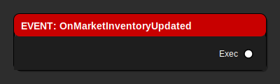
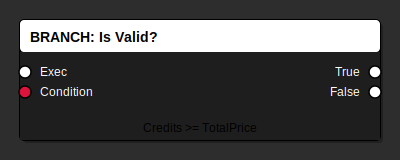

# Blueprint Fundamentals - Your First Steps

> **A complete beginner's guide to understanding Blueprints in Unreal Engine**

**Last Updated**: January 17, 2026  
**Target Audience**: Complete beginners with no Blueprint experience  
**Time to Complete**: 45-60 minutes  
**Engine**: Unreal Engine 5.6

---

## 🎯 What You'll Learn

By the end of this guide, you will:
- ✅ Understand what Blueprints are and why they're powerful
- ✅ Know the basic Blueprint node types and what they do
- ✅ Create your first simple Blueprint
- ✅ Connect nodes to create game logic
- ✅ Test and debug your Blueprint
- ✅ Read and understand Blueprint documentation

---

## 📚 Table of Contents

1. [What Are Blueprints?](#what-are-blueprints)
2. [Understanding the Blueprint Editor](#understanding-the-blueprint-editor)
3. [Core Concepts](#core-concepts)
4. [Node Types Explained](#node-types-explained)
5. [Your First Blueprint](#your-first-blueprint)
6. [Common Patterns](#common-patterns)
7. [Debugging Tips](#debugging-tips)
8. [Next Steps](#next-steps)

---

## What Are Blueprints?

### The Simple Explanation

Think of Blueprints as **visual programming**. Instead of writing text code like this:

```cpp
if (Health > 0) {
    Player.Move(Direction);
} else {
    Player.Die();
}
```

You connect visual boxes (called **nodes**) like building blocks:

```
[Check Health] → [Is Health > 0?]
                    ├─ True → [Move Player]
                    └─ False → [Die]
```

### Why Blueprints?

**Advantages:**
- 🎨 **Visual** - See your logic flow
- 🚀 **Fast** - No compilation waiting
- 🔄 **Iterate quickly** - Change and test immediately
- 👁️ **Easy to debug** - See values flow through nodes
- 🎓 **Beginner friendly** - No syntax to memorize

**When to Use Blueprints:**
- ✅ Game logic (player actions, AI behavior)
- ✅ UI (menus, HUD displays)
- ✅ Level scripting (doors, triggers, events)
- ✅ Prototyping (test ideas quickly)
- ✅ Content creation (ships, stations, items)

**When NOT to Use Blueprints:**
- ❌ Math-heavy calculations (use C++)
- ❌ Performance-critical systems (use C++)
- ❌ Core engine features (use C++)

---

## Understanding the Blueprint Editor

### Opening a Blueprint

1. **Find a Blueprint** in the Content Browser (bottom panel)
2. **Double-click** to open the Blueprint Editor
3. The **Blueprint Editor** opens with several panels

### The Blueprint Editor Layout

```
┌─────────────────────────────────────────────────────┐
│ Toolbar (Compile, Save, Play)                       │
├──────────────┬──────────────────────────────────────┤
│              │                                       │
│ Components   │  Event Graph (Main Work Area)        │
│ (Left Panel) │  - This is where you connect nodes   │
│              │  - Drag nodes from right panel       │
│ Variables    │  - Connect them with wires           │
│ Functions    │                                       │
│ Graphs       │                                       │
│              │                                       │
├──────────────┴──────────────────────────────────────┤
│ Details Panel (Bottom)                               │
│ - Shows properties of selected node/component       │
└──────────────────────────────────────────────────────┘
```

### Key Panels Explained

| Panel | What It Does | When You Use It |
|-------|--------------|-----------------|
| **Components** | Visual parts of your Blueprint (mesh, camera, collision) | Adding physical components to your actor |
| **Variables** | Store values (health, speed, name) | Need to remember information |
| **Functions** | Reusable chunks of logic | Same logic used multiple times |
| **Event Graph** | Main workspace where you build logic | 90% of your time here |
| **Details Panel** | Properties of selected item | Configuring settings |

---

## Core Concepts

### 1. Nodes

**Nodes** are the building blocks. Each node does ONE thing.

**Example Nodes:**
- `Print String` - Shows text on screen
- `Add` - Adds two numbers
- `Get Actor Location` - Gets object's position
- `Branch` - Makes a decision (if/else)

### 2. Pins

**Pins** are the connection points on nodes.

**Types of Pins:**

**Execution Pins (White):**
- ➡️ Flow of logic (what happens next)
- White triangles
- Connect left-to-right
- Think: "Do this, THEN do that"

**Data Pins (Colored):**
- 📊 Pass information between nodes
- Different colors for different types
- Connect right-to-left (input ← output)
- Think: "Use this value here"

**Common Data Pin Colors:**
- 🔴 **Red** - Boolean (true/false)
- 🟢 **Green** - Integer (whole numbers: 1, 2, 100)
- 🟢 **Light Green** - Float (decimals: 1.5, 3.14)
- 🔵 **Blue** - Object (references to things)
- 🟡 **Yellow** - Vector (3D position)
- 🟣 **Purple** - String (text)
- 🟠 **Orange** - Struct (groups of data)

### 3. Execution Flow

Blueprint logic flows from **left to right** through white execution pins.

```
[Event Begin Play] ──→ [Print "Hello"] ──→ [Wait 2 Sec] ──→ [Print "Goodbye"]
```

**What happens:**
1. Game starts
2. Print "Hello" appears
3. Wait 2 seconds
4. Print "Goodbye" appears

### 4. Variables

**Variables** store information you need to remember.

**Examples:**
- `PlayerHealth` = 100
- `PlayerName` = "Commander"
- `IsAlive` = true
- `CurrentSpeed` = 250.5

**Variable Types:**

| Type | What It Stores | Example |
|------|----------------|---------|
| **Boolean** | True or False | IsAlive = true |
| **Integer** | Whole numbers | PlayerHealth = 100 |
| **Float** | Decimal numbers | PlayerSpeed = 250.5 |
| **String** | Text | PlayerName = "Commander" |
| **Object Reference** | Points to another object | CurrentShip = BP_Ship |

---

## Node Types Explained

### Event Nodes (Red)



**What They Do:** Starting points for your logic

**Common Events:**
- `Event BeginPlay` - Runs when game starts
- `Event Tick` - Runs every frame (60 times per second!)
- `Event OnClicked` - Runs when UI button clicked
- Custom Events - You create these

**When to Use:**
- ✅ When game starts (BeginPlay)
- ✅ When button clicked (OnClicked)
- ✅ When collision happens (OnOverlap)

**Example:**
```
Event BeginPlay → Print "Game Started!"
```

### Function Nodes (Blue)


**What They Do:** Perform actions or calculations

**Common Functions:**
- `Print String` - Show text on screen (debugging)
- `Get Actor Location` - Get object's position
- `Set Actor Location` - Move object to position
- `Spawn Actor` - Create new object

**When to Use:**
- ✅ Need to perform an action
- ✅ Need to get or set a value
- ✅ Need to call C++ functionality

**Example:**
```
Event BeginPlay → Get Actor Location → Print String (show position)
```

### Branch Nodes (White)



**What They Do:** Make decisions (if/else)

**How It Works:**
1. Input: Condition (true/false)
2. Output: Two execution paths
   - ✅ **True** path - Runs if condition is true
   - ❌ **False** path - Runs if condition is false

**When to Use:**
- ✅ Check if player has enough money
- ✅ Check if health is above zero
- ✅ Check if button was clicked

**Example:**
```
Get Credits → Greater Than (100) → Branch
                                      ├─ True → Buy Item
                                      └─ False → Show Error Message
```

### Flow Control Nodes (Orange)


**What They Do:** Control how logic executes

**Common Flow Controls:**
- `ForLoop` - Repeat N times
- `ForEachLoop` - Repeat for each item in array
- `WhileLoop` - Repeat while condition true
- `Sequence` - Do multiple things in order
- `Delay` - Wait before continuing

**When to Use:**
- ✅ Process all items in a list
- ✅ Repeat an action multiple times
- ✅ Wait before doing something

**Example:**
```
Event BeginPlay → ForEachLoop (All Players)
                    └─ Loop Body → Print Player Name
```

---

## Your First Blueprint

### Exercise 1: "Hello World" Blueprint

**Goal:** Create a Blueprint that prints "Hello World!" when the game starts.

**Step-by-Step:**

1. **Create the Blueprint**
   - Right-click in Content Browser
   - Blueprint Class → Actor
   - Name it: `BP_HelloWorld`
   - Double-click to open

2. **Add the Logic**
   - You'll see an **Event BeginPlay** node already there
   - Right-click in empty space
   - Search for "Print String"
   - Click to create the node

3. **Connect the Nodes**
   - Drag from Event BeginPlay's white pin ➡️
   - Drop on Print String's white pin
   - Click the text field in Print String
   - Type: "Hello World!"

4. **Test It**
   - Click **Compile** button (top toolbar)
   - Click **Save** button
   - Drag `BP_HelloWorld` into the level
   - Click **Play** button
   - You should see "Hello World!" in the top-left corner!

**Your First Blueprint:**
```
[Event BeginPlay] ──→ [Print String: "Hello World!"]
```

**🎉 Congratulations!** You've created your first Blueprint!

---

## Common Patterns

### Pattern 1: Initialize on Start

**Use Case:** Set up initial values when game starts

```
Event BeginPlay
  ├─→ Set PlayerHealth = 100
  ├─→ Set PlayerCredits = 1000
  └─→ Print "Game Initialized"
```

### Pattern 2: Check Before Action

**Use Case:** Verify conditions before doing something

```
Event OnBuyButtonClicked
  → Get PlayerCredits
    → Greater Than (Item Price)
      → Branch
        ├─ True → Buy Item → Subtract Credits → Update UI
        └─ False → Show Error Message
```

### Pattern 3: Process List of Items

**Use Case:** Do something for each item in a collection

```
Event OnMarketUpdate
  → Get All Items in Market
    → ForEachLoop
      └─ Loop Body
        → Get Item Price
          → Update Display
```

---

## Debugging Tips

### Tip 1: Use Print String Liberally

**Problem:** Don't know if your code is running?

**Solution:** Add Print String nodes everywhere!

```
Event BeginPlay ──→ Print "Started!"
  ↓
Get Health ──→ Print Health Value
  ↓
Branch ──→ Print "Checking Health..."
  ├─ True ──→ Print "True Path"
  └─ False ──→ Print "False Path"
```

**Color Code Your Prints:**
- 🔵 Blue = Informational
- 🟡 Yellow = Warning
- 🔴 Red = Error

### Tip 2: Compile Often

**Problem:** Blueprint not working?

**Solution:** Click Compile after every change!

**Look for:**
- ⚠️ Yellow warnings (might be problems)
- ❌ Red errors (definitely problems)
- ✅ Green = All good!

---

## Common Mistakes

### Mistake 1: Forgetting to Connect Execution Pins

❌ **Wrong:**
```
Event BeginPlay     [Print String]
(Not connected!)
```

✅ **Correct:**
```
Event BeginPlay ──→ [Print String]
```

**Result:** Nothing happens because execution doesn't flow!

### Mistake 2: Using Event Tick for Everything

❌ **Wrong:**
```
Event Tick (runs 60 times per second!)
  → Check if button clicked
  → Update UI
  → Check inventory
```

✅ **Correct:**
```
Event OnButtonClicked → Check button
Event OnInventoryChanged → Update UI
```

**Result:** Terrible performance! Use specific events instead.

---

## Next Steps

### Recommended Learning Path

**You've Completed: Fundamentals** ✅

**Next Up:**

1. **Trading System Tutorial** (60 min)
   - [Trading UI Guide](../../Blueprints/TradingSystemBlueprintGuide_SIMPLIFIED.md)
   - Build a real game feature

2. **Ship Blueprint** (90 min)
   - [Trading Ship Guide](../../Blueprints/BP_TradingShip_GUIDE.md)
   - Create a flyable spaceship

3. **Advanced Topics**
   - Functions and custom events
   - Blueprint communication
   - Performance optimization

### Additional Resources

**In This Repository:**
- [Blueprint Guide for Beginners](../development/BLUEPRINT_GUIDE_FOR_BEGINNERS.md) - Comprehensive guide
- [Blueprint Quick Reference](../reference/BLUEPRINT_QUICK_REFERENCE.md) - Node reference
- [Blueprint Image Guide](../reference/BLUEPRINT_IMAGE_GUIDE.md) - Visual patterns

---

## Summary

### What You Learned Today

✅ **Blueprints** are visual programming  
✅ **Nodes** are building blocks that do one thing  
✅ **Pins** connect nodes (white = execution, colored = data)  
✅ **Execution flows** left to right through white pins  
✅ **Events** start logic execution  
✅ **Functions** perform actions  
✅ **Branches** make decisions  

### Key Principles

1. **One node = One action** - Keep it simple
2. **Left to right** - Execution flow direction
3. **Print everything** - Debug by printing values
4. **Compile often** - Catch errors early
5. **Start simple** - Build up complexity gradually

**Keep practicing, and don't be afraid to experiment!**

---

**Questions?** Check the [Blueprint Quick Reference](../reference/BLUEPRINT_QUICK_REFERENCE.md) or ask in the community!

**Ready for more?** Try the [Trading System Blueprint Guide](../../Blueprints/TradingSystemBlueprintGuide_SIMPLIFIED.md)!
