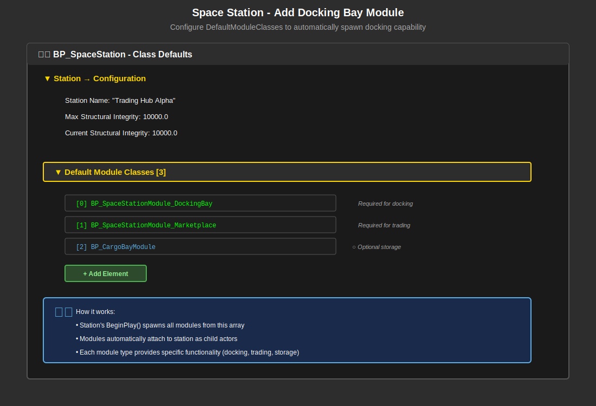
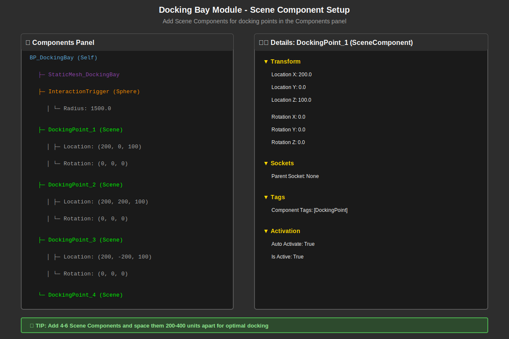
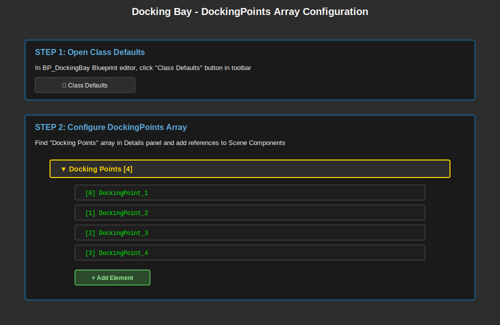

# Trading and Docking System - Complete Guide

**Last Updated**: 2026-01-18  
**Version**: 1.1  
**Status**: Unified Reference Guide (Enhanced with Visual Docking Setup)

> **⭐ This is the UNIFIED guide** for all trading and docking functionality in Adastrea. All previous separate guides have been consolidated here.

---

## 📋 Table of Contents

### Part 1: Overview & Architecture
1. [System Overview](#system-overview)
2. [Quick Start](#quick-start)
3. [Architecture](#architecture)
4. [Prerequisites](#prerequisites)

### Part 2: Trading System
5. [Trading Core Concepts](#trading-core-concepts)
6. [Market Data Assets](#market-data-assets)
7. [Trade Items](#trade-items)
8. [Marketplace Modules](#marketplace-modules)
9. [Trading UI](#trading-ui)
10. [Economy Manager](#economy-manager)
11. [Cargo System](#cargo-system)

### Part 3: Docking System
12. [Docking Core Concepts](#docking-core-concepts)
13. [Docking Setup](#docking-setup)
    - [Visual Docking Setup Guide](#-visual-docking-setup-guide) **NEW** 📸
    - [Part 1: Add Docking Bay to Space Station](#part-1-add-docking-bay-to-space-station)
    - [Part 2: Configure Docking Bay Components](#part-2-configure-docking-bay-components)
    - [Part 3: Link Scene Components to DockingPoints Array](#part-3-link-scene-components-to-dockingpoints-array)
    - [Part 4: Configure Docking Point Properties](#part-4-configure-docking-point-properties-scene-components)
14. [Docking Interaction](#docking-interaction)
15. [Docking UI](#docking-ui)
16. [Docking Points](#docking-points)

### Part 4: Implementation Guides
17. [Creating a Trading Station](#creating-a-trading-station)
18. [Setting Up Player Ship](#setting-up-player-ship)
19. [Implementing Docking Flow](#implementing-docking-flow)
20. [Building Trading UI](#building-trading-ui)

### Part 5: Integration & Testing
21. [Complete Trading Loop](#complete-trading-loop)
22. [Testing Checklist](#testing-checklist)
23. [Common Issues](#common-issues)
24. [Troubleshooting](#troubleshooting)

### Part 6: Advanced Topics
25. [AI Traders](#ai-traders)
26. [Dynamic Pricing](#dynamic-pricing)
27. [Trade Contracts](#trade-contracts)
28. [Market Events](#market-events)

### Part 7: Reference
29. [C++ API Reference](#c-api-reference)
30. [Blueprint Nodes Reference](#blueprint-nodes-reference)
31. [Data Asset Templates](#data-asset-templates)
32. [Related Documentation](#related-documentation)

---

## Part 1: Overview & Architecture

### System Overview

The Adastrea Trading and Docking System provides a complete economic simulation framework for the MVP trading gameplay loop:

**Core Experience**:
```
Dock at Station A → View Market → Buy Cargo (low price) →
Undock → Fly to Station B → Dock → Sell Cargo (high price) →
Calculate Profit → Upgrade Ship → Repeat
```

**Key Features**:
- ✅ **Modular Station Architecture**: Trading via marketplace modules attached to stations
- ✅ **Dynamic Markets**: Supply/demand-based pricing with market data assets
- ✅ **Blueprint-Friendly**: Full C++ exposure for designers
- ✅ **Docking System**: Automatic approach, docking, and undocking with C++ core logic
- ✅ **Cargo Management**: Inventory system with space limits
- ✅ **Economy Simulation**: Price fluctuations, stock levels, market events

**Target Audience**:
- Designers creating trading stations and markets
- Programmers implementing trading logic
- Blueprint creators building UI and interactions

---

### Quick Start

**For Designers (No C++ Required)**:

1. **Create a Market Data Asset**:
   - Content Browser → Right-Click → Data Asset → MarketDataAsset
   - Name: `DA_Market_YourStation`
   - Configure inventory, prices, and markup/markdown

2. **Configure Station with Marketplace**:
   - Open `BP_SpaceStation` in Blueprint editor
   - In **Components** panel, click **+ Add**
   - Add **Child Actor Component**, rename to "DockingBay"
     - Set Child Actor Class: `BP_SpaceStationModule_DockingBay`
   - Add another **Child Actor Component**, rename to "Marketplace"
     - Set Child Actor Class: `BP_SpaceStationModule_Marketplace`
   - Open `BP_SpaceStationModule_Marketplace` Class Defaults
   - Assign your MarketDataAsset

3. **Test**:
   - Drag station into level
   - Press Play
   - Fly close and press F to dock
   - Trading UI opens automatically

**For Programmers (C++ Implementation)**:

```cpp
// Check if station has trading capability
if (Station->HasMarketplace())
{
    AMarketplaceModule* Marketplace = Station->GetMarketplaceModule();
    if (Marketplace->IsAvailableForTrading())
    {
        UMarketDataAsset* MarketData = Marketplace->GetMarketData();
        // Open trading UI with market data
    }
}
```

---

### Architecture

#### Modular Station System

Trading in Adastrea uses a **modular station architecture**:

```
ASpaceStation (Base Station Actor)
├─ ADockingBayModule (Required for docking)
├─ AMarketplaceModule (Required for trading)
│   └─ UMarketDataAsset (Market configuration)
└─ ACargoBayModule (Optional storage)
```

**Key Components**:

1. **ASpaceStation** - Main station actor
   - Modules can be added via Child Actor Components (design-time) OR `DefaultModuleClasses` array (runtime)
   - Automatically discovers editor-placed modules in BeginPlay
   - Provides query functions: `HasMarketplace()`, `GetMarketplaceModule()`
   - Manages power, integrity, and module lifecycle

2. **AMarketplaceModule** - Trading facility
   - Attached to station as child actor
   - References `UMarketDataAsset` for inventory/pricing
   - Can be opened/closed (`bIsOpen` property)
   - Multiple marketplaces per station supported

3. **UMarketDataAsset** - Market configuration
   - Defines what items are sold/bought
   - Sets pricing rules (markup/markdown)
   - Manages stock levels, supply/demand
   - Reusable across multiple stations

4. **UTradeItemDataAsset** - Item definition
   - Base price, cargo volume, volatility
   - Category, rarity, description
   - Legal status, faction restrictions

#### Docking System Architecture

Docking has been **refactored to C++** for reliability:

```
ASpaceship (Player Ship)
├─ Docking Logic (C++ in ASpaceship class)
│   ├─ DetectNearbyStations()
│   ├─ RequestDocking()
│   ├─ PerformDockingSequence()
│   └─ Undock()
├─ UCargoComponent (Inventory)
└─ UPlayerTraderComponent (Trading operations)

ASpaceStation
└─ ADockingBayModule (Docking points)
    └─ DockingPoints (USceneComponent array)
```

**Docking Flow**:
1. Player flies within 2000 units of station
2. UI shows "Press F to Dock at [Station Name]"
3. Player presses F → `RequestDocking()` called
4. C++ finds nearest docking point
5. Ship smoothly moves to docking point (3-second curve)
6. Trading UI opens automatically
7. Player trades → Presses "Undock" button
8. Ship smoothly moves away from station

---

### Prerequisites

**Required for Trading**:
- [ ] Unreal Engine 5.6+
- [ ] Adastrea project compiled (C++ classes)
- [ ] At least one `UMarketDataAsset` created
- [ ] At least one `UTradeItemDataAsset` created
- [ ] `BP_SpaceStation` with marketplace module
- [ ] `WBP_TradingUI` widget created

**Required for Docking**:
- [ ] `BP_PlayerShip` with docking configured
- [ ] Input Action `IA_Dock` bound to F key
- [ ] `WBP_DockingPrompt` widget created
- [ ] Station with `ADockingBayModule`
- [ ] Docking curve asset (float curve 0→1, 3 seconds)

**Optional but Recommended**:
- [ ] `UEconomyManager` for dynamic pricing
- [ ] Multiple markets for price comparison
- [ ] `UCargoComponent` for inventory management
- [ ] Trading tutorial UI

---

## Part 2: Trading System

### Trading Core Concepts

**Buy Low, Sell High**:
The core gameplay loop is simple economic arbitrage:
- Find a station with cheap goods (producers)
- Buy goods with available credits
- Fly to station that needs those goods (importers)
- Sell for profit
- Use profits to upgrade cargo capacity

**Market Types**:
```cpp
enum class EMarketType : uint8
{
    OpenMarket,          // General trading (MVP default)
    BlackMarket,         // Illegal goods (post-MVP)
    CommodityExchange,   // Bulk trading (post-MVP)
    LuxuryBazaar,        // High-end goods (post-MVP)
    IndustrialDepot,     // Manufacturing supplies (post-MVP)
    ResearchHub,         // Tech and medicine (post-MVP)
    // ... more types
};
```

**For MVP**: Use `OpenMarket` type exclusively. Advanced types are post-MVP features.

**Market Sizes**:
```cpp
enum class EMarketSize : uint8
{
    Small,    // Outpost (limited stock)
    Medium,   // Standard station
    Large,    // Major hub
    Megacity, // Massive exchange (post-MVP)
    Capital   // Planetary market (post-MVP)
};
```

**Pricing Formula**:
```
Player Buy Price = BasePrice × SellPriceMarkup × SupplyFactor × EventMultiplier
Player Sell Price = BasePrice × BuyPriceMarkdown × DemandFactor × EventMultiplier

Supply Factor = 1.0 + (Demand - Supply) / 100
```

**Example**:
```
Water (DA_Item_Water):
- Base Price: 10 credits
- Cargo Volume: 1 unit

Agricultural Station (produces water):
- Sell Markup: 1.1 (player pays 11 credits to buy)
- Buy Markdown: 0.9 (player gets 9 credits when selling)
- Supply: 2.0 (abundant) → Price slightly lower

Industrial Station (needs water):
- Sell Markup: 1.3 (player pays 13 credits to buy)
- Buy Markdown: 0.7 (player gets 7 credits when selling)
- Demand: 2.0 (high need) → Markdown offset by demand

Profit: Buy at 11 (Ag), sell at 10 (Industrial with demand factor) = -1 credit
Better route: Buy at 9 from player selling to Ag, sell to Industrial for 14
Actual profit: 5 credits per unit
```

---

### Market Data Assets

Market Data Assets (`UMarketDataAsset`) define the configuration for each marketplace.

#### Creating a Market Data Asset

**In Editor**:
1. Content Browser → Right-Click
2. Data Asset → MarketDataAsset
3. Name: `DA_Market_[StationType]` (e.g., `DA_Market_Agricultural`)

**Properties to Configure**:

```cpp
// Basic Info
Market Name: "Farming Collective Market"
Market Type: Open Market
Market Size: Medium

// Pricing Configuration
Sell Price Markup: 1.1    // Player pays 10% more when buying
Buy Price Markdown: 0.9    // Player gets 10% less when selling
Transaction Tax Rate: 0.05 // 5% tax on all transactions

// Trading Permissions
Allow Player Buying: true
Allow Player Selling: true
Allow AI Traders: true

// Inventory (add items)
Inventory:
  [0] Trade Item: DA_Item_Water
      Current Stock: 10000
      Max Stock: 50000
      Supply Level: 2.0 (abundant - station produces)
      Demand Level: 0.5 (low need)
      
  [1] Trade Item: DA_Item_Food
      Current Stock: 5000
      Max Stock: 20000
      Supply Level: 1.5 (good supply)
      Demand Level: 0.8 (moderate demand)
      
  [2] Trade Item: DA_Item_Electronics
      Current Stock: 100
      Max Stock: 500
      Supply Level: 0.2 (scarce)
      Demand Level: 2.0 (high demand - needs imports)

// Market Events (optional, post-MVP)
Active Events: (empty for MVP)
Random Event Chance: 0.0

// AI Configuration (optional, post-MVP)
AI Trader Count: 0
AI Trade Frequency: 0
```

#### Market Data Asset API

**Blueprint-Callable Functions**:

```cpp
// Get price for an item
UFUNCTION(BlueprintCallable, BlueprintPure)
float GetItemPrice(UTradeItemDataAsset* TradeItem, bool bIsBuying) const;

// Check stock availability
UFUNCTION(BlueprintCallable, BlueprintPure)
bool IsItemInStock(FName ItemID, int32 Quantity) const;

// Get inventory entry
UFUNCTION(BlueprintCallable, BlueprintPure)
bool GetInventoryEntry(FName ItemID, FMarketInventoryEntry& OutEntry) const;

// Filter by category
UFUNCTION(BlueprintCallable)
TArray<FMarketInventoryEntry> GetItemsByCategory(ETradeItemCategory Category) const;

// Market events (post-MVP)
UFUNCTION(BlueprintCallable)
TArray<FMarketEvent> GetActiveEventsForItem(FName ItemID) const;
```

**Usage Example (Blueprint)**:
```
Get Market Data Asset (from marketplace module)
    ↓
For Each: Inventory Entry
    ↓
    Get Item Price (TradeItem, bIsBuying=True)
    ↓
    Add to UI List
```

---

### Trade Items

Trade Items (`UTradeItemDataAsset`) define individual goods that can be bought/sold.

#### Creating a Trade Item

**In Editor**:
1. Content Browser → Right-Click
2. Data Asset → TradeItemDataAsset
3. Name: `DA_Item_[ItemName]` (e.g., `DA_Item_Water`)

**Properties**:

```cpp
// Basic Info
Item Name: "Water"
Description: "Purified water essential for life support systems"
Item ID: "water" (unique identifier)

// Economic Properties
Base Price: 10.0 (credits per unit)
Cargo Volume: 1 (units of space)
Volatility: 0.3 (price fluctuation factor, 0.0-1.0)

// Classification
Category: BasicGoods
Rarity: Common
Legal Status: Legal

// Gameplay
Icon: T_Icon_Water (texture)
3D Model: SM_Cargo_Water (static mesh, optional)
```

**Trade Item Categories**:
```cpp
enum class ETradeItemCategory : uint8
{
    BasicGoods,    // Food, water, fuel
    Luxury,        // Art, entertainment, rare foods
    Industrial,    // Metals, components, machinery
    Medical,       // Medicine, equipment
    Technology,    // Electronics, software, computers
    Illegal,       // Contraband (post-MVP)
    Specialty      // Mission-specific items
};
```

**MVP Item Set** (Recommended):

| Category | Items | Base Prices |
|----------|-------|-------------|
| Basic Goods | Water (10), Food (25), Fuel (50) | Low volatility |
| Luxury | Fine Wine (200), Art (1000), Entertainment (500) | High volatility |
| Industrial | Metals (100), Components (250), Machinery (500) | Medium volatility |
| Medical | Medicine (300), Med Equipment (800) | Low volatility |
| Technology | Electronics (500), Software (1000), AI Cores (5000) | High volatility |

**Total**: 15-20 items recommended for MVP.

---

### Marketplace Modules

Marketplace Modules (`AMarketplaceModule`) are the physical trading facilities attached to stations.

#### Architecture

```cpp
class AMarketplaceModule : public ASpaceStationModule
{
    // Market configuration
    UPROPERTY(EditAnywhere, BlueprintReadWrite)
    UMarketDataAsset* MarketDataAsset;
    
    // Trading availability
    UPROPERTY(EditAnywhere, BlueprintReadWrite)
    bool bIsOpen;
    
    // Display name
    UPROPERTY(EditAnywhere, BlueprintReadWrite)
    FText MarketplaceName;
    
    // Module properties (inherited)
    // ModuleType = "Marketplace"
    // ModulePower = 40.0f (consumption)
    // ModuleGroup = Public
};
```

#### Adding Marketplace to Station

**Add as Child Actor Component:**

1. Open `BP_SpaceStation` (or your station Blueprint)
2. Switch to the **Components** panel
3. Click **+ Add** button
4. Search for and add **Child Actor Component**
5. Rename it to "Marketplace"
6. In Details panel, set:
   - **Child Actor Class**: `BP_SpaceStationModule_Marketplace`
7. Position the component in the viewport as needed
8. Compile and save

9. Open `BP_SpaceStationModule_Marketplace` Class Defaults
10. Set properties:
    ```
    Market Data Asset: DA_Market_YourStation
    Is Open: true
    Marketplace Name: "Central Market"
    ```
11. Compile and save

**What Happens**:
- Module is visible in editor viewport at design-time
- Station automatically discovers and registers module in `BeginPlay()`
- Marketplace becomes accessible for trading
- You can see marketplace information in the station Blueprint using `GetOpenMarketplaceCount()` and related functions

#### Querying Marketplace

**Check if Station Has Trading**:

```cpp
// C++ approach
if (Station->HasMarketplace())
{
    // Station has at least one marketplace
}

// Blueprint approach
Branch: Station → Has Marketplace?
├─ True → Continue
└─ False → Show "No Trading Available"
```

**Get Marketplace Module**:

```cpp
// Get first marketplace
AMarketplaceModule* Marketplace = Station->GetMarketplaceModule();

// Get all marketplaces (if multiple)
TArray<AMarketplaceModule*> Markets = Station->GetMarketplaceModules();

// Check availability
if (Marketplace && Marketplace->IsAvailableForTrading())
{
    // Open trading UI
}
```

**Complete Trading Check (Blueprint)**:

```
Event: Player Requests Trade
    ↓
Get Docked Station Reference
    ↓
Branch: Has Marketplace?
    ├─ False → Show UI: "No Marketplace"
    │
    └─ True:
        ↓
        Get Marketplace Module
        ↓
        Branch: Is Available For Trading?
        ├─ False → Show UI: "Market Closed"
        │   (bIsOpen = false or MarketDataAsset = null)
        │
        └─ True:
            ↓
            Get Market Data
            ↓
            Open Widget: WBP_TradingUI
            ↓
            Initialize UI with Market Data
```

---

### Trading UI

The Trading UI provides the player interface for buying and selling items when docked at stations.

#### Overview

Trading UI consists of two main widget classes:
- **WBP_TradingUI** - Main trading interface (extends `UTradingInterfaceWidget` in C++)
- **WBP_TradeItemRow** - Individual item display row (reusable sub-widget)

#### Widget Structure

```
WBP_TradingUI (Main Widget)
├── Background Panel
├── Header
│   ├── Market Name (Text)
│   └── Close Button
├── Left Panel (Market Info)
│   ├── Buy/Sell Toggle
│   ├── Category Filter (Optional)
│   └── Item List (Scroll Box)
│       └── WBP_TradeItemRow (repeated)
├── Right Panel (Player Info & Cart)
│   ├── Player Stats Panel
│   │   ├── Credits Display
│   │   ├── Cargo Space Bar
│   │   └── Profit Display
│   ├── Shopping Cart Panel
│   │   ├── Cart Items List
│   │   └── Cart Total
│   └── Transaction Button Panel
│       ├── Trade Button
│       └── Clear Cart Button
└── Status/Error Message (Text)
```

#### C++ Integration

The `UTradingInterfaceWidget` C++ class provides:
- `OpenMarket(UMarketDataAsset*)` - Initialize trading with a market
- `GetAvailableItems()` - Get market inventory
- `AddToCart(Item, Quantity)` - Add items to cart
- `ExecuteTrade()` - Complete transaction
- Blueprint Events for UI updates

**Key Blueprint Events:**
- `OnMarketInventoryUpdated` - Rebuild item list
- `OnCartUpdated` - Update cart display
- `OnCreditsUpdated` - Update credits text
- `OnCargoSpaceUpdated` - Update cargo bar
- `OnTradeCompleted` - Show result (success/error)

#### Creating the Trading UI

**Step 1: Create WBP_TradingUI**
1. Content Browser → User Interface → Widget Blueprint
2. Set Parent Class to `TradingInterfaceWidget`
3. Design the layout in the Designer tab

**Step 2: Implement Blueprint Logic**

Key event implementations:

```
Event: OnMarketInventoryUpdated (C++ Event)
├── Clear ItemListScrollBox children
├── Get Available Items (C++)
├── For Each Item:
│   ├── Create WBP_TradeItemRow
│   ├── Set ItemData = Current Item
│   ├── Set bIsBuyMode = bShowBuyView
│   └── Add to ItemListScrollBox
└── Update item count text

Event: OnCartUpdated (C++ Event)
├── Clear CartScrollBox children
├── For Each item in ShoppingCart (C++):
│   ├── Create simple text widget
│   ├── Format: "[Quantity]x [ItemName] - [Price] credits"
│   └── Add to CartScrollBox
├── Get Cart Total (C++)
└── Update total display text

Button: Complete Trade
OnClicked
├── Validate Transaction (C++)
├── If valid:
│   ├── Call ExecuteTrade() (C++)
│   └── [C++ handles rest via events]
└── Else:
    └── Show validation error message
```

**Step 3: Create WBP_TradeItemRow**
1. Create Widget Blueprint: `WBP_TradeItemRow`
2. Parent class: `UserWidget`
3. Design row layout:
   ```
   Horizontal Box
   ├── Image: Item Icon (64x64)
   ├── Vertical Box: Item Info
   │   ├── Text Block: Item Name (Bold)
   │   ├── Text: Description (Small)
   │   └── Text: Stock Level
   ├── Spacer
   ├── Vertical Box: Price Info
   │   ├── Text: "Price"
   │   └── Text Block: Price Value (Large)
   └── Horizontal Box: Actions
       ├── Button: "-" (Decrease)
       ├── EditableTextBox: Quantity
       ├── Button: "+" (Increase)
       └── Button: "Add to Cart"
   ```

#### Property Bindings

**Credits Display:**
```
Function: GetCreditsText
├── Get Player Credits (C++)
├── Format as text: "1,234,567 CR"
└── Return formatted text
```

**Cargo Progress Bar:**
```
Function: GetCargoFillPercent
├── Get Cargo Space Info (C++)
├── Calculate: UsedSpace / TotalSpace
└── Return as float (0.0 to 1.0)
```

**Trade Button Enabled:**
```
Function: CanExecuteTrade
├── Call ValidateTransaction(ErrorMessage) (C++)
└── Return boolean result
```

#### Styling Guidelines (MVP)

**Colors:**
- Background: `#1A1A1A` (Dark Gray)
- Primary: `#00FF00` (Green - Buy/Success)
- Secondary: `#FF4444` (Red - Sell/Error)
- Text: `#FFFFFF` (White)
- Disabled: `#666666` (Gray)

**Fonts:**
- Header: Bold, 24pt
- Body: Regular, 14pt
- Small: Regular, 12pt
- Price/Credits: Bold, 18pt

**Spacing:**
- Panel Padding: 20px
- Element Spacing: 10px
- Button Padding: 15px horizontal, 10px vertical

---

## Part 3: Docking System

### Docking Core Concepts

**Docking in Adastrea uses a C++-driven approach** for reliability and consistency. The docking logic has been refactored from Blueprint to C++ in the `ASpaceship` class.

**Key Components:**
- **Player Ship (ASpaceship)** - C++ docking logic with smooth movement
- **Docking Bay Module** - Provides docking points and manages slots
- **Docking UI** - Shows "Press F to Dock" prompts

**Docking Flow:**
1. Player flies within 2000 units of station
2. UI shows "Press F to Dock at [Station Name]"
3. Player presses F → `RequestDocking()` called (C++)
4. C++ finds nearest available docking point
5. Ship smoothly moves to docking point (3-second curve)
6. Trading UI opens automatically
7. Player trades → Presses "Undock" button
8. Ship smoothly moves away from station

**C++ vs Blueprint:**
- ✅ Core docking logic in C++ (reliable, tested)
- ✅ UI and input binding in Blueprint (flexible)
- ✅ Configuration via Class Defaults (designer-friendly)

---

### Docking Setup

> **📸 This section includes visual diagrams** to make docking setup crystal clear. Follow the step-by-step visual guides below.

#### Prerequisites

**Required:**
- [ ] `BP_PlayerShip` with docking configured
- [ ] Input Action `IA_Dock` bound to F key
- [ ] `WBP_DockingPrompt` widget created
- [ ] Station with `ADockingBayModule`
- [ ] Docking curve asset (float curve 0→1, 3 seconds)

---

### 🎯 Visual Docking Setup Guide

This comprehensive guide walks you through setting up docking with **visual diagrams** showing exactly what to configure.

---

#### Part 1: Add Docking Bay to Space Station

**Goal**: Configure your space station to have docking capability.



> **💡 Recommended Method: Child Actor Components**
> 
> Add modules directly in the Components panel for visual, design-time editing.
> See Part 4: "Creating a Trading Station" for detailed step-by-step instructions.

**Quick Setup:**

1. **Open Your Station Blueprint**
   - Navigate to `Content/Blueprints/Stations/`
   - Open `BP_SpaceStation` (or your custom station Blueprint)

2. **Add Docking Bay as Child Actor Component**
   - Go to **Components** panel
   - Click **+ Add** → **Child Actor Component**
   - Rename to "DockingBay"
   - Set **Child Actor Class**: `BP_SpaceStationModule_DockingBay`
   - Position in viewport

3. **Configure Basic Station Properties**
   - Click **Class Defaults** button
   - In Details panel, set:
     - **Station Name**: "Your Station Name"
     - **Max Structural Integrity**: 10000.0
     - **Current Structural Integrity**: 10000.0

4. **Compile and Save**
   - Click the "Compile" button in the toolbar
   - Click "Save" to persist your changes

**What Happens**:
- Docking bay module is visible in editor viewport
- Station automatically discovers module in BeginPlay()
- You can see docking information using `GetTotalDockingPoints()` function

---

#### Part 2: Configure Docking Bay Components

**Goal**: Add Scene Components to define where ships can dock.



**Step-by-Step Instructions**:

1. **Open Docking Bay Blueprint**
   - Navigate to `Content/Blueprints/Stations/Modules/`
   - Open `BP_SpaceStationModule_DockingBay`

2. **Switch to Components Panel**
   - In the Blueprint editor, ensure the "Components" tab is visible (usually on the left)
   - This shows the hierarchy of all components in the Blueprint

3. **Add Scene Components for Docking Points**
   
   For each docking point (recommended: 4-6 points):
   
   a. **Add New Scene Component**:
      - Click the "+ Add" button in Components panel
      - Search for "Scene Component"
      - Select it to add a new Scene Component
   
   b. **Rename the Component**:
      - Right-click the new component
      - Select "Rename"
      - Name it: `DockingPoint_1` (then `_2`, `_3`, etc.)
   
   c. **Configure Transform** (in Details panel):
      - **Location**: Position where ship should dock
        - DockingPoint_1: X=200, Y=0, Z=100
        - DockingPoint_2: X=200, Y=200, Z=100
        - DockingPoint_3: X=200, Y=-200, Z=100
        - DockingPoint_4: X=400, Y=0, Z=100
      - **Rotation**: Usually (0, 0, 0) for standard orientation
      - **Scale**: (1, 1, 1) - don't change this
   
   d. **Add Component Tag** (optional but recommended):
      - In Details panel, find "Tags → Component Tags"
      - Add tag: `DockingPoint`
      - This helps identify docking points programmatically

4. **Add Interaction Trigger (Sphere Component)**
   
   This sphere detects when ships enter docking range:
   
   a. **Add Sphere Component**:
      - Click "+ Add" button
      - Search for "Sphere Component"
      - Add it to the hierarchy
   
   b. **Rename**: `InteractionTrigger`
   
   c. **Configure Collision**:
      - **Sphere Radius**: 1500.0 (detection range in units)
      - **Collision Preset**: "Overlap All Dynamic"
      - **Generate Overlap Events**: ✓ Enabled
   
   d. **Visual Settings**:
      - **Hidden in Game**: ✓ Enabled (invisible during gameplay)
      - **Visible**: ✓ Enabled in editor for debugging

5. **Visual Layout Tips**
   - Space docking points **200-400 units apart**
   - Ensure **clear approach paths** (no collision geometry blocking)
   - Consider **visual symmetry** for aesthetic appeal
   - Use editor viewport to verify positions look correct

6. **Component Hierarchy Should Look Like**:
   ```
   BP_DockingBay (Self)
   ├─ StaticMesh_DockingBay
   ├─ InteractionTrigger (Sphere)
   ├─ DockingPoint_1 (Scene)
   ├─ DockingPoint_2 (Scene)
   ├─ DockingPoint_3 (Scene)
   └─ DockingPoint_4 (Scene)
   ```

7. **Compile and Save**

---

#### Part 3: Link Scene Components to DockingPoints Array

**Goal**: Tell the docking system which Scene Components to use as docking points.



**Step-by-Step Instructions**:

1. **Stay in BP_DockingBay Blueprint**
   - If you closed it, reopen `BP_SpaceStationModule_DockingBay`

2. **Open Class Defaults**
   - Click the "Class Defaults" button in the toolbar
   - Details panel shows default property values

3. **Find DockingPoints Array**
   - In Details panel, search for "Docking Points"
   - You should see: `▼ Docking Points [0]` (empty array)

4. **Add Scene Component References**
   
   For each docking point Scene Component you created:
   
   a. **Click "+ Add Element" Button**
      - This creates a new array slot
   
   b. **Select the Scene Component**:
      - Click the dropdown for the new array element
      - You'll see a list of all Scene Components in the Blueprint
      - Select `DockingPoint_1` (or whichever you're adding)
   
   c. **Repeat for All Docking Points**:
      - Add element → Select DockingPoint_2
      - Add element → Select DockingPoint_3
      - Add element → Select DockingPoint_4
      - Continue for all your docking points

5. **Final Array Should Look Like**:
   ```
   ▼ Docking Points [4]
      [0] DockingPoint_1
      [1] DockingPoint_2
      [2] DockingPoint_3
      [3] DockingPoint_4
   ```

6. **Configure Additional Properties**:
   - **Max Docked Ships**: Should equal number of docking points (e.g., 4)
   - **Module Power**: 50.0 (power consumption)
   - **Module Type**: "Docking Bay" (should be set automatically)

7. **Compile and Save**

**⚠️ Common Mistake**: Forgetting to populate the DockingPoints array! The C++ code iterates this array to find available docking spots. If it's empty, ships can't dock.

---

#### Part 4: Configure Docking Point Properties (Scene Components)

**What You Can Configure**: Each Scene Component in the Components panel has properties you can adjust.

**Components You Can Add to the Scene**:

| Component Type | Purpose | Key Properties |
|----------------|---------|----------------|
| **Scene Component** | Docking point marker (no visual) | Location, Rotation |
| **Static Mesh Component** | Visual docking arm/marker | Mesh, Material, Location |
| **Point Light Component** | Docking indicator light | Color, Intensity, Radius |
| **Particle System Component** | Docking FX (sparks, etc.) | Template, Auto Activate |
| **Audio Component** | Docking sound | Sound, Auto Activate |
| **Arrow Component** | Direction indicator (editor only) | Arrow Color, Arrow Size |
| **Billboard Component** | Icon in editor | Sprite, Scale |

**Example: Adding Visual Feedback**

1. **Add Static Mesh for Docking Arm**:
   - Add Component → Static Mesh Component
   - Name: `DockingArm_1`
   - Attach to: `DockingPoint_1`
   - Set Mesh: `SM_DockingArm` (your mesh)
   - Set Material: `M_DockingArm_Inactive`

2. **Add Light for Docking Indicator**:
   - Add Component → Point Light Component
   - Name: `DockingLight_1`
   - Attach to: `DockingPoint_1`
   - Light Color: Green (when available), Red (when occupied)
   - Intensity: 5000.0
   - Attenuation Radius: 200.0

3. **Add Particle Effect for Magnetic Lock**:
   - Add Component → Particle System Component
   - Name: `DockingFX_1`
   - Attach to: `DockingPoint_1`
   - Template: `P_DockingMagneticLock`
   - Auto Activate: False (activate in Blueprint when ship docks)

**Scene Component Transform Properties**:

| Property | Description | Example Values |
|----------|-------------|----------------|
| **Location** | World position of docking point | (200, 0, 100) |
| **Rotation** | Ship orientation when docked | (0, 0, 0) = forward-facing |
| **Scale** | Size multiplier | (1, 1, 1) = normal size |
| **Mobility** | Can it move at runtime? | Static (no), Movable (yes) |
| **Visible** | Show in game? | False for markers, True for visuals |
| **Hidden in Game** | Hide during gameplay? | True for debug components |

**Docking Point Positioning Guidelines**:

- **Spacing**: 200-400 units apart minimum
- **Height**: Usually same Z value for consistency
- **Clearance**: Ensure 100+ unit radius around each point
- **Symmetry**: Mirror points for visual appeal
- **Access**: Face points toward station entrance

**Example Configurations**:

**Small Station (2 docking points)**:
```
DockingPoint_1: (300, 0, 50)
DockingPoint_2: (300, 0, -50)
```

**Medium Station (4 docking points)**:
```
DockingPoint_1: (200, 200, 100)
DockingPoint_2: (200, -200, 100)
DockingPoint_3: (400, 200, 100)
DockingPoint_4: (400, -200, 100)
```

**Large Station (6 docking points)**:
```
DockingPoint_1: (200, 0, 150)
DockingPoint_2: (200, 300, 0)
DockingPoint_3: (200, -300, 0)
DockingPoint_4: (400, 0, 150)
DockingPoint_5: (400, 300, 0)
DockingPoint_6: (400, -300, 0)
```

---

#### Station Configuration Summary

After following all steps, your station setup should have:

**✅ Checklist**:
- [ ] BP_SpaceStation has DockingBay module (via Child Actor Component OR DefaultModuleClasses array)
- [ ] BP_DockingBay has 4-6 Scene Components as docking points
- [ ] Each Scene Component is properly positioned (200-400 units apart)
- [ ] DockingPoints array is populated with Scene Component references
- [ ] InteractionTrigger sphere has radius of 1500.0
- [ ] InteractionTrigger has collision set to "Overlap All Dynamic"
- [ ] InteractionTrigger has "Generate Overlap Events" enabled
- [ ] All Blueprints compiled and saved without errors

**🎮 Testing Your Setup**:

1. **Place Station in Level**:
   - Drag BP_SpaceStation into your test level
   - Position it away from player start location

2. **Play in Editor (PIE)**:
   - Press "Play" button
   - Fly player ship toward station

3. **Verify Docking Range Detection**:
   - At ~1500 units from station, docking prompt should appear
   - Prompt should show: "Press F to Dock at [Station Name]"

4. **Test Docking**:
   - Press F key
   - Ship should smoothly move to nearest docking point (3 seconds)
   - Trading UI should open automatically

5. **Test Undocking**:
   - Click "Undock" button in trading UI
   - Ship should detach and move slightly away
   - Flight controls should be restored

**❌ Troubleshooting Visual Setup**:

| Issue | Likely Cause | Solution |
|-------|--------------|----------|
| No docking prompt appears | InteractionTrigger not set up | Verify sphere collision settings |
| Ship doesn't move to point | DockingPoints array empty | Populate array with Scene Component refs |
| Ship docks at wrong location | Scene Component position wrong | Adjust transform in Details panel |
| Multiple ships use same point | DockingPoints array has duplicates | Ensure each array entry is unique |
| Ship falls through station | Docking point inside collision | Move docking point outside station mesh |

---

#### Original Text-Based Instructions (Reference)

#### Player Ship Configuration

**C++ Docking Variables (Exposed to Blueprints):**

| Variable | Type | Access | Description |
|----------|------|--------|-------------|
| `NearbyStation` | Space Station Module | ReadWrite | Station in docking range |
| `CurrentDockingPoint` | Scene Component | ReadWrite | Assigned docking point |
| `bIsDocked` | Boolean | ReadOnly | Is ship currently docked |
| `bIsDocking` | Boolean | ReadOnly | Is ship in docking sequence |
| `DockingPromptWidget` | User Widget | ReadOnly | UI widget instance |
| `TradingWidget` | User Widget | ReadOnly | Trading UI instance |

**Configuration in BP_PlayerShip Class Defaults:**

| Property | Type | Value |
|----------|------|-------|
| `DockingPromptWidgetClass` | Widget Class | `WBP_DockingPrompt` |
| `TradingInterfaceClass` | Widget Class | `WBP_TradingInterface` |
| `DockingCurve` | Curve Float | Cubic ease curve (0→1 over 3s) |

**Setup Steps:**
1. Open `BP_PlayerShip` in Blueprint editor
2. Select **Class Defaults** in toolbar
3. Find **Docking > UI** category
4. Set **Docking Prompt Widget Class** to `WBP_DockingPrompt`
5. Set **Trading Interface Class** to `WBP_TradingInterface`
6. Find **Docking** category
7. Set **Docking Curve** to a float curve asset

#### Input Binding

**Step 1: Create Input Action**
1. Content Browser → Input → Input Action
2. Name: `IA_Dock`
3. Value Type: Digital (bool)

**Step 2: Add to Input Mapping Context**
1. Open `IMC_Spaceship`
2. Add Mapping:
   - Action: `IA_Dock`
   - Key: `F`
   - Triggers: Pressed

**Step 3: Bind in Blueprint**

In `BP_PlayerShip` Event Graph:

```
Event: BeginPlay
→ Get Player Controller
→ Get Enhanced Input Component
→ Bind Action
  Input Component: InputComponent
  Action: IA_Dock
  Trigger Event: Started
  Callback: OnDockPressed (Custom Event)

Custom Event: OnDockPressed
→ Branch: bIsDocked
  [True]  → Call: Undock (self)
  [False] → Call: RequestDocking (self)
```

---

### Docking Interaction

#### C++ Docking Functions (BlueprintCallable)

All core docking logic is implemented in C++ and automatically available in Blueprints:

**Core Functions:**
- `SetNearbyStation(Station)` - Called by docking module on overlap
- `ShowDockingPrompt(bShow)` - Show/hide docking UI prompt
- `RequestDocking()` - Initiate docking sequence (call from input)
- `Undock()` - Undock and restore control
- `IsDocked()` - Check if currently docked (Pure function)
- `IsDocking()` - Check if in docking sequence (Pure function)

**Internal Functions** (called automatically):
- `NavigateToDockingPoint(DockingPoint)` - Start smooth movement
- `CompleteDocking()` - Finalize docking
- `UpdateDockingMovement(Alpha)` - Timeline update callback
- `OnDockingMovementComplete()` - Timeline finished callback

#### Docking Sequence

**Automatic Docking Flow:**
1. Player enters docking range (InteractionTrigger overlap)
2. Station calls `SetNearbyStation(self)` on player ship
3. C++ shows docking prompt UI
4. Player presses F → `RequestDocking()` called
5. C++ checks for available docking point
6. If available:
   - Stores docking point reference
   - Starts timeline for smooth movement
   - Disables player input (movement)
7. Timeline updates ship position (cubic interpolation)
8. On timeline complete → `CompleteDocking()` called
9. C++ opens trading UI automatically
10. Player completes trading
11. Player presses "Undock" → `Undock()` called
12. Ship detaches and control restored

**Error Handling:**
- No docking bay available → Shows error message
- All docking points occupied → "Docking bay full"
- Player too far away → No action
- Already docking → Ignores additional inputs

---

### Docking UI

#### Docking Prompt Widget (WBP_DockingPrompt)

**Purpose:** Shows "Press F to Dock" when near stations

**Widget Hierarchy:**
```
Canvas Panel (Root)
└── Vertical Box (DockingPromptContainer)
    ├── Text Block (Text_StationName) - "Station Name"
    ├── Horizontal Box (PromptRow)
    │   ├── Text Block (Text_Prompt) - "Press"
    │   ├── Border (KeyDisplay)
    │   │   └── Text Block (Text_Key) - "F"
    │   └── Text Block (Text_Action) - "to Dock"
    └── Spacer (10px)
```

**Key Functions:**

```
Function: ShowPrompt (NewStationName as Text)
├── Set StationName variable = NewStationName
├── Set Text (Text_StationName widget)
├── Set Text (Text_Key widget) = InteractionKey
├── Set Visibility (DockingPromptContainer) = Visible
└── Set IsVisible = True

Function: HidePrompt
├── Set Visibility (DockingPromptContainer) = Hidden
└── Set IsVisible = False
```

**Implementation:**
1. Create Widget Blueprint: `WBP_DockingPrompt`
2. Design layout as shown above
3. Implement ShowPrompt/HidePrompt functions
4. Widget is automatically created/managed by C++ in `ASpaceship`

#### Docking Confirmation

Optional visual feedback when docking begins:

```
Function: ShowDockingConfirmation (StationName as Text)
├── Format Text: "Docking at {0}..."
├── Set Text (Text_Confirmation)
├── Set Visibility (ConfirmationPanel) = Visible
├── Delay (2.0 seconds)
└── Set Visibility (ConfirmationPanel) = Hidden
```

---

### Docking Points

#### Docking Point Configuration

Docking points are Scene Components that define where ships should dock.

**Properties:**
- **Location** - Position relative to docking bay
- **Rotation** - Ship orientation when docked
- **Name** - Unique identifier for debugging

**Recommended Setup:**
- **Small Stations** - 1-2 docking points
- **Medium Stations** - 4 docking points
- **Large Stations** - 6+ docking points

**Positioning Guidelines:**
- Space points 200-400 units apart
- Ensure clear approach path (no collision)
- Face docking points toward station entrance
- Consider visual appeal (symmetry)

#### Docking Bay Module Setup

**Complete Checklist:**

**Components:**
- [ ] Static Mesh for visual representation
- [ ] Scene Components for each docking point (4-6)
- [ ] Sphere Collision for interaction trigger (radius 1500)
- [ ] DockingPoints array populated with references

**Configuration:**
- [ ] MaxDockedShips = Number of docking points
- [ ] ModulePower = 50.0
- [ ] ModuleType = "Docking Bay"

**Overlap Events:**
- [ ] OnComponentBeginOverlap → SetNearbyStation, ShowPrompt
- [ ] OnComponentEndOverlap → ClearNearbyStation, HidePrompt

**Testing:**
- [ ] Docking points visible in editor (Scene Component gizmos)
- [ ] Interaction trigger visible (sphere wireframe)
- [ ] Ship can dock at all points
- [ ] No collision issues during approach

---

## Part 4: Implementation Guides

### Creating a Trading Station

**Goal:** Create a fully functional trading station with docking and marketplace.

#### Step 1: Create Station Blueprint

1. Content Browser → Blueprint Class → Actor
2. Search for and select `ASpaceStation` as parent
3. Name: `BP_TradingStation_[Type]` (e.g., `BP_TradingStation_Agricultural`)

#### Step 2: Add Components

In the **Components** panel, add the following components to build your station:

**Required Components:**

1. **StaticMesh_StationCore** (Static Mesh Component)
   - Click "+ Add" button in Components panel
   - Search for "Static Mesh Component"
   - Rename to "StaticMesh_StationCore"
   - In Details panel, set:
     - Static Mesh: (your station mesh asset)
     - Material: M_Station_Metal

2. **DockingBay** (Child Actor Component)
   - Click "+ Add" button
   - Search for "Child Actor Component"
   - Rename to "DockingBay"
   - In Details panel, set:
     - Child Actor Class: `BP_SpaceStationModule_DockingBay`
   - Position as needed in viewport (relative to station)

3. **Marketplace** (Child Actor Component)
   - Click "+ Add" button
   - Search for "Child Actor Component"
   - Rename to "Marketplace"
   - In Details panel, set:
     - Child Actor Class: `BP_SpaceStationModule_Marketplace`
   - Position as needed in viewport (relative to station)

**Optional Components:**

4. **CargoBay** (Child Actor Component)
   - Click "+ Add" button
   - Search for "Child Actor Component"
   - Rename to "CargoBay"
   - In Details panel, set:
     - Child Actor Class: `BP_CargoBayModule`
   - Position as needed in viewport

5. **DetectionRange** (Sphere Component)
   - Click "+ Add" button
   - Search for "Sphere Component"
   - Rename to "DetectionRange"
   - In Details panel, set:
     - Sphere Radius: 5000.0
     - Collision: NoCollision (or custom)

**Final Component Hierarchy:**
```
DefaultSceneRoot
├─ StaticMesh_StationCore (Static Mesh)
│  └─ Material: M_Station_Metal
├─ DockingBay (Child Actor Component)
│  └─ Child Actor Class: BP_SpaceStationModule_DockingBay
├─ Marketplace (Child Actor Component)
│  └─ Child Actor Class: BP_SpaceStationModule_Marketplace
├─ CargoBay (Child Actor Component, optional)
│  └─ Child Actor Class: BP_CargoBayModule
└─ DetectionRange (Sphere Component)
   └─ Sphere Radius: 5000.0
```

> **📝 Note:** Using Child Actor Components allows you to see and position modules visually in the editor viewport at design-time. The station will automatically discover these modules at runtime in BeginPlay.

#### Step 3: Configure Class Defaults

1. Click **Class Defaults** button
2. Set **Station Properties**:
   - StationName: "Agricultural Hub Alpha"
   - MaxStructuralIntegrity: 10000.0
   - CurrentStructuralIntegrity: 10000.0

> **Alternative Method:** You can also add modules using the `DefaultModuleClasses` array, which spawns modules at runtime. However, using Child Actor Components (as shown in Step 2) is recommended because you can see and position modules visually in the editor.

#### Step 4: Create Market Data Asset

1. Content Browser → Data Asset → MarketDataAsset
2. Name: `DA_Market_Agricultural`
3. Configure:
   ```
   Market Name: "Farming Collective Market"
   Market Type: Open Market
   Market Size: Medium
   Sell Price Markup: 1.1 (player pays 10% more)
   Buy Price Markdown: 0.9 (player receives 10% less)
   
   Inventory:
     [0] Trade Item: DA_Item_Water
         Current Stock: 10000
         Max Stock: 50000
         Supply Level: 2.0 (abundant)
         Demand Level: 0.5 (low demand)
     
     [1] Trade Item: DA_Item_Food
         Current Stock: 5000
         Max Stock: 20000
         Supply Level: 1.5
         Demand Level: 0.8
     
     [2] Trade Item: DA_Item_Electronics
         Current Stock: 100
         Max Stock: 500
         Supply Level: 0.2 (scarce)
         Demand Level: 2.0 (high demand)
   ```

#### Step 5: Configure Marketplace Module

1. Open `BP_SpaceStationModule_Marketplace` Class Defaults
2. Set:
   - Market Data Asset: `DA_Market_Agricultural`
   - Is Open: `true`
   - Marketplace Name: "Farming Collective Market"

#### Step 6: Test the Station

1. Place station in test level
2. Press Play
3. Fly ship toward station
4. Watch for "Press F to Dock" prompt
5. Press F → Should dock automatically
6. Trading UI should open
7. Verify market shows correct items/prices

---

### Setting Up Player Ship

**Goal:** Configure player ship with docking and cargo capabilities.

#### Step 1: Open BP_PlayerShip

Navigate to `Content/Blueprints/Ships/` and open `BP_PlayerShip`

#### Step 2: Add Required Components

If not already present:
- [ ] **Floating Pawn Movement** component
- [ ] **Spring Arm** component (camera boom)
- [ ] **Camera** component (attached to spring arm)
- [ ] **Cargo Component** (custom)

#### Step 3: Configure Class Defaults

**Docking Configuration:**
```
Docking > UI:
  - Docking Prompt Widget Class: WBP_DockingPrompt
  - Trading Interface Class: WBP_TradingInterface

Docking:
  - Docking Curve: (Float curve asset, cubic ease)
```

**Ship Configuration:**
```
Ship Config:
  - Ship Data: DA_Ship_CompactTrader
  - Max Speed: 2000.0
  - Cargo Capacity: 10
```

**Starting Resources:**
```
Trading:
  - Current Credits: 1000
```

#### Step 4: Implement Input Binding

In Event Graph:

```
Event: BeginPlay
→ Call Parent: BeginPlay
→ Get Player Controller
→ Get Enhanced Input Component
→ Bind Action: IA_Dock to OnDockPressed

Custom Event: OnDockPressed
→ Branch: IsDocked (self)
  [True]  → Call: Undock (self)
  [False] → Call: RequestDocking (self)
```

#### Step 5: Create Ship Data Asset

1. Content Browser → Data Asset → SpaceshipDataAsset
2. Name: `DA_Ship_CompactTrader`
3. Configure:
   ```
   Ship Name: "Compact Trader"
   Cargo Capacity: 10
   Max Speed: 2000.0
   Ship Class: Trader
   Base Price: 5000
   ```

#### Step 6: Test Player Ship

- [ ] Ship moves with WASD keys
- [ ] Camera follows ship
- [ ] Can approach station and see dock prompt
- [ ] Can dock by pressing F
- [ ] Can undock and resume flight
- [ ] Cargo capacity shows correctly in trading UI

---

### Implementing Docking Flow

**Goal:** Complete the docking workflow from approach to undock.

#### Overview

The docking system is **C++-driven** with Blueprint configuration. The implementation is largely automatic once components are set up correctly.

#### Implementation Checklist

**Station Side:**
- [ ] Station has DockingBayModule in DefaultModuleClasses
- [ ] Docking bay has 4-6 docking points configured
- [ ] InteractionTrigger sphere collision set up (radius 1500)
- [ ] Overlap events bound to SetNearbyStation/ClearNearbyStation

**Ship Side:**
- [ ] Widget class references configured in Class Defaults
- [ ] Input Action IA_Dock created and bound to F key
- [ ] OnDockPressed custom event calls RequestDocking/Undock
- [ ] Docking curve asset created (cubic ease)

**UI Side:**
- [ ] WBP_DockingPrompt created with ShowPrompt/HidePrompt functions
- [ ] WBP_TradingInterface created with trading logic
- [ ] Undock button in trading UI calls Undock() on player ship

#### Testing Docking Flow

**Test Case 1: Approach and Prompt**
1. Start game
2. Fly toward station
3. At ~1500 units distance → Prompt should appear
4. Fly away → Prompt should disappear

**Test Case 2: Docking Sequence**
1. Approach station (prompt visible)
2. Press F
3. Ship should smoothly move to docking point (3 seconds)
4. Trading UI should open automatically
5. Ship controls should be disabled

**Test Case 3: Trading**
1. While docked, interact with trading UI
2. Buy/sell items
3. Verify credits and cargo update

**Test Case 4: Undocking**
1. Click "Undock" button in trading UI
2. Trading UI should close
3. Ship controls should be restored
4. Ship should move away from station slightly

**Test Case 5: Multiple Docking Points**
1. Dock at station
2. Spawn second ship (or use debug)
3. Second ship should dock at different point
4. Both ships can trade independently

#### Troubleshooting

**Issue: Ship doesn't move to docking point**
- Check docking curve is assigned
- Verify docking point has valid transform
- Ensure timeline is playing (check C++ logs)

**Issue: Trading UI doesn't open**
- Verify TradingInterfaceClass is set
- Check WBP_TradingInterface exists and compiles
- Check C++ logs for widget creation errors

**Issue: Can't undock**
- Verify Undock button calls Undock() on player ship
- Check ship reference is valid
- Ensure input mode restored to Game Only

---

### Building Trading UI

**Goal:** Create a functional trading interface for buying/selling items.

**For complete detailed guide, see:** [TRADING_UI_BLUEPRINT_GUIDE.md](TRADING_UI_BLUEPRINT_GUIDE.md)

#### Quick Implementation Steps

**Step 1: Create WBP_TradingUI**
1. Create Widget Blueprint extending `TradingInterfaceWidget`
2. Design layout with market items list, shopping cart, player stats
3. Implement required Blueprint events

**Step 2: Implement Key Events**

```
OnMarketInventoryUpdated:
  Clear item list
  For each item in market:
    Create WBP_TradeItemRow
    Add to scroll box

OnCartUpdated:
  Clear cart display
  For each cart item:
    Show quantity, name, price
  Update total

Button OnClicked (Complete Trade):
  Validate transaction
  Execute trade (C++)
  Handle result (success/error)
```

**Step 3: Create WBP_TradeItemRow**
1. Create sub-widget for individual item display
2. Show: Icon, Name, Price, Quantity selector, Add to Cart button
3. Implement add to cart functionality

**Step 4: Test Trading UI**
- [ ] Market items display correctly
- [ ] Can add items to cart
- [ ] Cart total calculates correctly
- [ ] Trade button enables/disables appropriately
- [ ] Transaction completes successfully
- [ ] Credits and cargo update after trade

---

## Part 5: Integration & Testing

### Complete Trading Loop

**End-to-End Workflow:**

1. **Game Start**
   - Player spawns in ship with 1000 credits
   - Starter cargo capacity: 10 units
   - Two stations visible: Agricultural (cheap water), Industrial (expensive water)

2. **First Trade: Buy Phase**
   - Fly to Agricultural Station
   - Press F to dock (automatic smooth docking)
   - Trading UI opens automatically
   - View market: Water is 10 credits (cheap here)
   - Buy 10 units of Water for 100 credits total
   - Credits: 1000 → 900
   - Cargo: 0/10 → 10/10

3. **Transit**
   - Click "Undock" in trading UI
   - Ship undocks automatically
   - Controls restored
   - Fly to Industrial Station (~30 seconds flight)

4. **First Trade: Sell Phase**
   - Dock at Industrial Station
   - Trading UI opens
   - View market: Water is 15 credits (expensive here)
   - Sell 10 units of Water for 150 credits total
   - Credits: 900 → 1050
   - Cargo: 10/10 → 0/10
   - **Profit: 50 credits (50% return on investment)**

5. **Progression**
   - Repeat trades, accumulating credits
   - After 20-30 trades (~10 minutes):
     - Credits: ~5000
     - Can upgrade to larger ship (30 cargo)
   - After 50-60 trades (~30 minutes):
     - Credits: ~50000
     - Can upgrade to advanced ship (100 cargo)

**Expected Metrics (MVP):**
- First complete loop: 3-5 minutes
- 10 complete loops: 30-50 minutes
- Profitability: 20-50% per trade
- Time to first upgrade: 15-20 minutes

---

### Testing Checklist

#### Pre-Launch Testing

**Core Systems:**
- [ ] Game Mode initializes economy correctly
- [ ] All markets have valid inventory
- [ ] Trade items have valid base prices
- [ ] Cargo component tracks inventory correctly
- [ ] Credits system works (add/subtract)

**Station Systems:**
- [ ] Stations spawn with correct modules
- [ ] Marketplace modules have MarketDataAsset assigned
- [ ] Docking bays have docking points configured
- [ ] Interaction triggers detect player ship
- [ ] Multiple stations don't conflict

**Player Ship:**
- [ ] Flight controls responsive (WASD, mouse)
- [ ] Docking input works (Press F)
- [ ] Automatic docking smooth (3-second transition)
- [ ] Trading UI opens after docking
- [ ] Undocking restores controls
- [ ] Cargo capacity correctly set from ShipData

**Trading UI:**
- [ ] Market items display with correct prices
- [ ] Can add items to shopping cart
- [ ] Cart total calculates correctly
- [ ] Trade button validation works (credits, cargo space)
- [ ] Transaction completes successfully
- [ ] Error messages show for invalid trades
- [ ] Credits display updates after trades
- [ ] Cargo display updates after trades

**Economy System:**
- [ ] Prices initialized from base prices
- [ ] Supply/demand affects prices correctly
- [ ] Player transactions update supply/demand
- [ ] Prices recover toward base over time
- [ ] Market events work (if implemented)
- [ ] Economy updates run on schedule

**UI/UX:**
- [ ] Docking prompt appears at correct distance
- [ ] Docking prompt shows station name
- [ ] Trading UI readable and intuitive
- [ ] All buttons clickable and responsive
- [ ] Text displays correctly (no overflow)
- [ ] Mouse cursor visible in UI mode
- [ ] Mouse cursor hidden in flight mode

#### Playtesting Protocol

**Test Session Structure:**
1. **Setup** (5 minutes)
   - Start new game
   - Verify starting conditions (credits, cargo, location)

2. **First Trade** (10 minutes)
   - Complete one full buy → fly → sell loop
   - Note any confusion or frustration
   - Measure time to complete

3. **Multiple Trades** (20 minutes)
   - Complete 5-10 trades
   - Try different items and routes
   - Test economy changes

4. **Edge Cases** (10 minutes)
   - Try to buy with insufficient credits
   - Try to buy with full cargo
   - Try to sell item not in cargo
   - Dock at occupied station
   - Undock multiple times quickly

5. **Feedback Collection** (5 minutes)
   - Was the core loop clear?
   - Was trading fun?
   - Any confusion or bugs?
   - Would you play more?

**Success Criteria:**
- [ ] 80%+ playtesters complete first trade without help
- [ ] 60%+ say "this is fun"
- [ ] <3 critical bugs found
- [ ] Average time per trade: 3-5 minutes
- [ ] No crashes in 30-minute session

---

### Common Issues

#### Issue 1: Prices Not Updating

**Symptoms:**
- Market prices stay at base values
- No price changes after transactions
- Economy updates not visible

**Diagnosis:**
1. Check Game Mode is BP_TradingGameMode
2. Verify economy initialized (console message)
3. Check UpdateEconomy timer is running
4. Verify GetItemPrice calls go through Game Mode

**Solutions:**
- Ensure all markets registered in Game Mode's AllMarkets array
- Check OnPlayerTransaction is called after trades
- Verify supply/demand maps are populated
- Check economy update interval (default 30s)

#### Issue 2: Docking Fails

**Symptoms:**
- Press F, nothing happens
- Ship doesn't move to docking point
- Docking prompt doesn't appear

**Diagnosis:**
1. Check Input Action IA_Dock bound to F key
2. Verify OnDockPressed event implemented
3. Check station has DockingBayModule
4. Verify docking points configured
5. Check InteractionTrigger sphere size

**Solutions:**
- Verify Input Mapping Context active
- Increase InteractionTrigger radius to 2000
- Check docking points have valid transforms
- Verify RequestDocking() function available
- Check console for C++ errors

#### Issue 3: Trading UI Won't Open

**Symptoms:**
- Dock successfully but no UI appears
- Blank screen after docking
- Mouse cursor doesn't appear

**Diagnosis:**
1. Check TradingInterfaceClass set in ship Class Defaults
2. Verify WBP_TradingInterface exists and compiles
3. Check MarketDataAsset assigned to marketplace module
4. Verify CompleteDocking() opens UI

**Solutions:**
- Set TradingInterfaceClass to valid widget
- Ensure marketplace has MarketDataAsset
- Check widget's OpenMarket function implemented
- Verify Set Input Mode UI Only called
- Check Set Show Mouse Cursor (True) called

#### Issue 4: Cargo Space Incorrect

**Symptoms:**
- Can buy infinite items
- Cargo shows negative values
- Trading UI shows wrong available space

**Diagnosis:**
1. Check ShipData assigned to player ship
2. Verify Cargo Capacity set in ShipData
3. Check CargoComponent initialized in BeginPlay
4. Verify AddCargo/RemoveCargo called correctly

**Solutions:**
- Assign valid ShipData to ship
- Set reasonable Cargo Capacity (10-100)
- Initialize cargo component in BeginPlay
- Check cargo count updates after transactions
- Verify GetAvailableCargoSpace calculation

#### Issue 5: Credits Not Updating

**Symptoms:**
- Buy/sell items but credits stay same
- Negative credits allowed
- UI shows wrong credits

**Diagnosis:**
1. Check CurrentCredits variable updated
2. Verify ExecuteTrade subtracts/adds credits
3. Check credits display binding
4. Verify initial credits set

**Solutions:**
- Ensure ExecuteTrade modifies CurrentCredits
- Add validation to prevent negative credits
- Check UI binding refreshes on change
- Set reasonable starting credits (1000)
- Debug with Print String showing credit changes

---

### Troubleshooting

#### Debug Workflow

**Step 1: Identify the System**
- Is it docking, trading, economy, or UI?
- What was the player doing when issue occurred?
- Is it consistent or intermittent?

**Step 2: Check Console Output**
- Look for errors (red text)
- Look for warnings (yellow text)
- Check for initialization messages
- Note timing of messages

**Step 3: Add Debug Visualization**
- Print String nodes for key events
- Draw Debug Sphere for docking points
- Display on-screen text for variables
- Log prices before/after updates

**Step 4: Isolate the Issue**
- Test with single station
- Test with single trade item
- Disable auto-refresh
- Simplify the scenario

**Step 5: Verify Configuration**
- Check all Data Assets exist
- Check all widget classes assigned
- Check all components present
- Check all input bindings active

#### Common Blueprint Errors

**Error: "Accessed None"**
- Cause: Trying to use null reference
- Solution: Add IsValid check before using
- Example: Check station reference before docking

**Error: "Widget not in viewport"**
- Cause: Trying to interact with removed widget
- Solution: Check widget is valid and in viewport
- Example: Verify trading UI added before showing

**Error: "Array index out of bounds"**
- Cause: Accessing empty array or wrong index
- Solution: Check array length before accessing
- Example: Verify markets array populated

**Error: "Timeline not playing"**
- Cause: Timeline not started or already finished
- Solution: Check timeline Play From Start called
- Example: Verify docking timeline starts correctly

#### Performance Issues

**Low FPS During Trading**
- Check for unnecessary Tick functions
- Verify UI updates only on events, not every frame
- Reduce particle effects near stations
- Optimize widget complexity

**Stuttering During Docking**
- Check docking curve not too complex
- Verify timeline Update called correctly
- Reduce physics calculations during docking
- Check for heavy Blueprint logic in Tick

**Long Load Times**
- Check number of Data Assets loaded
- Verify async loading for large assets
- Reduce texture sizes for UI
- Check for circular references in Blueprints

---

## Part 6: Advanced Topics

### AI Traders

**Status:** Out of scope for MVP Phase 1

**Post-MVP Implementation:**
AI traders would:
- Autonomously buy/sell at markets
- Affect supply/demand
- Compete with player for resources
- Create dynamic economy

For MVP, focus on **player-driven economy only**.

---

### Dynamic Pricing

Dynamic pricing is **implemented in BP_TradingGameMode** for MVP.

**Key Features:**
- Supply/demand affects prices
- Player transactions change supply/demand
- Prices gradually return to base values
- Configurable volatility and recovery rate

**Configuration (Game Mode):**
```
UpdateInterval: 30.0 (seconds)
PriceVolatility: 0.1 (10% max change)
SupplyRecoveryRate: 0.05 (5% per update)
```

**Formula:**
```
CurrentPrice = BasePrice × SupplyFactor × DemandFactor
SupplyFactor = DemandLevel / SupplyLevel (clamped 0.5 to 2.0)
```

**Example:**
- Base Price: 100 credits
- Supply: 50 (low), Demand: 150 (high)
- Factor: 150/50 = 3.0 → Clamped to 2.0
- Current Price: 100 × 2.0 = 200 credits

---

### Trade Contracts

**Status:** Post-MVP feature

**Design Concept:**
- Delivery missions: Transport X units from A to B
- Procurement: Buy and deliver specific goods
- Time-limited contracts
- Reputation rewards
- Penalty for failure

Not required for MVP's core "buy low, sell high" loop.

---

### Market Events

**Status:** Optional MVP feature

**Implementation:**
Market events can dynamically affect prices:

```cpp
struct FMarketEvent
{
  EventName: "Supply Shortage"
  AffectedItems: ["Water", "Food"]
  PriceMultiplier: 1.5
  DurationHours: 24.0
};
```

**Example Events:**
- **Drought** - Water prices increase 50%
- **Tech Expo** - Electronics demand spikes
- **Authority Raid** - Black market disrupted
- **Surplus** - Food prices drop 30%

**Implementation** (if added):
1. Add event definitions to MarketDataAsset
2. Trigger events randomly or on schedule
3. Apply multipliers in GetItemPrice
4. Remove events after duration

For MVP: **Optional, low priority**

---

## Part 7: Reference

### C++ API Reference

#### Core Trading Classes

**ASpaceship (Docking)**

```cpp
// Docking functions (BlueprintCallable)
void SetNearbyStation(USpaceStationModule* Station);
void ShowDockingPrompt(bool bShow);
void RequestDocking();
void Undock();
bool IsDocked() const;
bool IsDocking() const;

// Configuration
UPROPERTY(EditDefaultsOnly, BlueprintReadOnly)
TSubclassOf<UUserWidget> DockingPromptWidgetClass;

UPROPERTY(EditDefaultsOnly, BlueprintReadOnly)
TSubclassOf<UUserWidget> TradingInterfaceClass;

UPROPERTY(EditDefaultsOnly, BlueprintReadOnly)
UCurveFloat* DockingCurve;
```

**UCargoComponent**

```cpp
// Cargo management
UFUNCTION(BlueprintCallable)
bool AddCargo(UTradeItemDataAsset* Item, int32 Quantity);

UFUNCTION(BlueprintCallable)
bool RemoveCargo(UTradeItemDataAsset* Item, int32 Quantity);

UFUNCTION(BlueprintCallable, BlueprintPure)
int32 GetCargoSpaceUsed() const;

UFUNCTION(BlueprintCallable, BlueprintPure)
float GetCargoCapacity() const;

UFUNCTION(BlueprintCallable, BlueprintPure)
bool HasItem(UTradeItemDataAsset* Item) const;
```

**AMarketplaceModule**

```cpp
// Market access
UFUNCTION(BlueprintCallable, BlueprintPure)
UMarketDataAsset* GetMarketData() const;

UFUNCTION(BlueprintCallable, BlueprintPure)
bool IsAvailableForTrading() const;

// Configuration
UPROPERTY(EditAnywhere, BlueprintReadWrite)
UMarketDataAsset* MarketDataAsset;

UPROPERTY(EditAnywhere, BlueprintReadWrite)
bool bIsOpen;

UPROPERTY(EditAnywhere, BlueprintReadWrite)
FText MarketplaceName;
```

**UMarketDataAsset**

```cpp
// Price queries
UFUNCTION(BlueprintCallable, BlueprintPure)
float GetItemPrice(UTradeItemDataAsset* TradeItem, bool bIsBuying) const;

UFUNCTION(BlueprintCallable, BlueprintPure)
bool IsItemInStock(FName ItemID, int32 Quantity) const;

UFUNCTION(BlueprintCallable, BlueprintPure)
bool GetInventoryEntry(FName ItemID, FMarketInventoryEntry& OutEntry) const;

// Configuration
UPROPERTY(EditAnywhere, BlueprintReadOnly)
float SellPriceMarkup; // Player pays more when buying

UPROPERTY(EditAnywhere, BlueprintReadOnly)
float BuyPriceMarkdown; // Player gets less when selling

UPROPERTY(EditAnywhere, BlueprintReadWrite)
TArray<FMarketInventoryEntry> Inventory;
```

**UTradeItemDataAsset**

```cpp
// Item properties
UPROPERTY(EditAnywhere, BlueprintReadOnly)
FText ItemName;

UPROPERTY(EditAnywhere, BlueprintReadOnly)
float BasePrice;

UPROPERTY(EditAnywhere, BlueprintReadOnly)
float VolumePerUnit;

UPROPERTY(EditAnywhere, BlueprintReadOnly)
float Volatility;

UPROPERTY(EditAnywhere, BlueprintReadOnly)
ETradeItemCategory Category;
```

---

### Blueprint Nodes Reference

#### Docking Nodes

**Request Docking**
- **Node**: `RequestDocking`
- **Target**: Player Ship (ASpaceship)
- **Parameters**: None
- **Description**: Initiates docking sequence if station in range

**Undock**
- **Node**: `Undock`
- **Target**: Player Ship (ASpaceship)
- **Parameters**: None
- **Description**: Detaches ship and restores flight controls

**Is Docked**
- **Node**: `IsDocked`
- **Target**: Player Ship (ASpaceship)
- **Returns**: Boolean
- **Description**: Pure function checking if currently docked

#### Trading Nodes

**Open Market**
- **Node**: `OpenMarket`
- **Target**: Trading Interface Widget
- **Parameters**: `Market` (UMarketDataAsset)
- **Description**: Initializes trading UI with market data

**Add To Cart**
- **Node**: `AddToCart`
- **Target**: Trading Interface Widget
- **Parameters**: `Item` (UTradeItemDataAsset), `Quantity` (int32)
- **Returns**: Boolean (success)
- **Description**: Adds item to shopping cart

**Execute Trade**
- **Node**: `ExecuteTrade`
- **Target**: Trading Interface Widget
- **Parameters**: None
- **Returns**: Boolean (success)
- **Description**: Completes transaction, updates credits/cargo

**Get Item Price**
- **Node**: `GetItemPrice`
- **Target**: Market Data Asset
- **Parameters**: `TradeItem` (UTradeItemDataAsset), `bIsBuying` (bool)
- **Returns**: Float (price)
- **Description**: Gets current price for buying or selling

#### Cargo Nodes

**Add Cargo**
- **Node**: `AddCargo`
- **Target**: Cargo Component
- **Parameters**: `Item` (UTradeItemDataAsset), `Quantity` (int32)
- **Returns**: Boolean (success)
- **Description**: Adds item to cargo hold

**Remove Cargo**
- **Node**: `RemoveCargo`
- **Target**: Cargo Component
- **Parameters**: `Item` (UTradeItemDataAsset), `Quantity` (int32)
- **Returns**: Boolean (success)
- **Description**: Removes item from cargo hold

**Get Cargo Space Used**
- **Node**: `GetCargoSpaceUsed`
- **Target**: Cargo Component
- **Parameters**: None
- **Returns**: Integer (units used)
- **Description**: Pure function returning current cargo usage

**Get Cargo Capacity**
- **Node**: `GetCargoCapacity`
- **Target**: Cargo Component
- **Parameters**: None
- **Returns**: Float (max capacity)
- **Description**: Pure function returning max cargo space

---

### Data Asset Templates

#### Trade Item Template

```yaml
ItemName: "Water"
ItemID: "water"
Description: "Purified water for life support"
Category: BasicGoods
Rarity: Common
LegalStatus: Legal

BasePrice: 10.0
VolumePerUnit: 1.0
Volatility: 0.3

Icon: T_Icon_Water
3DModel: SM_Cargo_Water (optional)
```

#### Market Data Template

```yaml
MarketName: "Agricultural Station Market"
MarketID: "market_agricultural"
MarketType: OpenMarket
MarketSize: Medium

SellPriceMarkup: 1.1
BuyPriceMarkdown: 0.9
TransactionTaxRate: 0.05

AllowPlayerBuying: true
AllowPlayerSelling: true
AllowAITraders: false

Inventory:
  - TradeItem: DA_Item_Water
    CurrentStock: 10000
    MaxStock: 50000
    SupplyLevel: 2.0
    DemandLevel: 0.5
  
  - TradeItem: DA_Item_Food
    CurrentStock: 5000
    MaxStock: 20000
    SupplyLevel: 1.5
    DemandLevel: 0.8
```

#### Spaceship Data Template

```yaml
ShipName: "Compact Trader"
ShipClass: Trader
BasePrice: 5000

CargoCapacity: 10
MaxSpeed: 2000.0
Acceleration: 1500.0

ShipMesh: SM_Ship_CompactTrader
Icon: T_Icon_Ship_CompactTrader
```

---

### Related Documentation

**Core Guides:**
- [Trade Simulator MVP Instructions](.github/instructions/trade-simulator-mvp.instructions.md)
- [Blueprint Documentation Standards](.github/instructions/blueprint-documentation.instructions.md)
- [Anti-Patterns to Avoid](.github/instructions/anti-patterns.instructions.md)

**MVP Phase Documentation:**
- [MVP Quick Start](README.md)
- [Phase 1 Checklist](PHASE_1_CHECKLIST.md)
- [Trading UI Quickstart](TRADING_UI_QUICKSTART.md)

**System Guides:**
- [Trading System Guide](../Assets/TradingSystemGuide.md)
- [Station System Guide](../docs/systems/STATION_EDITOR_COMPLETE_GUIDE.md)
- [Spaceship System Guide](../Assets/SpaceshipSystemGuide.md)

**Blueprint Guides:**
- [BP_TradingGameMode Guide](../Blueprints/BP_TradingGameMode_GUIDE.md)
- [BP_TradingShip Guide](../Blueprints/BP_TradingShip_GUIDE.md)
- [WBP_MarketDisplay Guide](../Blueprints/WBP_MarketDisplay_GUIDE.md)
- [Ship Cargo System Guide](../Blueprints/ShipCargoSystemGuide.md)

**C++ Source Reference:**
- `Source/Adastrea/Public/Ships/Spaceship.h` - Docking logic
- `Source/Adastrea/Public/Trading/CargoComponent.h` - Cargo management
- `Source/Adastrea/Public/Stations/MarketplaceModule.h` - Market modules
- `Source/Adastrea/Public/Trading/MarketDataAsset.h` - Market configuration
- `Source/Adastrea/Public/Trading/TradeItemDataAsset.h` - Item definitions

---

## Appendix: Quick Reference Cards

### Docking Quick Reference

**Player Ship Setup:**
1. Set DockingPromptWidgetClass = WBP_DockingPrompt
2. Set TradingInterfaceClass = WBP_TradingInterface
3. Set DockingCurve = Cubic ease curve
4. Bind Input Action IA_Dock to F key
5. Implement OnDockPressed → RequestDocking/Undock

**Station Setup:**
1. Add BP_SpaceStationModule_DockingBay to DefaultModuleClasses
2. Configure 4-6 docking points (Scene Components)
3. Add InteractionTrigger (Sphere, radius 1500)
4. Bind overlap events

**Testing:**
- Fly within 1500 units → Prompt appears
- Press F → Ship docks smoothly (3 seconds)
- Trading UI opens automatically
- Undock → Controls restored

### Trading Quick Reference

**Market Setup:**
1. Create MarketDataAsset
2. Configure SellPriceMarkup (1.1-1.5)
3. Configure BuyPriceMarkdown (0.7-0.9)
4. Add inventory entries with stock/supply/demand
5. Assign to MarketplaceModule

**Item Setup:**
1. Create TradeItemDataAsset
2. Set BasePrice (10-5000 credits)
3. Set VolumePerUnit (1.0-10.0 units)
4. Set Category and Rarity
5. Add to market inventories

**Testing:**
- Dock at station → Trading UI opens
- Buy item → Credits decrease, cargo increases
- Undock and fly to different station
- Dock → Trading UI opens
- Sell item → Credits increase, cargo decreases
- Verify profit calculation correct

### Economy Quick Reference

**Game Mode Setup:**
1. Set GameMode to BP_TradingGameMode
2. Populate AllMarkets array
3. Configure UpdateInterval (30s default)
4. Configure PriceVolatility (0.1 default)
5. Configure SupplyRecoveryRate (0.05 default)

**Economy Flow:**
- Initialization → All items at base price
- Player transaction → Supply/demand changes
- Update cycle (30s) → Prices adjust
- Recovery → Gradual return to base

**Testing:**
- Start game → Economy initialized message
- Wait 30s → Economy updated message
- Complete trade → Supply/demand changes
- Wait 2-3 minutes → Prices recover toward base

---

**Last Updated:** January 18, 2026  
**Version:** 1.1 (Enhanced with Visual Docking Setup Guide)  
**Status:** Ready for MVP Phase 1  
**Maintained by:** Adastrea Development Team

---

This guide consolidates all trading and docking documentation into a single authoritative reference. For specific implementation details, refer to the individual Blueprint guides listed in Related Documentation.

**What's New in v1.1:**
- ✨ Added comprehensive Visual Docking Setup Guide with step-by-step diagrams
- 📸 Three new SVG Blueprint diagrams for docking configuration
- 🎯 Detailed "Components You Can Add in Scene" reference table
- 🔧 Enhanced troubleshooting section for visual setup issues
- ✅ Complete testing checklist for docking verification

