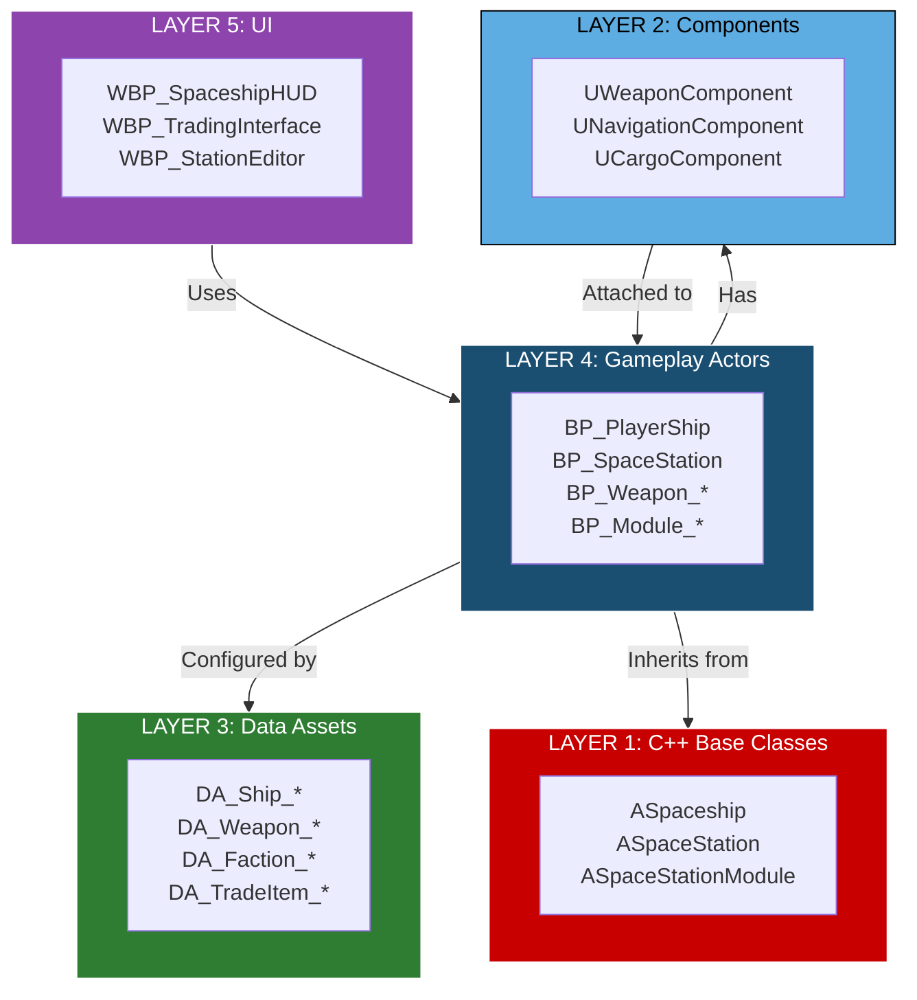

# Blueprint Architecture Guide - Adastrea

**Last Updated**: January 6, 2026  
**For Version**: 1.0.0-alpha  
**Target Engine**: Unreal Engine 5.6

> **Purpose**: This document provides a comprehensive overview of all Blueprints in Adastrea, their C++ parent classes, dependencies, and how they interact. This is **developer/designer documentation**, not in-game player information.

---

## Table of Contents

1. [Overview & Philosophy](#overview--philosophy)
2. [Core Architecture Layers](#core-architecture-layers)
3. [Blueprint Class Hierarchy](#blueprint-class-hierarchy)
4. [Docking System Deep-Dive](#docking-system-deep-dive) ⭐ (Answers user's specific question)
5. [System-by-System Breakdown](#system-by-system-breakdown)
6. [Data Asset Dependencies](#data-asset-dependencies)
7. [Component Architecture](#component-architecture)
8. [Interface System](#interface-system)
9. [Blueprint Interaction Flows](#blueprint-interaction-flows)
10. [Current vs Future Blueprints](#current-vs-future-blueprints)

---

## Overview & Philosophy

### Design Principles

Adastrea follows a **layered architecture** where:

1. **C++ Base Classes** - Provide core functionality and performance-critical code
2. **Blueprint Classes** - Extend C++ classes for designer-friendly customization
3. **Data Assets** - Configure content without Blueprint logic
4. **Components** - Modular, reusable functionality attached to actors
5. **Interfaces** - Define contracts for cross-system communication

### Blueprint Naming Convention

```
BP_<System>_<Purpose>
DA_<System>_<Purpose>  (Data Assets)
WBP_<Purpose>          (Widget Blueprints)
```

**Examples:**
- `BP_Ship_Fighter` - Fighter ship blueprint
- `DA_Weapon_Laser` - Laser weapon data asset
- `WBP_TradingInterface` - Trading UI widget

---

## Core Architecture Layers



---

## Blueprint Class Hierarchy

### Game Framework

```
AActor (UE5)
├─ AGameModeBase (UE5)
│  └─ AdastreaGameMode (C++)
│     └─ BP_SpaceGameMode (Blueprint)
│     └─ BP_TestGameMode (Blueprint)
│
├─ APlayerController (UE5)
│  └─ AdastreaPlayerController (C++)
│     └─ BP_SpaceshipController (Blueprint)
│
├─ UGameInstance (UE5)
│  └─ AdastreaGameInstance (C++)
│     └─ BP_GameInstance (Blueprint)
│
└─ AGameStateBase (UE5)
   └─ AdastreaGameState (C++)
      └─ BP_GameState (Blueprint)
```

### Ship System

```
APawn (UE5)
└─ ASpaceship (C++)
   ├─ BP_PlayerShip (Blueprint) - Player's main ship
   ├─ BP_PlayerShip_Fighter (Blueprint) - Combat variant
   ├─ BP_PlayerShip_Trader (Blueprint) - Trading variant
   ├─ BP_Ship_NPC_Fighter (Blueprint) - AI fighter
   ├─ BP_Ship_NPC_Trader (Blueprint) - AI trader
   ├─ BP_Ship_Corvette (Blueprint)
   ├─ BP_Ship_Cruiser (Blueprint)
   ├─ BP_Ship_Destroyer (Blueprint)
   ├─ BP_Ship_Freighter (Blueprint)
   └─ BP_Battleship (Blueprint)

ASpaceshipInterior (C++)
└─ BP_ShipInterior (Blueprint) - Walkable interior space
```

**Key Properties:**
- `USpaceshipDataAsset* ShipDataAsset` - Ship stats and configuration
- `UFloatingPawnMovement* MovementComponent` - 3D movement in space
- `USpaceshipParticleComponent* ParticleComponent` - Engine VFX
- `USpringArmComponent* CameraSpringArm` - Camera positioning
- `UCameraComponent* Camera` - Player view

**Ship Components (Attachable):**
- `UWeaponComponent` - Combat weapons
- `UNavigationComponent` - Autopilot and pathfinding
- `UCargoComponent` - Cargo management
- `UShieldComponent` - Shield systems
- `UTargetingComponent` - Target acquisition
- `USpaceshipControlsComponent` - Flight controls
- `UShipCustomizationComponent` - Visual customization
- `UShipUpgradeComponent` - Upgrade system

### Station System

```
AActor (UE5)
├─ ASpaceStation (C++)
│  ├─ BP_SpaceStation (Blueprint) - Generic station
│  ├─ BP_SpaceStation_Trading (Blueprint) - Trading hub
│  ├─ BP_SpaceStation_Military (Blueprint) - Military base
│  └─ BP_SpaceStation_Research (Blueprint) - Research station
│
└─ ASpaceStationModule (C++) ⭐ BASE FOR ALL MODULES
   ├─ ADockingBayModule (C++) - Large docking bay
   │  └─ BP_Module_DockingBay (Blueprint)
   │
   ├─ ADockingPortModule (C++) - Small docking port
   │  └─ BP_Module_DockingPort (Blueprint)
   │
   ├─ AReactorModule (C++) - Power reactor
   │  └─ BP_Module_Reactor (Blueprint)
   │
   ├─ ASolarArrayModule (C++) - Solar power
   │  └─ BP_Module_SolarArray (Blueprint)
   │
   ├─ ACargoBayModule (C++) - Cargo storage
   │  └─ BP_Module_CargoBay (Blueprint)
   │
   ├─ AFuelDepotModule (C++) - Fuel storage
   │  └─ BP_Module_FuelDepot (Blueprint)
   │
   ├─ ATurretModule (C++) - Defence turret
   │  └─ BP_Module_Turret (Blueprint)
   │
   ├─ AShieldGeneratorModule (C++) - Shield generator
   │  └─ BP_Module_ShieldGenerator (Blueprint)
   │
   ├─ AHabitationModule (C++) - Living quarters
   │  └─ BP_Module_Habitation (Blueprint)
   │
   ├─ ABarracksModule (C++) - Military quarters
   │  └─ BP_Module_Barracks (Blueprint)
   │
   ├─ AFabricationModule (C++) - Manufacturing
   │  └─ BP_Module_Fabrication (Blueprint)
   │
   ├─ AProcessingModule (C++) - Resource processing
   │  └─ BP_Module_Processing (Blueprint)
   │
   ├─ AMarketplaceModule (C++) - Trading marketplace
   │  └─ BP_Module_Marketplace (Blueprint)
   │
   ├─ AScienceLabModule (C++) - Research lab
   │  └─ BP_Module_ScienceLab (Blueprint)
   │
   └─ ACorridorModule (C++) - Connecting corridor
      └─ BP_Module_Corridor (Blueprint)
```

**Key Station Properties:**
- `TArray<ASpaceStationModule*> Modules` - All attached modules
- `UFactionDataAsset* OwningFaction` - Station owner faction
- `float CurrentStructuralIntegrity` - Station health
- `FText StationName` - Station display name

**Key Module Properties (Base Class):**
- `FString ModuleType` - Module type identifier
- `float ModulePower` - Power consumption/generation (negative = generates)
- `EStationModuleGroup ModuleGroup` - Group categorization
- `UFactionDataAsset* ModuleFaction` - Module-specific faction (can differ from station)

### Combat System

```
AActor (UE5)
├─ BP_Weapon_Laser (Blueprint) - Laser weapon actor
├─ BP_Weapon_Missile (Blueprint) - Missile launcher
├─ BP_Weapon_Railgun (Blueprint) - Railgun
├─ BP_Weapon_Plasma (Blueprint) - Plasma weapon
├─ BP_Projectile_Laser (Blueprint) - Laser bolt projectile
├─ BP_Projectile_Cannon (Blueprint) - Cannon shell
├─ BP_Projectile_Missile (Blueprint) - Guided missile
└─ BP_Projectile_Torpedo (Blueprint) - Heavy torpedo
```

**Combat Components:**
- `UWeaponComponent` - Attached to ships/stations for weapons
- `UTargetingComponent` - Target acquisition and tracking
- `UCombatHealthComponent` - Health and damage management
- `UPointDefenseComponent` - Anti-missile defense
- `UBoardingComponent` - Boarding action system

### AI System

```
UObject (UE5)
├─ UNPCLogicBase (C++) - Base AI logic
│  ├─ UFactionLogic (C++) - Faction-level AI
│  │  └─ BP_FactionLogic_Standard (Blueprint)
│  │
│  └─ UPersonnelLogic (C++) - Individual crew AI
│     └─ BP_PersonnelLogic_Standard (Blueprint)
│
└─ AAIController (UE5)
   └─ BP_AIController (Blueprint) - AI ship controller
```

---

## Docking System Deep-Dive

> ⭐ **This section answers your specific question about the docking system complexity.**

### Why Multiple Docking Components?

The docking system has **three distinct layers**, each serving a different purpose:

#### 1. Module Classes (Gameplay Logic)

**ADockingBayModule (C++)**
- **Purpose**: Large docking facility for freighters and capital ships
- **Power Consumption**: 50 units
- **Features**: Hangar doors, tractor beams, docking assistance
- **Capacity**: Multiple large ships
- **Blueprint**: `BP_Module_DockingBay`

**ADockingPortModule (C++)**
- **Purpose**: Small docking point for shuttles and fighters
- **Power Consumption**: 10 units
- **Features**: Basic docking clamp
- **Capacity**: Single small ship
- **Blueprint**: `BP_Module_DockingPort`

**Why Both?**
- **Gameplay Variety**: Different ship sizes need different docking facilities
- **Resource Management**: Bays cost more power but handle bigger ships
- **Station Design**: Mix-and-match for balanced station layouts
- **Economic Balance**: Small ports are cheaper, bays are more versatile

#### 2. DockingPoint Scene Components (Transform Data)

**What are they?**
- `USceneComponent` instances representing **physical attachment points**
- Store transform data (position, rotation, scale)
- Mark where ships physically dock
- No gameplay logic, just spatial data

**Usage:**
```cpp
// Inside ADockingBayModule or ADockingPortModule
UPROPERTY(VisibleAnywhere, BlueprintReadOnly)
USceneComponent* DockingPoint1;

UPROPERTY(VisibleAnywhere, BlueprintReadOnly)
USceneComponent* DockingPoint2;

UPROPERTY(VisibleAnywhere, BlueprintReadOnly)
USceneComponent* DockingPoint3;
```

**Why Scene Components?**
- **Transform Inheritance**: Automatically move with parent module
- **Editor Visualization**: Visible in editor for level design
- **Modular Positioning**: Each point can be positioned independently
- **Collision/Overlap**: Can have trigger volumes attached

#### 3. DockingPoint Array (Multiple Slots)

**What is it?**
- `TArray<USceneComponent*>` storing multiple docking points
- Allows modules to have **multiple simultaneous docking slots**
- Example: Docking Bay might have 4 slots, Docking Port has 1

**Implementation:**
```cpp
// In ASpaceStationModule base class or derived docking modules
UPROPERTY(VisibleAnywhere, BlueprintReadOnly, Category="Docking")
TArray<USceneComponent*> DockingPoints;
```

**Why an Array?**
- **Scalability**: Easily add/remove docking slots
- **Iteration**: Loop through available slots to find free ones
- **Flexibility**: Different modules can have different slot counts
- **Runtime Management**: Track which slots are occupied

### Docking System Architecture Diagram

```
┌────────────────────────────────────────────────────────────────┐
│              ASpaceStationModule (Base Class)                  │
│  - ModuleType: FString                                         │
│  - ModulePower: float                                          │
│  - ModuleGroup: EStationModuleGroup                           │
└────────────────────────────────────────────────────────────────┘
                              ↑
                              │ Inherits from
                ┌─────────────┴─────────────┐
                │                           │
┌───────────────────────────┐   ┌───────────────────────────┐
│  ADockingBayModule (C++)  │   │ ADockingPortModule (C++)  │
│  - Power: 50 units        │   │ - Power: 10 units         │
│  - Size: Large            │   │ - Size: Small             │
└───────────────────────────┘   └───────────────────────────┘
        ↓ Has                           ↓ Has
┌───────────────────────────┐   ┌───────────────────────────┐
│ TArray<USceneComponent*>  │   │ TArray<USceneComponent*>  │
│ DockingPoints (3-6 slots) │   │ DockingPoints (1 slot)    │
└───────────────────────────┘   └───────────────────────────┘
        ↓ Contains                      ↓ Contains
┌───────────────────────────┐   ┌───────────────────────────┐
│  USceneComponent          │   │  USceneComponent          │
│  - Location: FVector      │   │  - Location: FVector      │
│  - Rotation: FRotator     │   │  - Rotation: FRotator     │
│  - Occupied: bool         │   │  - Occupied: bool         │
└───────────────────────────┘   └───────────────────────────┘
```

### Docking Workflow Example

**When a ship wants to dock:**

1. **Find Available Module**
   ```cpp
   ADockingBayModule* Bay = FindNearestDockingBay(ShipLocation);
   ```

2. **Check for Free Slots**
   ```cpp
   for (USceneComponent* Point : Bay->DockingPoints)
   {
       if (!Point->IsOccupied())
       {
           SelectedDockingPoint = Point;
           break;
       }
   }
   ```

3. **Move Ship to Docking Point**
   ```cpp
   FVector DockLocation = SelectedDockingPoint->GetComponentLocation();
   FRotator DockRotation = SelectedDockingPoint->GetComponentRotation();
   Ship->MoveToLocation(DockLocation, DockRotation);
   ```

4. **Mark Slot as Occupied**
   ```cpp
   SelectedDockingPoint->SetOccupied(true);
   ```

5. **Trigger Docking Complete**
   ```cpp
   Ship->OnDockingComplete();
   Bay->OnShipDocked(Ship);
   ```

### Summary: Why This Architecture?

| Component | Purpose | Why Needed |
|-----------|---------|------------|
| **DockingBayModule** | Large docking facility | Gameplay variety, resource management |
| **DockingPortModule** | Small docking point | Cost-effective for small ships |
| **DockingPoint (Scene Component)** | Physical attachment point | Transform data, editor visualization |
| **DockingPoints Array** | Multiple simultaneous slots | Scalability, runtime tracking |

**Key Insight**: This separation follows **Single Responsibility Principle**:
- **Modules** = Gameplay logic and resource management
- **Scene Components** = Spatial/transform data
- **Arrays** = Slot management and iteration

---

## System-by-System Breakdown

### 1. Core Game Framework

#### Game Mode
- **C++ Class**: `AdastreaGameMode`
- **Blueprint**: `BP_SpaceGameMode`
- **Purpose**: Main game rules, spawn management, game state
- **Dependencies**: None (top-level)
- **Used By**: UE5 game instance, level setup

#### Game Instance
- **C++ Class**: `AdastreaGameInstance`
- **Blueprint**: `BP_GameInstance`
- **Purpose**: Persistent game data across levels
- **Subsystems**: `UFactionDiplomacyManager` (faction relationships)
- **Dependencies**: None
- **Lifespan**: Entire game session

#### Player Controller
- **C++ Class**: `AdastreaPlayerController`
- **Blueprint**: `BP_SpaceshipController`
- **Purpose**: Player input handling, UI management
- **Components**: 
  - `UPlayerReputationComponent` - Reputation tracking
  - `UPlayerProgressionComponent` - Player advancement
  - `UPlayerUnlockComponent` - Unlockable content
- **Dependencies**: Enhanced Input System

### 2. Ship System

#### Player Ships
- **Base C++ Class**: `ASpaceship`
- **Blueprints**: 
  - `BP_PlayerShip` - Default player ship
  - `BP_PlayerShip_Fighter` - Combat variant
  - `BP_PlayerShip_Trader` - Trading variant
- **Data Assets**: `DA_Ship_*` (configures stats)
- **Components**:
  - `UFloatingPawnMovement` - 3D space movement
  - `USpaceshipParticleComponent` - Engine VFX
  - `UWeaponComponent` - Combat weapons
  - `UNavigationComponent` - Autopilot
  - `UCargoComponent` - Cargo management

#### NPC Ships
- **Base C++ Class**: `ASpaceship`
- **Blueprints**:
  - `BP_Ship_NPC_Fighter` - AI fighter
  - `BP_Ship_NPC_Trader` - AI trader
  - `BP_Ship_NPC_Interceptor` - Fast interceptor
- **AI Controller**: `BP_AIController`
- **AI Logic**: `BP_PersonnelLogic_Standard`, `BP_FactionLogic_Standard`

### 3. Station System

**Already covered in detail above** - See [Station System Hierarchy](#station-system)

### 4. Trading System

#### Trade Items
- **C++ Class**: `UTradeItemDataAsset`
- **Data Assets**: `DA_TradeItem_*` (Food, Water, Minerals, etc.)
- **Properties**: Base price, volume, volatility
- **Used By**: Markets, cargo systems, quests

#### Markets
- **C++ Class**: `UMarketDataAsset`
- **Data Assets**: `DA_Market_Station1`, `DA_Market_Station2`, etc.
- **Properties**: Station location, item price multipliers
- **Used By**: Trading interface, AI traders

#### Trading Components
- **C++ Class**: `UCargoComponent`
- **Purpose**: Cargo inventory management
- **Attached To**: Ships and stations
- **Functions**: AddCargo, RemoveCargo, GetCargoSpace

- **C++ Class**: `UAITraderComponent`
- **Purpose**: Autonomous AI trading behavior
- **Attached To**: NPC trader ships
- **Functions**: FindBestTrade, ExecuteTrade, UpdateRoutes

### 5. Combat System

#### Weapons
- **C++ Class**: `UWeaponComponent`
- **Data Assets**: `DA_Weapon_*` (Laser, Missile, Railgun, etc.)
- **Attached To**: Ships and turret modules
- **Functions**: Fire, Reload, GetDamage

#### Projectiles
- **Base Class**: `AActor`
- **Blueprints**: `BP_Projectile_*`
- **Purpose**: Visual and collision for weapon projectiles
- **Properties**: Speed, damage, lifetime, homing

#### Combat Components
- **C++ Class**: `UCombatHealthComponent`
- **Purpose**: Health, shields, damage management
- **Attached To**: Ships and stations
- **Interfaces**: `IDamageable`, `ITargetable`

### 6. Faction System

#### Factions
- **C++ Class**: `UFactionDataAsset`
- **Data Assets**: `DA_Faction_*`
- **Properties**: Name, traits, relationships, homeworld
- **Used By**: Diplomacy manager, reputation system, AI

#### Diplomacy Manager
- **C++ Class**: `UFactionDiplomacyManager` (Game Instance Subsystem)
- **Purpose**: Manages faction relationships globally
- **Functions**: GetRelationship, SetRelationship, DeclareWar

### 7. Personnel System

#### Personnel
- **C++ Class**: `UPersonnelDataAsset`
- **Data Assets**: `DA_Personnel_*` (Captain, Pilot, Engineer, etc.)
- **Properties**: Skills, traits, relationships, role
- **Used By**: Crew management, AI behavior

#### Personnel AI
- **C++ Class**: `UPersonnelLogic`
- **Blueprint**: `BP_PersonnelLogic_Standard`
- **Purpose**: Individual crew AI behavior
- **Personality Types**: 8 dispositions (Friendly, Suspicious, Greedy, etc.)

### 8. UI System

#### HUD
- **C++ Class**: `UAdastreaHUDWidget`
- **Blueprint**: `WBP_SpaceshipHUD`
- **Purpose**: Main gameplay HUD
- **Components**: Health, shields, speed, target info

#### Trading Interface
- **C++ Class**: `UTradingInterfaceWidget`
- **Blueprint**: `WBP_TradingInterface`
- **Purpose**: Buy/sell trading UI
- **Dependencies**: Market data, cargo component

#### Station Editor
- **C++ Class**: `UStationEditorWidget`
- **Blueprint**: `WBP_StationEditor`
- **Purpose**: Player-facing station construction UI
- **Dependencies**: Station grid system, module catalog

#### Other Widgets
- `WBP_Inventory` - Inventory management
- `WBP_ShipStatus` - Ship status screen
- `WBP_SectorMap` - Sector navigation map
- `WBP_QuestLog` - Quest tracking
- `WBP_MainMenu` - Main menu

---

## Data Asset Dependencies

### Ships Depend On

```
BP_PlayerShip (Blueprint Actor)
├─ Requires: DA_Ship_PlayerScout (SpaceshipDataAsset)
│  └─ Defines: Hull, speed, cargo, weapons, stats
│
├─ Optionally References:
│  ├─ DA_Weapon_Laser (WeaponDataAsset) - Primary weapon
│  ├─ DA_Weapon_Missile (WeaponDataAsset) - Secondary weapon
│  └─ DA_Faction_Player (FactionDataAsset) - Faction membership
│
└─ Uses Components:
   ├─ UWeaponComponent (configured by DA_Weapon_*)
   ├─ UCargoComponent (capacity from DA_Ship_*)
   └─ UNavigationComponent
```

### Stations Depend On

```
BP_SpaceStation (Blueprint Actor)
├─ Contains: TArray<ASpaceStationModule*> Modules
│  ├─ BP_Module_DockingBay
│  ├─ BP_Module_Reactor
│  ├─ BP_Module_CargoBay
│  └─ ... (up to 25 module types)
│
├─ References: DA_Faction_* (OwningFaction)
│
└─ May Reference:
   ├─ DA_Market_Station1 (MarketDataAsset) - For trading
   └─ DA_StationModuleCatalog - Available modules
```

### Trading Depends On

```
WBP_TradingInterface (Widget Blueprint)
├─ Reads: DA_Market_* (MarketDataAsset)
│  └─ Contains: Item prices, supply/demand
│
├─ Reads: DA_TradeItem_* (TradeItemDataAsset)
│  └─ Defines: Item properties (name, icon, base price)
│
├─ Accesses: UCargoComponent (on player ship)
│  └─ Functions: GetCargoSpace, AddCargo, RemoveCargo
│
└─ Accesses: UPlayerReputationComponent (on player controller)
   └─ Function: GetTradePriceModifier (faction discounts)
```

### AI Depends On

```
BP_Ship_NPC_Fighter (Blueprint Actor)
├─ Requires: DA_Ship_NPCFighter (SpaceshipDataAsset)
│
├─ Requires: BP_AIController (AIController Blueprint)
│  └─ Uses: BP_PersonnelLogic_Standard (AI behavior)
│     └─ References: DA_Personnel_* (personality, skills)
│
└─ References: DA_Faction_Pirates (FactionDataAsset)
   └─ Defines: Faction behavior, relationships
```

---

## Component Architecture

### Component Types

#### 1. Movement Components
- `UFloatingPawnMovement` - 3D space flight (UE5 built-in)
- `UNavigationComponent` - Autopilot and pathfinding (Adastrea)
- `USimpleAIMovementComponent` - Basic AI movement (Adastrea)

#### 2. Combat Components
- `UWeaponComponent` - Weapon management
- `UTargetingComponent` - Target acquisition
- `UCombatHealthComponent` - Health and shields
- `UPointDefenseComponent` - Anti-missile defense
- `UBoardingComponent` - Boarding actions

#### 3. Trading Components
- `UCargoComponent` - Cargo inventory
- `UAITraderComponent` - Autonomous trading AI
- `UPlayerTraderComponent` - Player trading logic

#### 4. Player Components
- `UPlayerReputationComponent` - Faction reputation
- `UPlayerProgressionComponent` - Player advancement
- `UPlayerUnlockComponent` - Unlockable content
- `UVerse` (Verse component) - Guild reputation

#### 5. Customization Components
- `UShipCustomizationComponent` - Visual customization
- `UShipUpgradeComponent` - Ship upgrades
- `UShipModuleComponent` - Modular ship parts

#### 6. Visual Components
- `USpaceshipParticleComponent` - Engine VFX
- `UStaticMeshComponent` - Visual mesh (UE5 built-in)

#### 7. UI Components
- `UInventoryComponent` - Inventory management

### Component Dependencies

```
ASpaceship (Actor)
├─ REQUIRED Components:
│  ├─ UFloatingPawnMovement - Movement
│  ├─ UStaticMeshComponent - Visual mesh
│  └─ USpaceshipParticleComponent - VFX
│
├─ OPTIONAL Components (depends on ship type):
│  ├─ UWeaponComponent - If ship has weapons
│  ├─ UNavigationComponent - If autopilot enabled
│  ├─ UCargoComponent - If ship carries cargo
│  ├─ UTargetingComponent - If combat capable
│  └─ UCombatHealthComponent - If damageable
│
└─ PLAYER-ONLY Components:
   ├─ UPlayerReputationComponent - Reputation tracking
   ├─ UPlayerProgressionComponent - Progression system
   └─ UShipCustomizationComponent - Visual customization
```

---

## Interface System

### Core Interfaces

#### IDamageable
- **Purpose**: Can receive damage
- **Implemented By**: ASpaceship, ASpaceStation, ASpaceStationModule
- **Functions**:
  - `ApplyDamage(float Damage, EDamageType Type, ...)`
  - `GetHealthPercentage()`
  - `IsDestroyed()`
  - `CanTakeDamage()`

#### ITargetable
- **Purpose**: Can be targeted by weapons/sensors
- **Implemented By**: ASpaceship, ASpaceStation, ASpaceStationModule
- **Functions**:
  - `CanBeTargeted()`
  - `GetTargetPriority()`
  - `GetTargetDisplayName()`
  - `GetAimPoint()`
  - `IsHostileToActor(AActor* Observer)`

#### IFactionMember
- **Purpose**: Belongs to a faction
- **Implemented By**: ASpaceship, ASpaceStation
- **Functions**:
  - `GetFaction()`
  - `IsAlliedWith(IFactionMember* Other)`
  - `IsHostileTo(IFactionMember* Other)`
  - `GetRelationshipWith(IFactionMember* Other)`
  - `GetTradePriceModifier(UFactionDataAsset* TraderFaction)`

#### IShipModule
- **Purpose**: Modular ship component (for future modular ship system)
- **Implemented By**: Ship module actors (when implemented)
- **Functions**:
  - `Activate()`
  - `Deactivate()`
  - `GetModuleType()`
  - `GetPowerRequirement()`

### Interface Usage Pattern

```cpp
// Example: Weapon targeting system
void UWeaponComponent::AcquireTarget(AActor* PotentialTarget)
{
    // Check if actor implements ITargetable interface
    if (PotentialTarget->Implements<UTargetable>())
    {
        ITargetable* Target = Cast<ITargetable>(PotentialTarget);
        
        // Use interface functions
        if (Target->CanBeTargeted_Implementation())
        {
            FVector AimPoint = Target->GetAimPoint_Implementation();
            bool IsHostile = Target->IsHostileToActor_Implementation(OwnerShip);
            
            if (IsHostile)
            {
                CurrentTarget = PotentialTarget;
            }
        }
    }
}
```

---

## Blueprint Interaction Flows

### Trading Flow

```
Player docks at station
        ↓
BP_SpaceStation::OnShipDocked(BP_PlayerShip)
        ↓
WBP_TradingInterface::Open()
        ↓
    Reads DA_Market_Station1 (prices)
        ↓
    Reads DA_TradeItem_* (item info)
        ↓
    Queries UCargoComponent::GetCargoSpace()
        ↓
Player clicks "Buy"
        ↓
WBP_TradingInterface::OnBuyClicked()
        ↓
    Validates credits via UPlayerReputationComponent
        ↓
    Validates cargo space via UCargoComponent
        ↓
    Applies faction discount via IFactionMember::GetTradePriceModifier()
        ↓
    UCargoComponent::AddCargo(Item, Quantity)
        ↓
    Update player credits
        ↓
    Update market supply/demand
        ↓
WBP_TradingInterface::Refresh()
```

### Combat Flow

```
Player locks target
        ↓
BP_PlayerShip::UTargetingComponent::AcquireTarget(BP_Ship_NPC_Fighter)
        ↓
    Check ITargetable::CanBeTargeted()
        ↓
    Get IFactionMember::IsHostileTo()
        ↓
    Set CurrentTarget
        ↓
Player presses fire button
        ↓
BP_PlayerShip::UWeaponComponent::Fire()
        ↓
    Read DA_Weapon_Laser (damage, projectile speed)
        ↓
    Spawn BP_Projectile_Laser
        ↓
    Set projectile target
        ↓
BP_Projectile_Laser::OnHit(BP_Ship_NPC_Fighter)
        ↓
    Calculate damage
        ↓
    Call ITargetable::ApplyDamage(Damage, DamageType, Instigator)
        ↓
BP_Ship_NPC_Fighter::UCombatHealthComponent::ReceiveDamage()
        ↓
    Update health
        ↓
    Check if destroyed
        ↓
    Trigger VFX and audio
        ↓
    Update player reputation if killed
```

### Station Docking Flow

```
Player approaches BP_SpaceStation
        ↓
BP_PlayerShip::UNavigationComponent::RequestDocking(BP_SpaceStation)
        ↓
BP_SpaceStation::FindAvailableDockingPoint()
        ↓
    Iterate through Modules array
        ↓
    Find ADockingBayModule or ADockingPortModule
        ↓
    Check DockingPoints array for free slot
        ↓
    Select first available USceneComponent* DockingPoint
        ↓
BP_SpaceStation::GrantDockingPermission(BP_PlayerShip, DockingPoint)
        ↓
BP_PlayerShip::UNavigationComponent::MoveToLocation(DockingPoint->GetComponentLocation())
        ↓
    Ship moves to docking point
        ↓
BP_PlayerShip::OnDockingComplete()
        ↓
    Disable ship controls
        ↓
    Mark docking point as occupied
        ↓
    Open WBP_TradingInterface or WBP_StationManagement
```

### AI Decision Flow

```
BP_Ship_NPC_Trader spawns
        ↓
BP_AIController takes control
        ↓
BP_FactionLogic_Standard::DecideEconomicAction()
        ↓
    Read DA_Faction_Merchants (traits, behaviors)
        ↓
    Query nearby stations via UFactionDiplomacyManager
        ↓
    Find best trade route
        ↓
BP_Ship_NPC_Trader::UAITraderComponent::ExecuteTrade()
        ↓
    Navigate to BP_SpaceStation_Trading
        ↓
    Request docking
        ↓
    Dock at station
        ↓
    Read DA_Market_Station1 (prices)
        ↓
    Buy cargo (low price)
        ↓
    Undock
        ↓
    Navigate to BP_SpaceStation_Military
        ↓
    Dock at station
        ↓
    Read DA_Market_Station2 (prices)
        ↓
    Sell cargo (high price)
        ↓
    Calculate profit
        ↓
BP_FactionLogic_Standard::UpdateEconomicState()
        ↓
    Update faction wealth
        ↓
    Decide next action
```

---

## Current vs Future Blueprints

### ✅ CURRENT - Existing in Repository

**Game Framework:**
- `BP_GameInstance` ✅
- `BP_SpaceGameMode` ⚠️ (needs verification)
- `BP_SpaceshipController` ⚠️ (needs verification)

**Ships:**
- `BP_PlayerShip` ✅
- `BP_Ship_Corvette` ✅
- `BP_Ship_Cruiser` ✅
- `BP_Ship_Destroyer` ✅
- `BP_Ship_Freighter` ✅
- `BP_Battleship` ✅
- `BP_Ship_Fighter` ✅

**Stations:**
- `BP_SpaceStation` ✅
- `BP_StationModule` ✅
- `BP_CargoBayModule` ✅

**Combat:**
- `BP_Weapon_Laser` ✅
- `BP_Weapon_Missile` ✅
- `BP_Weapon_Railgun` ✅
- `BP_Weapon_Plasma` ✅

**AI:**
- `BP_AIController` ✅
- `BP_FactionAI` ✅

**Input Actions:**
- `IA_Move` ✅
- `IA_Look` ✅
- `IA_Boost` ✅
- `IA_Fire_Primary` ✅
- `IA_ThrottleUp` ✅
- `IA_ThrottleDown` ✅
- `IA_PauseMenu` ✅
- `IA_ShipStatus` ✅
- `IA_Inventory` ✅
- `IA_Map` ✅
- `IA_OpenStationEditor` ✅
- `IMC_Spaceship` (Input Mapping Context) ✅

### ⏳ PLANNED - Needed for Full Functionality

**Ships:**
- `BP_PlayerShip_Fighter` ⏳
- `BP_PlayerShip_Trader` ⏳
- `BP_Ship_NPC_Fighter` ⏳
- `BP_Ship_NPC_Trader` ⏳
- `BP_Ship_NPC_Interceptor` ⏳

**Station Modules (15+ missing):**
- `BP_Module_DockingBay` ⏳
- `BP_Module_DockingPort` ⏳
- `BP_Module_Reactor` ⏳
- `BP_Module_SolarArray` ⏳
- `BP_Module_FuelDepot` ⏳
- `BP_Module_Turret` ⏳
- `BP_Module_ShieldGenerator` ⏳
- `BP_Module_Habitation` ⏳
- `BP_Module_Barracks` ⏳
- `BP_Module_Fabrication` ⏳
- `BP_Module_Processing` ⏳
- `BP_Module_Marketplace` ⏳
- `BP_Module_ScienceLab` ⏳
- `BP_Module_Corridor` ⏳
- ... (10+ more)

**Data Assets (100+ needed):**
- `DA_Ship_*` (10+ ship configs) ⏳
- `DA_Weapon_*` (10+ weapon types) ⏳
- `DA_Faction_*` (10+ factions) ⏳
- `DA_TradeItem_*` (20+ trade goods) ⏳
- `DA_Market_*` (10+ markets) ⏳
- `DA_Personnel_*` (15+ crew roles) ⏳
- `DA_Quest_*` (10+ quests) ⏳
- `DA_Way_*` (10+ guilds) ⏳

**UI Widgets (20+ needed):**
- `WBP_SpaceshipHUD` ⏳
- `WBP_TradingInterface` ⏳
- `WBP_StationEditor` ⏳
- `WBP_Inventory` ⏳
- `WBP_ShipStatus` ⏳
- `WBP_SectorMap` ⏳
- `WBP_MainMenu` ⏳
- `WBP_PauseMenu` ⏳
- ... (15+ more)

**Maps:**
- `TestLevel.umap` ⏳
- `MainMenu.umap` ⏳
- `TestMode.umap` ⏳
- `SectorAlpha.umap` ⏳

### 🎯 MVP PRIORITY (Trade Simulator)

For the **Trade Simulator MVP** (Dec 2025 - Mar 2026), prioritize:

**Critical:**
- ✅ `BP_PlayerShip` - Player ship with cargo
- ⏳ `BP_SpaceStation_Trading` - 2-3 trading stations
- ⏳ `BP_Module_DockingBay` or `BP_Module_DockingPort` - Docking
- ⏳ `WBP_TradingInterface` - Trading UI
- ⏳ `DA_TradeItem_*` - 10-20 trade goods
- ⏳ `DA_Market_*` - 2-3 markets with different prices

**Deferred (Post-MVP):**
- ❌ Combat blueprints (no combat in MVP)
- ❌ Faction diplomacy (beyond price modifiers)
- ❌ Personnel management
- ❌ Quest system
- ❌ Station building

---

## Quick Reference Tables

### Blueprint Count by System

| System | C++ Classes | Blueprints Exist | Blueprints Needed | Total |
|--------|-------------|------------------|-------------------|-------|
| **Game Framework** | 4 | 3 | 2 | 5 |
| **Ships** | 2 | 7 | 10 | 17 |
| **Stations** | 18 | 3 | 22 | 25 |
| **Combat** | 5 | 4 | 10 | 14 |
| **Trading** | 3 | 0 | 3 | 3 |
| **AI** | 3 | 2 | 3 | 5 |
| **UI** | 15 | 0 | 30 | 30 |
| **Input** | 2 | 11 (actions) | 3 | 14 |
| **Total** | **52** | **30** | **83** | **113** |

### Data Assets by System

| System | DA Types | Needed | Priority |
|--------|----------|--------|----------|
| **Ships** | SpaceshipDataAsset | 10+ | High |
| **Weapons** | WeaponDataAsset | 10+ | Medium |
| **Factions** | FactionDataAsset | 10+ | Medium |
| **Trading** | TradeItemDataAsset | 20+ | ⭐ Critical (MVP) |
| **Markets** | MarketDataAsset | 10+ | ⭐ Critical (MVP) |
| **Personnel** | PersonnelDataAsset | 15+ | Low (Post-MVP) |
| **Quests** | QuestDataAsset | 10+ | Low (Post-MVP) |
| **Ways** | WayDataAsset | 10+ | Low (Post-MVP) |

### MVP Trade Simulator Blueprint Checklist

**Essential (Must Have):**
- [ ] `BP_PlayerShip` - Player ship with cargo component
- [ ] `BP_SpaceStation_Trading` (x2-3) - Trading hubs
- [ ] `BP_Module_DockingBay` or `BP_Module_DockingPort` - Docking
- [ ] `WBP_TradingInterface` - Trading UI
- [ ] `DA_TradeItem_*` (x10-20) - Trade goods
- [ ] `DA_Market_*` (x2-3) - Markets
- [ ] `DA_Ship_PlayerScout` - Player ship stats
- [ ] `TestLevel.umap` - Playable map

**Nice to Have (Polish):**
- [ ] `WBP_SpaceshipHUD` - Basic HUD
- [ ] `BP_SpaceStation_Trading` variant designs
- [ ] `DA_Faction_*` (x3-5) - For price modifiers
- [ ] Ship upgrade system (cargo capacity)

**Explicitly Deferred:**
- ❌ Combat weapons and projectiles
- ❌ Quest system
- ❌ Personnel/crew management
- ❌ Station building
- ❌ Exploration mechanics

---

## Documentation References

### System Guides
- `Assets/SpaceshipDataAssetGuide.md` - Complete ship system
- `Assets/StationEditorSystemGuide.md` - Station construction
- `Assets/TradingSystemGuide.md` - Trading economy
- `Assets/CombatSystemGuide.md` - Combat mechanics
- `Assets/PersonnelSystemGuide.md` - Crew management
- `Assets/WaySystemGuide.md` - Guild system

### Blueprint Lists
- `docs/archive/UPDATED_BLUEPRINT_LIST_2025.md` - Comprehensive 208-item list
- `docs/reference/BLUEPRINT_REQUIREMENTS_LIST.md` - Original requirements
- `docs/mvp/BLUEPRINT_IMPLEMENTATION_GUIDE.md` - MVP-focused guide

### Quick References
- `docs/reference/BLUEPRINT_QUICK_REFERENCE.md` - Quick lookup
- `Assets/HUD_QUICK_REFERENCE.md` - HUD system
- `docs/reference/STATION_MODULE_BLUEPRINTS_QUICK_REFERENCE.md` - Station modules

---

## Questions & Clarifications

**Q: Why do some blueprints have both C++ and Blueprint versions?**
- **A**: C++ provides performance-critical logic and base functionality. Blueprints extend C++ for designer-friendly customization without recompiling.

**Q: Can I create a blueprint without a C++ parent class?**
- **A**: Yes, but most Adastrea blueprints inherit from C++ classes for consistent functionality. Pure Blueprint actors are mainly for simple visual/VFX elements.

**Q: What's the difference between a module and a component?**
- **A**: **Modules** are physical station pieces (actors). **Components** are functionality attached to actors (like UWeaponComponent on ships).

**Q: Why are there so many data assets?**
- **A**: Data Assets separate **content** (ship stats, item prices) from **logic** (blueprint code). This allows designers to create variants without touching blueprints.

**Q: What's the recommended creation order?**
- **A**: 
  1. Game framework (GameMode, GameInstance, Controller)
  2. Player ship (1 ship to fly)
  3. Input system (already mostly exists)
  4. Basic level with lighting
  5. Then expand: stations, trading, combat, etc.

**Q: How do I know which components to add to an actor?**
- **A**: Check the C++ base class header file. It lists required components in the constructor. Optional components depend on gameplay needs.

---

## Changelog

### January 6, 2026
- Initial creation
- Comprehensive blueprint architecture documentation
- **Docking system deep-dive** addressing user's specific question
- System-by-system breakdowns
- Current vs. planned blueprint inventory
- MVP trade simulator priorities

---

**For Additional Help:**
- **Designers**: See `Assets/DesignerOnboarding.md`
- **Programmers**: See `CONTRIBUTING.md` and `ARCHITECTURE.md`
- **Quick Start**: See `QUICKSTART.md`
- **Full Documentation**: See `DOCUMENTATION_INDEX.md`

---

**End of Blueprint Architecture Guide**
