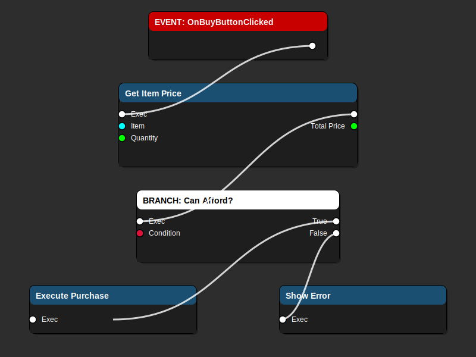

# Blueprint Image-Based Mockup Guide

> **Visual Blueprint documentation using high-quality SVG diagrams**

**Last Updated**: December 29, 2025  
**For Version**: 1.0.0-alpha  
**Target Engine**: Unreal Engine 5.6

---

## Overview

This guide provides **image-based documentation** for Blueprint patterns using SVG diagrams that closely match Unreal Engine's Blueprint editor appearance.

### Why Images?

- ✅ **Crystal clear** visual representation
- ✅ **Matches actual Blueprint appearance** precisely
- ✅ **Scalable** (SVG format scales without quality loss)
- ✅ **Renders perfectly** in GitHub, documentation sites, and editors
- ✅ **Professional quality** for presentations and training

---

## 🎨 Blueprint Node Types

### Event Nodes

Event nodes are entry points in Blueprint graphs (red header).


**Example: OnMarketInventoryUpdated**
- Red header indicates this is an event
- Single execution output pin (white)
- Triggered when market data changes

**Common Event Nodes:**
- `Event BeginPlay` - Called when actor starts
- `Event Tick` - Called every frame
- `Event OnClicked` - Called when UI element clicked
- `Event OnOverlapBegin` - Called when collision occurs

---

### Function Nodes

Function nodes perform actions and return values (blue header).


**Example: Get Available Items**
- Blue header indicates standard function
- Execution input/output pins (white)
- Input parameters (Target object reference)
- Return value (Array of inventory entries)
- Description box shows function purpose

**Common Function Nodes:**
- `Print String` - Debug output
- `Get Actor Location` - Returns position
- `Set Actor Location` - Moves actor
- `Spawn Actor` - Creates new actor

---

### Flow Control Nodes

Flow control nodes manage execution paths (orange header).


**Example: ForEach Loop**
- Orange header indicates flow control
- Execution input pin
- Array input (items to iterate)
- Loop Body output (executes for each item)
- Completed output (executes when loop finishes)
- Array Element and Index outputs

**Common Flow Control Nodes:**
- `ForLoop` - Iterate with counter
- `WhileLoop` - Loop while condition true
- `Sequence` - Execute multiple paths in order
- `Gate` - Control execution flow
- `DoOnce` - Execute only once

---

### Branch Nodes

Branch nodes create conditional logic (white header).


**Example: Is Valid?**
- White header indicates conditional
- Execution and condition inputs
- True/False execution outputs
- Condition displayed in node body

**Common Branch Patterns:**
- `Is Valid` - Check if reference exists
- `>=` `<=` `==` - Numeric comparisons
- `AND` `OR` `NOT` - Boolean logic
- `Switch` - Multi-way branching

---

## 🔄 Complete Blueprint Flow

### Real-World Example: Buy Item Validation



**Flow Explanation:**

1. **Event: OnBuyButtonClicked**
   - User clicks the buy button
   - Triggers the purchase flow

2. **Get Item Price**
   - Calculates total cost
   - Takes Item and Quantity as inputs
   - Returns Total Price

3. **Branch: Can Afford?**
   - Checks if player has enough credits
   - Compares player credits vs total price
   - Splits into two paths

4. **True Path: Execute Purchase**
   - Player has enough credits
   - Complete the transaction
   - Update inventory and credits

5. **False Path: Show Error**
   - Player cannot afford item
   - Display error message
   - Keep transaction in cart

---

## 📋 Pattern Library

### Pattern 1: Market Inventory Update

**Blueprint Flow:**


↓

↓


**Implementation Steps:**

1. **Event: OnMarketInventoryUpdated**
   - Triggered when market data changes
   - Execution output connects to next node

2. **Function: Get Available Items**
   - Calls C++ function to retrieve inventory
   - Returns array of market entries
   - Each entry contains: Item, Price, Stock

3. **ForEach Loop: Process Items**
   - Iterates through each inventory entry
   - Loop Body: Create UI widget for item
   - Loop Body: Populate widget with item data
   - Loop Body: Add widget to scrollbox
   - Completed: Finalize UI update

**Result:** Dynamic list of market items with current prices

---

### Pattern 2: Transaction Validation

**Blueprint Flow:**


**Validation Chain:**

1. **Get Item Price** - Calculate total cost
2. **Branch: Can Afford** - Check credits
3. **Branch: Has Cargo Space** - Check capacity (not shown)
4. **Branch: Item In Stock** - Verify availability (not shown)

If **all validations pass** → Execute Purchase  
If **any validation fails** → Show specific error

---

### Pattern 3: Loop with Widget Creation

**Common UI Pattern:**

```
ForEach Loop (Array: Items)
  ├── Loop Body:
  │   ├── Create Widget (Class: WBP_ItemEntry)
  │   ├── Set Item Data (Widget, Current Item)
  │   └── Add Child to ScrollBox (Parent, Widget)
  └── Completed:
      └── [Continue to next operation]
```

**Visual Reference:** See ForEach Loop image above

---

## 🎯 Node Pin Types

### Execution Pins (White)

- **Input:** ►─ (arrow pointing into node)
- **Output:** ─► (arrow pointing out of node)
- Controls execution flow
- Always white colored

### Data Pins (Colored)

| Pin Color | Data Type | Example |
|-----------|-----------|---------|
| 🔴 Red | Boolean | true, false |
| 🟢 Green | Integer/Float | 10, 3.14, -5 |
| 🟣 Pink/Magenta | String/Text | "Hello", "Price: 100 CR" |
| 🟡 Yellow | Vector | (X=1, Y=2, Z=3) |
| 🟠 Orange | Rotator/Transform | Rotation, full transform |
| 🔵 Cyan | Object Reference | Actor*, Component* |
| 🟤 Blue | Struct | Custom data structures |

---

## 📸 Creating Your Own Blueprint Images

### Method 1: Screenshot from Unreal

1. Open Blueprint in Unreal Editor
2. Zoom to appropriate level
3. Press `Ctrl+C` to copy selected nodes
4. Paste into image editor
5. Crop and save as PNG or SVG

### Method 2: Use the Image Generator

Use the provided Python script to generate SVG diagrams:

```bash
python3 Tools/generate_blueprint_images.py
```

This creates professional SVG diagrams in `docs/reference/images/blueprints/`

### Method 3: Draw.io / Diagrams.net

1. Use the Blueprint template (if available)
2. Or create custom shapes matching node colors
3. Export as SVG for best quality

---

## 🔧 Image Best Practices

### DO ✅

1. **Use SVG format** for scalable, crisp images
2. **Match Unreal colors** exactly (use provided color codes)
3. **Include pin labels** for clarity
4. **Show execution flow** with arrows/wires
5. **Add captions** below images explaining the flow
6. **Organize by pattern** (events, functions, complete flows)

### DON'T ❌

1. **Don't use low-res screenshots** - looks unprofessional
2. **Don't crop too tightly** - leave breathing room
3. **Don't mix styles** - be consistent across all images
4. **Don't forget alt text** - accessibility matters
5. **Don't use compression** that degrades quality

---

## 📚 Integration Examples

### In Documentation

```markdown
## Implementing Market Updates

When market prices change, update the UI:


1. Event triggers automatically
2. Get latest inventory from EconomyManager
3. Loop through each item
4. Update existing widgets or create new ones
```

### In Pull Requests

```markdown
## Changes Made

Added buy button validation:


- Checks player credits before purchase
- Shows appropriate error messages
- Only executes transaction if all checks pass
```

### In Training Materials

Use images in presentations, wikis, and onboarding documents for:
- Visual learning
- Step-by-step tutorials
- Architecture overviews
- Code review discussions

---

## 🎨 Color Reference

### Node Header Colors (Exact Unreal Engine Values)

| Node Type | Hex Color | RGB |
|-----------|-----------|-----|
| Event | `#C80000` | (200, 0, 0) |
| Function | `#1B4F72` | (27, 79, 114) |
| Pure Function | `#006400` | (0, 100, 0) |
| Branch | `#FFFFFF` | (255, 255, 255) |
| Flow Control | `#FF8C00` | (255, 140, 0) |
| Variable | `#5DADE2` | (93, 173, 226) |
| Macro | `#8E44AD` | (142, 68, 173) |
| Delegate | `#8B0000` | (139, 0, 0) |

### Pin Colors

| Pin Type | Hex Color | RGB |
|----------|-----------|-----|
| Exec | `#FFFFFF` | (255, 255, 255) |
| Boolean | `#DC143C` | (220, 20, 60) |
| Integer | `#00FF00` | (0, 255, 0) |
| Float | `#90EE90` | (144, 238, 144) |
| String | `#FF00FF` | (255, 0, 255) |
| Text | `#FFB6C1` | (255, 182, 193) |
| Vector | `#FFD700` | (255, 215, 0) |
| Object | `#00FFFF` | (0, 255, 255) |
| Struct | `#4682B4` | (70, 130, 180) |

---

## 🔗 Related Documentation

### Previous Guides (Text-Based)

- [BLUEPRINT_MOCKUP_GUIDE.md](BLUEPRINT_MOCKUP_GUIDE.md) - Text-based patterns
- [BLUEPRINT_VISUAL_MOCKUP_GUIDE.md](BLUEPRINT_VISUAL_MOCKUP_GUIDE.md) - ASCII art version
- [BLUEPRINT_DOCUMENTATION_EXAMPLES.md](BLUEPRINT_DOCUMENTATION_EXAMPLES.md) - Before/after examples

### Recommended Usage

- **Use images** for primary documentation
- **Use text** for quick notes and inline examples
- **Combine both** for comprehensive guides

---

## 📊 Image Inventory

### Available Diagrams

| Diagram | File | Description |
|---------|------|-------------|
| Event Node | `event_node.svg` | OnMarketInventoryUpdated example |
| Function Node | `function_node.svg` | Get Available Items with pins |
| ForEach Loop | `foreach_loop.svg` | Loop with array iteration |
| Branch Node | `branch_node.svg` | Conditional Is Valid check |
| Complete Flow | `complete_flow.svg` | Full buy validation flow |

### Generating More Images

To add new diagrams:

1. Edit `Tools/generate_blueprint_images.py`
2. Add new function: `def generate_your_node()`
3. Call in `main()`: `save_svg(generate_your_node(), 'filename.svg')`
4. Run script to generate new image
5. Reference in documentation with ``

---

## 💡 Tips for Best Results

### Screenshot Quality

If taking screenshots from Unreal Editor:
1. **Increase editor window size** for better resolution
2. **Zoom to 100%** for accurate representation
3. **Use transparent background** if possible
4. **Include all relevant pins** and connections
5. **Capture complete node title** text

### SVG Advantages

- **Scalable** - Looks perfect at any size
- **Text searchable** - Find nodes by name
- **Small file size** - Faster page loads
- **Editable** - Can update colors/text programmatically
- **Professional** - Crisp on all displays

---

## ✅ Quick Start Checklist

For documenting a new Blueprint pattern:

- [ ] Identify the key nodes in the pattern
- [ ] Take screenshot or generate SVG
- [ ] Save to `docs/reference/images/blueprints/`
- [ ] Create markdown documentation
- [ ] Embed image with ``
- [ ] Add description explaining the flow
- [ ] Include step-by-step breakdown
- [ ] Cross-reference related patterns
- [ ] Test image renders correctly on GitHub

---

## 🎓 Learning Path

### For New Developers

1. Start with single node images (event, function)
2. Understand pin types and colors
3. Study simple flows (2-3 nodes)
4. Progress to complete patterns
5. Practice with real examples

### For Documentation Writers

1. Use consistent image style
2. Always include alt text
3. Provide context before showing image
4. Explain the flow after image
5. Link to related patterns

---

## 🚀 Next Steps

This image-based approach provides:
- **Maximum clarity** for Blueprint documentation
- **Professional quality** visuals
- **Easy to understand** patterns
- **Reusable templates** for new content

Use these images in:
- System documentation
- Pull request descriptions
- Training materials
- Architecture discussions
- Code reviews

---

**Last Updated**: December 29, 2025  
**Maintained by**: Adastrea Development Team  
**Image Generator**: `Tools/generate_blueprint_images.py`  
**Image Directory**: `docs/reference/images/blueprints/`
