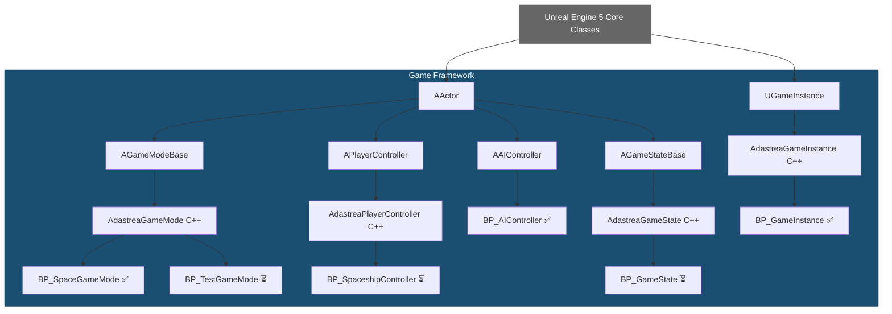
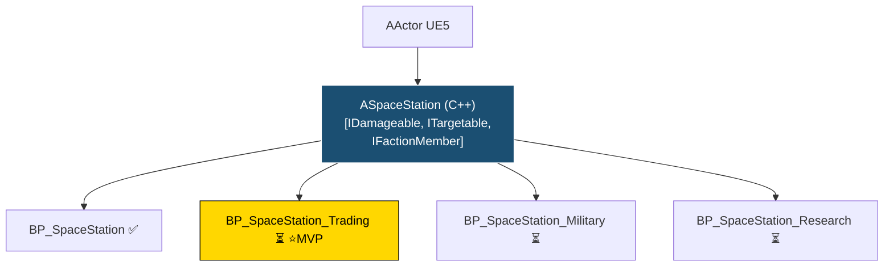
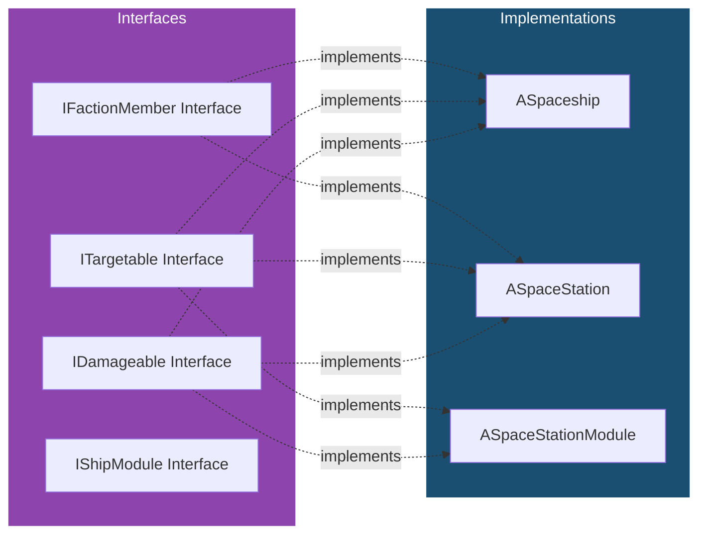
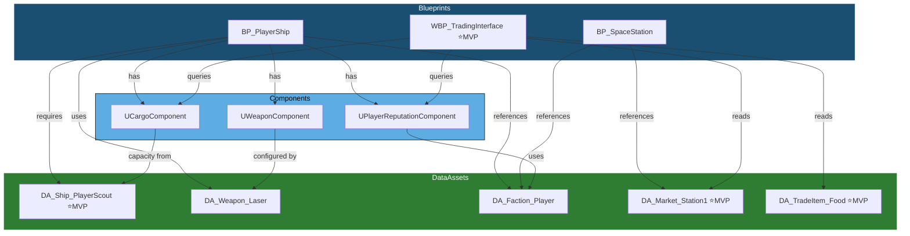
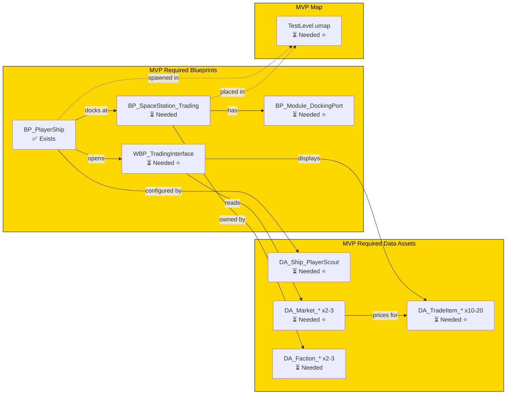

# Blueprint Class Tree Diagram - Adastrea (Mermaid)

**Visual Reference**: Complete class hierarchy showing all blueprints and their relationships.

---

## Complete Blueprint Tree

---

## Ship System Hierarchy

```mermaid
graph TD
    APawn[APawn UE5]
    ASpaceship["ASpaceship (C++)<br/>[IDamageable, ITargetable,<br/>IFactionMember]"]
    
    BP_PlayerShip[BP_PlayerShip ✅]
    BP_PlayerShip_Fighter[BP_PlayerShip_Fighter ⏳]
    BP_PlayerShip_Trader[BP_PlayerShip_Trader ⏳ ⭐MVP]
    
    BP_Ship_Corvette[BP_Ship_Corvette ✅]
    BP_Ship_Cruiser[BP_Ship_Cruiser ✅]
    BP_Ship_Destroyer[BP_Ship_Destroyer ✅]
    BP_Ship_Freighter[BP_Ship_Freighter ✅]
    BP_Ship_Fighter[BP_Ship_Fighter ✅]
    BP_Battleship[BP_Battleship ✅]
    
    BP_Ship_NPC_Fighter[BP_Ship_NPC_Fighter ⏳]
    BP_Ship_NPC_Trader[BP_Ship_NPC_Trader ⏳]
    BP_Ship_NPC_Interceptor[BP_Ship_NPC_Interceptor ⏳]
    
    APawn --> ASpaceship
    ASpaceship --> BP_PlayerShip
    ASpaceship --> BP_PlayerShip_Fighter
    ASpaceship --> BP_PlayerShip_Trader
    ASpaceship --> BP_Ship_Corvette
    ASpaceship --> BP_Ship_Cruiser
    ASpaceship --> BP_Ship_Destroyer
    ASpaceship --> BP_Ship_Freighter
    ASpaceship --> BP_Ship_Fighter
    ASpaceship --> BP_Battleship
    ASpaceship --> BP_Ship_NPC_Fighter
    ASpaceship --> BP_Ship_NPC_Trader
    ASpaceship --> BP_Ship_NPC_Interceptor
    
    style ASpaceship fill:#1B4F72,stroke:#fff,color:#fff
    style BP_PlayerShip fill:#2E7D32,stroke:#fff,color:#fff
    style BP_PlayerShip_Trader fill:#FFD700,stroke:#000,color:#000
```

**Key Properties:**
- `USpaceshipDataAsset* ShipDataAsset` - Ship configuration
- `UFloatingPawnMovement* MovementComponent` - 3D space movement
- `USpaceshipParticleComponent* ParticleComponent` - Engine VFX
- `USpringArmComponent* CameraSpringArm` - Camera positioning

---

## Station System Hierarchy

---

## Station Module Hierarchy

```mermaid
graph TD
    AActor[AActor UE5]
    ASpaceStationModule["ASpaceStationModule (C++)<br/>[IDamageable, ITargetable]"]
    
    subgraph Docking[Docking Modules ⭐MVP]
        DockingBay["ADockingBayModule<br/>Power: -50"]
        BP_DockingBay[BP_Module_DockingBay ⏳ ⭐]
        DockingPort["ADockingPortModule<br/>Power: -10"]
        BP_DockingPort[BP_Module_DockingPort ⏳ ⭐]
    end
    
    subgraph Power[Power Modules]
        Reactor["AReactorModule<br/>Power: +100"]
        BP_Reactor[BP_Module_Reactor ⏳]
        SolarArray["ASolarArrayModule<br/>Power: +30"]
        BP_SolarArray[BP_Module_SolarArray ⏳]
    end
    
    subgraph Storage[Storage Modules]
        CargoBay["ACargoBayModule<br/>Power: -5"]
        BP_CargoBay[BP_Module_CargoBay ✅]
        FuelDepot["AFuelDepotModule<br/>Power: -5"]
        BP_FuelDepot[BP_Module_FuelDepot ⏳]
    end
    
    subgraph Defense[Defense Modules]
        Turret["ATurretModule<br/>Power: -30"]
        BP_Turret[BP_Module_Turret ⏳]
        Shield["AShieldGeneratorModule<br/>Power: -40"]
        BP_Shield[BP_Module_ShieldGenerator ⏳]
    end
    
    subgraph Living[Living Modules]
        Habitation["AHabitationModule<br/>Power: -20"]
        BP_Habitation[BP_Module_Habitation ⏳]
        Barracks["ABarracksModule<br/>Power: -25"]
        BP_Barracks[BP_Module_Barracks ⏳]
    end
    
    subgraph Industrial[Industrial Modules]
        Fabrication["AFabricationModule<br/>Power: -35"]
        BP_Fabrication[BP_Module_Fabrication ⏳]
        Processing["AProcessingModule<br/>Power: -40"]
        BP_Processing[BP_Module_Processing ⏳]
    end
    
    subgraph Trading[Trading Modules ⭐MVP]
        Marketplace["AMarketplaceModule<br/>Power: -15"]
        BP_Marketplace[BP_Module_Marketplace ⏳ ⭐]
    end
    
    subgraph Research[Research Modules]
        ScienceLab["AScienceLabModule<br/>Power: -25"]
        BP_ScienceLab[BP_Module_ScienceLab ⏳]
    end
    
    subgraph Utility[Utility Modules]
        Corridor["ACorridorModule<br/>Power: -2"]
        BP_Corridor[BP_Module_Corridor ⏳]
    end
    
    AActor --> ASpaceStationModule
    ASpaceStationModule --> DockingBay
    DockingBay --> BP_DockingBay
    ASpaceStationModule --> DockingPort
    DockingPort --> BP_DockingPort
    
    ASpaceStationModule --> Reactor
    Reactor --> BP_Reactor
    ASpaceStationModule --> SolarArray
    SolarArray --> BP_SolarArray
    
    ASpaceStationModule --> CargoBay
    CargoBay --> BP_CargoBay
    ASpaceStationModule --> FuelDepot
    FuelDepot --> BP_FuelDepot
    
    ASpaceStationModule --> Turret
    Turret --> BP_Turret
    ASpaceStationModule --> Shield
    Shield --> BP_Shield
    
    ASpaceStationModule --> Habitation
    Habitation --> BP_Habitation
    ASpaceStationModule --> Barracks
    Barracks --> BP_Barracks
    
    ASpaceStationModule --> Fabrication
    Fabrication --> BP_Fabrication
    ASpaceStationModule --> Processing
    Processing --> BP_Processing
    
    ASpaceStationModule --> Marketplace
    Marketplace --> BP_Marketplace
    
    ASpaceStationModule --> ScienceLab
    ScienceLab --> BP_ScienceLab
    
    ASpaceStationModule --> Corridor
    Corridor --> BP_Corridor
    
    style ASpaceStationModule fill:#1B4F72,stroke:#fff,color:#fff
    style Docking fill:#FFD700,stroke:#000,color:#000
    style Trading fill:#FFD700,stroke:#000,color:#000
```

---

## Component Architecture

```mermaid
graph TD
    UActorComponent[UActorComponent UE5]
    
    subgraph Movement[Movement Components]
        FloatingPawn[UFloatingPawnMovement UE5]
        Navigation[UNavigationComponent]
        SimpleAI[USimpleAIMovementComponent]
    end
    
    subgraph Combat[Combat Components]
        Weapon[UWeaponComponent]
        Targeting[UTargetingComponent]
        CombatHealth[UCombatHealthComponent]
        PointDefense[UPointDefenseComponent]
        Boarding[UBoardingComponent]
    end
    
    subgraph Trading[Trading Components ⭐MVP]
        Cargo[UCargoComponent ⭐]
        AITrader[UAITraderComponent]
        PlayerTrader[UPlayerTraderComponent]
    end
    
    subgraph Player[Player Components]
        Reputation[UPlayerReputationComponent ⭐MVP]
        Progression[UPlayerProgressionComponent]
        Unlock[UPlayerUnlockComponent]
    end
    
    subgraph Customization[Customization Components]
        ShipCustom[UShipCustomizationComponent]
        ShipUpgrade[UShipUpgradeComponent]
        ShipModule[UShipModuleComponent]
    end
    
    subgraph Visual[Visual Components]
        Particle[USpaceshipParticleComponent]
        StaticMesh[UStaticMeshComponent UE5]
    end
    
    UActorComponent --> FloatingPawn
    UActorComponent --> Navigation
    UActorComponent --> SimpleAI
    
    UActorComponent --> Weapon
    UActorComponent --> Targeting
    UActorComponent --> CombatHealth
    UActorComponent --> PointDefense
    UActorComponent --> Boarding
    
    UActorComponent --> Cargo
    UActorComponent --> AITrader
    UActorComponent --> PlayerTrader
    
    UActorComponent --> Reputation
    UActorComponent --> Progression
    UActorComponent --> Unlock
    
    UActorComponent --> ShipCustom
    UActorComponent --> ShipUpgrade
    UActorComponent --> ShipModule
    
    UActorComponent --> Particle
    UActorComponent --> StaticMesh
    
    style UActorComponent fill:#1B4F72,stroke:#fff,color:#fff
    style Trading fill:#FFD700,stroke:#000,color:#000
    style Player fill:#FFD700,stroke:#000,color:#000
```

---

## Interface Implementation Map

---

## Data Asset Dependency Map

---

## MVP Trade Simulator Critical Path

---

## Legend

**Status Indicators:**
- ✅ = Exists in repository
- ⏳ = Planned/needed
- ⭐ MVP = Critical for Trade Simulator MVP
- [Interface] = Implements interface

**Relationships:**
- Solid arrows = Inheritance
- Dashed arrows = Implementation/Reference
- Dotted arrows = Weak reference

---

## Quick Statistics

### Blueprint Count by System

| System | C++ Classes | Blueprints Exist | Blueprints Needed | Total |
|--------|-------------|------------------|-------------------|-------|
| **Game Framework** | 4 | 3 | 2 | 5 |
| **Ships** | 2 | 7 | 10 | 17 |
| **Stations** | 18 | 3 | 22 | 25 |
| **Combat** | 5 | 4 | 10 | 14 |
| **Trading** | 3 | 0 | 3 | 3 |
| **AI** | 3 | 2 | 3 | 5 |
| **UI** | 15 | 0 | 30 | 30 |
| **Input** | 2 | 11 (actions) | 3 | 14 |
| **Total** | **52** | **30** | **83** | **113** |

### MVP Requirements

**Critical for MVP (30-40 items):**
- 1 Player ship blueprint
- 2-3 Station blueprints
- 1 Docking module blueprint
- 1 Trading UI widget
- 10-20 Trade item data assets
- 2-3 Market data assets
- 1 Ship data asset
- 2-3 Faction data assets
- 1 Test level map
