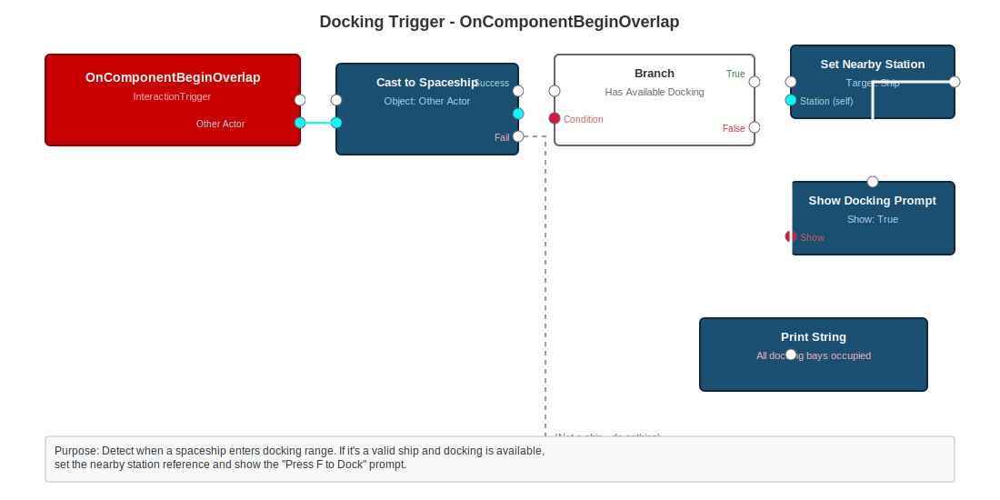
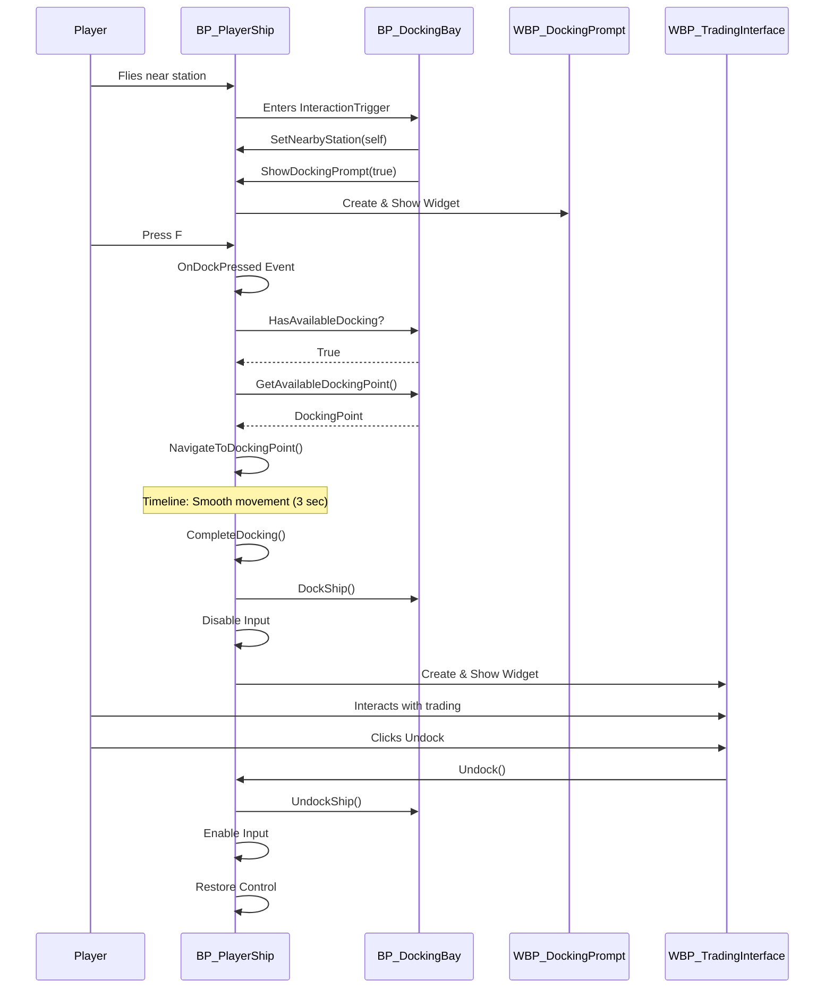

# Docking System Blueprint Implementation Guide

> **⚠️ DEPRECATED**: This guide has been consolidated into the unified Trading and Docking Complete Guide.  
> **See**: [Trading and Docking Complete Guide](../mvp/TRADING_AND_DOCKING_COMPLETE_GUIDE.md)

---

## Overview

**Status**: **DEPRECATED** - Refer to unified guide above

This guide provides **complete step-by-step instructions** for implementing the full docking system in Adastrea, including:

- All required Blueprint classes
- Blueprint graph implementations with visual diagrams
- **"Press F to Dock" interaction system**
- Docking point setup on space stations
- Complete workflow from approach to undocking

**🔄 UPDATED (January 2026):** Core docking logic has been **refactored to C++** (`ASpaceship` class). Blueprint implementation is now **simplified** - only widget configuration and input binding required. All docking functions are automatically available via `BlueprintCallable` C++ functions.

**Prerequisites:**
- Unreal Engine 5.6 project open
- Adastrea source code compiled
- Basic Blueprint knowledge

---

## 🚀 Quick Start (C++ Implementation)

If you're setting up docking for the first time with the C++ implementation:

1. **Configure Widget Classes** in BP_PlayerShip Class Defaults:
   - Set `DockingPromptWidgetClass` to `WBP_DockingPrompt`
   - Set `TradingInterfaceClass` to `WBP_TradingInterface`
   - Set `DockingCurve` to a float curve (0→1 over 3 seconds, cubic ease)

2. **Bind Input Action** (Press F):
   - Add Input Action `IA_Dock` to `IMC_Spaceship`
   - Bind to F key
   - In BP_PlayerShip Event Graph: Call `RequestDocking()` on F press

3. **Add Undock Button** to `WBP_TradingInterface`:
   - OnClicked → Get Owning Player Pawn → Cast to Spaceship → Call `Undock()`

**That's it!** All docking logic is handled by C++.

---

## Table of Contents

1. [System Architecture Overview](#system-architecture-overview)
2. [Required Blueprint Classes](#required-blueprint-classes)
3. [Step 1: Space Station Setup](#step-1-space-station-setup)
4. [Step 2: Docking Module Setup](#step-2-docking-module-setup)
5. [Step 3: Player Ship Interaction](#step-3-player-ship-interaction)
6. [Step 4: Docking Interaction System](#step-4-docking-interaction-system)
7. [Step 5: UI Prompts](#step-5-ui-prompts)
8. [Step 6: Docking Navigation](#step-6-docking-navigation)
9. [Step 7: Trading Interface](#step-7-trading-interface)
10. [Complete Blueprint Graphs](#complete-blueprint-graphs)
11. [Testing Checklist](#testing-checklist)

---

## System Architecture Overview

### Component Hierarchy

```
ASpaceStation (BP_SpaceStation_Main)
├─ Modules (Array of Space Station Module)
│
├─ ADockingBayModule (BP_DockingBay)
│  ├─ DockingPoints (Array of Scene Component, 4-6 slots)
│  ├─ InteractionTrigger (Sphere Component)
│  └─ Functions: DockShip(), UndockShip(), GetAvailableDockingPoint()
│
├─ ADockingPortModule (BP_DockingPort)
│  ├─ DockingPoints (Array of Scene Component, 1 slot)
│  ├─ InteractionTrigger (Sphere Component)
│  └─ Functions: DockShip(), UndockShip(), GetAvailableDockingPoint()
│
└─ Other Modules (Reactor, CargoBay, etc.)

ASpaceship (BP_PlayerShip)
├─ Movement & Flight Components
├─ Docking State Variables
├─ Nearby Station Reference
└─ Functions: RequestDocking(), CompleteDocking(), Undock()
```

### Interaction Flow

```
1. Player flies near station → Trigger overlap detected
2. UI shows "Press F to Dock" prompt
3. Player presses F → Request docking
4. Station finds available docking point
5. Ship navigates to docking point (autopilot)
6. Ship attaches to docking point
7. Controls disabled, trading UI opens
8. Player completes trading
9. Player presses F to undock
10. Ship detaches and control restored
```

---

## Required Blueprint Classes

### 1. BP_SpaceStation_Main
**Base Class:** `ASpaceStation` (C++)  
**Purpose:** Main station actor with docking modules  
**Location:** `Content/Blueprints/Stations/`

### 2. BP_DockingBay
**Base Class:** `ADockingBayModule` (C++)  
**Purpose:** Large docking facility (4-6 ships)  
**Location:** `Content/Blueprints/Stations/Modules/`

### 3. BP_DockingPort
**Base Class:** `ADockingPortModule` (C++)  
**Purpose:** Small docking port (1 ship)  
**Location:** `Content/Blueprints/Stations/Modules/`

### 4. BP_PlayerShip
**Base Class:** `ASpaceship` (C++)  
**Purpose:** Player-controlled ship with docking capability  
**Location:** `Content/Blueprints/Ships/`

### 5. WBP_DockingPrompt
**Base Class:** `UUserWidget`  
**Purpose:** UI widget showing "Press F to Dock"  
**Location:** `Content/UI/Widgets/`

### 6. WBP_TradingInterface
**Base Class:** `UUserWidget`  
**Purpose:** Trading interface when docked  
**Location:** `Content/UI/Widgets/`

---

## Step 1: Space Station Setup

### Create BP_SpaceStation_Main

1. **Create Blueprint:**
   - Right-click in Content Browser → Blueprint Class
   - Search for `ASpaceStation`
   - Name: `BP_SpaceStation_Main`
   - Location: `Content/Blueprints/Stations/`

2. **Add Components (in Blueprint Editor):**
   ```
   DefaultSceneRoot
   ├─ StaticMesh_StationCore
   │  └─ Material: M_Station_Metal
   ├─ BP_DockingBay_1 (Child Actor Component)
   │  └─ Relative Location: (500, 0, 0)
   ├─ BP_DockingBay_2 (Child Actor Component)
   │  └─ Relative Location: (-500, 0, 0)
   └─ SphereComponent (Detection Range)
      └─ Sphere Radius: 5000.0 (50 meter detection)
   ```

3. **Configure Properties:**
   - **StationName:** "Trade Hub Alpha"
   - **MaxStructuralIntegrity:** 10000.0
   - **CurrentStructuralIntegrity:** 10000.0

### Blueprint Graph: BeginPlay

**Purpose:** Initialize station modules array


**Implementation:**
```
Event BeginPlay
├─ Get All Actors of Class (ADockingBayModule)
│  └─ [Output: Array of docking modules]
├─ Append to Array (Modules)
│  └─ [Target: self.Modules]
└─ Print String "Station initialized with X docking modules"
```

**Blueprint Text Format:**
```
Event: BeginPlay
→ Get All Actors of Class
  Class: DockingBayModule
→ For Each Loop
  → Add to Array
    Target: Modules (self)
    Item: Array Element
→ Print String
  Text: "Station Ready: {Modules.Num()} docking modules"
```

---

## Step 2: Docking Module Setup

### Create BP_DockingBay

1. **Create Blueprint:**
   - Base Class: `ADockingBayModule`
   - Name: `BP_DockingBay`
   - Location: `Content/Blueprints/Stations/Modules/`

2. **Add Components:**
   ```
   MeshComponent (from parent)
   ├─ Static Mesh: SM_DockingBay_Large
   ├─ DockingPoint_1 (Scene Component)
   │  └─ Location: (200, 0, 100)
   ├─ DockingPoint_2 (Scene Component)
   │  └─ Location: (200, 200, 100)
   ├─ DockingPoint_3 (Scene Component)
   │  └─ Location: (200, -200, 100)
   ├─ DockingPoint_4 (Scene Component)
   │  └─ Location: (400, 0, 100)
   └─ InteractionTrigger (Sphere Component)
      └─ Sphere Radius: 1500.0 (15 meters)
   ```

3. **Configure DockingPoints Array:**
   - Open **Class Defaults**
   - Find **DockingPoints** array
   - Add 4 elements:
     - Element 0: DockingPoint_1
     - Element 1: DockingPoint_2
     - Element 2: DockingPoint_3
     - Element 3: DockingPoint_4

4. **Configure Properties:**
   - **MaxDockedShips:** 4
   - **ModulePower:** 50.0
   - **ModuleType:** "Docking Bay"

### Blueprint Graph: InteractionTrigger OnComponentBeginOverlap

**Purpose:** Detect when ship enters docking range



**Implementation:**
```
Event: OnComponentBeginOverlap (InteractionTrigger)
├─ Cast to Spaceship (Other Actor)
│  └─ [Success] Branch
│     ├─ Check: HasAvailableDocking (self)
│     │  └─ [True] Set Nearby Station (on ship)
│     │     ├─ Target: Ship
│     │     ├─ Station: self
│     │     └─ Show Docking Prompt (call on ship)
│     └─ [False] Print "Docking bay full"
└─ [Fail] Do nothing (not a ship)
```

**Blueprint Text Format:**
```
Event: OnComponentBeginOverlap
  Component: InteractionTrigger
  Other Actor: (variable)

→ Cast to Spaceship
  Object: Other Actor
  [Success]
  → Branch
    Condition: Has Available Docking (self)
    [True]
    → Call Function on Spaceship
      Function: SetNearbyStation
      Station: self
    → Call Function on Spaceship
      Function: ShowDockingPrompt
      Show: True
    [False]
    → Print String
      Text: "All docking bays occupied"
```

### Blueprint Graph: InteractionTrigger OnComponentEndOverlap

**Purpose:** Hide docking prompt when ship leaves range

```
Event: OnComponentEndOverlap (InteractionTrigger)
├─ Cast to Spaceship (Other Actor)
│  └─ [Success]
│     ├─ Clear Nearby Station (on ship)
│     │  └─ Target: Ship
│     └─ Hide Docking Prompt (call on ship)
│        └─ Show: False
└─ [Fail] Do nothing
```

---

## Step 3: Player Ship Interaction

### Modify BP_PlayerShip

**Note:** Core docking logic is now implemented in C++ (`ASpaceship` class). Blueprint setup is simplified to configuration only.

#### 1. Configure Widget Class References

In **BP_PlayerShip** Class Defaults:

| Property | Category | Type | Description |
|----------|----------|------|-------------|
| `DockingPromptWidgetClass` | Docking\|UI | Widget Class | Set to WBP_DockingPrompt |
| `TradingInterfaceClass` | Docking\|UI | Widget Class | Set to WBP_TradingInterface |
| `DockingCurve` | Docking | Curve Float | Curve asset for smooth docking (cubic ease) |

**Steps:**
1. Open **BP_PlayerShip** in Blueprint editor
2. Select **Class Defaults** in toolbar
3. Find **Docking > UI** category
4. Set **Docking Prompt Widget Class** to `WBP_DockingPrompt`
5. Set **Trading Interface Class** to `WBP_TradingInterface`
6. Find **Docking** category
7. Set **Docking Curve** to a float curve with cubic interpolation (0.0 to 1.0 over 3 seconds)

#### 2. C++ Docking Variables (Read-Only in Blueprints)

The following variables are managed by C++ and exposed as **BlueprintReadOnly** or **BlueprintReadWrite**:

| Variable Name | Type | Access | Description |
|--------------|------|--------|-------------|
| `NearbyStation` | Space Station Module | ReadWrite | Station in docking range |
| `CurrentDockingPoint` | Scene Component | ReadWrite | Assigned docking point |
| `bIsDocked` | Boolean | ReadOnly | Is ship currently docked |
| `bIsDocking` | Boolean | ReadOnly | Is ship in docking sequence |
| `DockingPromptWidget` | User Widget | ReadOnly | UI widget instance |
| `TradingWidget` | User Widget | ReadOnly | Trading UI instance |
| `DockingTimeline` | Timeline Component | ReadOnly | Smooth movement timeline |

**Note:** These variables are automatically available in Blueprint graphs. You don't need to create them manually.

#### 3. C++ Docking Functions (BlueprintCallable)

The following functions are implemented in C++ and available in Blueprints:

**Core Functions:**
- `SetNearbyStation(Station)` - Called by docking module on overlap
- `ShowDockingPrompt(bShow)` - Show/hide docking UI prompt
- `RequestDocking()` - Initiate docking sequence (call from input)
- `Undock()` - Undock and restore control
- `IsDocked()` - Check if currently docked (Pure function)
- `IsDocking()` - Check if in docking sequence (Pure function)

**Internal Functions** (called automatically by timeline):
- `NavigateToDockingPoint(DockingPoint)` - Start smooth movement
- `CompleteDocking()` - Finalize docking
- `UpdateDockingMovement(Alpha)` - Timeline update callback
- `OnDockingMovementComplete()` - Timeline finished callback

**Usage in Blueprints:**
These functions appear in the Blueprint context menu under **Docking** category. Right-click in Event Graph and search for function name.

#### 4. Blueprint Implementation Requirements

**Only two Blueprint implementations are needed:**

##### A. Input Binding (Press F to Dock)

See [Step 4: Docking Interaction System](#step-4-docking-interaction-system) for complete input setup.

**Summary:**
```
Event: OnDockPressed (from Input Action IA_Dock)
→ Branch: IsDocked (self)
  [True]  → Call: Undock (self)
  [False] → Call: RequestDocking (self)
```

##### B. Trading UI Undock Button

In **WBP_TradingInterface** widget:
```
Event: OnClicked (UndockButton)
→ Get Owning Player Pawn
→ Cast to Spaceship
  [Success]
  → Call: Undock (Spaceship)
```

---

### Deprecated Blueprint Functions

The following functions are **no longer needed** in Blueprint:

❌ `SetNearbyStation` - Now handled by C++  
❌ `ShowDockingPrompt` - Now handled by C++  
❌ `RequestDocking` - Now handled by C++  
❌ `NavigateToDockingPoint` - Now handled by C++  
❌ `CompleteDocking` - Now handled by C++  
❌ `Undock` - Now handled by C++

**If you have existing Blueprint implementations of these functions, you can safely delete them.** The C++ versions will be called automatically.

---

### Migration from Blueprint Implementation

If you have an existing Blueprint implementation:

1. **Backup your Blueprint** before making changes
2. **Delete** custom Blueprint functions listed above
3. **Keep** input binding and UI button implementations
4. **Set** widget class references in Class Defaults
5. **Test** docking still works (C++ will handle logic)

The C++ implementation is **backward compatible** - existing Blueprints that call these functions will automatically use the C++ versions.

---

## Step 4: Docking Interaction System

### Setup Enhanced Input (Press F)

1. **Create Input Action: IA_Dock**
   - Location: `Content/Input/Actions/`
   - Right-click → Input → Input Action
   - Name: `IA_Dock`
   - Value Type: Digital (bool)

2. **Add to Input Mapping Context**
   - Open: `IMC_Spaceship` (or your spaceship input context)
   - Add Mapping:
     - Action: `IA_Dock`
     - Key: `F`
     - Modifiers: None
     - Triggers: Pressed

3. **Add to InputConfigDataAsset**
   - Open your `DA_InputConfig` Blueprint
   - Under **Interaction** category:
     - **DockAction:** IA_Dock

### Blueprint: Bind Input in BP_PlayerShip

**Event Graph: BeginPlay**

```
Event: BeginPlay
→ Get Player Controller
  Return: PlayerController
→ Get Enhanced Input Component
  Target: PlayerController
  Return: InputComponent
→ Bind Action
  Input Component: InputComponent
  Action: IA_Dock (from InputConfigDataAsset)
  Trigger Event: Started
  Callback: OnDockPressed (Custom Event)
```

**Custom Event: OnDockPressed**

```
Event: OnDockPressed
→ Branch: bIsDocked
  [True]
  → Call: Undock (self)
  
  [False]
  → Call: RequestDocking (self)
```

---

## Step 5: UI Prompts

### Create WBP_DockingPrompt Widget

1. **Create Widget Blueprint:**
   - Right-click → User Interface → Widget Blueprint
   - Name: `WBP_DockingPrompt`
   - Location: `Content/UI/Widgets/`

2. **Widget Hierarchy:**
   ```
   Canvas Panel
   └─ Horizontal Box (Anchored: Bottom Center)
      ├─ Image (Icon_Keyboard_F)
      │  └─ Size: 32x32
      ├─ Spacer (8px)
      └─ Text Block
         └─ Text: "Press F to Dock"
         └─ Font Size: 18
         └─ Color: White
   ```

3. **Styling:**
   - Background: Semi-transparent dark panel
   - Position: Bottom center, Y offset: -100
   - Padding: 10px all sides

### Create WBP_TradingInterface Widget

1. **Create Widget Blueprint:**
   - Name: `WBP_TradingInterface`
   - Location: `Content/UI/Widgets/`

2. **Basic Layout:**
   ```
   Canvas Panel
   ├─ Background Image (Blur)
   ├─ Vertical Box (Center)
   │  ├─ Text Block: "Trading Interface"
   │  ├─ Spacer
   │  ├─ Button: "Buy"
   │  ├─ Button: "Sell"
   │  ├─ Button: "Ship Upgrades"
   │  └─ Button: "Undock"
   └─ Inventory Display
   ```

3. **Button Bindings:**
   - **Undock Button → OnClicked:**
     ```
     Event: OnClicked (UndockButton)
     → Get Owning Player Pawn
       Return: PlayerShip
     → Cast to Spaceship
       [Success]
       → Call: Undock (PlayerShip)
     ```

---

## Step 6: Docking Navigation

### Enhanced NavigateToDockingPoint with Smooth Movement

**Timeline Setup: DockingTimeline**

1. **Create Timeline in BP_PlayerShip:**
   - Right-click in Event Graph → Add Timeline
   - Name: `DockingTimeline`
   - Length: 3.0 seconds
   - Autoplay: False

2. **Add Float Track:**
   - Name: `Alpha`
   - Keys:
     - Time 0.0 → Value 0.0 (Cubic ease in)
     - Time 3.0 → Value 1.0 (Cubic ease out)

3. **Timeline Implementation:**

```
Function: NavigateToDockingPoint
  Input: DockingPoint (Scene Component)

→ Store Initial Transform
  → Get Actor Location (self)
    Return: StartLocation (Vector)
  → Get Actor Rotation (self)
    Return: StartRotation (Rotator)
  → Set: DockingStartLocation (variable)
  → Set: DockingStartRotation (variable)

→ Store Target Transform
  → Get Component Location (DockingPoint)
    Return: TargetLocation (Vector)
  → Get Component Rotation (DockingPoint)
    Return: TargetRotation (Rotator)
  → Set: DockingTargetLocation (variable)
  → Set: DockingTargetRotation (variable)

→ Play from Start (DockingTimeline)

Timeline Update Event:
→ Get Alpha (DockingTimeline)
  Return: Alpha (Float 0-1)
  
→ Lerp (Vector)
  A: DockingStartLocation
  B: DockingTargetLocation
  Alpha: Alpha
  Return: NewLocation

→ RLerp (Rotator)
  A: DockingStartRotation
  B: DockingTargetRotation
  Alpha: Alpha
  Shortest Path: True
  Return: NewRotation

→ Set Actor Location and Rotation
  Target: self
  New Location: NewLocation
  New Rotation: NewRotation
  Sweep: False

Timeline Finished Event:
→ Call: CompleteDocking (self)
```

---

## Step 7: Trading Interface

### MVP Trading Interface Implementation

For the **Trade Simulator MVP**, the trading interface can start simple:

**WBP_TradingInterface Graph:**

```
Event: Construct
→ Get Station Reference
  From: Player Ship → NearbyStation
  Return: StationRef

→ Get Market Data
  Target: StationRef
  Return: AvailableGoods (Array)

→ Populate Item List
  For Each: AvailableGoods
    → Add Item to ScrollBox
      Item Name: Good.DisplayName
      Price: Good.BasePrice
      Quantity: Good.AvailableQuantity
```

**Button: Buy Item**
```
Event: OnClicked (BuyButton)
→ Get Selected Item
  Return: ItemData
  
→ Check Player Credits
  Player Credits: Get Credits (Player)
  Item Cost: ItemData.Price
  
→ Branch: PlayerCredits >= ItemCost
  [True]
  → Subtract Credits
    Amount: ItemCost
  → Add to Ship Cargo
    Item: ItemData
    Quantity: 1
  → Update UI Display
  → Play Sound: Purchase_Success
  
  [False]
  → Show Message: "Insufficient Credits"
  → Play Sound: Purchase_Failed
```

---

## Complete Blueprint Graphs

### Overview Diagram



---

## Testing Checklist

### Basic Functionality

- [ ] Station appears in level with docking modules
- [ ] Docking points visible in editor (Scene Components)
- [ ] InteractionTrigger sphere visible in editor

### Approach & Detection

- [ ] Flying near station triggers overlap
- [ ] "Press F to Dock" prompt appears at correct distance
- [ ] Prompt disappears when flying away
- [ ] Multiple stations don't conflict

### Docking Request

- [ ] Pressing F initiates docking sequence
- [ ] Ship starts moving toward docking point
- [ ] Movement is smooth (timeline interpolation)
- [ ] Ship rotation aligns with docking point
- [ ] No collision issues during approach

### Docking Complete

- [ ] Ship stops at correct position
- [ ] Ship controls disabled
- [ ] Ship hidden or camera changed
- [ ] Trading UI appears
- [ ] Mouse cursor visible
- [ ] Trading interface functional

### Undocking

- [ ] Undock button clickable
- [ ] Trading UI closes
- [ ] Ship becomes visible
- [ ] Ship controls restored
- [ ] Mouse cursor hidden
- [ ] Ship receives forward impulse
- [ ] Docking point marked as free

### Edge Cases

- [ ] All docking bays full → Shows error message
- [ ] Press F while out of range → No action
- [ ] Press F during docking sequence → No duplicate docking
- [ ] Multiple ships docking → Each gets unique slot
- [ ] Station destroyed while docked → Graceful handling

### Performance

- [ ] No frame drops during docking
- [ ] Timeline runs smoothly
- [ ] UI responsive
- [ ] No memory leaks (repeated dock/undock)

---

## Common Issues & Solutions

### Issue: "Press F" prompt doesn't appear

**Solution:**
- Check InteractionTrigger sphere radius (should be ~1500 units)
- Verify collision channel settings (Query Only)
- Ensure BP_PlayerShip has ShowDockingPrompt function
- Check if Widget is being created correctly

### Issue: Ship doesn't move to docking point

**Solution:**
- Verify CurrentDockingPoint is set correctly
- Check Timeline is playing (Add debug print at Timeline Update)
- Ensure DockingPoint has valid transform
- Check ship has movement component enabled

### Issue: Ship jumps/snaps instead of smooth movement

**Solution:**
- Verify Timeline curve type is set to Cubic (not Linear)
- Check Timeline length (should be 3+ seconds)
- Use RLerp for rotation (not RInterpTo in Timeline)
- Ensure DeltaTime is not used in Timeline (use Alpha instead)

### Issue: Docking point already occupied

**Solution:**
- Check DockingBayModule's CurrentDockedShips counter
- Ensure UndockShip() is called when player undocks
- Verify HasAvailableDocking() check before assigning slot
- Add tracking map: `TMap<USceneComponent*, ASpaceship*> OccupiedSlots`

### Issue: Trading UI doesn't open

**Solution:**
- Verify WBP_TradingInterface class reference is correct
- Check if Widget is being added to viewport
- Ensure Player Controller has valid HUD
- Try Set Input Mode UI Only with explicit widget focus

---

## Advanced Features (Post-MVP)

### Queued Docking

Multiple ships waiting for docking slot:

```cpp
TArray<ASpaceship*> DockingQueue;

void ADockingBayModule::AddToQueue(ASpaceship* Ship)
{
    if (!DockingQueue.Contains(Ship))
    {
        DockingQueue.Add(Ship);
        NotifyQueuePosition(Ship, DockingQueue.Num());
    }
}

void ADockingBayModule::ProcessQueue()
{
    if (HasAvailableDocking() && DockingQueue.Num() > 0)
    {
        ASpaceship* NextShip = DockingQueue[0];
        DockingQueue.RemoveAt(0);
        GrantDockingPermission(NextShip);
    }
}
```

### Automated Docking

AI ships automatically docking:

```
Function: AI_RequestAutoDocking
  Input: TargetStation (ASpaceStation)

→ Find Nearest Docking Module
  Target: TargetStation
  Return: NearestModule

→ Request Docking Permission
  Target: NearestModule
  Ship: self
  Return: Granted (Boolean)

→ Branch: Granted
  [True]
  → Get Assigned Docking Point
    Return: DockingPoint
  → AI Move To Location
    Target Location: DockingPoint Location
    Acceptance Radius: 50.0
  → On Move Completed
    → Attach to Docking Point
    → Trigger Trading Logic
```

### Docking Fees

Charge credits for docking:

```
Function: ProcessDockingFee
  Input: Ship (ASpaceship)

→ Get Station Faction
  Return: Faction

→ Get Player Relationship
  Ship: Ship
  Faction: Faction
  Return: Relationship (-100 to +100)

→ Calculate Fee
  Base Fee: 100
  Relationship Modifier: (100 - Relationship) / 100
  Final Fee: BaseFee * Modifier

→ Branch: PlayerCredits >= FinalFee
  [True]
  → Subtract Credits
    Amount: FinalFee
  → Grant Docking
  → Show Message: "Docking fee: X credits"
  
  [False]
  → Deny Docking
  → Show Message: "Insufficient funds for docking fee"
```

### Tractor Beam Assistance

Visual effect guiding ship to docking point:

```
Function: ActivateTractorBeam
  Input: Ship (ASpaceship), DockingPoint (USceneComponent)

→ Spawn Niagara System
  Template: NS_TractorBeam
  Location: DockingPoint Location
  Attach to: self

→ Set Beam Target
  Target: Ship Location
  
→ Timeline: Beam Intensity (0-1 over 0.5 sec)
  Update:
  → Set Niagara Variable
    Name: "Intensity"
    Value: Timeline Alpha
```

---

## Related Documentation

**Core System References:**
- `docs/reference/DOCKING_SYSTEM_QUICK_REFERENCE.md` - Component architecture
- `docs/reference/DOCKING_SYSTEM_VISUAL_DIAGRAM.md` - Visual flow diagrams
- `docs/setup/STATION_MODULE_BLUEPRINTS_GUIDE.md` - Module setup

**C++ Header Files:**
- `Source/Adastrea/Public/Stations/DockingBayModule.h` - Docking bay class
- `Source/Adastrea/Public/Stations/DockingPortModule.h` - Docking port class
- `Source/Adastrea/Public/Stations/SpaceStation.h` - Station base class
- `Source/Adastrea/Public/Ships/Spaceship.h` - Ship base class
- `Source/Adastrea/Public/Input/InputConfigDataAsset.h` - Input configuration

**Blueprint Standards:**
- `.github/instructions/blueprint-documentation.instructions.md` - Blueprint doc standards
- `docs/reference/BLUEPRINT_IMAGE_GUIDE.md` - Visual documentation guide

---

## Summary

### What You Need to Create:

1. **BP_SpaceStation_Main** - Main station with modules array
2. **BP_DockingBay** (or BP_DockingPort) - Docking module with:
   - Scene components for docking points
   - Sphere trigger for interaction
   - Overlap events for detection
3. **BP_PlayerShip modifications:**
   - Variables: NearbyStation, CurrentDockingPoint, bIsDocked
   - Functions: RequestDocking, NavigateToDockingPoint, CompleteDocking, Undock
   - Input binding: F key → OnDockPressed event
4. **WBP_DockingPrompt** - "Press F to Dock" UI
5. **WBP_TradingInterface** - Trading UI with Undock button

### Key Takeaways:

✅ **Docking modules need:**
- DockingPoints array (Array of Scene Component)
- InteractionTrigger (Sphere Component)
- Overlap detection to show prompt

✅ **Player ship needs:**
- Reference to nearby station
- Input binding for F key
- Timeline for smooth docking movement
- Functions to handle dock/undock logic

✅ **UI needs:**
- Docking prompt widget (shown on overlap)
- Trading interface widget (shown when docked)
- Undock button to restore control

✅ **The "Press F" workflow:**
1. Overlap → Show prompt
2. Press F → Request docking
3. Get docking point → Navigate
4. Complete → Disable control + Show UI
5. Undock → Restore control

---

## C++ Implementation Reference

### Core C++ Files

**Header:** `Source/Adastrea/Public/Ships/Spaceship.h`
- Docking member variables (NearbyStation, CurrentDockingPoint, bIsDocked, etc.)
- Widget class references (DockingPromptWidgetClass, TradingInterfaceClass)
- Timeline component for smooth movement
- BlueprintCallable function declarations

**Implementation:** `Source/Adastrea/Private/Ships/Spaceship.cpp`
- Complete docking logic implementation
- Timeline callback bindings
- Widget creation and management
- Input handling and state transitions

### Key C++ Functions

```cpp
// Called by docking module on overlap
void SetNearbyStation(USpaceStationModule* Station);

// Show/hide docking prompt
void ShowDockingPrompt(bool bShow);

// Initiate docking sequence (call from input)
void RequestDocking();

// Navigate to docking point (internal)
void NavigateToDockingPoint(USceneComponent* DockingPoint);

// Complete docking (internal - timeline callback)
void CompleteDocking();

// Undock and restore control
void Undock();

// Query functions
bool IsDocked() const;
bool IsDocking() const;
```

### Blueprint Access

All C++ functions are exposed to Blueprints via `UFUNCTION(BlueprintCallable)` macros. Search for function names in Blueprint context menu under **Docking** category.

**Variables** are exposed with appropriate access levels:
- `BlueprintReadOnly` - Read-only state variables (bIsDocked, bIsDocking)
- `BlueprintReadWrite` - Modifiable references (NearbyStation, CurrentDockingPoint)
- `EditDefaultsOnly` - Configuration in Class Defaults (Widget classes, curve)

---

**Last Updated:** January 7, 2026  
**Version:** 2.0 (C++ Refactor)  
**Author:** Adastrea Development Team  
**For:** Trade Simulator MVP Phase
