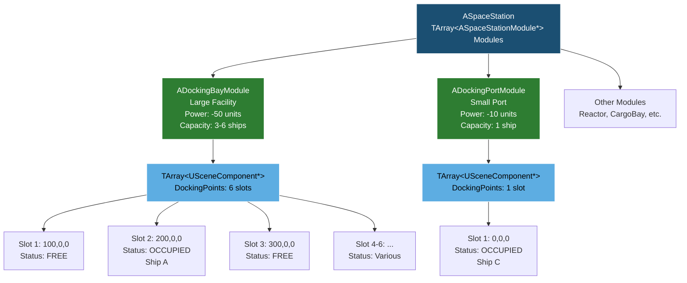
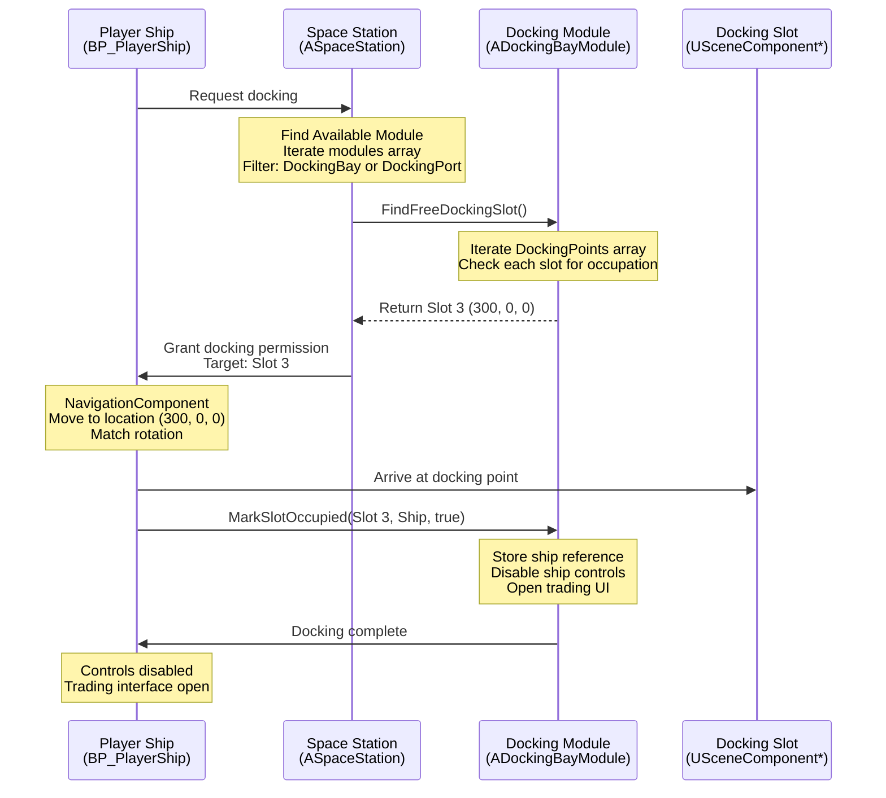
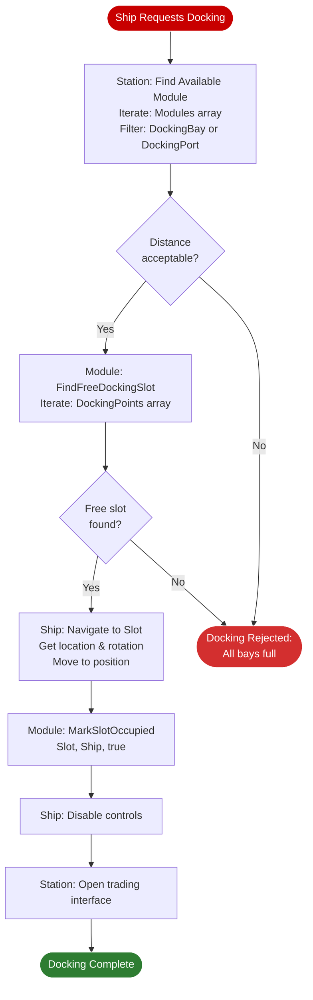
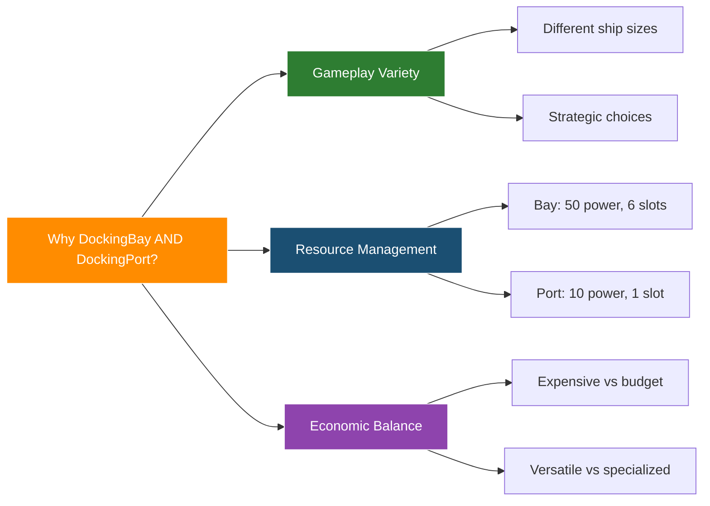
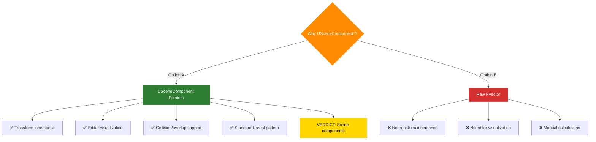
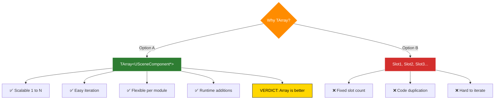
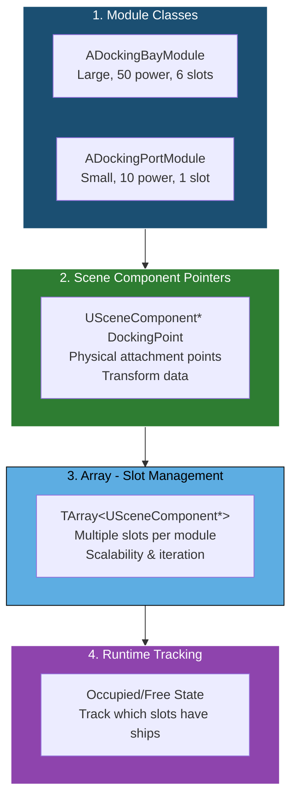

# Docking System Visual Diagram

## Station and Module Architecture



### Legend

| Component | Description |
|-----------|-------------|
| **Module Classes (C++)** | Gameplay logic, power, capacity |
| **Scene Component Pointers** | USceneComponent* docking point instances (transforms) |
| **Array** | Slot management and iteration |
| **FREE/OCCUPIED** | Runtime slot tracking |

---

## Ship Docking Workflow



---

## Docking Process Steps



---

## Code Flow

### 1. Station finds available docking module

```cpp
ADockingBayModule* FindNearestDockingModule(ASpaceship* Ship)
{
    for (ASpaceStationModule* Module : Modules)
    {
        if (ADockingBayModule* Bay = Cast<ADockingBayModule>(Module))
        {
            if (Bay->HasFreeSlots())
                return Bay;
        }
    }
    return nullptr;
}
```

### 2. Module finds free slot

```cpp
USceneComponent* ADockingBayModule::FindFreeDockingSlot()
{
    for (USceneComponent* Point : DockingPoints)
    {
        if (!IsSlotOccupied(Point))
            return Point;
    }
    return nullptr;
}
```

### 3. Ship moves to slot

```cpp
void ASpaceship::DockAtSlot(USceneComponent* Slot)
{
    FVector TargetLoc = Slot->GetComponentLocation();
    FRotator TargetRot = Slot->GetComponentRotation();
    
    NavigationComponent->MoveToLocation(TargetLoc, TargetRot);
    
    // On arrival:
    OnDockingComplete(Slot);
}
```

### 4. Mark slot as occupied / freed

```cpp
void ADockingBayModule::MarkSlotOccupied(USceneComponent* Slot, ASpaceship* DockedShip, bool bOccupied)
{
    if (!Slot || !DockedShip)
    {
        return;
    }

    if (bOccupied)
    {
        // Store ship reference
        OccupiedSlots.Add(Slot, DockedShip);

        // Disable ship controls while docked
        DockedShip->DisableInput();

        // Open trading UI
        OpenTradingInterface();
    }
    else
    {
        // Slot is now free
        OccupiedSlots.Remove(Slot);
    }
}
```

---

## Design Rationale

### Why Two Module Classes?



**Comparison:**

| Feature | DockingBayModule | DockingPortModule |
|---------|------------------|-------------------|
| **Size** | Large | Small |
| **Power** | -50 units | -10 units |
| **Capacity** | 3-6 large ships | 1 small ship |
| **Cost** | High | Low |
| **Use Case** | Freighters, capital ships | Shuttles, fighters |

### Why Scene Component Pointers?



### Why Array Instead of Fixed Properties?



---

## Summary

### 4 Distinct Layers



### Single Responsibility Principle

| Layer | Purpose | Why Needed |
|-------|---------|------------|
| **Module Classes** | Gameplay logic | Distinct gameplay (power, cost, capacity) |
| **Scene Component Pointers** | Transform data | Editor tools, inheritance |
| **Array** | Slot management | Scalability, iteration, runtime tracking |
| **Runtime Tracking** | State management | Prevent double-docking, track occupancy |

---

**Key Insight**: Each layer has ONE clear purpose. Separation = Easier maintenance. Modular = Extensible design.
