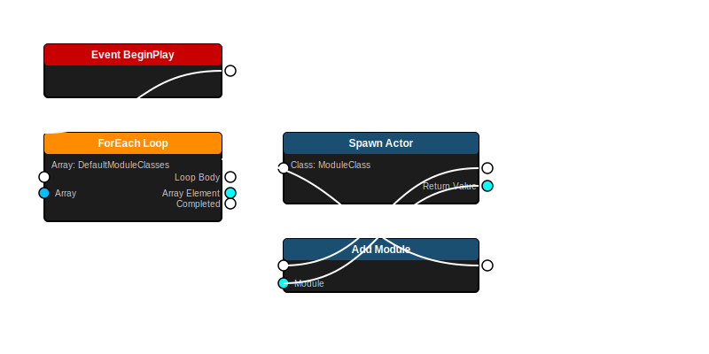
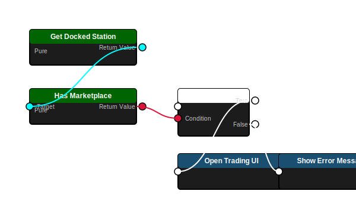
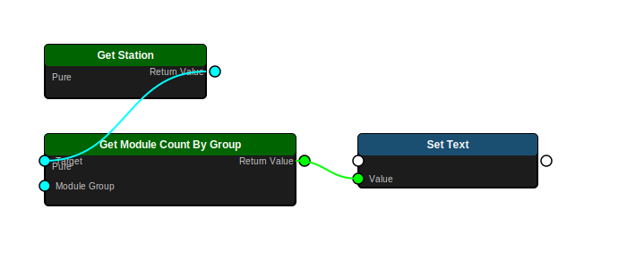

# Space Station Module System - Architecture Guide

**Version**: 1.0  
**Last Updated**: January 13, 2026  
**Status**: Production-ready for MVP Trade Simulator

---

## 📋 Table of Contents

1. [System Overview](#system-overview)
2. [Architecture Diagram](#architecture-diagram)
3. [Core Concepts](#core-concepts)
4. [Module Types Reference](#module-types-reference)
5. [Blueprint Integration](#blueprint-integration)
6. [C++ API Reference](#c-api-reference)
7. [Usage Examples](#usage-examples)
8. [Troubleshooting](#troubleshooting)
9. [Performance Considerations](#performance-considerations)

---

## System Overview

The Space Station Module System provides a **flexible, modular architecture** for constructing space stations from individual functional components. This system enables:

✅ **Dynamic Composition** - Stations built from independent module actors  
✅ **Designer-Friendly** - Configure modules in Blueprints without C++ code  
✅ **Aggregate Functionality** - Station queries modules for combined capabilities  
✅ **Blueprint Exposure** - All functionality accessible from Blueprint graphs  
✅ **MVP-Ready** - Essential features for trading gameplay validated

### Key Design Principles

1. **Modules are Separate Actors** - Each module exists independently in 3D space
2. **Attach-Based Hierarchy** - Modules attach to parent station using `AttachToActor()`
3. **Configuration in Editor** - Use `DefaultModuleClasses` array in Class Defaults
4. **Runtime Aggregation** - Station calculates capabilities from attached modules

---

## Architecture Diagram

### Class Hierarchy

```
┌─────────────────────────────────────────────────────────────────┐
│                     ASpaceStation (AActor)                      │
│                                                                 │
│  Configuration Properties:                                      │
│  • DefaultModuleClasses (TArray<TSubclassOf<...>>)             │
│    └─ Set in Class Defaults → Auto-spawn in BeginPlay          │
│                                                                 │
│  Runtime State:                                                 │
│  • Modules (TArray<ASpaceStationModule*>)                      │
│    └─ Populated automatically during BeginPlay                 │
│  • CurrentStructuralIntegrity (float)                          │
│  • MaxStructuralIntegrity (float)                              │
│  • StationName (FText)                                         │
│                                                                 │
│  Aggregate Query Functions (BlueprintCallable):                │
│  • GetTotalPowerConsumption() → float                          │
│  • GetTotalPowerGeneration() → float                           │
│  • GetPowerBalance() → float                                   │
│  • HasDockingCapability() → bool                               │
│  • HasMarketplace() → bool                                     │
│  • HasCargoStorage() → bool                                    │
│  • GetModuleCountByGroup(EStationModuleGroup) → int32         │
│  • GetModulesByGroup(EStationModuleGroup) → TArray<Module*>   │
│                                                                 │
│  Interfaces:                                                    │
│  • IDamageable - Can receive damage                            │
│  • ITargetable - Can be targeted by weapons/sensors            │
└─────────────────────────────────────────────────────────────────┘
                           │
                           │ AttachToActor()
                           │ FAttachmentTransformRules::KeepRelativeTransform
                           ▼
    ┌──────────────────────┴─────────────────────┐
    │                                             │
    ▼                                             ▼
┌─────────────────────────────┐     ┌─────────────────────────────┐
│ ADockingBayModule           │     │ AMarketplaceModule          │
│                             │     │                             │
│ Type: "Docking Bay"         │     │ Type: "Marketplace"         │
│ Power: +50 (consumes)       │     │ Power: +40 (consumes)       │
│ Group: Docking              │     │ Group: Public               │
│                             │     │                             │
│ Specific Properties:        │     │ Specific Properties:        │
│ • DockingPoints (TArray)    │     │ • MarketDataAsset           │
│ • MaxDockedShips (int32)    │     │ • bIsOpen (bool)            │
│ • CurrentDockedShips (int)  │     │ • MarketplaceName (FText)   │
└─────────────────────────────┘     └─────────────────────────────┘
    │                                             │
    ▼                                             ▼
┌─────────────────────────────┐     ┌─────────────────────────────┐
│ ACargoBayModule             │     │ AHabitationModule           │
│                             │     │                             │
│ Type: "Cargo Bay"           │     │ Type: "Habitation"          │
│ Power: +5 (consumes)        │     │ Power: +30 (consumes)       │
│ Group: Storage              │     │ Group: Habitation           │
│                             │     │                             │
│ Contributes: Storage        │     │ Contributes: Living space   │
└─────────────────────────────┘     └─────────────────────────────┘
```

### Parent-Child Relationship

```
ASpaceStation (Root Actor)
    ├─ ADockingBayModule (Child Actor, attached)
    ├─ AMarketplaceModule (Child Actor, attached)
    ├─ ACargoBayModule (Child Actor, attached)
    └─ AHabitationModule (Child Actor, attached)
```

**Key Points:**
- Each module is a full `AActor` with its own mesh, collision, and health
- Modules attach using `AttachToActor()` with `KeepRelativeTransform` rule
- Station tracks all modules in `Modules` array for aggregate queries
- Module positions can be set via `SetActorRelativeLocation()` after attachment

---

## Core Concepts

### 1. Modular Construction

Stations are **composed** rather than **configured**. Instead of setting properties on a monolithic station actor, you:

1. Create individual module actors (docking bays, marketplaces, etc.)
2. Attach modules to the station actor
3. Station automatically aggregates functionality from all modules

**Benefits:**
- Each module can be damaged/destroyed independently
- Modules visible in 3D space with proper collision
- Easy to add/remove modules dynamically
- Visual feedback for module status

### 2. Editor Configuration vs Runtime State

**Configuration** (`DefaultModuleClasses`):
- Set in Blueprint Class Defaults
- Array of module Blueprint classes
- Station spawns these automatically in `BeginPlay()`

**Runtime State** (`Modules`):
- Read-only array tracking attached modules
- Populated during `BeginPlay()` from `DefaultModuleClasses`
- Updated by `AddModule()` / `RemoveModule()` calls
- Used by aggregate functions to calculate capabilities

### 3. Aggregate Functionality

Station provides **convenience functions** that aggregate data from all modules:

```cpp
// Instead of manually iterating modules:
for (ASpaceStationModule* Module : Station->Modules) {
    if (Module->GetModuleGroup() == EStationModuleGroup::Docking) {
        // Found docking module
    }
}

// Use aggregate function:
bool HasDocking = Station->HasDockingCapability();
```

### 4. Module Groups (Categories)

Modules are organized by functional group using `EStationModuleGroup`:

| Group | Purpose | MVP Status | Example Modules |
|-------|---------|------------|-----------------|
| `Docking` | Ship docking/undocking | ✅ MVP | DockingBay, DockingPort |
| `Storage` | Cargo and fuel storage | ✅ MVP | CargoBay, FuelDepot |
| `Public` | Markets and social spaces | ✅ MVP | Marketplace |
| `Habitation` | Living quarters | ✅ MVP | Habitation, Barracks |
| `Connection` | Corridors and connectors | ✅ MVP | Corridor |
| `Power` | Energy generation | ⏸ Post-MVP | Reactor, SolarArray |
| `Processing` | Manufacturing | ⏸ Post-MVP | Fabrication, Processing |
| `Defence` | Weapons and shields | ⏸ Post-MVP | Turret, ShieldGenerator |
| `Other` | Miscellaneous | 🔄 Later | Custom modules |

---

## Module Types Reference

### MVP Module Classes (Ready for Use)

#### Docking Modules

**ADockingBayModule** (`Source/Adastrea/Public/Stations/DockingBayModule.h`)
- **Purpose**: Large ship docking facility
- **Power**: +50 (consumes)
- **Group**: `Docking`
- **Properties**:
  - `DockingPoints` (TArray<USceneComponent*>) - Array of docking locations
  - `MaxDockedShips` (int32) - Maximum simultaneous ships (default: 4)
  - `CurrentDockedShips` (int32) - Current count
- **Functions**:
  - `GetAvailableDockingSpots()` → int32
  - `HasAvailableDocking()` → bool
  - `DockShip()` → bool
  - `UndockShip()` → bool

**ADockingPortModule** (`Source/Adastrea/Public/Stations/DockingPortModule.h`)
- **Purpose**: Small ship docking port
- **Power**: +10 (consumes)
- **Group**: `Docking`
- **Use Case**: Fighter/scout docking

#### Trading Modules

**AMarketplaceModule** (`Source/Adastrea/Public/Stations/MarketplaceModule.h`)
- **Purpose**: Trade marketplace for buying/selling goods
- **Power**: +40 (consumes)
- **Group**: `Public`
- **Properties**:
  - `MarketDataAsset` (UMarketDataAsset*) - Market configuration
  - `bIsOpen` (bool) - Trading availability
  - `MarketplaceName` (FText) - Display name
- **Functions**:
  - `GetMarketData()` → UMarketDataAsset*
  - `IsAvailableForTrading()` → bool
- **MVP Critical**: ✅ Essential for trading gameplay

#### Storage Modules

**ACargoBayModule** (`Source/Adastrea/Public/Stations/CargoBayModule.h`)
- **Purpose**: Cargo storage facility
- **Power**: +5 (consumes)
- **Group**: `Storage`
- **Use Case**: General goods storage

#### Habitation Modules

**AHabitationModule** (`Source/Adastrea/Public/Stations/HabitationModule.h`)
- **Purpose**: Living quarters for crew
- **Power**: +30 (consumes)
- **Group**: `Habitation`
- **Use Case**: Station population housing

#### Connection Modules

**ACorridorModule** (`Source/Adastrea/Public/Stations/CorridorModule.h`)
- **Purpose**: Connective passageways
- **Power**: +2 (consumes)
- **Group**: `Connection`
- **Use Case**: Station navigation

### Post-MVP Module Classes (Future Development)

#### Power Generation

**AReactorModule** - Fusion reactor
- **Power**: -500 (generates)
- **Group**: `Power`

**ASolarArrayModule** - Solar power generation
- **Power**: -100 (generates)
- **Group**: `Power`

#### Processing

**AFabricationModule** - Manufacturing facility
- **Power**: +150 (consumes)
- **Group**: `Processing`

**AProcessingModule** - Resource refinement
- **Power**: +100 (consumes)
- **Group**: `Processing`

**AScienceLabModule** - Research facility
- **Power**: +75 (consumes)
- **Group**: `Processing`

#### Defence

**AShieldGeneratorModule** - Energy shields
- **Power**: +200 (consumes)
- **Group**: `Defence`

**ATurretModule** - Defensive weapons
- **Power**: +25 (consumes)
- **Group**: `Defence`

---

## Blueprint Integration

### Automatic Module Spawning

When a station begins play, it automatically spawns modules from the `DefaultModuleClasses` array:



**Flow Explanation:**
1. **Event BeginPlay** - Station initialization
2. **ForEach Loop** - Iterate through DefaultModuleClasses array
3. **Spawn Actor** - Create each module instance
4. **Add Module** - Attach module to station and add to Modules array

### Capability Checking

Check if a station has specific capabilities:



**Flow Explanation:**
1. **Get Docked Station** - Retrieve station reference
2. **Has Marketplace** - Check for marketplace module (pure function)
3. **Branch** - Conditional logic based on result
4. **True Path** - Open trading UI if marketplace exists
5. **False Path** - Show error message if no marketplace

### Module Counting

Query the number of modules in a specific group:



**Flow Explanation:**
1. **Get Station** - Retrieve station reference
2. **Get Module Count By Group** - Query specific group (pure function)
3. **Set Text** - Display count in UI widget

### Power Balance Calculation

Calculate net power balance (generation - consumption):


**Flow Explanation:**
1. **Get Station** - Retrieve station reference
2. **Get Total Power Generation** - Sum all generating modules (pure)
3. **Get Total Power Consumption** - Sum all consuming modules (pure)
4. **Subtract (-)** - Calculate net balance
5. **Format Text** - Display result in UI

---

## C++ API Reference

### ASpaceStation Core Functions

#### Module Management (POST-MVP)

⚠️ **Note**: These functions exist in C++ for internal use (called by `BeginPlay()`) but are **NOT exposed to Blueprint** in the MVP. They are marked as POST-MVP features for future station building gameplay.

```cpp
// [INTERNAL C++ ONLY - Not Blueprint-exposed]
// Used internally by BeginPlay() to spawn DefaultModuleClasses
void AddModule(ASpaceStationModule* Module);

// [INTERNAL C++ ONLY - Not Blueprint-exposed]
bool AddModuleAtLocation(ASpaceStationModule* Module, FVector RelativeLocation);

// [POST-MVP - Not currently available]
bool RemoveModule(ASpaceStationModule* Module);

// [POST-MVP - Not currently available]
bool MoveModule(ASpaceStationModule* Module, FVector NewRelativeLocation);
```

**Current MVP Approach:**
For the MVP, stations use pre-configured module layouts via `DefaultModuleClasses` array. Runtime module addition/removal will be enabled post-MVP for station construction gameplay.

#### Module Queries

**Blueprint-Exposed Functions (Available Now):**
```cpp
// Get all attached modules
UFUNCTION(BlueprintCallable, Category="Station")
TArray<ASpaceStationModule*> GetModules() const;

// Get all modules in a specific group
UFUNCTION(BlueprintCallable, Category="Station|Modules")
TArray<ASpaceStationModule*> GetModulesByGroup(EStationModuleGroup ModuleGroup) const;

// Get count of modules in a specific group
UFUNCTION(BlueprintCallable, BlueprintPure, Category="Station|Modules")
int32 GetModuleCountByGroup(EStationModuleGroup ModuleGroup) const;
```

**Internal C++ Functions (Not Blueprint-Exposed):**
```cpp
// [INTERNAL C++ ONLY] Get modules by type string
// Not exposed to Blueprint - use GetModulesByGroup() instead
TArray<ASpaceStationModule*> GetModulesByType(const FString& ModuleType) const;

// [INTERNAL C++ ONLY] Get total module count
// Not exposed to Blueprint - use GetModules().Num() instead
int32 GetModuleCount() const;
```

**Example Usage:**
```cpp
// Find all docking modules (Blueprint-callable)
TArray<ASpaceStationModule*> DockingModules = MyStation->GetModulesByGroup(
    EStationModuleGroup::Docking
);

UE_LOG(LogTemp, Log, TEXT("Station has %d docking modules"), DockingModules.Num());
```

#### Capability Checks

```cpp
// Check if station has docking capability
UFUNCTION(BlueprintCallable, BlueprintPure, Category="Station|Capabilities")
bool HasDockingCapability() const;

// Check if station has marketplace for trading
UFUNCTION(BlueprintCallable, BlueprintPure, Category="Station|Capabilities")
bool HasMarketplace() const;

// Check if station has cargo storage
UFUNCTION(BlueprintCallable, BlueprintPure, Category="Station|Capabilities")
bool HasCargoStorage() const;
```

**Example Usage:**
```cpp
if (MyStation->HasMarketplace())
{
    // Open trading interface
    OpenTradingUI(MyStation->GetMarketplaceModule());
}
else
{
    // Show error: no trading available
    ShowMessage(TEXT("This station has no marketplace"));
}
```

#### Power Management

```cpp
// Get total power consumption from all modules
UFUNCTION(BlueprintCallable, BlueprintPure, Category="Station|Modules")
float GetTotalPowerConsumption() const;

// Get total power generation from power modules
UFUNCTION(BlueprintCallable, BlueprintPure, Category="Station|Modules")
float GetTotalPowerGeneration() const;

// Get net power balance (generation - consumption)
UFUNCTION(BlueprintCallable, BlueprintPure, Category="Station|Modules")
float GetPowerBalance() const;
```

**Example Usage:**
```cpp
float PowerBalance = MyStation->GetPowerBalance();
if (PowerBalance < 0.0f)
{
    UE_LOG(LogTemp, Warning, TEXT("Station has power deficit: %.2f MW"), 
        FMath::Abs(PowerBalance));
}
```

#### Marketplace Access

```cpp
// Get the first marketplace module (for trading UI)
UFUNCTION(BlueprintCallable, Category="Station|Trading")
AMarketplaceModule* GetMarketplaceModule() const;

// Get all marketplace modules (for multiple markets)
UFUNCTION(BlueprintCallable, Category="Station|Trading")
TArray<AMarketplaceModule*> GetMarketplaceModules() const;
```

**Example Usage:**
```cpp
AMarketplaceModule* Marketplace = MyStation->GetMarketplaceModule();
if (Marketplace && Marketplace->IsAvailableForTrading())
{
    UMarketDataAsset* MarketData = Marketplace->GetMarketData();
    // Open trading UI with market data
}
```

### ASpaceStationModule Base Class

All module types inherit from `ASpaceStationModule`:

```cpp
// Get module type identifier
UFUNCTION(BlueprintCallable, BlueprintPure, Category="Module")
FString GetModuleType() const { return ModuleType; }

// Get power consumption/generation
UFUNCTION(BlueprintCallable, BlueprintPure, Category="Module")
float GetModulePower() const { return ModulePower; }

// Get module's functional group
UFUNCTION(BlueprintCallable, BlueprintPure, Category="Module")
EStationModuleGroup GetModuleGroup() const { return ModuleGroup; }

// Check if module generates power (negative power value)
UFUNCTION(BlueprintCallable, BlueprintPure, Category="Module")
bool IsGeneratingPower() const { return ModulePower < 0.0f; }

// Get the mesh component
UFUNCTION(BlueprintCallable, BlueprintPure, Category="Module")
UStaticMeshComponent* GetMeshComponent() const { return MeshComponent; }
```

### Module Type Enum

```cpp
/**
 * Module classification for organization
 * Groups modules by primary function
 */
UENUM(BlueprintType)
enum class EStationModuleGroup : uint8
{
    All         UMETA(DisplayName="All"),          // All modules
    Docking     UMETA(DisplayName="Docking"),      // Ship docking (MVP)
    Power       UMETA(DisplayName="Power"),        // Energy generation (POST-MVP)
    Storage     UMETA(DisplayName="Storage"),      // Cargo storage (MVP)
    Processing  UMETA(DisplayName="Processing"),   // Manufacturing (POST-MVP)
    Defence     UMETA(DisplayName="Defence"),      // Weapons/shields (POST-MVP)
    Habitation  UMETA(DisplayName="Habitation"),   // Living quarters (MVP)
    Public      UMETA(DisplayName="Public"),       // Markets/social (MVP)
    Connection  UMETA(DisplayName="Connection"),   // Corridors (MVP)
    Other       UMETA(DisplayName="Other")         // Miscellaneous
};
```

---

## Usage Examples

### Example 1: Configure Station in Editor

**Step-by-Step:**

1. **Open Blueprint Editor**
   - Navigate to `Content/Blueprints/Stations/`
   - Open `BP_SpaceStation`

2. **Click "Class Defaults"** (top toolbar)

3. **Find "Default Module Classes"** in Details panel
   - Under `Station → Configuration`

4. **Add Module Classes:**
   ```
   DefaultModuleClasses:
     [0] BP_SpaceStationModule_DockingBay
     [1] BP_SpaceStationModule_Marketplace
     [2] BP_CargoBayModule
     [3] BP_SpaceStationModule_Habitation
   ```

5. **Compile and Save**

6. **Test in Level:**
   - Drag `BP_SpaceStation` into level
   - Press Play
   - Modules spawn automatically in BeginPlay

**Result:**
- ✅ 4 modules spawn and attach automatically
- ✅ `HasMarketplace()` returns `true`
- ✅ `HasDockingCapability()` returns `true`
- ✅ `GetModuleCount()` returns `4`

### Example 2: Check Station Capabilities (Blueprint)

**Scenario**: Player docks at station, check if trading is available

**Blueprint Graph:**
```
Event: Player Docked at Station
    ↓
Get Docked Station (object reference)
    ↓
Has Marketplace? (bool)
    ├─ True → Open Trading UI
    └─ False → Show Message: "No marketplace available"
```

**Implementation:**
1. Get station reference from docking system
2. Call `HasMarketplace()` on station
3. Branch based on result
4. If true: call `GetMarketplaceModule()` and open UI
5. If false: display error message

### Example 3: Display Station Facilities (UI Widget)

**Scenario**: Show station info panel with facility breakdown

**Blueprint Graph:**
```
Event: Update Station Info Widget
    ↓
Get Station Reference
    ↓
Get Module Count By Group: Docking
    → Set Text: "Docking Bays: X"
    ↓
Get Module Count By Group: Storage
    → Set Text: "Cargo Holds: X"
    ↓
Get Module Count By Group: Public
    → Set Text: "Public Facilities: X"
    ↓
Get Power Balance
    ├─ Positive → Set Text: "+X MW (Surplus)" (Green)
    └─ Negative → Set Text: "-X MW (Deficit)" (Red)
```

**Widget Binding Code (C++):**
```cpp
void UStationInfoWidget::UpdateStationInfo(ASpaceStation* Station)
{
    if (!Station) return;
    
    // Update facility counts
    int32 DockingCount = Station->GetModuleCountByGroup(EStationModuleGroup::Docking);
    int32 StorageCount = Station->GetModuleCountByGroup(EStationModuleGroup::Storage);
    int32 PublicCount = Station->GetModuleCountByGroup(EStationModuleGroup::Public);
    
    DockingText->SetText(FText::Format(
        LOCTEXT("DockingFormat", "Docking Bays: {0}"), 
        DockingCount
    ));
    
    StorageText->SetText(FText::Format(
        LOCTEXT("StorageFormat", "Cargo Holds: {0}"), 
        StorageCount
    ));
    
    // Update power status
    float PowerBalance = Station->GetPowerBalance();
    FLinearColor PowerColor = PowerBalance >= 0.0f ? FLinearColor::Green : FLinearColor::Red;
    FText PowerText = FText::Format(
        LOCTEXT("PowerFormat", "{0}{1} MW"), 
        PowerBalance >= 0.0f ? TEXT("+") : TEXT(""),
        FText::AsNumber(PowerBalance)
    );
    
    PowerStatusText->SetText(PowerText);
    PowerStatusText->SetColorAndOpacity(PowerColor);
}
```

### Example 4: Power Balance Monitoring

**Scenario**: Monitor station power and alert if deficit

**C++ System:**
```cpp
void UStationPowerMonitor::CheckPowerStatus()
{
    for (ASpaceStation* Station : ManagedStations)
    {
        if (!Station) continue;
        
        float PowerBalance = Station->GetPowerBalance();
        float Generation = Station->GetTotalPowerGeneration();
        float Consumption = Station->GetTotalPowerConsumption();
        
        if (PowerBalance < 0.0f)
        {
            // Power deficit - log warning
            UE_LOG(LogAdastreaStations, Warning,
                TEXT("Station %s has power deficit: %.2f MW (Gen: %.2f, Con: %.2f)"),
                *Station->GetName(), PowerBalance, Generation, Consumption);
            
            // Trigger low power alert
            OnPowerDeficit.Broadcast(Station, FMath::Abs(PowerBalance));
        }
        else if (PowerBalance < 100.0f)
        {
            // Low power margin - log info
            UE_LOG(LogAdastreaStations, Log,
                TEXT("Station %s has low power margin: %.2f MW"),
                *Station->GetName(), PowerBalance);
        }
    }
}
```

---

## Troubleshooting

### Common Issues and Solutions

#### Issue: Modules Not Spawning

**Symptoms:**
- Station placed in level but no modules appear
- `GetModuleCount()` returns 0

**Possible Causes:**
1. **DefaultModuleClasses array is empty**
   - **Solution**: Open Blueprint Class Defaults, add module classes to array

2. **Module classes not compiled**
   - **Solution**: Compile C++ code, restart editor, refresh Blueprint

3. **Spawn collision issues**
   - **Solution**: Check `SpawnActorCollisionHandlingMethod` in BeginPlay
   - Ensure spawn location has clearance

**Diagnostic Code:**
```cpp
void ASpaceStation::BeginPlay()
{
    Super::BeginPlay();
    
    UE_LOG(LogAdastreaStations, Log, 
        TEXT("Station %s: DefaultModuleClasses count = %d"),
        *GetName(), DefaultModuleClasses.Num());
    
    // ... spawning logic ...
    
    UE_LOG(LogAdastreaStations, Log,
        TEXT("Station %s: Spawned %d modules successfully"),
        *GetName(), Modules.Num());
}
```

#### Issue: HasMarketplace() Returns False

**Symptoms:**
- Station should have marketplace but function returns false
- Trading UI doesn't open

**Possible Causes:**
1. **No AMarketplaceModule in DefaultModuleClasses**
   - **Solution**: Add `BP_SpaceStationModule_Marketplace` to array

2. **Marketplace module not open for trading**
   - **Solution**: Check `bIsOpen` property in module Blueprint
   - Check `MarketDataAsset` is assigned

3. **Module failed to spawn**
   - **Solution**: Check output log for spawn errors
   - Verify marketplace Blueprint compiles

**Diagnostic Code:**
```cpp
bool ASpaceStation::HasMarketplace() const
{
    bool bFound = GetMarketplaceModule() != nullptr;
    
    UE_LOG(LogAdastreaStations, Log,
        TEXT("Station %s: HasMarketplace = %s (Total modules: %d)"),
        *GetName(), bFound ? TEXT("true") : TEXT("false"), Modules.Num());
    
    return bFound;
}
```

#### Issue: Power Balance Incorrect

**Symptoms:**
- `GetPowerBalance()` returns unexpected values
- Power status shows wrong surplus/deficit

**Possible Causes:**
1. **Module power values not configured**
   - **Solution**: Check `ModulePower` property in module Blueprints
   - Ensure consuming modules use positive values
   - Ensure generating modules use negative values

2. **Modules not properly attached**
   - **Solution**: Verify modules in `Modules` array
   - Check attachment in scene outliner

**Diagnostic Code:**
```cpp
float ASpaceStation::GetPowerBalance() const
{
    float Generation = GetTotalPowerGeneration();
    float Consumption = 0.0f;
    
    for (ASpaceStationModule* Module : Modules)
    {
        if (Module && !Module->IsGeneratingPower())
        {
            Consumption += Module->GetModulePower();
            
            UE_LOG(LogAdastreaStations, Verbose,
                TEXT("  Module %s: Power = %.2f"),
                *Module->GetModuleType(), Module->GetModulePower());
        }
    }
    
    float Balance = Generation - Consumption;
    
    UE_LOG(LogAdastreaStations, Log,
        TEXT("Station %s: Gen=%.2f, Con=%.2f, Balance=%.2f"),
        *GetName(), Generation, Consumption, Balance);
    
    return Balance;
}
```

#### Issue: Module Not Found by Group

**Symptoms:**
- `GetModuleCountByGroup()` returns 0 for existing modules
- `GetModulesByGroup()` returns empty array

**Possible Causes:**
1. **ModuleGroup not set correctly**
   - **Solution**: Open module Blueprint Class Defaults
   - Set `ModuleGroup` property to correct enum value

2. **Using wrong enum value in query**
   - **Solution**: Verify you're using correct `EStationModuleGroup` value
   - Check spelling (e.g., `Docking` not `Dock`)

**Diagnostic Code:**
```cpp
int32 ASpaceStation::GetModuleCountByGroup(EStationModuleGroup ModuleGroup) const
{
    int32 Count = 0;
    
    for (ASpaceStationModule* Module : Modules)
    {
        if (Module)
        {
            UE_LOG(LogAdastreaStations, Verbose,
                TEXT("  Module %s: Group = %d (looking for %d)"),
                *Module->GetModuleType(), 
                (int32)Module->GetModuleGroup(),
                (int32)ModuleGroup);
            
            if (Module->GetModuleGroup() == ModuleGroup)
            {
                Count++;
            }
        }
    }
    
    return Count;
}
```

### Validation Checklist

Before reporting a bug, verify:

- [ ] C++ code compiled successfully without errors
- [ ] Editor restarted after C++ changes
- [ ] Blueprint Class Defaults configured correctly
- [ ] `DefaultModuleClasses` array populated
- [ ] Module Blueprints compile without errors
- [ ] Module properties (`ModulePower`, `ModuleGroup`) set correctly
- [ ] Station placed in level and BeginPlay called
- [ ] Output log checked for errors/warnings

---

## Performance Considerations

### Optimization Guidelines

#### Module Spawning

**Current Implementation:**
- Modules spawn during `BeginPlay()` (one-time cost)
- All modules spawn in single frame
- May cause frame hitch for stations with many modules

**Optimization (if needed):**
```cpp
// Stagger module spawning across multiple frames
void ASpaceStation::BeginPlay()
{
    Super::BeginPlay();
    
    if (DefaultModuleClasses.Num() > 10)
    {
        // Spawn modules over multiple frames
        GetWorldTimerManager().SetTimer(
            ModuleSpawnTimer,
            this,
            &ASpaceStation::SpawnNextModule,
            0.1f,  // Spawn one every 0.1 seconds
            true   // Loop
        );
    }
    else
    {
        // Spawn all immediately for small stations
        SpawnAllModules();
    }
}
```

#### Aggregate Functions

**Performance Characteristics:**
- All aggregate functions iterate `Modules` array (O(n))
- Marked as `BlueprintPure` - can be called frequently
- Consider caching results if called every frame

**Optimization Example:**
```cpp
class ADASTREA_API ASpaceStation : public AActor
{
    // Cache power balance, recalculate only when modules change
    UPROPERTY()
    float CachedPowerBalance = 0.0f;
    
    UPROPERTY()
    bool bPowerBalanceDirty = true;
    
public:
    float GetPowerBalance() const
    {
        if (bPowerBalanceDirty)
        {
            CachedPowerBalance = CalculatePowerBalance();
            bPowerBalanceDirty = false;
        }
        return CachedPowerBalance;
    }
    
    void AddModule(ASpaceStationModule* Module)
    {
        // ... add module ...
        bPowerBalanceDirty = true;  // Mark cache dirty
    }
};
```

#### Memory Usage

**Typical Memory Footprint:**
- `ASpaceStation`: ~1-2 KB base actor
- `ASpaceStationModule`: ~500 bytes per module
- `Modules` TArray: ~24 bytes + (8 bytes × module count)
- **Total for 10-module station**: ~2-3 KB

**Guidelines:**
- Avoid storing large data in module actors
- Use Data Assets for configuration (shared memory)
- Unload unused modules (call `RemoveModule()` + `Destroy()`)

#### Collision Performance

**Considerations:**
- Each module has own collision mesh
- Many modules = many collision primitives
- Can impact physics performance

**Optimization:**
```cpp
// Disable collision on decorative modules
void ACorridorModule::BeginPlay()
{
    Super::BeginPlay();
    
    // Corridors don't need complex collision
    if (MeshComponent)
    {
        MeshComponent->SetCollisionEnabled(ECollisionEnabled::NoCollision);
    }
}
```

### Profiling Commands

**In-Game Console:**
```
// Show detailed frame stats
stat fps
stat unit
stat game

// Show memory usage
stat memory
obj list class=SpaceStation
obj list class=SpaceStationModule

// Profile specific subsystems
stat scenerendering
stat initviews
```

**Recommended Targets:**
- Module spawning: < 1ms per module
- `GetModulesByGroup()`: < 0.5ms for 50 modules
- Total station update: < 2ms per frame

---

## Advanced Topics

### Custom Module Types

To create a new module type:

1. **Create C++ class** inheriting from `ASpaceStationModule`:
```cpp
// MyCustomModule.h
#pragma once
#include "SpaceStationModule.h"
#include "MyCustomModule.generated.h"

UCLASS(BlueprintType, Blueprintable)
class ADASTREA_API AMyCustomModule : public ASpaceStationModule
{
    GENERATED_BODY()
    
public:
    AMyCustomModule();
    
    // Custom properties
    UPROPERTY(EditAnywhere, BlueprintReadOnly, Category="Custom")
    float CustomProperty;
    
    // Custom functions
    UFUNCTION(BlueprintCallable, Category="Custom")
    void DoCustomThing();
};
```

2. **Implement constructor**:
```cpp
// MyCustomModule.cpp
AMyCustomModule::AMyCustomModule()
{
    // Set module properties
    ModuleType = TEXT("Custom Module");
    ModulePower = 25.0f;  // Consumes 25 power
    ModuleGroup = EStationModuleGroup::Other;
    
    // Initialize custom properties
    CustomProperty = 100.0f;
}
```

3. **Create Blueprint**:
   - Right-click in Content Browser
   - Blueprint Class → Search for `MyCustomModule`
   - Name: `BP_MyCustomModule`
   - Add mesh to `MeshComponent`

4. **Add to Station**:
   - Add `BP_MyCustomModule` to `DefaultModuleClasses` array in station Blueprint

### Runtime Module Addition (POST-MVP)

⚠️ **Note**: Runtime module addition is a POST-MVP feature not currently available in Blueprint.

The functions `AddModule()`, `AddModuleAtLocation()`, `RemoveModule()`, and `MoveModule()` exist in C++ and are used internally during `BeginPlay()` but are **not exposed to Blueprint**. They will be re-enabled post-MVP for station construction gameplay.

**Current Workaround for MVP:**
Configure all station modules via `DefaultModuleClasses` array in Class Defaults. Modules spawn automatically when the station begins play.

### Module Events and Delegates

For module lifecycle events:

```cpp
// In ASpaceStationModule
DECLARE_DYNAMIC_MULTICAST_DELEGATE_OneParam(
    FOnModuleDamaged, 
    float, 
    DamageAmount
);

UPROPERTY(BlueprintAssignable, Category="Module Events")
FOnModuleDamaged OnModuleDamaged;

// In ASpaceStation
DECLARE_DYNAMIC_MULTICAST_DELEGATE_OneParam(
    FOnModuleAdded, 
    ASpaceStationModule*, 
    Module
);

UPROPERTY(BlueprintAssignable, Category="Station Events")
FOnModuleAdded OnModuleAdded;

void ASpaceStation::AddModule(ASpaceStationModule* Module)
{
    // ... add module ...
    
    // Broadcast event
    OnModuleAdded.Broadcast(Module);
}
```

**Usage in Blueprint:**
- Event graph → Add Event → On Module Added
- React to module changes in real-time

---

## Related Documentation

### Core Documentation

- **[ADDING_MODULES_TO_STATIONS.md](ADDING_MODULES_TO_STATIONS.md)** - Complete step-by-step usage guide
- **[STATION_MODULE_BLUEPRINTS_QUICK_REFERENCE.md](STATION_MODULE_BLUEPRINTS_QUICK_REFERENCE.md)** - Quick reference for module types
- **[STATION_MODULE_BLUEPRINT_EXAMPLES.md](STATION_MODULE_BLUEPRINT_EXAMPLES.md)** - Example implementations

### Setup Guides

- **[STATION_MODULE_BLUEPRINTS_GUIDE.md](../setup/STATION_MODULE_BLUEPRINTS_GUIDE.md)** - Creating module Blueprints
- **[SPACESTATION_MODULE_CONFIG_GUIDE.md](SPACESTATION_MODULE_CONFIG_GUIDE.md)** - Module configuration
- **[STATION_EDITOR_VISUAL_GUIDE.md](STATION_EDITOR_VISUAL_GUIDE.md)** - Visual editor guide

### Source Code

- **C++ Headers**:
  - `Source/Adastrea/Public/Stations/SpaceStation.h` - Main station class
  - `Source/Adastrea/Public/Stations/SpaceStationModule.h` - Base module class
  - `Source/Adastrea/Public/Stations/StationModuleTypes.h` - Enums and types
  - `Source/Adastrea/Public/Stations/*Module.h` - Specific module types

- **C++ Implementation**:
  - `Source/Adastrea/Private/Stations/SpaceStation.cpp` - Station implementation
  - `Source/Adastrea/Private/Stations/*Module.cpp` - Module implementations

### Blueprint Documentation Standards

- **[BLUEPRINT_IMAGE_GUIDE.md](BLUEPRINT_IMAGE_GUIDE.md)** - Visual Blueprint documentation
- **[BLUEPRINT_DOCUMENTATION_EXAMPLES.md](BLUEPRINT_DOCUMENTATION_EXAMPLES.md)** - Example patterns

---

## Version History

### Version 1.0 (January 13, 2026)
- Complete architecture documentation rewrite
- Added visual Blueprint flow diagrams (SVG)
- Comprehensive C++ API reference
- Real-world usage examples
- Troubleshooting guide
- Performance optimization guidelines
- Module type reference table

### Previous Versions
- **December 2025** - Initial architecture diagram
- **October 2025** - System implementation

---

## FAQ

**Q: Can I add modules at runtime?**  
A: Not in the MVP. Runtime module addition is a POST-MVP feature. The `AddModule()` / `AddModuleAtLocation()` functions exist in C++ for internal use during `BeginPlay` but are not exposed to Blueprint. For now, configure station layouts via `DefaultModuleClasses` array in Class Defaults.

**Q: How do I create a custom module type?**  
A: Inherit from `ASpaceStationModule` in C++, set module properties in constructor, create Blueprint.

**Q: Why use actors instead of components?**  
A: Actors provide independent collision, health, and visual representation. Components would be tightly coupled to the station.

**Q: Can modules be damaged individually?**  
A: Yes, modules implement `IDamageable` interface and can be targeted separately.

**Q: How many modules can a station have?**  
A: No hard limit, but recommended max is 50-100 modules for performance.

**Q: Can I save/load station configurations?**  
A: Yes, `DefaultModuleClasses` is serialized. Runtime-spawned modules (when POST-MVP features are enabled) will need custom save system.

**Q: Do modules need unique names?**  
A: No, multiple modules can have the same `ModuleType`. Use actor names if uniqueness needed.

**Q: Can modules be moved after attachment?**  
A: Yes, call `SetActorRelativeLocation()` (Blueprint: **Set Relative Location**) on the module actor.

---

**Document Status**: ✅ Complete and production-ready  
**Last Reviewed**: January 13, 2026  
**Maintained By**: Adastrea Development Team  
**Feedback**: Open GitHub issue with tag `documentation`
