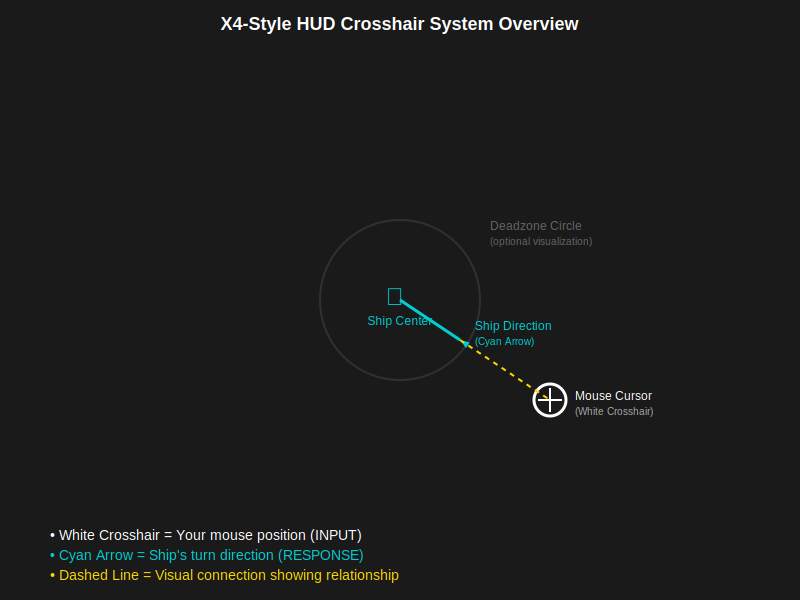
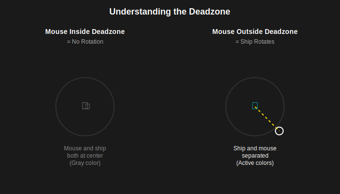
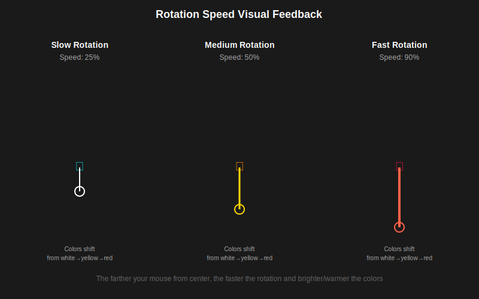

# X4-Style HUD Crosshair System - Beginner's Guide

## What Is This System?

Imagine you're piloting a spaceship. You move your mouse to the right side of the screen, and your ship starts turning right. But how do you know:
- Where your mouse actually is?
- Which direction your ship is turning?
- How fast it's turning?

**This HUD system shows you all of that visually on screen.**

It's inspired by the game "X4: Foundations" and makes flying feel intuitive and precise by giving you clear visual feedback.

### What You'll See

When you fly a ship, you'll see on your screen:
1. A **mouse cursor indicator** (white crosshair) - shows where your mouse is
2. A **ship direction indicator** (cyan arrow) - shows where your ship is turning
3. A **connection line** - visually links the two indicators
4. A **deadzone circle** (optional) - shows the "neutral zone" where no turning happens

---

## Before You Start: What You Need to Know

This guide assumes you have basic knowledge of:
- **Unreal Engine Editor** - You can open it and navigate the interface
- **Blueprints** - You know what a Blueprint is and how to open one
- **Widgets** - You know that UI elements in Unreal are called "Widgets"

**Don't worry if you're not an expert!** We'll explain concepts as we go.

### Glossary of Terms

Before we dive in, let's define some terms you'll see throughout this guide:

| Term | What It Means | Example |
|------|---------------|---------|
| **HUD** | Heads-Up Display - The UI elements you see on screen while playing | Health bar, crosshair, minimap |
| **Widget** | A UI element in Unreal Engine | Button, text, image, progress bar |
| **Canvas Panel** | A container that holds other widgets and lets you position them freely | Like a blank canvas for painting |
| **Screen Space** | The coordinate system of your monitor (0,0 is top-left, 1920,1080 is bottom-right for Full HD) | Mouse at x=960, y=540 is center of 1080p screen |
| **Normalized Coordinates** | Values from 0 to 1 instead of pixels (0.5, 0.5 is screen center regardless of resolution) | 0.5 = 50% across screen |
| **Blueprint Event** | A function that gets called automatically when something happens | OnClicked fires when you click a button |
| **Vector2D** | A coordinate with X and Y values | (100, 200) means X=100 pixels, Y=200 pixels |
| **Anchors** | Where a widget is "attached" on screen (keeps it in place when resolution changes) | Anchored to center = stays centered on all screens |
| **Render Translation** | Moving a widget by a certain number of pixels | Move 50 pixels right, 30 pixels down |
| **Lerp** | Linear interpolation - smooth transition from one value to another | Smoothly fade color from white to red |
| **Deadzone** | A region where input is ignored (to prevent accidental movements) | Small mouse movements near center don't turn ship |

---

## Key Concepts Explained

### Why Two Indicators?

You might wonder: "Why show both mouse position AND ship direction? Aren't they the same?"

**No! And that's the key insight.**

When you move your mouse, your ship doesn't instantly point there. Instead, it **gradually rotates** toward that direction. Think of it like steering a real ship - you turn the wheel (mouse input), but the ship takes time to change course (ship response).

By showing both indicators, you can see:
- **Input**: "I want to go here" (mouse cursor)
- **Response**: "I'm turning this way" (ship direction)
- **Relationship**: How far apart they are shows how much turning is needed

### The Three Visual Elements

#### 1. Mouse Position Indicator (White Crosshair)

**What it represents**: Your mouse cursor position on screen

**Why it's important**: This shows your INPUT - where you're telling the ship to go. When you move your mouse right, this indicator moves right.

**Visual appearance**: 
- Shape: Crosshair or plus sign (+)
- Color: White (changes to yellow/orange at high speeds)
- Size: Small and precise (28-32 pixels)
- Behavior: Follows your mouse exactly

**Real-world analogy**: This is like where you're pointing with your finger saying "Go THAT way!"

#### 2. Ship Direction Indicator (Cyan Arrow)

**What it represents**: The direction your ship is actually rotating toward

**Why it's important**: This shows your RESPONSE - where the ship is actually going. Even if you move the mouse, the ship takes time to catch up.

**Visual appearance**:
- Shape: Arrow or chevron pointing in rotation direction
- Color: Cyan/blue (changes to red/orange at high speeds)
- Size: Slightly larger than mouse indicator (40-48 pixels)
- Behavior: Smoothly follows the ship's rotation

**Real-world analogy**: This is like the ship's nose saying "I'm turning THIS direction!"

#### 3. Connection Line

**What it represents**: The visual link showing the relationship between input and response

**Why it's important**: Makes it instantly clear how far apart your mouse and ship direction are. Longer line = more turning needed.

**Visual appearance**:
- Shape: Straight line connecting the two indicators
- Color: Gradient from white (mouse) to cyan (ship)
- Thickness: 2-3 pixels, gets thicker at high speeds
- Behavior: Stretches and shrinks as indicators move

**Real-world analogy**: Like an elastic band between where you want to go and where you're currently heading.

### Understanding the Deadzone

**What is a deadzone?**

A deadzone is a circular area in the center of your screen where mouse movement doesn't cause rotation. When your mouse is inside this circle, the ship flies straight without turning.

**Why do we need it?**

Without a deadzone, tiny accidental mouse movements would constantly make your ship wobble. The deadzone lets you fly straight when you want to, and only turn when you move the mouse away from center.

**Think of it like this**: 
- Inside deadzone = "Fly straight ahead"
- Outside deadzone = "Turn toward mouse"

**Visual representation**:
```
      Screen
   ┌──────────┐
   │          │
   │  ╔════╗  │  ← Deadzone circle (optional to show)
   │  ║ ┼  ║  │
   │  ╚════╝  │
   │          │
   └──────────┘
   
   Mouse inside circle = No turning
   Mouse outside circle = Turn toward mouse
```

### How Rotation Speed Works

The **further your mouse is from the screen center**, the **faster your ship turns**.

```
Distance from Center → Rotation Speed

At center (deadzone)     = 0% speed (no rotation)
Just outside deadzone    = 10-20% speed (slow turn)
Halfway to edge         = 50% speed (medium turn)
At edge of screen       = 100% speed (fast turn)
```

**Visual feedback for speed**:
- **Slow**: White mouse cursor, cyan ship indicator
- **Medium**: Slightly yellower cursor, orange-ish ship indicator
- **Fast**: Yellow/orange cursor, red ship indicator, thick connection line

This gives you instant visual feedback on how aggressive your turn is.

---

## Visual Guide: How It All Works Together

Here's what the complete HUD system looks like on your screen:



**What you're seeing:**
- The **white crosshair** is where your mouse is positioned
- The **cyan arrow** shows which direction your ship is turning
- The **dashed yellow line** connects them, showing the relationship
- The **subtle circle** (optional) is the deadzone boundary

### Deadzone Behavior Visualized

Understanding when rotation happens and when it doesn't:



**Left side**: Mouse inside the deadzone circle = ship flies straight (no rotation)  
**Right side**: Mouse outside the deadzone = ship turns toward mouse position

### Rotation Speed Color Changes

As you move your mouse farther from center, the colors change to show rotation speed:



Notice how:
- **Slow rotation**: White and cyan (cool colors)
- **Medium rotation**: Yellow and orange (warm colors)
- **Fast rotation**: Red colors (hot colors)
- The **line gets thicker** as rotation speed increases

---

## Part 1: Understanding the Technical Foundation

Before we start building, let's understand how this system works "under the hood."

### The Data Flow: From Input to Visual

Here's the journey that happens every frame (60 times per second):

```
1. Player moves mouse
   ↓
2. Game reads mouse position
   ↓
3. Game calculates: "How far from center?"
   ↓
4. Game determines: "In deadzone or outside?"
   ↓
5. Game calculates rotation speed (0-100%)
   ↓
6. Game sends all this data to HUD Widget
   ↓
7. HUD Widget draws indicators on screen
```

**The important part**: Steps 1-6 are already done for you in C++! You only need to do step 7 (draw the indicators).

### What's Already Implemented (C++ Side)

The game already calculates and provides you with:

✅ `MouseScreenPosition` - Where the mouse is (as a number 0 to 1)  
✅ `ShipRotationDirection` - Where the ship is turning (as a number 0 to 1)  
✅ `RotationSpeed` - How fast it's turning (0 = stopped, 1 = maximum)  
✅ `bInDeadzone` - True/False: Is mouse in deadzone?  
✅ `DeadzoneRadiusPercent` - How big the deadzone is (0 to 1)

**Your job**: Use these numbers to draw pretty pictures on screen!

### Understanding Normalized Coordinates

You'll see "0 to 1" values everywhere. This is called **normalization** and it's super useful.

**Instead of**:
- "Mouse is at X=960, Y=540" (only true for 1920x1080 screens)

**We use**:
- "Mouse is at X=0.5, Y=0.5" (means "50% across, 50% down" - works on ANY screen)

**To convert normalized to pixels for CENTER-ANCHORED widgets**:
```
Centered Pixel X = (Normalized X - 0.5) × Screen Width
Centered Pixel Y = (Normalized Y - 0.5) × Screen Height

Example (1920x1080 screen):
Mouse at (0.5, 0.5) [center] = ((0.5 - 0.5) × 1920, (0.5 - 0.5) × 1080) = (0, 0) pixels
Mouse at (0, 0) [top-left] = ((0 - 0.5) × 1920, (0 - 0.5) × 1080) = (-960, -540) pixels
Mouse at (1, 1) [bottom-right] = ((1 - 0.5) × 1920, (1 - 0.5) × 1080) = (960, 540) pixels
```

**Why subtract 0.5?** Because our widgets are anchored to screen CENTER, not top-left. The center becomes (0, 0) in render translation space, so we need to convert normalized coordinates (where 0.5, 0.5 is center) to center-based pixel coordinates (where 0, 0 is center).

This is important because we need center-based pixel positions to move center-anchored widgets correctly.

---

## Part 2: Step-by-Step Implementation Guide

Now let's build this system! We'll go slowly and explain everything.

### Step 1: Create Your HUD Widget Blueprint (15 minutes)

**What we're doing**: Creating a new Blueprint class that will hold our crosshair visuals.

**Detailed instructions**:

1. **Open Unreal Engine** and your Adastrea project

2. **Navigate to Content Browser**:
   - This is usually at the bottom of your screen
   - It shows all your project's files and folders

3. **Right-click in an empty area** of the Content Browser

4. **Select**: User Interface → Widget Blueprint
   - A dialog will appear

5. **Choose parent class**:
   - Click "All Classes" to expand the list
   - Search for: `AdastreaHUDWidget`
   - Select it and click "Select"
   
   **Why this parent class?** It already has all the C++ code that calculates positions and speeds. We just need to add the visuals.

6. **Name it**: `WBP_FlightHUD`
   - `WBP` = Widget Blueprint (naming convention)
   - `Flight` = What it's for
   - `HUD` = It's a HUD element

7. **Double-click** to open it

You should now see the **Widget Blueprint Editor**. It has:
- **Designer** tab (top-left) - Where you visually build the UI
- **Graph** tab - Where you write Blueprint code
- **Palette** panel (left) - All available UI widgets
- **Hierarchy** panel - Shows your widget structure
- **Details** panel (right) - Properties of selected widget

### Step 2: Add Visual Elements to Canvas (30 minutes)

**What we're doing**: Adding the images/shapes that will show on screen.

The **Designer** tab should be open. If not, click it at the top.

#### 2.1: Set Up the Canvas Panel

Your widget should already have a **Canvas Panel** as the root. If not:
1. From the Palette, drag a **Canvas Panel** into the Hierarchy
2. It becomes your root container

**What is a Canvas Panel?** Think of it as a blank canvas where you can place widgets anywhere you want using X,Y coordinates.

#### 2.2: Add the Mouse Cursor Indicator

1. **From the Palette**, find **"Image"** widget (under "Common" section)

2. **Drag it** onto the Canvas Panel in the Hierarchy

3. **Rename it**: Right-click the Image → Rename → `MouseCursorIndicator`
   - Naming is important so we can find it in Blueprint code later!

4. **Configure its properties** (in Details panel on right):
   
   **Slot (Canvas Panel Slot) section**:
   - **Anchors**: Click the anchor dropdown
     - **Select the CENTER anchor** (middle button in the grid)
     - This makes the widget stay centered when screen size changes
   - **Position X**: 0
   - **Position Y**: 0
   - **Size X**: 32
   - **Size Y**: 32
   - **Alignment**: 0.5, 0.5 (centers the widget on its anchor point)
   
   **Appearance section**:
   - **Color and Opacity**: Pure white (R=1, G=1, B=1, A=1)
   - **Brush → Image**: We need a crosshair texture here
     - For now, you can use any texture as a placeholder
     - Later, you'll want to create a proper crosshair image
   
   **Behavior section**:
   - **Visibility**: Visible

**What did we just do?** We created an image widget that will show our mouse cursor. It's 32x32 pixels, white colored, and anchored to screen center.

#### 2.3: Add the Ship Direction Indicator

Repeat the same process, but with these differences:

1. Drag another **Image** widget onto Canvas Panel

2. **Rename it**: `ShipDirectionIndicator`

3. **Configure**:
   - **Anchors**: CENTER (same as before)
   - **Position X**: 0
   - **Position Y**: 0
   - **Size X**: 48 (slightly larger than mouse cursor)
   - **Size Y**: 48
   - **Alignment**: 0.5, 0.5
   - **Color**: Cyan (R=0.4, G=0.8, B=1, A=1)
     - This gives us that cyan/blue color
   - **Brush → Image**: Arrow or chevron texture pointing up
     - For now, use any texture

**Why larger than the mouse cursor?** Makes it easier to see, and visually distinguishes it from the mouse indicator.

#### 2.4: Add the Optional Deadzone Circle

1. Drag another **Image** widget onto Canvas Panel

2. **Rename it**: `DeadzoneCircle`

3. **Configure**:
   - **Anchors**: CENTER
   - **Position X**: 0
   - **Position Y**: 0
   - **Size X**: 100 (we'll change this dynamically later)
   - **Size Y**: 100
   - **Alignment**: 0.5, 0.5
   - **Color**: White (R=1, G=1, B=1, A=0.3)
     - Note the **Alpha=0.3** makes it semi-transparent
   - **Brush → Image**: A circle texture (you can create one in any image editor)
   - **Visibility**: Hidden (we'll show it only when needed)

#### 2.5: Organize Your Hierarchy

Your **Hierarchy** panel should now look like this:
```
Canvas Panel
├── DeadzoneCircle (Image)
├── ShipDirectionIndicator (Image)
└── MouseCursorIndicator (Image)
```

**Order matters!** Widgets at the bottom are drawn on top. So MouseCursorIndicator will be on top of everything else.

**Save your work**: Ctrl+S or File → Save

### Step 3: Understanding Blueprint Events (Concept Break)

Before we write code, let's understand what we're about to do.

**What is a Blueprint Event?**

An event is a function that gets called automatically when something happens. Think of it like this:

**Real life**:
- WHEN doorbell rings → Dog barks
- WHEN timer reaches 0 → Oven beeps
- WHEN you click Like button → Counter increases

**In our case**:
- WHEN mouse position changes → UpdateFlightCrosshair event fires
- WHEN deadzone size changes → UpdateDeadzoneVisualization event fires

**Important**: The C++ code already calls these events for us every frame! We just need to write what happens when they're called.

### Step 4: Implement UpdateFlightCrosshair Event (45 minutes)

This is where the magic happens. We'll write the Blueprint code to move our indicators based on mouse position.

**Switch to the Graph tab** (top-left, next to Designer).

#### 4.1: Override the Event

1. **Right-click** in an empty area of the Event Graph

2. **Search for**: `UpdateFlightCrosshair`

3. **Select**: "Event Update Flight Crosshair"
   - This creates a red event node

**What you see**: A red node with 4 output pins:
- `Mouse Screen Position` (yellow pin - Vector2D)
- `Ship Rotation Direction` (yellow pin - Vector2D)
- `Rotation Speed` (green pin - Float)
- `b In Deadzone` (red pin - Boolean)

**What this means**: Every frame, this event gets called with fresh data about the mouse, ship, and deadzone.

#### 4.2: Get Viewport Size

We need to know how big the screen is to convert normalized coordinates to pixels.

1. **Drag off the white execution pin** from UpdateFlightCrosshair

2. **Search for**: `Get Viewport Size`

3. **Select** it

**What you see**: A blue node that outputs `Viewport Size` (yellow pin - Vector2D)

**What it does**: Returns the screen resolution (e.g., 1920x1080 or 2560x1440)

#### 4.3: Convert Mouse Position to Pixels (Center-Anchored Coordinates)

Now let's do math! Don't worry, we'll explain every step.

**IMPORTANT**: Since we anchored our widgets to CENTER, the center of the screen is at position (0, 0) in render translation space, NOT the top-left corner!

**Formula**: Pixel Position = (Normalized Position - 0.5) × Screen Size

This formula:
- Centers the coordinate system (0.5, 0.5 normalized becomes 0, 0 pixels)
- Makes left/top positions negative
- Makes right/bottom positions positive

**Step-by-step Blueprint nodes**:

1. **Drag off** the `Mouse Screen Position` pin from the event

2. **Search for**: `Break Vector2D`
   - This splits the Vector2D into separate X and Y values

3. **Subtract 0.5 from X**:
   - Drag off `Mouse Screen Position X`
   - Search for: `-` (subtract)
   - Set the other input to `0.5`
   - This centers the X coordinate

4. **Subtract 0.5 from Y**:
   - Drag off `Mouse Screen Position Y`
   - Search for: `-` (subtract)
   - Set the other input to `0.5`
   - This centers the Y coordinate

5. **Drag off** the `Viewport Size` output from Get Viewport Size

6. **Search for**: `Break Vector2D` (again)
   - Now we have ViewportWidth (X) and ViewportHeight (Y)

7. **Multiply centered X**:
   - Take the result from step 3 (Mouse X - 0.5)
   - Search for: `*` (multiply)
   - Connect `Viewport Size X` to the other input
   - This gives us the centered pixel X position

8. **Multiply centered Y**:
   - Take the result from step 4 (Mouse Y - 0.5)
   - Search for: `*` (multiply)
   - Connect `Viewport Size Y` to the other input
   - This gives us the centered pixel Y position

**What we just did**: Converted normalized mouse position (0-1) to center-anchored pixel coordinates.

**Example**:
```
Mouse at (0.5, 0.5) on 1920x1080 screen (CENTER of screen):
X = (0.5 - 0.5) × 1920 = 0 pixels ✓ (centered)
Y = (0.5 - 0.5) × 1080 = 0 pixels ✓ (centered)

Mouse at (0, 0) on 1920x1080 screen (TOP-LEFT of screen):
X = (0 - 0.5) × 1920 = -960 pixels ✓ (left of center)
Y = (0 - 0.5) × 1080 = -540 pixels ✓ (above center)

Mouse at (1, 1) on 1920x1080 screen (BOTTOM-RIGHT of screen):
X = (1 - 0.5) × 1920 = 960 pixels ✓ (right of center)
Y = (1 - 0.5) × 1080 = 540 pixels ✓ (below center)
```

#### 4.4: Move the Mouse Cursor Indicator

Now we use those center-anchored pixel coordinates to actually move the widget!

1. **Get reference to our widget**:
   - Drag `MouseCursorIndicator` from the Variables list (left side)
   - Select "Get MouseCursorIndicator"

2. **Set its position**:
   - Drag off the MouseCursorIndicator pin
   - Search for: `Set Render Translation`
   - Connect the execution pin from your last multiply node (or previous node with execution)
   
3. **Connect coordinates**:
   - Drag the Mouse Pixel X (result from step 7 above) to `Translation X` input
   - Drag the Mouse Pixel Y (result from step 8 above) to `Translation Y` input

**What we just did**: Moved the mouse cursor indicator to match the actual mouse position on screen!

**Why this works**: `Set Render Translation` moves a widget relative to its anchor point. Since we:
1. Anchored to CENTER (middle of screen)
2. Set alignment to 0.5, 0.5 (widget centered on its position)
3. Converted to center-based coordinates (by subtracting 0.5 before multiplying)

The widget now correctly displays at the mouse position:
- Center of screen (0, 0 translation) = mouse at center
- Negative X/Y = mouse left/above center
- Positive X/Y = mouse right/below center

#### 4.5: Repeat for Ship Direction Indicator

Do the exact same thing for the ship direction, using the correct center-anchored formula:

1. Break `Ship Rotation Direction` into X and Y
2. **Subtract 0.5 from both X and Y** (to center the coordinates)
3. Multiply the centered X by Viewport Size X
4. Multiply the centered Y by Viewport Size Y
5. Get `ShipDirectionIndicator` variable
6. Call `Set Render Translation` with the calculated center-based pixel positions

Now both indicators should be moving correctly with proper center-based positioning!

#### 4.6: Add Color Changes Based on Rotation Speed

Let's make the colors change as you turn faster. This provides great visual feedback!

**The logic we want**:
```
If Rotation Speed < 0.3 → White and Cyan (slow)
If Rotation Speed 0.3-0.7 → Yellow and Orange (medium)
If Rotation Speed > 0.7 → Red colors (fast)
```

1. **Create a Branch**:
   - After setting positions, drag off execution pin
   - Search for: `Branch`
   - This is an IF statement

2. **Check rotation speed**:
   - Drag `Rotation Speed` pin from the event
   - Search for: `>` (greater than)
   - Set the other value to 0.7
   - Connect result to Branch's `Condition` input

3. **True path** (fast rotation):
   - Drag off Branch's `True` pin
   - Get `MouseCursorIndicator`
   - Search for: `Set Color and Opacity`
   - Set color to red-orange (R=1, G=0.3, B=0.3, A=1)

4. **False path** (slower rotation):
   - Drag off Branch's `False` pin
   - Another Branch to check if speed > 0.3
   - True: Set yellow color (R=1, G=0.9, B=0, A=1)
   - False: Set white color (R=1, G=1, B=1, A=1)

**What we accomplished**: The mouse cursor now changes from white → yellow → red as rotation speed increases!

Repeat similar logic for the Ship Direction Indicator, using cyan → orange → red colors.

#### 4.7: Handle Deadzone State

When the mouse is in the deadzone, we want to dim the indicators:

1. **Create another Branch**:
   - Check `b In Deadzone` (drag it from the event)

2. **True path** (in deadzone):
   - Set both indicators to gray color (R=0.7, G=0.7, B=0.7, A=0.6)
   - This visually shows "no input"

3. **False path** (outside deadzone):
   - Use the color changing logic we just made

### Step 5: Implement UpdateDeadzoneVisualization Event (15 minutes)

This event resizes the deadzone circle to match the actual deadzone size.

1. **Right-click** in Event Graph

2. **Search for**: `UpdateDeadzoneVisualization`

3. **Create the event** - you'll see inputs:
   - `Deadzone Radius Percent` (0 to 1)
   - `Max Radius Percent` (0 to 1)

4. **Get Viewport Size** (same as before)

5. **Calculate circle diameter**:
   ```
   Diameter = Deadzone Radius Percent × Viewport Width × 2
   ```
   - Multiply DeadzoneRadiusPercent by Viewport Width
   - Multiply result by 2 (since radius → diameter)

6. **Get DeadzoneCircle widget**

7. **Call**: `Set Desired Size In Viewport`
   - Connect the calculated diameter to both X and Y

**What this does**: Resizes the deadzone circle to exactly match the configured deadzone size!

### Step 6: Implement SetFlightCrosshairVisible Event (5 minutes)

This one is simple - just show/hide all the indicators.

1. **Create**: `SetFlightCrosshairVisible` event
   - Input: `b Visible` (Boolean)

2. **Get all three widgets**: MouseCursorIndicator, ShipDirectionIndicator, DeadzoneCircle

3. **For each one**:
   - Call `Set Visibility`
   - Connect `b Visible` to input
   - Choose visibility mode: `Visible` when true, `Hidden` when false

**Compile and Save**: Click the Compile button (top-left) then Save.

---

## Part 3: Testing Your Implementation

Now let's see if it works!

### Basic Functionality Test

1. **Add your HUD to the game**:
   - Open your Player Controller Blueprint (probably `BP_PlayerController`)
   - In `Event BeginPlay`, create your `WBP_FlightHUD` widget
   - Call `Add to Viewport` to show it

2. **Play the game** (Alt+P or click Play button)

3. **Possess a spaceship**

4. **Move your mouse around the screen**:
   - ✓ White crosshair should follow your mouse exactly
   - ✓ Cyan arrow should show ship's turn direction
   - ✓ When you move mouse far from center, colors should shift toward red/orange
   - ✓ When you return mouse to center, colors should return to white/cyan

### Deadzone Test

1. **Keep your mouse near screen center** (within the invisible deadzone)

2. **You should see**:
   - Both indicators near center
   - Gray/dimmed colors
   - Ship not rotating

3. **Move mouse away from center**:
   - Indicators separate
   - Colors brighten
   - Ship starts turning

### Debug Tips

**If nothing appears**:
- Check that HUD widget is added to viewport
- Check visibility is set to Visible
- Check Z-order (should be on top)
- Print debug messages to verify events are being called

**If indicators don't move**:
- Check that you're subtracting 0.5 from normalized coords BEFORE multiplying by viewport size
- Check anchors are set to CENTER
- Check alignment is 0.5, 0.5
- Verify `Set Render Translation` is connected correctly
- Verify the formula: (Normalized - 0.5) × Viewport Size

**If colors don't change**:
- Check that `Rotation Speed` is being used in Branch conditions
- Verify color values are correct (0-1 range in Blueprint)
- Make sure `Set Color and Opacity` is being called

---

## Common Beginner Mistakes & How to Fix Them

### Mistake 1: Forgetting to Center Coordinates for Center-Anchored Widgets

**Symptom**: Indicators are all shifted toward bottom-right, or only appear in one quadrant

**Why it happens**: You're multiplying normalized coordinates (0-1) by screen size without accounting for center anchoring. This treats top-left as (0, 0) but your widgets are anchored to center where (0, 0) should be at screen center.

**Fix**:
```
❌ WRONG: Set Render Translation(MouseScreenPosition.X × ViewportWidth, MouseScreenPosition.Y × ViewportHeight)
✓ RIGHT: Set Render Translation((MouseScreenPosition.X - 0.5) × ViewportWidth, (MouseScreenPosition.Y - 0.5) × ViewportHeight)
```

**Why this works**: Subtracting 0.5 converts from top-left-based normalized coordinates to center-based coordinates:
- Center (0.5, 0.5) becomes (0, 0) - correct for center anchor
- Top-left (0, 0) becomes (-0.5, -0.5) × size = negative values - left and above center
- Bottom-right (1, 1) becomes (0.5, 0.5) × size = positive values - right and below center

### Mistake 2: Wrong Anchor Points

**Symptom**: Indicators appear in wrong positions or change position when resizing window

**Why it happens**: Anchors control where the widget is "attached" to the screen.

**Fix**:
- All HUD indicators should use **CENTER anchor** (0.5, 0.5)
- Alignment should also be (0.5, 0.5) to center the widget on its position

### Mistake 3: Z-Order Issues

**Symptom**: Can't see one of the indicators (it's hidden behind others)

**Why it happens**: Widgets are drawn in order. Last in the hierarchy = drawn on top.

**Fix**:
- In the Hierarchy panel, drag MouseCursorIndicator to the bottom
- Order should be: DeadzoneCircle → ShipDirectionIndicator → MouseCursorIndicator

### Mistake 4: Not Handling Deadzone State

**Symptom**: Indicators look the same whether in deadzone or not

**Why it happens**: Forgot to check `b In Deadzone` and change colors accordingly.

**Fix**:
```
Add a Branch node:
- Condition: b In Deadzone
- True: Set colors to gray (R=0.7, G=0.7, B=0.7)
- False: Use normal color logic (white/yellow/red)
```

### Mistake 5: Hard-Coded Pixel Values

**Symptom**: HUD looks fine on your screen but wrong on other resolutions

**Why it happens**: Using pixel values like "960" instead of calculating from viewport size.

**Fix**:
- Always use normalized coordinates (0-1) or calculate from viewport size
- Example: `ScreenCenterX = ViewportWidth × 0.5` (works on any resolution)

### Mistake 6: Forgetting to Compile

**Symptom**: Changes don't appear in-game

**Why it happens**: Blueprint changes aren't applied until you compile.

**Fix**:
- Click the **Compile** button (top-left of Blueprint editor) after making changes
- Look for errors in the Compiler Results panel
- Fix any red error messages before testing

---

## Understanding Blueprint Node Types (Quick Reference)

When you're building the Blueprint, you'll use different types of nodes. Here's what they mean:

### Event Nodes (Red)
- **What they are**: Entry points that get called automatically
- **Examples**: UpdateFlightCrosshair, BeginPlay, Tick
- **How to use**: Right-click → search for event name

### Function Nodes (Blue)
- **What they are**: Actions or calculations that you explicitly call
- **Examples**: Get Viewport Size, Set Render Translation, Set Color and Opacity
- **How to use**: Drag off a pin → search for function name

### Pure Function Nodes (Green)
- **What they are**: Functions that just return values without changing anything
- **Examples**: Break Vector2D, Multiply, Greater Than
- **How to use**: Same as function nodes, but no execution pins

### Flow Control Nodes (White)
- **What they are**: Control the flow of execution (if/then, loops, etc.)
- **Examples**: Branch (if/else), For Loop, Sequence
- **How to use**: Drag off execution pin → search for flow control type

### Variable Nodes (Light Blue)
- **What they are**: Get or set the value of a variable
- **Examples**: Get MouseCursorIndicator, Set Rotation Speed
- **How to use**: Drag variable from Variables list → choose Get or Set

---

## Advanced: Adding the Connection Line

The connection line is optional but adds a nice visual touch. Here are three ways to implement it:

### Method 1: Simple Line Image (Easiest)

1. Create a thin, vertical line texture (4px wide, 100px tall) in an image editor
2. Add an Image widget named `ConnectionLine` to your Canvas Panel
3. In UpdateFlightCrosshair, after positioning indicators:
   - Get ConnectionLine widget
   - Calculate midpoint between mouse and ship positions
   - Calculate distance between them
   - Set ConnectionLine position to midpoint
   - Set ConnectionLine size Y to the distance
   - Rotate ConnectionLine to point from ship to mouse

**Blueprint nodes needed**:
- `Get ConnectionLine`
- `Set Render Translation` (to position it)
- `Set Render Transform Angle` (to rotate it)
- `Set Brush Size` (to stretch it)

### Method 2: Custom Paint (More Control)

1. Override the `OnPaint` event in your widget
2. Use `Draw Line` node to draw a line from ship position to mouse position
3. Set line thickness and color dynamically

**Pros**: Can create gradients and effects  
**Cons**: More complex, requires understanding of painting system

### Method 3: Multiple Small Images (Visual Effects)

1. Create an array of small circle/dot images
2. Place them in a line from ship to mouse
3. Animate their opacity to create a "traveling" effect

**Pros**: Can add cool animations  
**Cons**: More performance-intensive

**Recommendation for beginners**: Start with Method 1 (simple line image). Add fancy effects later!

---

## Customizing the Look and Feel

Once you have the basic system working, you can customize it to your taste:

### Changing Colors

Colors are set in `Set Color and Opacity` nodes. You can easily change them:

**Default colors**:
```
Mouse Cursor:
- Slow: White (R=1, G=1, B=1)
- Fast: Red-Orange (R=1, G=0.3, B=0.3)

Ship Direction:
- Slow: Cyan (R=0.4, G=0.8, B=1)
- Fast: Red (R=1, G=0.4, B=0.4)
```

**Alternative color schemes**:

**Scheme 1: Green Theme**
- Mouse: Green (R=0, G=1, B=0) → Yellow (R=1, G=1, B=0)
- Ship: Light Green (R=0.5, G=1, B=0.5) → Orange (R=1, G=0.5, B=0)

**Scheme 2: Purple Theme**
- Mouse: Purple (R=0.8, G=0.2, B=1) → Pink (R=1, G=0.2, B=0.6)
- Ship: Light Purple (R=0.6, G=0.4, B=1) → Magenta (R=1, G=0, B=1)

**Scheme 3: Minimal (Like X4)**
- Mouse: Hidden or very subtle (R=0.5, G=0.5, B=0.5, A=0.5)
- Ship: Cyan only (R=0, G=0.8, B=1)

### Changing Sizes

Sizes are set when you add widgets to the Canvas Panel:

**Tiny (Minimal HUD)**:
- Mouse: 24x24 pixels
- Ship: 32x32 pixels

**Default (Balanced)**:
- Mouse: 32x32 pixels
- Ship: 48x48 pixels

**Large (Accessibility)**:
- Mouse: 48x48 pixels
- Ship: 64x64 pixels

### Animation and Smoothing

To make movements smoother, add interpolation:

1. After calculating new position, don't set it directly
2. Instead, use `Lerp (Vector)` node:
   - A: Current position (store in variable)
   - B: New calculated position
   - Alpha: 0.1 to 0.3 (lower = smoother but slower)
3. Store the lerped position back to the variable
4. Use lerped position for `Set Render Translation`

**What this does**: Indicators smoothly glide to new positions instead of jumping instantly.

---

## Performance Optimization

The HUD system is already quite efficient, but here are some tips if you notice performance issues:

### Optimization 1: Update Less Frequently

Instead of updating every frame (60 times per second):

1. Add a **Timer** that calls UpdateFlightCrosshair every 2-3 frames
2. Store last updated values
3. Only update if values changed significantly

**Trade-off**: Slightly less smooth, but better performance

### Optimization 2: Cache Widget References

When you name widgets in the Designer (e.g., "MouseCursorIndicator"), Unreal automatically creates variables that are already cached references. These Designer-bound variables are efficient to use directly.

However, if you're creating widgets dynamically in Blueprint code (not in the Designer), then you should cache those references:

1. In **Event Construct** (when widget is dynamically created):
   - Get the dynamically created widget once
   - Store in a variable
   
2. In UpdateFlightCrosshair:
   - Use the stored variable instead of searching each time

**Note**: For widgets added in the Designer (like our MouseCursorIndicator), dragging from the Variables list already gives you the cached reference. This optimization is mainly for dynamically created widgets.

**Benefit**: Avoids repeated widget searches for dynamic content

### Optimization 3: Conditional Updates

Only update indicators that changed:

1. Check if MouseScreenPosition changed since last frame
2. If not, skip updating mouse indicator
3. Same logic for ship direction

**Benefit**: Less computation when mouse is still

---

## Troubleshooting Guide

### Problem: "I don't see UpdateFlightCrosshair event in the list"

**Solution**: Make sure your Widget Blueprint's parent class is `AdastreaHUDWidget`, not just `UserWidget`. The event is only available in AdastreaHUDWidget.

**How to check**:
1. Open your Widget Blueprint
2. Click "Class Settings" (top toolbar)
3. Look at "Parent Class" in the Details panel
4. If it's not AdastreaHUDWidget, you'll need to create a new widget with the correct parent

### Problem: "My indicators are huge or tiny"

**Solution**: Check your size values and anchor settings.

**Debug steps**:
1. Select your indicator in the Designer
2. Check "Size X" and "Size Y" in Details panel (should be 32-48 for mouse, 40-64 for ship)
3. Check "Size To Content" is unchecked
4. Check "Anchors" is set to CENTER

### Problem: "Everything works in Designer but not in-game"

**Solution**: The HUD widget needs to be added to the player's viewport.

**How to fix**:
1. Open your Player Controller Blueprint (e.g., `BP_PlayerController`)
2. In Event BeginPlay:
   - Create Widget (class: WBP_FlightHUD)
   - Add to Viewport
   - Store reference in variable (so you can update it later)

### Problem: "Colors don't change smoothly"

**Solution**: Add color interpolation.

**How to do it**:
1. Store current color in a variable
2. When setting new color:
   - Use `Lerp (LinearColor)` node
   - A: Current color
   - B: Target color
   - Alpha: 0.1-0.2 (controls blend speed)
3. Set the lerped color
4. Store it as new current color

### Problem: "Deadzone circle is the wrong size"

**Solution**: Check your radius calculation.

**Formula should be**:
```
Circle Diameter = Deadzone Radius Percent × Viewport Width × 2
```

**Common mistakes**:
- Forgetting to multiply by 2 (radius vs diameter)
- Using Viewport Height instead of Width
- Not getting fresh viewport size each update

### Problem: "HUD looks fine on my 1920x1080 screen but wrong on 2560x1440"

**Solution**: You're probably using hard-coded pixel values instead of normalized coordinates.

**Fix**:
- Remove any hard-coded numbers like "960" or "1080"
- Always calculate positions from viewport size
- Use normalized coordinates (0-1) for proportions
- Example: `ScreenCenter = ViewportSize × 0.5`

---

## Next Steps: Going Further

Once you have the basic system working, here are some enhancements you can try:

### Enhancement 1: Rotation Speed Bar

Add a progress bar showing rotation speed numerically:

1. Add a Progress Bar widget to your Canvas Panel
2. Position it at the bottom of the screen
3. In UpdateFlightCrosshair:
   - Get the Progress Bar widget
   - Set Percent to Rotation Speed (it's already 0-1!)
   - Change bar color based on speed (green → yellow → red)

### Enhancement 2: Speed Indicator Text

Show the actual rotation speed as a number:

1. Add a Text Block widget
2. Position it near the progress bar
3. In UpdateFlightCrosshair:
   - Multiply Rotation Speed by 100 (to get percentage)
   - Convert to Integer
   - Append "%" to make "75%"
   - Set Text Block's text to this string

### Enhancement 3: Pulsing Effect

Make indicators pulse when at high speed:

1. When Rotation Speed > 0.7:
   - Use a Timeline or time-based sine wave
   - Scale indicators between 1.0x and 1.2x
   - Creates a "pulsing" effect
2. When speed drops below 0.7:
   - Return to normal scale

### Enhancement 4: Trail Effect

Add a subtle trail behind the mouse cursor:

1. Create 3-5 copies of the mouse cursor indicator
2. Each frame, set their positions to previous mouse positions
3. Make each one more transparent (first: 80%, second: 60%, third: 40%, etc.)
4. Creates a motion trail effect

### Enhancement 5: Custom Crosshair Shapes

Design your own crosshair textures:

1. Open an image editor (Photoshop, GIMP, Krita)
2. Create a 64x64 pixel image
3. Use a transparent background
4. Draw your custom crosshair shape
5. Export as PNG
6. Import to Unreal
7. Set as the Brush Image for your indicators

**Ideas**:
- Circle with dot
- Cross with rounded ends
- Diamond shape
- Custom sci-fi design
- Different shapes for different ship types

---

## Appendix: Complete Property Reference

Here are all the properties you can access from the C++ side:

### Properties Updated Every Frame

| Property | Type | Range | Description |
|----------|------|-------|-------------|
| `FlightMousePosition` | Vector2D | 0-1 | Current mouse position in normalized screen space |
| `ShipRotationIndicator` | Vector2D | 0-1 | Ship's rotation direction in normalized screen space |
| `CurrentRotationSpeed` | Float | 0-1 | How fast ship is rotating (0=stopped, 1=max) |
| `bMouseInDeadzone` | Boolean | true/false | Is mouse currently inside the deadzone? |

### Configuration Properties (Set Once)

| Property | Type | Range | Description |
|----------|------|-------|-------------|
| `bFlightCrosshairVisible` | Boolean | true/false | Master on/off switch for entire crosshair system |
| `bShowDeadzoneCircle` | Boolean | true/false | Whether to show the deadzone visualization circle |

These are read-only from Blueprint (set by C++ based on ship configuration).

---

## Summary: What You've Learned

Congratulations! If you've followed this guide, you now understand:

✅ What the X4-style HUD crosshair system is and why it's useful  
✅ The difference between mouse input and ship response  
✅ How normalized coordinates work  
✅ How to create a Widget Blueprint with proper parent class  
✅ How to add and configure UI elements in the Designer  
✅ How to override Blueprint events  
✅ How to convert normalized coordinates to pixels  
✅ How to move widgets dynamically based on game state  
✅ How to change colors based on rotation speed  
✅ How to handle deadzone behavior  
✅ Common mistakes and how to fix them  
✅ How to customize and enhance the system

### Key Takeaways

1. **The system works by showing TWO indicators** - one for input (mouse), one for response (ship)

2. **Normalized coordinates (0-1) are resolution-independent** - multiply by viewport size to get pixels

3. **The C++ code does all the math** - you just need to draw the results on screen

4. **Anchors and alignment matter** - use CENTER anchor for all indicators

5. **Visual feedback is crucial** - changing colors and sizes helps players understand what's happening

### Where to Go From Here

Now that you understand the basics:

1. **Experiment!** Try different colors, sizes, and effects
2. **Add enhancements** like speed bars, text, or trails
3. **Create custom assets** - design your own crosshair textures
4. **Share with the community** - show off your cool HUD designs!

---

## Additional Resources

### Unreal Engine Documentation

- [UMG UI Designer Quick Start](https://docs.unrealengine.com/5.0/en-US/umg-ui-designer-quick-start-guide-in-unreal-engine/) - Learn the basics of creating UI
- [Widget Blueprints](https://docs.unrealengine.com/5.0/en-US/widget-blueprints-in-unreal-engine/) - Deep dive into widgets
- [Canvas Panels](https://docs.unrealengine.com/5.0/en-US/canvas-panel-in-unreal-engine/) - How Canvas Panels work
- [Blueprint Visual Scripting](https://docs.unrealengine.com/5.0/en-US/blueprint-visual-scripting-in-unreal-engine/) - Blueprint fundamentals

### Related Adastrea Documentation

- `X4FlightControlsGuide.md` - Complete flight controls system
- `X4_HUD_VISUAL_MOCKUP.md` - ASCII art mockups and visual examples
- `X4FlightControlsQuickReference.md` - Quick reference card
- `HUDSystemGuide.md` - General HUD system architecture

### Community Resources

- **Unreal Engine Forums** - Ask questions and get help
- **YouTube tutorials** on UMG and Widget Blueprints
- **Discord community** for real-time help (if available)

---

## Frequently Asked Questions

### Q: Do I need to know C++ to implement this?

**A:** No! The C++ code is already written. You only need to work in Blueprint, specifically in the Widget Blueprint Designer and Event Graph.

### Q: What if I don't have crosshair textures?

**A:** You can:
1. Use simple colored squares as placeholders
2. Find free crosshair textures online (search "crosshair PNG transparent")
3. Create your own in any image editor
4. Use Unreal's built-in shapes (though they're limited)

### Q: Can I change the deadzone size?

**A:** Yes! The deadzone size is configured in the Spaceship settings (C++ or Blueprint). Look for `MouseDeadzoneRadius` property. The HUD automatically adapts to whatever size is configured.

### Q: Why use Vector2D instead of separate X and Y values?

**A:** Vector2D is just a convenient way to package X and Y together. Think of it as a coordinate pair. You can always "break" it into separate X and Y values using the "Break Vector2D" node.

### Q: My game runs at 30 FPS with this HUD. How do I optimize?

**A:** The HUD itself is very lightweight. If you're seeing performance issues:
1. Check that you're not doing expensive operations every frame
2. Cache widget references (don't search for them repeatedly)
3. Consider updating every other frame instead of every frame
4. Look at the rest of your game for performance issues (the HUD is rarely the bottleneck)

### Q: Can I use this HUD for other types of vehicles?

**A:** Absolutely! The system works for any vehicle that uses mouse-position-based flight controls. You might want to adjust colors or sizes for different vehicle types (e.g., smaller indicators for fighters, larger for capital ships).

### Q: How do I hide the system cursor and only show the HUD cursor?

**A:** In your Player Controller:
1. Set "Show Mouse Cursor" to false
2. The HUD indicator will still show (it's not actually the mouse cursor, just an indicator that follows it)

### Q: Can I make the indicators 3D instead of 2D?

**A:** That's more advanced, but yes! You'd need to:
1. Use 3D widgets in the world instead of screen-space widgets
2. Project mouse position to a plane in 3D space
3. Place 3D meshes or billboards at calculated positions
This is beyond the scope of this beginner's guide, but it's definitely possible!

---

## Version History

**Version 2.0** (Current) - Beginner-Friendly Rewrite
- Complete restructuring for educational purposes
- Added glossary of terms
- Added detailed step-by-step instructions
- Added visual diagrams
- Added common mistakes section
- Added troubleshooting guide
- Removed assumed knowledge

**Version 1.0** - Technical Reference
- Original implementation guide
- Assumed advanced Unreal Engine knowledge
- Technical focus

---

## Feedback and Contributions

This is a living document! If you:
- Found something confusing
- Have suggestions for improvements
- Want to add examples or tips
- Found errors or outdated information

Please contribute! The goal is to make this as accessible as possible for beginners while remaining accurate and useful.

---

**Last Updated**: January 14, 2026  
**Version**: 2.0 - Beginner-Friendly Edition  
**Target Audience**: Unreal Engine beginners with basic Blueprint knowledge  
**Skill Level**: Beginner  
**Prerequisites**: [See prerequisites section](#before-you-start-what-you-need-to-know)  
**Estimated Reading Time**: 45 minutes  
**Estimated Implementation Time**: 2-3 hours for complete system  

---

**Thank you for using this guide! Happy flying! 🚀**
