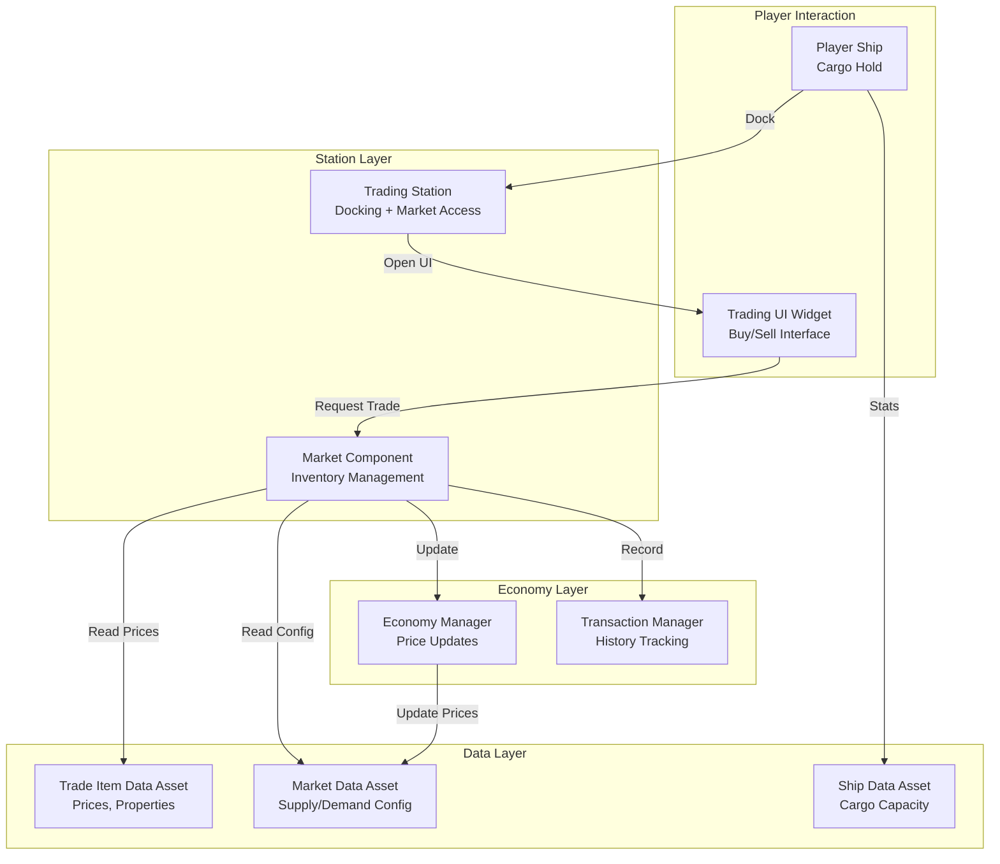
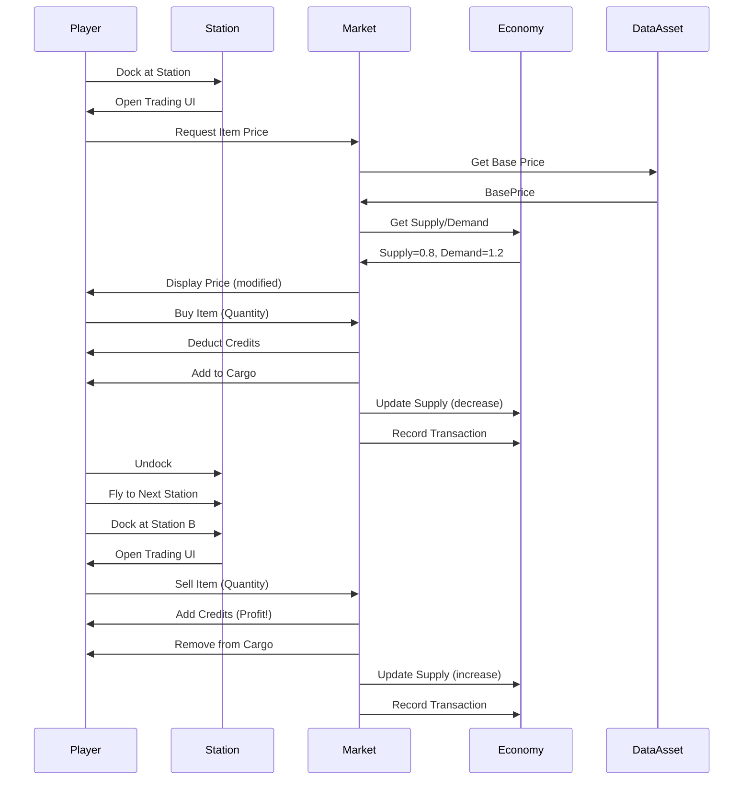

# Trading System Architecture

**Status**: MVP-Critical System (#1 Priority)  
**Phase**: Trade Simulator MVP (Dec 2025 - Mar 2026)  
**Last Updated**: 2025-12-25

---

## 🎯 Executive Summary

The Trading System is the **core gameplay system** for Adastrea's MVP. It implements a "buy low, sell high" loop with ship upgrades as progression. This document defines the architecture, data flow, and implementation strategy.

**Core Experience**: Dock → Buy Cargo → Fly → Dock → Sell Cargo → Profit → Upgrade → Repeat

---

## Table of Contents

- [Architecture Overview](#architecture-overview)
- [Core Components](#core-components)
- [Data Assets](#data-assets)
- [Data Flow](#data-flow)
- [MVP Implementation](#mvp-implementation)
- [Economy Simulation](#economy-simulation)
- [Integration Points](#integration-points)
- [Extension Points](#extension-points)
- [Testing Strategy](#testing-strategy)

---

## Architecture Overview

### System Diagram



### Key Principles

1. **Data-Driven Design**: All content configurable via Data Assets
2. **Blueprint-Friendly**: Full Blueprint exposure for designers
3. **MVP-First**: Simple features first, complexity later
4. **Modular**: Each component independently testable
5. **Performant**: Optimized for 100+ items, 10+ markets

---

## Core Components

### 1. Trade Item Data Asset (`UTradeItemDataAsset`)

**Purpose**: Defines a single tradeable commodity

**Location**: `Source/Adastrea/Trading/TradeItemDataAsset.h`

**Key Features**:
- 11 trade categories (Raw Materials, Technology, Luxury, etc.)
- Dynamic pricing with volatility settings
- Legality status (Legal, Regulated, Contraband)
- Faction-based trade restrictions
- Supply/demand responsiveness
- AI trader behavior configuration

**Properties** (MVP-Critical):
```cpp
FText ItemName;              // Display name
float BasePrice;             // Credits per unit
float VolumePerUnit;         // Cargo space required
ETradeItemCategory Category; // Item type
FPriceVolatility Settings;   // Price fluctuation params
bool bAffectedBySupplyDemand; // Dynamic pricing toggle
```

**Properties** (Deferred):
```cpp
ELegalityStatus LegalityStatus;      // Legal/Contraband
FTradeRestrictions Restrictions;     // Faction bans
int32 AITradePriority;               // AI behavior
bool bAIHoardable;                   // AI stockpiling
```

**Blueprint Functions** (MVP):
```cpp
float CalculatePrice(Supply, Demand, EventMultiplier)
float GetTotalVolume(Quantity)
float GetTotalMass(Quantity)
bool IsHighValue()
```

**Blueprint Events** (Extensibility):
```cpp
OnCalculateCustomPrice()  // Custom pricing logic
OnItemTraded()           // Trade event hooks
```

---

### 2. Market Data Asset (`UMarketDataAsset`)

**Purpose**: Configures a trading station's market

**Location**: `Source/Adastrea/Trading/MarketDataAsset.h`

**Key Features**:
- 8 market types (Open Market, Black Market, Luxury Bazaar, etc.)
- 5 market sizes (Small Outpost to Capital World Market)
- Inventory management with stock levels
- Market events system
- Dynamic supply/demand tracking
- AI trader integration

**Properties** (MVP-Critical):
```cpp
FText MarketName;
EMarketType MarketType;
EMarketSize MarketSize;
float TransactionTaxRate;         // 0.0-1.0
float SellPriceMarkup;           // 1.0-3.0 (station sells to player)
float BuyPriceMarkdown;          // 0.1-1.0 (station buys from player)
TArray<FMarketInventoryEntry> Inventory;
```

**Properties** (MVP-Simplified):
```cpp
UFactionDataAsset* ControllingFaction;  // For price modifiers only
int32 MinReputationRequired;            // Access control
```

**Properties** (Deferred):
```cpp
TArray<FMarketEvent> ActiveEvents;   // Market events
int32 AITraderCount;                 // AI trader spawns
bool bAllowAIPriceManipulation;      // AI market manipulation
```

**Market Inventory Entry**:
```cpp
struct FMarketInventoryEntry {
    UTradeItemDataAsset* TradeItem;
    int32 CurrentStock;     // Units available
    int32 MaxStock;         // Maximum capacity
    float SupplyLevel;      // 0.0-2.0+ (1.0 = typical)
    float DemandLevel;      // 0.0-2.0+ (1.0 = typical)
    float LastTradePrice;   // Most recent price
    bool bInStock;          // Availability flag
};
```

**Blueprint Functions** (MVP):
```cpp
float GetItemPrice(TradeItem, bIsBuying)
bool IsItemInStock(ItemID, Quantity)
TArray<FMarketInventoryEntry> GetItemsByCategory(Category)
bool CanPlayerAccess(PlayerReputation)
void UpdateMarket(DeltaHours)
void RefreshStock()
```

---

### 3. Trade Transaction System (`FTradeTransaction`, `UTradeTransactionManager`)

**Purpose**: Record and analyze trade history

**Location**: `Source/Adastrea/Trading/TradeTransaction.h`

**Transaction Record**:
```cpp
struct FTradeTransaction {
    FGuid TransactionID;
    ETransactionType Type;        // Buy, Sell, Transfer
    UTradeItemDataAsset* TradeItem;
    int32 Quantity;
    float PricePerUnit;
    int32 TotalValue;
    int32 TaxPaid;
    FName BuyerID, SellerID;
    UMarketDataAsset* Market;
    float Timestamp;              // Game time
    float SupplyLevel, DemandLevel;
};
```

**Transaction Manager** (MVP-Simplified):
```cpp
void RecordTransaction(Transaction)
int32 GetPlayerProfitLoss(PlayerID)
```

**Transaction Manager** (Deferred):
```cpp
TArray<FTradeTransaction> GetTransactionsByItem(ItemID)
float GetAveragePrice(ItemID, StartTime, EndTime)
float GetPriceTrend(ItemID, TimeWindow)
TArray<FName> GetMostTradedItems(Count)
```

---

### 4. Trading UI Widget (`UTradingInterfaceWidget`)

**Purpose**: Player-facing buy/sell interface

**Location**: `Source/Adastrea/UI/TradingInterfaceWidget.h`

**MVP Requirements**:
- List of available items with prices
- Player credits display
- Available cargo space indicator
- Quantity selector
- Buy/Sell buttons
- Profit/loss calculation preview
- Price comparison (if player has price data)

**Visual Feedback**:
- Highlight profitable trades (green)
- Show price differences between stations
- Animate credits changes
- Display cargo capacity visually
- Show transaction confirmation

**Blueprint Events**:
```cpp
OnTradeExecuted(Item, Quantity, Price, bWasBuying)
OnTradeAttempted(Item, Quantity, bSuccessful)
OnInsufficientFunds()
OnInsufficientCargo()
```

---

### 5. AI Trader Component (`UAITraderComponent`)

**Purpose**: Autonomous NPC trading behavior

**Location**: `Source/Adastrea/Trading/AITraderComponent.h`

**MVP Status**: ⚠️ **Deferred** (except basic economy simulation)

**MVP Exception**: Use for simple price updates only
- No AI ships
- No visible AI traders
- Economy simulation runs in background
- Simulates market supply/demand changes

**Full Features** (Deferred):
```cpp
TArray<FTradeRoute> FindBestTradeRoutes()
bool ExecuteTrade(TradeItem, Quantity, bIsBuying)
void ReactToPlayerAction(Market, Item, Quantity)
bool AttemptMarketManipulation(Market, Item)
```

---

### 6. Trade Contract System (`UTradeContractDataAsset`)

**Purpose**: Delivery missions and trade quests

**Location**: `Source/Adastrea/Trading/TradeContractDataAsset.h`

**MVP Status**: 🚫 **Fully Deferred**

Trading IS the game for MVP. No contracts/missions needed until post-MVP.

---

## Data Assets

### Required Data Assets for MVP

**Phase 1 (Hardcoded Prototype)**:
- None (hardcoded values in code)

**Phase 2 (Structured Version)**:
- 10-20 Trade Item Data Assets
- 5-10 Market Data Assets
- 3 Ship Data Assets (cargo capacity variants)

**Phase 3 (Polish & Demo)**:
- 20+ Trade Item Data Assets
- 10 Market Data Assets
- Additional ship variants

### Data Asset Creation Workflow

```
1. Create Data Asset Blueprint
   → Blueprints/DataAssets/Trading/
   → DA_TradeItem_[Name]
   → DA_Market_[Name]

2. Configure Properties
   → Set base price, volume, category
   → Configure market inventory
   → Test in-game

3. Balance & Iterate
   → Playtest for fun factor
   → Adjust prices, stock levels
   → Refine progression curve
```

---

## Data Flow

### Core Trading Loop Flow



### Price Calculation Flow

```cpp
// Step 1: Get base price from Trade Item Data Asset
float BasePrice = TradeItemAsset->BasePrice;

// Step 2: Apply supply/demand multiplier
float SupplyDemandFactor = (DemandLevel / SupplyLevel);
float AdjustedPrice = BasePrice * SupplyDemandFactor;

// Step 3: Apply volatility (if enabled)
if (TradeItemAsset->bAffectedBySupplyDemand) {
    float Volatility = TradeItemAsset->PriceVolatility.VolatilityMultiplier;
    AdjustedPrice *= FMath::Clamp(
        SupplyDemandFactor * Volatility,
        TradeItemAsset->PriceVolatility.MinPriceDeviation,
        TradeItemAsset->PriceVolatility.MaxPriceDeviation
    );
}

// Step 4: Apply market markup/markdown
if (bIsBuying) {
    // Player buying from station (station markup)
    FinalPrice = AdjustedPrice * MarketAsset->SellPriceMarkup;
} else {
    // Player selling to station (station markdown)
    FinalPrice = AdjustedPrice * MarketAsset->BuyPriceMarkdown;
}

// Step 5: Apply transaction tax
float Tax = FinalPrice * MarketAsset->TransactionTaxRate;
FinalPrice += Tax;

// Step 6 (Deferred for MVP): Apply faction modifiers
// Step 7 (Deferred for MVP): Apply market event multipliers

return FinalPrice;
```

---

## MVP Implementation

### Phase 1: Hardcoded Prototype (Weeks 1-4)

**Goal**: Playable trading loop in 2 weeks, validated by week 4

**What to Build**:
```cpp
// Hardcode in C++ or Blueprint
TArray<FSimpleTradeItem> Items = {
    { "Water", 10.0f, 1.0f },        // Name, Price, Volume
    { "Food Packs", 25.0f, 1.0f },
    { "Electronics", 100.0f, 2.0f }
};

TArray<FSimpleMarket> Markets = {
    { "Agricultural Station", { Water=8.0f, Food=30.0f, Electronics=120.0f } },
    { "Industrial Station", { Water=12.0f, Food=20.0f, Electronics=80.0f } }
};

int32 PlayerCredits = 1000;
int32 CargoCapacity = 10;
```

**Implementation**:
1. Create `BP_TradingStation` Blueprint
2. Add docking trigger volume
3. Create `WBP_SimpleTrading` widget
4. Hardcode 3 items with prices
5. Implement buy/sell logic
6. Add profit counter

**Success Criteria**:
- ✅ Can fly between 2 stations in &lt;1 minute
- ✅ Can buy cargo at Station A
- ✅ Can sell cargo at Station B
- ✅ Profit counter increases
- ✅ Cargo capacity enforced
- ✅ No crashes in 10 minutes

**Testing**:
- Week 4: External playtest with 5-10 people
- Target: 60%+ say "this is fun"
- GO/NO-GO decision point

---

### Phase 2: Structured Version (Weeks 5-8)

**Goal**: Data-driven system with progression

**Convert to Data Assets**:
1. Create `UTradeItemDataAsset` Blueprints
   - 10-20 trade goods
   - Different categories
   - Varied prices and volumes

2. Create `UMarketDataAsset` Blueprints
   - 5-10 stations
   - Different economies (produces/imports)
   - Supply/demand configuration

3. Create `USpaceshipDataAsset` variants
   - Small: 10 cargo
   - Medium: 30 cargo (unlock at 50K credits)
   - Large: 100 cargo (unlock at 250K credits)

**Add Features**:
- Ship upgrade system
- Multiple trade routes
- Supply/demand dynamics
- Save/load system
- Basic economy updates

**Economy Manager** (`UEconomyManager`):
```cpp
class UEconomyManager : public UGameInstanceSubsystem
{
    // Update prices based on player trades
    void UpdatePrices(float DeltaTime);
    
    // Simulate background economy activity
    void SimulateEconomy(float DeltaTime);
    
    // Get current price for item at market
    float CalculatePrice(FName ItemID, FName MarketID, bool bIsBuying);
    
    // Record player transaction
    void RecordTransaction(FTradeTransaction Transaction);
};
```

**Success Criteria**:
- ✅ 5-10 minutes of varied gameplay
- ✅ Multiple trade routes with different profitability
- ✅ Progression feels rewarding
- ✅ Economy reacts to player actions
- ✅ 70%+ "had fun" rating

---

### Phase 3: Polish & Demo (Weeks 9-12)

**Goal**: 30-minute polished demo ready for publisher pitch

**Content Expansion**:
- 3 ships with clear progression
- 10 stations with varied economies
- 20 trade goods across categories
- 5-10 upgrade options
- Tutorial system

**Polish**:
- UI improvements (better visuals)
- VFX for docking, purchases
- Sound effects (station ambience, cash register)
- Balance adjustments
- Bug fixes

**Demo Structure**:
```
Minutes 0-5:   Tutorial (guided first trade)
Minutes 5-15:  Core loop (player explores, learns)
Minutes 15-25: Expansion (unlocks, complex routes)
Minutes 25-30: Climax (ship upgrade, tease more content)
```

**Success Criteria**:
- ✅ 90%+ complete full 30 minutes
- ✅ 75%+ "had fun"
- ✅ 50%+ "would buy"
- ✅ 0 crashes
- ✅ &lt;5 known bugs
- ✅ 60 FPS on mid-range PC

---

## Economy Simulation

### Simple Supply/Demand Model (MVP)

**Core Formula**:
```
CurrentPrice = BasePrice × StationMultiplier × SupplyDemandFactor

SupplyDemandFactor = 1.0 + (Demand - Supply) / 100
```

**Rules**:
1. When player **sells**, supply increases (price drops)
2. When player **buys**, demand increases (price rises)
3. Prices gradually return to base over time
4. Station-specific multipliers (some stations always cheaper/expensive)

**Example**:
```
Water base price: 10 credits

Agricultural Station (produces water):
- Station multiplier: 0.8x
- Price: 8 credits (they make it, so it's cheap)

Industrial Station (needs water):
- Station multiplier: 1.2x
- Price: 12 credits (they need it, so it's expensive)

Player Action:
1. Buy 100 water at Ag station: 800 credits
   - Supply reduced, price rises to 8.5 credits
   
2. Sell 100 water at Industrial: 1150 credits
   - Supply increased, price drops to 11.5 credits
   
3. Profit: 1150 - 800 = 350 credits (43% margin!)
```

**Price Recovery**:
```cpp
// Prices gradually return to base over time
void UpdatePrices(float DeltaHours) {
    for (auto& Entry : Inventory) {
        // Push supply/demand back toward 1.0
        float RecoveryRate = 0.1f; // 10% per hour
        Entry.SupplyLevel = FMath::Lerp(Entry.SupplyLevel, 1.0f, RecoveryRate * DeltaHours);
        Entry.DemandLevel = FMath::Lerp(Entry.DemandLevel, 1.0f, RecoveryRate * DeltaHours);
    }
}
```

---

### Advanced Features (Post-MVP)

**Market Events** (Deferred):
```cpp
struct FMarketEvent {
    FText EventName;              // "Solar Flare Disrupts Mining"
    TArray<FName> AffectedItems;  // ["Metals", "Components"]
    float PriceMultiplier;        // 1.5x (50% price increase)
    float DurationHours;          // 24 hours
};
```

**AI Trader Simulation** (Deferred):
- AI ships buy/sell at markets
- Compete with player for deals
- Create price fluctuations
- Market manipulation possible

**Faction Economy** (Deferred):
- Faction warfare affects prices
- Blockades reduce supply
- Reputation affects prices
- Smuggling opportunities

---

## Integration Points

### With Spaceship System

```cpp
// Ship cargo management
class ASpaceship {
    UPROPERTY()
    int32 CargoCapacity;  // From USpaceshipDataAsset
    
    UPROPERTY()
    TArray<FCargoItem> CargoHold;
    
    bool AddCargo(UTradeItemDataAsset* Item, int32 Quantity);
    bool RemoveCargo(UTradeItemDataAsset* Item, int32 Quantity);
    int32 GetAvailableCargoSpace() const;
};
```

### With Station System

```cpp
// Station market access
class ASpaceStation {
    UPROPERTY()
    UMarketDataAsset* MarketData;
    
    void OnPlayerDocked(ASpaceship* PlayerShip);
    void OpenTradingInterface(APlayerController* Player);
};
```

### With Faction System (Simplified)

```cpp
// Faction price modifiers (MVP-Simplified)
float GetFactionPriceModifier(UFactionDataAsset* Faction, int32 Reputation) {
    // Simple reputation scaling
    if (Reputation >= 50) return 0.9f;  // 10% discount
    if (Reputation <= -50) return 1.2f; // 20% markup
    return 1.0f;
}
```

### With Save System

```cpp
// Save game data
USTRUCT()
struct FSaveGameTrading {
    int32 PlayerCredits;
    TArray<FCargoItem> CargoHold;
    TArray<FMarketSaveData> MarketStates;  // Stock levels
    FString CurrentShipID;
};
```

---

## Extension Points

### BlueprintNativeEvent Hooks

**Custom Pricing**:
```cpp
UFUNCTION(BlueprintNativeEvent)
float OnCalculateCustomPrice(float Supply, float Demand, 
                            float EventMultiplier, 
                            float BaseCalculatedPrice) const;
```

**Trade Events**:
```cpp
UFUNCTION(BlueprintNativeEvent)
void OnItemTraded(int32 Quantity, float Price, 
                 FName BuyerFactionID, 
                 FName SellerFactionID);
```

**Market Events**:
```cpp
UFUNCTION(BlueprintNativeEvent)
void OnStockRefreshed();

UFUNCTION(BlueprintNativeEvent)
void OnMarketEventStarted(const FMarketEvent& Event);
```

### Designer Customization

Designers can create Blueprint child classes to:
- Add custom pricing formulas
- Implement special trade conditions
- Create unique market behaviors
- Add quest-like trade challenges

---

## Testing Strategy

### Unit Tests (Phase 2+)

```cpp
// Price calculation tests
TEST(TradingSystem, CalculatePriceBasic) {
    UTradeItemDataAsset* Item = CreateTestItem(100.0f);
    float Price = Item->CalculatePrice(1.0f, 1.0f, 1.0f);
    EXPECT_NEAR(Price, 100.0f, 0.01f);
}

TEST(TradingSystem, CalculatePriceSupplyDemand) {
    UTradeItemDataAsset* Item = CreateTestItem(100.0f);
    float Price = Item->CalculatePrice(0.5f, 2.0f, 1.0f);  // High demand, low supply
    EXPECT_GT(Price, 100.0f);  // Price should be higher
}
```

### Integration Tests

```cpp
// Trade execution tests
TEST(TradingSystem, ExecuteTradeSuccess) {
    ASpaceship* Ship = CreateTestShip(1000 credits, 10 cargo);
    UMarketDataAsset* Market = CreateTestMarket();
    
    bool Success = ExecuteTrade(Ship, Market, "Water", 5, true);
    EXPECT_TRUE(Success);
    EXPECT_EQ(Ship->Credits, 950);  // Spent 50 credits
    EXPECT_EQ(Ship->CargoHold.Num(), 5);
}

TEST(TradingSystem, ExecuteTradeInsufficientFunds) {
    ASpaceship* Ship = CreateTestShip(10 credits, 10 cargo);
    bool Success = ExecuteTrade(Ship, Market, "ExpensiveItem", 1, true);
    EXPECT_FALSE(Success);
}
```

### Playtest Metrics

**Week 4 Prototype**:
- Fun rating: Target 60%+
- Confusion points: &lt;3 major issues
- Completion rate: 80%+ complete one trade loop

**Week 8 Structured**:
- Fun rating: Target 70%+
- Trade count: Average 10+ trades per session
- Station exploration: 80%+ visit all available stations

**Week 12 Demo**:
- Fun rating: Target 75%+
- Buy intent: Target 50%+
- Completion rate: 90%+ complete 30 minutes
- Technical: 0 crashes, 60 FPS, &lt;30s load time

---

## Performance Considerations

### Optimization Targets

- **100+ trade items**: Fast lookups (use TMap with FName keys)
- **10+ markets**: Update prices efficiently (stagger updates)
- **1000+ transactions**: Prune old history, cache analytics

### Memory Management

```cpp
// Cache expensive calculations
UPROPERTY()
TMap<FName, float> CachedPrices;  // ItemID -> Current Price

bool bPricesCacheDirty = true;

void UpdateCachedPrices() {
    if (!bPricesCacheDirty) return;
    
    for (auto& Entry : Inventory) {
        CachedPrices.Add(Entry.TradeItem->ItemID, 
                        CalculatePrice(Entry));
    }
    bPricesCacheDirty = false;
}
```

### Update Frequency

```cpp
// Stagger market updates across frames
float UpdateInterval = 5.0f;  // Update every 5 seconds
float UpdateTimer = 0.0f;

void Tick(float DeltaTime) {
    UpdateTimer += DeltaTime;
    if (UpdateTimer >= UpdateInterval) {
        UpdateMarket(UpdateTimer);
        UpdateTimer = 0.0f;
    }
}
```

---

## FAQ

### Q: Why is AI Trader Component deferred if economy needs simulation?

**A**: MVP uses simple background simulation without visible AI ships. Post-MVP will add AI trader ships, but economy price updates can run without them.

### Q: Can I use TradeContractDataAsset for MVP?

**A**: No. Contracts/missions are deferred. Trading itself IS the game for MVP.

### Q: How do I add a new trade item?

**A**: Phase 1: Hardcode in array. Phase 2: Create `DA_TradeItem_[Name]` Blueprint based on `UTradeItemDataAsset`.

### Q: What if players exploit the economy?

**A**: That's part of the fun! MVP accepts simple exploits. Post-MVP can add AI traders that compete and rebalance.

### Q: Should I implement faction reputation affects on prices?

**A**: Phase 2+. Start simple (no faction effects), add if testing shows it's needed.

---

## Next Steps

**For Developers**:
1. Read this document fully
2. Review existing code in `Source/Adastrea/Trading/`
3. See `docs/mvp/TRADING_MVP_GUIDE.md` for implementation steps
4. Start with Phase 1 hardcoded prototype

**For Designers**:
1. Wait for Phase 2 (Data Assets)
2. Review YAML templates when available
3. Focus on balancing prices for fun, not realism

**For Project Leads**:
1. Validate Week 4 playtest results
2. Make GO/NO-GO decision based on 60%+ fun rating
3. Don't add features until core loop is validated

---

## Related Documents

- `CRITICAL_REVIEW_SUMMARY.md` - Why trading is MVP priority
- `docs/mvp/README.md` - MVP overview
- `docs/mvp/SYSTEM_CLASSIFICATION.md` - System priorities
- `docs/mvp/TRADING_MVP_GUIDE.md` - Implementation guide (to be created)
- `.github/instructions/trade-simulator-mvp.instructions.md` - MVP instructions

---

**Remember**: Build the smallest, simplest trading system that's fun. Expand only after validation.

---

**Last Updated**: 2025-12-25  
**Author**: Trading System Architecture Team  
**Status**: Active Development (MVP Phase)
